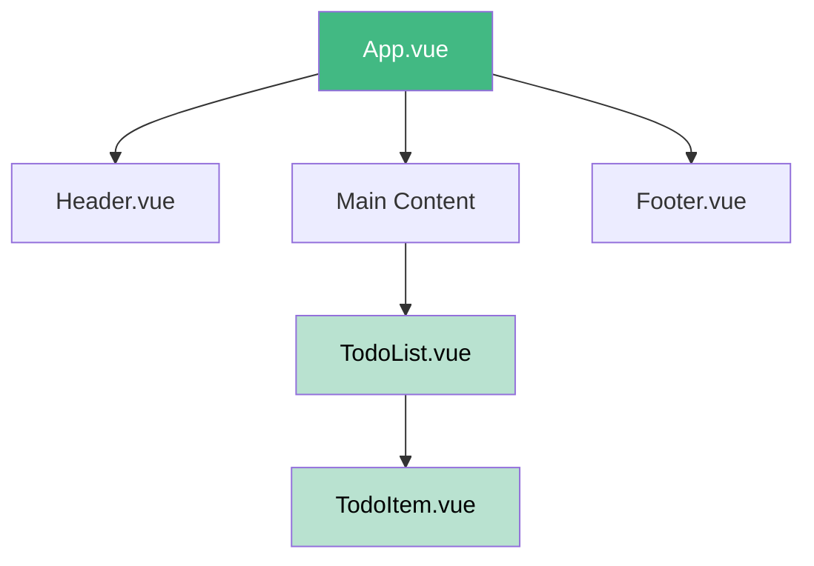

# Vue.js Single-File Components

## Introduction

When you start building larger Vue.js applications, you'll quickly find that organizing your components becomes essential for maintainability. Vue's **Single-File Components (SFCs)** provide an elegant solution to this problem.

Single-File Components allow you to encapsulate the template, script, and style of a component in a single `.vue` file. This approach makes components more self-contained, easier to understand, and simpler to maintain.

In this tutorial, we'll explore:
- What Single-File Components are and why they're useful
- The structure and syntax of `.vue` files
- How to set up your project to use SFCs
- Best practices for working with SFCs

## What are Single-File Components?

A Vue Single-File Component is a file with a `.vue` extension that contains three parts:

1. **Template**: The HTML structure of your component
2. **Script**: The JavaScript logic for your component
3. **Style**: The CSS styling for your component

This approach offers several advantages:

- **Organization**: All related code is in one place
- **Modularity**: Components can be easily imported and reused
- **Scoped CSS**: Styles can be scoped to the component
- **Better tooling**: Syntax highlighting, linting, and other editor features

## Structure of a Single-File Component

Here's the basic structure of a `.vue` file:

```html
<template>
  <!-- HTML goes here -->
</template>

<script>
  // JavaScript goes here
</script>

<style>
  /* CSS goes here */
</style>
```

Let's break down each section:

### Template Section

The `<template>` section contains your HTML markup. Vue compiles this into a render function.

```html
<template>
  <div class="greeting">
    <h1>{{ message }}</h1>
    <button @click="changeMessage">Change Message</button>
  </div>
</template>
```

### Script Section

The `<script>` section contains your component's JavaScript logic. This is where you define data, methods, computed properties, and other component options.

```html
<script>
export default {
  name: 'Greeting',
  data() {
    return {
      message: 'Hello, Vue!'
    }
  },
  methods: {
    changeMessage() {
      this.message = 'Message changed!'
    }
  }
}
</script>
```

For Vue 3, you can also use the Composition API with the `setup` function:

```html
<script>
import { ref } from 'vue'

export default {
  name: 'Greeting',
  setup() {
    const message = ref('Hello, Vue!')
    
    function changeMessage() {
      message.value = 'Message changed!'
    }
    
    return {
      message,
      changeMessage
    }
  }
}
</script>
```

Or with the newer `<script setup>` syntax (Vue 3):

```html
<script setup>
import { ref } from 'vue'

const message = ref('Hello, Vue!')

function changeMessage() {
  message.value = 'Message changed!'
}
</script>
```

### Style Section

The `<style>` section contains CSS styles for your component:

```html
<style>
.greeting {
  padding: 20px;
  background-color: #f5f5f5;
  border-radius: 4px;
}

h1 {
  color: #42b983;
}
</style>
```

By default, these styles are global. To scope them to the component, add the `scoped` attribute:

```html
<style scoped>
/* These styles will only apply to this component */
.greeting {
  padding: 20px;
  background-color: #f5f5f5;
  border-radius: 4px;
}
</style>
```

## Setting Up Your Project for SFCs

To use Single-File Components, you need a build step. Here's how to set up a project:

### Using Vue CLI (Recommended for beginners)

1. Install Vue CLI:
```bash
npm install -g @vue/cli
```

2. Create a new project:
```bash
vue create my-vue-app
```

3. Select the default preset or manually select features.

Once set up, you can start creating `.vue` files in the `src/components` directory.

## Practical Example: To-Do List Component

Let's create a simple to-do list component to demonstrate SFCs in action:

```html
<template>
  <div class="todo-list">
    <h2>{{ title }}</h2>
    
    <div class="add-task">
      <input 
        v-model="newTask" 
        @keyup.enter="addTask" 
        placeholder="Add a new task"
      />
      <button @click="addTask">Add</button>
    </div>
    
    <ul v-if="tasks.length > 0">
      <li v-for="(task, index) in tasks" :key="index" class="task-item">
        <input 
          type="checkbox"
          v-model="task.completed"
          @change="updateTask(index)"
        />
        <span :class="{ completed: task.completed }">{{ task.text }}</span>
        <button @click="deleteTask(index)" class="delete-btn">❌</button>
      </li>
    </ul>
    
    <p v-else class="empty-list">No tasks yet. Add one!</p>
    
    <div class="task-stats">
      <p>{{ completedTaskCount }} of {{ tasks.length }} tasks completed</p>
    </div>
  </div>
</template>

<script>
export default {
  name: 'TodoList',
  props: {
    title: {
      type: String,
      default: 'My Tasks'
    }
  },
  data() {
    return {
      newTask: '',
      tasks: []
    }
  },
  computed: {
    completedTaskCount() {
      return this.tasks.filter(task => task.completed).length
    }
  },
  methods: {
    addTask() {
      if (this.newTask.trim()) {
        this.tasks.push({
          text: this.newTask,
          completed: false
        })
        this.newTask = '' // Clear the input
      }
    },
    updateTask(index) {
      // Emit an event to notify parent components
      this.$emit('task-updated', {
        index,
        completed: this.tasks[index].completed
      })
    },
    deleteTask(index) {
      this.tasks.splice(index, 1)
    }
  }
}
</script>

<style scoped>
.todo-list {
  max-width: 500px;
  margin: 0 auto;
  padding: 20px;
  background-color: #f9f9f9;
  border-radius: 8px;
  box-shadow: 0 2px 4px rgba(0, 0, 0, 0.1);
}

h2 {
  color: #42b983;
  margin-top: 0;
}

.add-task {
  display: flex;
  margin-bottom: 16px;
}

input {
  flex-grow: 1;
  padding: 8px;
  border: 1px solid #ddd;
  border-radius: 4px 0 0 4px;
}

button {
  padding: 8px 16px;
  background-color: #42b983;
  color: white;
  border: none;
  border-radius: 0 4px 4px 0;
  cursor: pointer;
}

ul {
  list-style: none;
  padding: 0;
}

.task-item {
  display: flex;
  align-items: center;
  padding: 8px 0;
  border-bottom: 1px solid #eee;
}

.completed {
  text-decoration: line-through;
  color: #999;
}

.delete-btn {
  margin-left: auto;
  background: none;
  border: none;
  cursor: pointer;
  font-size: 16px;
}

.empty-list {
  text-align: center;
  color: #999;
}

.task-stats {
  margin-top: 16px;
  text-align: right;
  font-size: 0.9em;
  color: #666;
}
</style>
```

### Usage of the Component

Once you've created your TodoList component, you can use it in another component or in your main App:

```html
<template>
  <div id="app">
    <TodoList title="Daily Tasks" @task-updated="onTaskUpdate" />
  </div>
</template>

<script>
import TodoList from './components/TodoList.vue'

export default {
  name: 'App',
  components: {
    TodoList
  },
  methods: {
    onTaskUpdate(data) {
      console.log(`Task ${data.index} completed status: ${data.completed}`)
    }
  }
}
</script>
```

## Advanced Concepts

### Using Pre-Processors

Vue SFCs support preprocessors like Sass, TypeScript, and more:

```html
<template>
  <div class="greeting">{{ message }}</div>
</template>

<script lang="ts">
import { defineComponent, ref } from 'vue'

export default defineComponent({
  setup() {
    const message = ref('Hello TypeScript!')
    return { message }
  }
})
</script>

<style lang="scss" scoped>
$primary-color: #42b983;

.greeting {
  color: $primary-color;
  font-size: 24px;
  
  &:hover {
    text-decoration: underline;
  }
}
</style>
```

### CSS Modules

You can use CSS Modules for more isolated styles:

```html
<template>
  <div :class="$style.container">
    <h1 :class="$style.title">Hello, Vue!</h1>
  </div>
</template>

<script>
export default {
  name: 'CssModuleExample'
}
</script>

<style module>
.container {
  padding: 20px;
}

.title {
  color: #42b983;
}
</style>
```

### Multiple Script/Style Blocks

SFCs support multiple `<script>` and `<style>` blocks:

```html
<template>
  <div><!-- content --></div>
</template>

<script>
// Component logic
</script>

<script setup>
// Composition API setup code
</script>

<style>
/* Global styles */
</style>

<style scoped>
/* Component-scoped styles */
</style>
```

## Best Practices for Single-File Components

1. **Keep components focused**: Each component should do one thing well
2. **Name your components**: Always include a name property for easier debugging
3. **Use scoped styles**: Prevent style leaks with `scoped` attribute
4. **Organize by feature**: Group related components together
5. **Keep template logic simple**: Move complex logic to computed properties
6. **Use props and events**: Communicate between parent and child components properly

## Visualizing the Component Structure

Here's a visualization of how SFCs fit into your Vue application:



## Summary

Single-File Components are a powerful way to organize your Vue applications:

- They combine template, script, and style in one file
- They improve code organization and maintainability
- They support scoped styles to prevent CSS conflicts
- They work well with various preprocessors (Sass, TypeScript, etc.)
- They require a build setup, but tools like Vue CLI make it easy

By using SFCs, you can create more maintainable and scalable Vue applications, with each component containing all the code it needs in one place.

## Additional Resources and Exercises

### Resources:
- [Official Vue.js Documentation on SFCs](https://vuejs.org/guide/scaling-up/sfc.html)
- [Vue Style Guide](https://vuejs.org/style-guide/)

### Exercises:

1. **Basic Component**: Create a simple user profile card component that displays a name, job title, and short bio.

2. **Component Communication**: Create a parent component that contains a list of item components. Implement a feature where clicking an item emits an event to the parent.

3. **Dynamic Components**: Create a tabs component with multiple tab panels that can be switched between.

4. **Complex Component**: Build a form component with validation that uses computed properties to check for errors before submission.

5. **Full Application**: Create a small application with multiple components that demonstrates proper component organization and communication.

With these exercises and the knowledge from this tutorial, you'll be well on your way to mastering Vue.js Single-File Components!