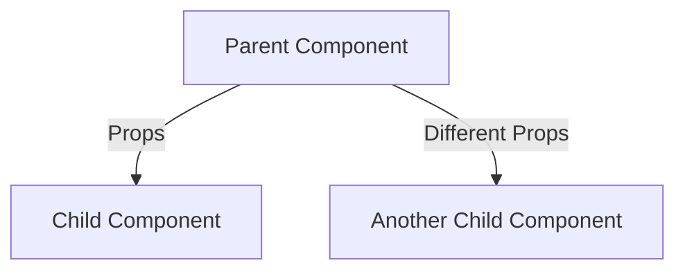

# Vue.js Props

## Introduction

In Vue.js applications, components are the building blocks that help us create reusable and modular code. However, these components often need to communicate with each other. **Props** (short for properties) are the primary way to pass data from a parent component down to its child components.

Props enable you to create flexible and reusable components by allowing parent components to feed data into child components. Think of props as custom HTML attributes that you can register on a component.

In this guide, we'll explore:
- What props are and why they're important
- How to define and use props
- Prop validation
- One-way data flow
- Best practices for working with props

## What Are Props?

Props are custom attributes you can register on a component. When a value is passed to a prop attribute, it becomes a property on that component instance. A child component can then use this property value as needed.



## Registering Props

### Basic Props Registration

To use props in a component, you need to register them first. Vue.js provides several ways to register props:

#### Array Syntax

The simplest way to register props is using an array:

```html
<script>
export default {
  props: ['message', 'user', 'isActive']
}
</script>
```

#### Object Syntax

For more control, you can use the object syntax to add validation:

```html
<script>
export default {
  props: {
    message: String,
    user: Object,
    isActive: Boolean
  }
}
</script>
```

### Using Props in a Component

Once registered, props can be used in your component's template like regular component properties:

```html
<template>
  <div>
    <h1>{{ message }}</h1>
    <p>User: {{ user.name }}</p>
    <span v-if="isActive">Active!</span>
  </div>
</template>
```

## Passing Props to Components

To pass props to a child component, include them as attributes in the component's tag:

```html
<!-- In the parent component -->
<template>
  <div>
    <ChildComponent 
      message="Hello from parent!" 
      :user="{ name: 'John', role: 'Admin' }" 
      :is-active="true" 
    />
  </div>
</template>

<script>
import ChildComponent from './ChildComponent.vue';

export default {
  components: {
    ChildComponent
  }
}
</script>
```

Note the `:` (or `v-bind:`) before some prop names. This is Vue's binding syntax that allows you to pass dynamic JavaScript values instead of static strings.

## Prop Validation

Vue allows you to specify requirements for your props, which is especially helpful when creating components that will be used by other developers.

### Basic Type Validation

You can specify the expected type for a prop:

```html
<script>
export default {
  props: {
    title: String,
    likes: Number,
    isPublished: Boolean,
    commentIds: Array,
    author: Object,
    callback: Function,
    contactsPromise: Promise
  }
}
</script>
```

### Advanced Validation

For more complex validation needs, you can define detailed requirements:

```html
<script>
export default {
  props: {
    // Basic type check (`null` and `undefined` values will pass any type validation)
    propA: Number,
    
    // Multiple possible types
    propB: [String, Number],
    
    // Required string
    propC: {
      type: String,
      required: true
    },
    
    // Number with a default value
    propD: {
      type: Number,
      default: 100
    },
    
    // Object with a default value (always use a factory function)
    propE: {
      type: Object,
      default() {
        return { message: 'hello' }
      }
    },
    
    // Custom validator function
    propF: {
      validator(value) {
        // The value must match one of these strings
        return ['success', 'warning', 'danger'].includes(value)
      }
    }
  }
}
</script>
```

## One-Way Data Flow

Props in Vue follow a one-way data flow, from parent to child. This means:

1. When the parent property updates, it flows down to the child
2. When the child property updates, it does NOT affect the parent

This principle helps maintain a clear and predictable data flow in your application.

If you try to mutate a prop directly in a child component, Vue will warn you in the console. There are two common cases where you might be tempted to mutate a prop:

### 1. Using a prop as initial value for a local data property

```html
<script>
export default {
  props: ['initialCounter'],
  data() {
    return {
      // Create a local data property that uses the prop as its initial value
      counter: this.initialCounter
    }
  }
}
</script>
```

### 2. Transforming a prop value

```html
<script>
export default {
  props: ['size'],
  computed: {
    // Create a computed property that transforms the prop value
    normalizedSize() {
      return this.size.trim().toLowerCase()
    }
  }
}
</script>
```

## Practical Examples

### Example 1: Product Card Component

Let's create a reusable product card component that accepts various props:

**ProductCard.vue (Child Component)**:

```html
<template>
  <div class="product-card" :class="{ 'on-sale': onSale }">
    <h2>{{ name }}</h2>
    <p class="description">{{ description }}</p>
    <p class="price">
      <span v-if="onSale" class="original-price">${{ price.toFixed(2) }}</span>
      <span class="current-price">${{ discountedPrice.toFixed(2) }}</span>
    </p>
    <button @click="addToCart" :disabled="!inStock">
      {{ inStock ? 'Add to Cart' : 'Out of Stock' }}
    </button>
  </div>
</template>

<script>
export default {
  props: {
    id: {
      type: [Number, String],
      required: true
    },
    name: {
      type: String,
      required: true
    },
    description: {
      type: String,
      default: 'No description available'
    },
    price: {
      type: Number,
      required: true,
      validator(value) {
        return value >= 0
      }
    },
    discount: {
      type: Number,
      default: 0,
      validator(value) {
        return value >= 0 && value <= 100
      }
    },
    inStock: {
      type: Boolean,
      default: true
    }
  },
  computed: {
    onSale() {
      return this.discount > 0
    },
    discountedPrice() {
      return this.price * (1 - this.discount / 100)
    }
  },
  methods: {
    addToCart() {
      this.$emit('add-to-cart', this.id)
    }
  }
}
</script>
```

**Parent Component Using ProductCard**:

```html
<template>
  <div class="products-container">
    <ProductCard
      v-for="product in products"
      :key="product.id"
      :id="product.id"
      :name="product.name"
      :description="product.description"
      :price="product.price"
      :discount="product.discount"
      :in-stock="product.inStock"
      @add-to-cart="handleAddToCart"
    />
  </div>
</template>

<script>
import ProductCard from './ProductCard.vue';

export default {
  components: {
    ProductCard
  },
  data() {
    return {
      products: [
        {
          id: 1,
          name: 'Wireless Headphones',
          description: 'High-quality wireless headphones with noise cancellation',
          price: 129.99,
          discount: 15,
          inStock: true
        },
        {
          id: 2,
          name: 'Smartphone',
          description: 'Latest model with advanced camera features',
          price: 799.99,
          discount: 0,
          inStock: true
        },
        {
          id: 3,
          name: 'Laptop',
          description: 'Powerful laptop for work and gaming',
          price: 1299.99,
          discount: 10,
          inStock: false
        }
      ]
    }
  },
  methods: {
    handleAddToCart(productId) {
      console.log(`Product ${productId} added to cart!`);
      // Add logic to update cart
    }
  }
}
</script>
```

### Example 2: Button Component with Props

Here's how to create a reusable button component with customizable properties:

**AppButton.vue (Child Component)**:

```html
<template>
  <button 
    :class="['app-button', `app-button--${type}`, { 'app-button--small': small }]"
    :disabled="disabled || loading"
    @click="$emit('click')"
  >
    <span v-if="loading" class="loader"></span>
    <slot v-else></slot>
  </button>
</template>

<script>
export default {
  props: {
    type: {
      type: String,
      default: 'primary',
      validator(value) {
        return ['primary', 'secondary', 'success', 'danger', 'warning'].includes(value)
      }
    },
    disabled: {
      type: Boolean,
      default: false
    },
    loading: {
      type: Boolean,
      default: false
    },
    small: {
      type: Boolean,
      default: false
    }
  }
}
</script>

<style scoped>
.app-button {
  padding: 10px 15px;
  border: none;
  border-radius: 4px;
  cursor: pointer;
  font-weight: bold;
  transition: opacity 0.3s;
}

.app-button--small {
  padding: 6px 10px;
  font-size: 0.8em;
}

.app-button:disabled {
  cursor: not-allowed;
  opacity: 0.7;
}

.app-button--primary {
  background-color: #4c75af;
  color: white;
}

.app-button--secondary {
  background-color: #6c757d;
  color: white;
}

.app-button--success {
  background-color: #28a745;
  color: white;
}

.app-button--danger {
  background-color: #dc3545;
  color: white;
}

.app-button--warning {
  background-color: #ffc107;
  color: #212529;
}

.loader {
  display: inline-block;
  width: 12px;
  height: 12px;
  border: 2px solid rgba(255,255,255,0.3);
  border-radius: 50%;
  border-top-color: #fff;
  animation: spin 1s infinite linear;
}

@keyframes spin {
  0% { transform: rotate(0deg); }
  100% { transform: rotate(360deg); }
}
</style>
```

**Parent Component Using AppButton**:

```html
<template>
  <div class="button-showcase">
    <h2>Button Types</h2>
    <div class="button-row">
      <AppButton type="primary">Primary</AppButton>
      <AppButton type="secondary">Secondary</AppButton>
      <AppButton type="success">Success</AppButton>
      <AppButton type="danger">Danger</AppButton>
      <AppButton type="warning">Warning</AppButton>
    </div>
    
    <h2>Button States</h2>
    <div class="button-row">
      <AppButton>Normal</AppButton>
      <AppButton disabled>Disabled</AppButton>
      <AppButton loading>Loading</AppButton>
    </div>
    
    <h2>Small Buttons</h2>
    <div class="button-row">
      <AppButton small>Small</AppButton>
      <AppButton small type="success">Small Success</AppButton>
      <AppButton small type="danger">Small Danger</AppButton>
    </div>
    
    <h2>Interactive Button</h2>
    <div class="button-row">
      <AppButton 
        :loading="isLoading" 
        :type="buttonType"
        @click="handleClick"
      >
        {{ buttonText }}
      </AppButton>
    </div>
  </div>
</template>

<script>
import AppButton from './AppButton.vue';

export default {
  components: {
    AppButton
  },
  data() {
    return {
      isLoading: false,
      buttonType: 'primary',
      buttonText: 'Click Me!'
    }
  },
  methods: {
    handleClick() {
      this.isLoading = true;
      this.buttonText = 'Processing...';
      
      setTimeout(() => {
        this.isLoading = false;
        this.buttonType = 'success';
        this.buttonText = 'Done!';
        
        // Reset after showing success
        setTimeout(() => {
          this.buttonType = 'primary';
          this.buttonText = 'Click Me!';
        }, 1500);
      }, 2000);
    }
  }
}
</script>

<style scoped>
.button-showcase {
  max-width: 600px;
  margin: 0 auto;
}

.button-row {
  display: flex;
  gap: 10px;
  margin-bottom: 20px;
}

h2 {
  margin-top: 30px;
}
</style>
```

## Best Practices for Using Props

### 1. Use prop validation

Always define and validate your props to make your components more predictable and easier to debug.

```html
// Good
export default {
  props: {
    status: {
      type: String,
      required: true,
      validator: (value) => ['active', 'inactive', 'pending'].includes(value)
    }
  }
}

// Not recommended
export default {
  props: ['status']
}
```

### 2. Use kebab-case in templates

In HTML templates, use kebab-case for prop names since HTML is case-insensitive:

```html
<!-- In parent template -->
<UserProfile user-name="John" profile-image="/images/john.jpg" />

<!-- In UserProfile.vue -->
<script>
export default {
  props: {
    userName: String,    // Access as this.userName in component
    profileImage: String // Access as this.profileImage in component
  }
}
</script>
```

### 3. Don't mutate props directly

Props are meant to be read-only. If you need to modify data passed via props, use one of these approaches:

```html
<!-- Define a local data property based on a prop -->
<script>
export default {
  props: ['initialValue'],
  data() {
    return {
      internalValue: this.initialValue
    }
  }
}
</script>

<!-- Or use a computed property -->
<script>
export default {
  props: ['label'],
  computed: {
    formattedLabel() {
      return this.label.toUpperCase()
    }
  }
}
</script>
```

### 4. Use default values appropriately

Provide sensible defaults to make components more flexible:

```html
<script>
export default {
  props: {
    level: {
      type: Number,
      default: 1
    },
    items: {
      type: Array,
      // For object or array defaults, use a factory function
      default: () => []
    }
  }
}
</script>
```

### 5. Document your props for other developers

Add comments to describe what each prop is for and how it's used:

```html
<script>
export default {
  props: {
    /**
     * The title of the dialog
     */
    title: String,
    
    /**
     * Whether the dialog can be closed by clicking outside
     */
    closable: {
      type: Boolean,
      default: true
    },
    
    /**
     * Callback function executed when dialog is closed
     * @param {string} reason - The reason why dialog was closed
     */
    onClose: Function
  }
}
</script>
```

## Summary

Props are a fundamental concept in Vue.js that allow parent components to pass data to their child components. Key points to remember:

- Props create a one-way data flow from parent to child
- Always validate your props to make your components more robust
- Use kebab-case in templates and camelCase in JavaScript
- Don't modify props directly; use local data or computed properties instead
- Provide default values when appropriate

By mastering props, you'll be able to create flexible, reusable components that can be composed together to build complex applications.

## Additional Resources

- [Vue.js Official Documentation on Props](https://vuejs.org/guide/components/props.html)
- [Vue.js Style Guide - Prop Definitions](https://vuejs.org/style-guide/rules-essential.html#use-detailed-prop-definitions)

## Exercises

1. Create a simple `UserCard` component that accepts `name`, `email`, `role`, and `avatarUrl` props and displays them in a card format.

2. Build a `Pagination` component that accepts `totalPages`, `currentPage`, and `maxVisibleButtons` props, and emits page change events.

3. Create a component that transforms a prop before displaying it (e.g., a `CurrencyDisplay` component that formats a number as currency).

4. Build a star rating component that accepts a `rating` prop (0-5) and displays the appropriate number of filled/empty stars.

5. Create a component with prop validation that throws custom error messages when invalid props are provided.