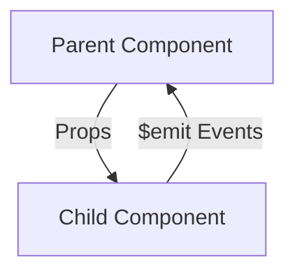

# Vue.js Events

## Introduction

Events are a fundamental part of any interactive web application. In Vue.js, events provide a powerful mechanism for components to communicate with each other and respond to user interactions. Understanding how to work with events is essential for building dynamic and responsive Vue applications.

In this tutorial, we'll explore how Vue.js handles events, including:

- Basic event handling with `v-on` directive (or `@` shorthand)
- Event modifiers
- Key and mouse modifiers
- Custom events with `$emit`
- Event handling best practices

By the end of this guide, you'll have a solid understanding of how to implement event-driven interactions in your Vue applications.

## Basic Event Handling

Vue provides the `v-on` directive (often shortened to `@`) to attach event listeners to DOM elements.

### Syntax

```html
<button v-on:click="handleClick">Click Me</button>
<!-- Shorthand version -->
<button @click="handleClick">Click Me</button>
```

### Example: Button Click Counter

Let's create a simple counter that increments when a button is clicked:

```html
<template>
  <div>
    <h2>Counter: {{ count }}</h2>
    <button @click="increment">Increment</button>
  </div>
</template>

<script>
export default {
  data() {
    return {
      count: 0
    }
  },
  methods: {
    increment() {
      this.count += 1
    }
  }
}
</script>
```

When you click the "Increment" button, the `increment` method is called, which increases the `count` value by 1, and the UI updates automatically thanks to Vue's reactivity system.

### Inline Event Handlers

For simple operations, you can write the handler code directly in the template:

```html
<template>
  <div>
    <h2>Counter: {{ count }}</h2>
    <button @click="count += 1">Increment</button>
    <button @click="count -= 1">Decrement</button>
  </div>
</template>

<script>
export default {
  data() {
    return {
      count: 0
    }
  }
}
</script>
```

## Event Modifiers

Vue provides event modifiers to handle common needs without having to use JavaScript to manipulate the event object directly.

### Common Event Modifiers

- `.stop` - prevents event propagation (equivalent to `event.stopPropagation()`)
- `.prevent` - prevents default behavior (equivalent to `event.preventDefault()`)
- `.capture` - uses event capturing instead of bubbling
- `.self` - only trigger if event was dispatched from this element
- `.once` - trigger the event at most once
- `.passive` - indicates that the function will never call `preventDefault()`

### Example: Preventing Form Submission

```html
<template>
  <form @submit.prevent="handleSubmit">
    <input type="text" v-model="username" placeholder="Username" />
    <button type="submit">Submit</button>
  </form>
</template>

<script>
export default {
  data() {
    return {
      username: ''
    }
  },
  methods: {
    handleSubmit() {
      console.log(`Form submitted with username: ${this.username}`)
      // Process form data without page reload
    }
  }
}
</script>
```

In this example, the `.prevent` modifier stops the form from performing its default action (reloading the page), allowing us to handle the submission in JavaScript.

### Example: Stop Propagation

```html
<template>
  <div @click="handleOuterClick">
    <p>Outer Container (click me)</p>
    <button @click.stop="handleInnerClick">
      Inner Button (click won't propagate)
    </button>
  </div>
</template>

<script>
export default {
  methods: {
    handleOuterClick() {
      alert('Outer container clicked!')
    },
    handleInnerClick() {
      alert('Button clicked!')
      // Without .stop, the outer click handler would also fire
    }
  }
}
</script>
```

## Key and Mouse Modifiers

Vue also provides modifiers for keyboard and mouse events, making it easy to listen for specific keys or mouse buttons.

### Key Modifiers

```html
<template>
  <div>
    <input @keyup.enter="submitForm" placeholder="Press Enter to submit" />
    <input @keyup.esc="clearInput" placeholder="Press Escape to clear" />
  </div>
</template>

<script>
export default {
  data() {
    return {
      input: ''
    }
  },
  methods: {
    submitForm() {
      console.log('Form submitted via Enter key')
    },
    clearInput(event) {
      event.target.value = ''
      console.log('Input cleared via Escape key')
    }
  }
}
</script>
```

### Available Key Modifiers

- `.enter`
- `.tab`
- `.delete` (captures both Delete and Backspace)
- `.esc`
- `.space`
- `.up`, `.down`, `.left`, `.right` (arrow keys)

### Mouse Button Modifiers

```html
<template>
  <div>
    <button @click.left="leftClick">Left Click</button>
    <button @click.right.prevent="rightClick">Right Click</button>
    <button @click.middle="middleClick">Middle Click</button>
  </div>
</template>

<script>
export default {
  methods: {
    leftClick() {
      console.log('Left button clicked')
    },
    rightClick() {
      console.log('Right button clicked')
      // .prevent stops the context menu from appearing
    },
    middleClick() {
      console.log('Middle button clicked')
    }
  }
}
</script>
```

## System Modifier Keys

Vue also provides modifiers for system keys:

```html
<template>
  <div>
    <button @click.ctrl="handleCtrlClick">Ctrl + Click</button>
    <button @click.shift="handleShiftClick">Shift + Click</button>
    <input @keyup.alt.c="clearAll">Alt + C to Clear</input>
  </div>
</template>

<script>
export default {
  methods: {
    handleCtrlClick() {
      console.log('Control + Click detected')
    },
    handleShiftClick() {
      console.log('Shift + Click detected')
    },
    clearAll() {
      console.log('Alt + C pressed - clearing all data')
      // Clear functionality here
    }
  }
}
</script>
```

## Accessing the Event Object

You can access the native DOM event by passing a special `$event` variable to your method:

```html
<template>
  <button @click="warn('Warning!', $event)">Show warning</button>
</template>

<script>
export default {
  methods: {
    warn(message, event) {
      // Access the native event
      if (event) {
        console.log(event.target.tagName)
        event.preventDefault()
      }
      alert(message)
    }
  }
}
</script>
```

## Custom Events with $emit

One of Vue's most powerful features is the ability for child components to communicate with their parents through custom events using the `$emit` method.

### Component Communication Flow



### Basic Example

Let's create a counter component that emits events when the counter changes:

**Child Component (Counter.vue)**:

```html
<template>
  <div>
    <h3>Current Count: {{ count }}</h3>
    <button @click="increment">+</button>
    <button @click="decrement">-</button>
  </div>
</template>

<script>
export default {
  data() {
    return {
      count: 0
    }
  },
  methods: {
    increment() {
      this.count += 1
      this.$emit('count-changed', this.count)
    },
    decrement() {
      this.count -= 1
      this.$emit('count-changed', this.count)
    }
  }
}
</script>
```

**Parent Component**:

```html
<template>
  <div>
    <h2>Parent Component</h2>
    <p>Last count received: {{ lastCount }}</p>
    <Counter @count-changed="handleCountChange" />
  </div>
</template>

<script>
import Counter from './Counter.vue'

export default {
  components: {
    Counter
  },
  data() {
    return {
      lastCount: 0
    }
  },
  methods: {
    handleCountChange(newCount) {
      this.lastCount = newCount
      console.log(`Count updated to: ${newCount}`)
    }
  }
}
</script>
```

In this example:
1. The child component (Counter) tracks its own count state
2. When buttons are clicked, it updates its state and emits a custom `count-changed` event
3. The parent component listens for this event using `@count-changed`
4. When the event occurs, the parent executes the `handleCountChange` method with the value passed from the child

### Passing Multiple Arguments

You can pass multiple arguments with `$emit`:

```js
// In child component
this.$emit('user-action', userId, actionType, timestamp)

// In parent component
<UserComponent @user-action="handleUserAction" />

// In parent methods
handleUserAction(id, action, time) {
  console.log(`User ${id} performed ${action} at ${time}`)
}
```

## Event Validation with defineEmits (Vue 3)

In Vue 3, you can validate emitted events using the `defineEmits` macro:

```html
<script setup>
const emit = defineEmits({
  // No validation
  'change': null,
  
  // Validate submit event
  'submit': (payload) => {
    if (!payload.email) {
      console.warn('Invalid submit event payload!')
      return false
    }
    return true
  }
})

function submitForm() {
  emit('submit', { email: 'user@example.com' }) // Valid
  emit('submit', {}) // Invalid, will show warning
}
</script>

<template>
  <form @submit.prevent="submitForm">
    <!-- Form content -->
  </form>
</template>
```

## Practical Example: Form with Validation

Let's build a form component that emits events when the form is valid or invalid:

**FormComponent.vue**:

```html
<template>
  <form @submit.prevent="submitForm">
    <div class="form-group">
      <label for="email">Email:</label>
      <input 
        type="email" 
        id="email" 
        v-model="email"
        @input="validateEmail"
      />
      <p v-if="emailError" class="error">{{ emailError }}</p>
    </div>
    
    <div class="form-group">
      <label for="password">Password:</label>
      <input 
        type="password" 
        id="password" 
        v-model="password"
        @input="validatePassword"
      />
      <p v-if="passwordError" class="error">{{ passwordError }}</p>
    </div>
    
    <button type="submit" :disabled="!isValid">Submit</button>
  </form>
</template>

<script>
export default {
  data() {
    return {
      email: '',
      password: '',
      emailError: '',
      passwordError: '',
      isValid: false
    }
  },
  methods: {
    validateEmail() {
      const emailRegex = /^[^\s@]+@[^\s@]+\.[^\s@]+$/
      
      if (!this.email) {
        this.emailError = 'Email is required'
      } else if (!emailRegex.test(this.email)) {
        this.emailError = 'Please enter a valid email'
      } else {
        this.emailError = ''
      }
      
      this.checkFormValidity()
    },
    validatePassword() {
      if (!this.password) {
        this.passwordError = 'Password is required'
      } else if (this.password.length < 6) {
        this.passwordError = 'Password must be at least 6 characters'
      } else {
        this.passwordError = ''
      }
      
      this.checkFormValidity()
    },
    checkFormValidity() {
      const wasValid = this.isValid
      this.isValid = !this.emailError && !this.passwordError && 
                     this.email !== '' && this.password !== ''
      
      // Emit events when validity changes
      if (wasValid !== this.isValid) {
        this.$emit('validity-change', this.isValid)
      }
    },
    submitForm() {
      if (this.isValid) {
        const formData = {
          email: this.email,
          password: this.password
        }
        
        this.$emit('form-submit', formData)
      }
    }
  }
}
</script>

<style scoped>
.form-group {
  margin-bottom: 15px;
}
.error {
  color: red;
  font-size: 0.8em;
}
</style>
```

**Parent Component (LoginPage.vue)**:

```html
<template>
  <div class="login-page">
    <h1>Login</h1>
    
    <p v-if="formStatus === 'valid'">Form is valid and ready to submit!</p>
    <p v-else-if="formStatus === 'invalid'">Please fix the errors in the form</p>
    
    <FormComponent 
      @validity-change="handleValidityChange"
      @form-submit="handleSubmit"
    />
    
    <div v-if="submitted">
      <h3>Form Submitted!</h3>
      <pre>{{ submittedData }}</pre>
    </div>
  </div>
</template>

<script>
import FormComponent from './FormComponent.vue'

export default {
  components: {
    FormComponent
  },
  data() {
    return {
      formStatus: 'idle', // 'idle', 'valid', or 'invalid'
      submitted: false,
      submittedData: null
    }
  },
  methods: {
    handleValidityChange(isValid) {
      this.formStatus = isValid ? 'valid' : 'invalid'
    },
    handleSubmit(formData) {
      this.submitted = true
      this.submittedData = formData
      console.log('Form submitted:', formData)
      // In real app: send data to API, etc.
    }
  }
}
</script>
```

## Event Bus (For Legacy Vue 2 Applications)

:::warning
In Vue 3, the event bus pattern is no longer officially supported. For complex state management, it's recommended to use Vuex/Pinia or provide/inject instead.
:::

In Vue 2, for components that weren't directly related (not parent/child), developers often used an event bus pattern:

```js
// eventBus.js
import Vue from 'vue'
export const EventBus = new Vue()

// In ComponentA.vue
import { EventBus } from './eventBus'
// ...
methods: {
  sendMessage() {
    EventBus.$emit('message-sent', 'Hello from Component A!')
  }
}

// In ComponentB.vue
import { EventBus } from './eventBus'
// ...
created() {
  EventBus.$on('message-sent', message => {
    console.log(message) // "Hello from Component A!"
  })
},
// Don't forget to remove listeners to prevent memory leaks
beforeDestroy() {
  EventBus.$off('message-sent')
}
```

## Summary

Event handling is a crucial aspect of Vue.js component interactions. In this guide, we covered:

1. Basic event handling using the `v-on` directive (or `@` shorthand)
2. Event modifiers like `.prevent`, `.stop`, and `.once`
3. Key and mouse modifiers for specific interactions
4. Using custom events with `$emit` for parent-child component communication
5. Event validation with `defineEmits` in Vue 3
6. A practical form example showing real-world event usage

By mastering Vue's event system, you can create more interactive and responsive applications with clear communication patterns between components.

## Additional Resources

- [Vue.js Official Documentation on Event Handling](https://vuejs.org/guide/essentials/event-handling.html)
- [Vue.js Component Events](https://vuejs.org/guide/components/events.html)
- [Vue 3 Composition API Events](https://vuejs.org/api/composition-api-setup.html#emits)

## Exercises

1. Create a simple todo list component that emits events when items are added or removed.
2. Build a form with multiple input fields that validates in real-time and emits different events based on validation status.
3. Create a custom pagination component that emits events when the page changes.
4. Implement a dropdown menu with key navigation (up/down arrows to navigate and Enter to select).
5. Build a custom modal component that emits events when opened, closed, or when the user clicks outside the modal.