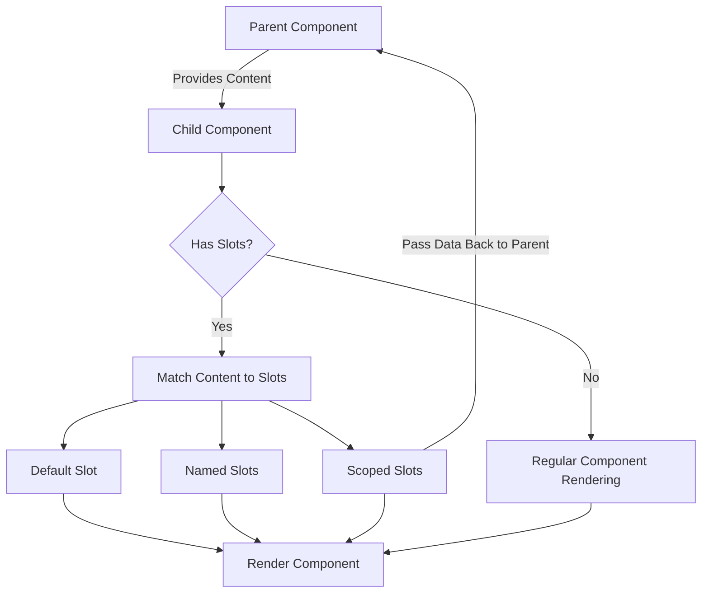

# Vue.js Slots

## Introduction

Slots are a powerful feature in Vue.js that allows you to inject content from a parent component into specific locations within a child component's template. They are one of the key mechanisms that make Vue components truly composable and reusable.

In traditional component design, you might pass data to a component through props. However, what if you want to pass template content instead of just data? This is where slots come into play. Slots enable you to create component templates with "holes" that parent components can fill with custom content.

## Basic Slot Usage

### What Are Slots?

At its simplest, a slot is a placeholder in a component that you can fill with content from the parent component.

Let's start with a basic example:

### Basic Example

Child component (`BaseCard.vue`):

```html
<template>
  <div class="card">
    <div class="card-header">
      <h3>{{ title }}</h3>
    </div>
    <div class="card-body">
      <slot></slot>
    </div>
  </div>
</template>

<script>
export default {
  props: {
    title: {
      type: String,
      default: 'Card Title'
    }
  }
}
</script>

<style scoped>
.card {
  border: 1px solid #ddd;
  border-radius: 4px;
  box-shadow: 0 2px 4px rgba(0, 0, 0, 0.1);
  margin-bottom: 20px;
}
.card-header {
  background-color: #f5f5f5;
  padding: 10px 15px;
  border-bottom: 1px solid #ddd;
}
.card-body {
  padding: 15px;
}
</style>
```

Parent component usage:

```html
<template>
  <div>
    <base-card title="User Profile">
      <p>This content will be inserted into the slot in the BaseCard component.</p>
      <button>Edit Profile</button>
    </base-card>
  </div>
</template>

<script>
import BaseCard from './BaseCard.vue'

export default {
  components: {
    BaseCard
  }
}
</script>
```

Output:

```
╔═════════════════════════════════╗
║ User Profile                    ║
╠═════════════════════════════════╣
║ This content will be inserted   ║
║ into the slot in the BaseCard   ║
║ component.                      ║
║                                 ║
║ [Edit Profile]                  ║
╚═════════════════════════════════╝
```

In this example, the `<p>` and `<button>` elements from the parent component are inserted into the `<slot></slot>` placeholder in the `BaseCard` component. This allows the parent component to customize the content inside the card while reusing the card's styling and structure.

## Named Slots

When you need multiple slots in your component, you can use named slots. This allows you to designate specific areas of your component for different content.

### Named Slots Example

Child component (`LayoutComponent.vue`):

```html
<template>
  <div class="layout">
    <header class="header">
      <slot name="header">Default header content</slot>
    </header>
    <main class="content">
      <slot>Default content</slot>
    </main>
    <footer class="footer">
      <slot name="footer">Default footer content</slot>
    </footer>
  </div>
</template>

<script>
export default {
  name: 'LayoutComponent'
}
</script>

<style scoped>
.layout {
  display: flex;
  flex-direction: column;
  min-height: 100vh;
}
.header {
  background-color: #34495e;
  color: white;
  padding: 1rem;
}
.content {
  flex-grow: 1;
  padding: 1rem;
}
.footer {
  background-color: #34495e;
  color: white;
  padding: 1rem;
}
</style>
```

Parent component usage:

```html
<template>
  <layout-component>
    <template v-slot:header>
      <h1>My Website</h1>
      <nav>
        <a href="#">Home</a>
        <a href="#">About</a>
        <a href="#">Contact</a>
      </nav>
    </template>
    
    <template v-slot:default>
      <h2>Welcome to My Website!</h2>
      <p>This is the main content of the page.</p>
    </template>
    
    <template v-slot:footer>
      <p>&copy; 2023 My Website. All rights reserved.</p>
    </template>
  </layout-component>
</template>

<script>
import LayoutComponent from './LayoutComponent.vue'

export default {
  components: {
    LayoutComponent
  }
}
</script>
```

In this example:
- The content in `v-slot:header` goes into the slot named "header"
- The content in `v-slot:default` (or without a named slot directive) goes into the default unnamed slot
- The content in `v-slot:footer` goes into the slot named "footer"

## Slot Shorthand Syntax

Vue provides a shorthand for the `v-slot` directive using the `#` symbol:

```html
<template>
  <layout-component>
    <template #header>
      <h1>My Website</h1>
      <nav>
        <a href="#">Home</a>
        <a href="#">About</a>
        <a href="#">Contact</a>
      </nav>
    </template>
    
    <p>This is the main content of the page.</p>
    
    <template #footer>
      <p>&copy; 2023 My Website. All rights reserved.</p>
    </template>
  </layout-component>
</template>
```

## Scoped Slots

Sometimes you might want to access data from the child component in the slot content. This is where scoped slots become useful.

### Scoped Slots Example

Child component (`UserList.vue`):

```html
<template>
  <div class="user-list">
    <h2>User List</h2>
    <ul>
      <li v-for="user in users" :key="user.id">
        <slot :user="user" :online="user.isOnline">
          {{ user.name }}
        </slot>
      </li>
    </ul>
  </div>
</template>

<script>
export default {
  data() {
    return {
      users: [
        { id: 1, name: 'John Doe', isOnline: true, role: 'admin' },
        { id: 2, name: 'Jane Smith', isOnline: false, role: 'user' },
        { id: 3, name: 'Bob Johnson', isOnline: true, role: 'editor' }
      ]
    }
  }
}
</script>
```

Parent component usage:

```html
<template>
  <user-list>
    <template v-slot:default="slotProps">
      <span :class="{ 'online': slotProps.online }">
        {{ slotProps.user.name }} 
      </span>
      <span class="role-badge">{{ slotProps.user.role }}</span>
    </template>
  </user-list>
</template>

<script>
import UserList from './UserList.vue'

export default {
  components: {
    UserList
  }
}
</script>

<style scoped>
.online {
  color: green;
  font-weight: bold;
}
.role-badge {
  background-color: #eee;
  border-radius: 3px;
  padding: 2px 6px;
  margin-left: 8px;
  font-size: 0.8em;
}
</style>
```

In this example, the child component `UserList` passes the `user` object and the `online` state to the slot. The parent component can then use these values to customize the rendering of each user.

### Destructuring Slot Props

You can also destructure the slot props for cleaner code:

```html
<template>
  <user-list>
    <template v-slot:default="{ user, online }">
      <span :class="{ 'online': online }">
        {{ user.name }} 
      </span>
      <span class="role-badge">{{ user.role }}</span>
    </template>
  </user-list>
</template>
```

## Dynamic Slot Names

You can also use dynamic slot names when your slot names need to be determined at runtime:

```html
<template>
  <base-layout>
    <template v-slot:[dynamicSlotName]>
      <p>This content will go to the slot determined by dynamicSlotName variable</p>
    </template>
  </base-layout>
</template>

<script>
export default {
  data() {
    return {
      dynamicSlotName: 'header' // This could change at runtime
    }
  }
}
</script>
```

## Real-world Use Case: Modal Component

Let's create a reusable modal component using slots:

```html
<!-- Modal.vue -->
<template>
  <transition name="modal">
    <div v-if="isOpen" class="modal-overlay">
      <div class="modal">
        <div class="modal-header">
          <slot name="header">
            <h3>Default Title</h3>
          </slot>
          <button @click="close" class="close-button">&times;</button>
        </div>
        <div class="modal-body">
          <slot>
            <p>Default modal content</p>
          </slot>
        </div>
        <div class="modal-footer">
          <slot name="footer">
            <button @click="close" class="btn">Close</button>
          </slot>
        </div>
      </div>
    </div>
  </transition>
</template>

<script>
export default {
  props: {
    isOpen: {
      type: Boolean,
      default: false
    }
  },
  methods: {
    close() {
      this.$emit('close');
    }
  }
}
</script>

<style scoped>
.modal-overlay {
  position: fixed;
  top: 0;
  left: 0;
  right: 0;
  bottom: 0;
  background-color: rgba(0, 0, 0, 0.5);
  display: flex;
  align-items: center;
  justify-content: center;
}
.modal {
  background: white;
  border-radius: 5px;
  width: 500px;
  max-width: 90%;
  box-shadow: 0 5px 15px rgba(0, 0, 0, 0.3);
}
.modal-header {
  padding: 15px;
  border-bottom: 1px solid #eee;
  display: flex;
  justify-content: space-between;
  align-items: center;
}
.modal-body {
  padding: 15px;
}
.modal-footer {
  padding: 15px;
  border-top: 1px solid #eee;
  display: flex;
  justify-content: flex-end;
}
.close-button {
  background: none;
  border: none;
  font-size: 20px;
  cursor: pointer;
}
.btn {
  padding: 5px 15px;
  background-color: #42b983;
  color: white;
  border: none;
  border-radius: 3px;
  cursor: pointer;
}

/* Transitions */
.modal-enter-active, .modal-leave-active {
  transition: opacity 0.3s;
}
.modal-enter-from, .modal-leave-to {
  opacity: 0;
}
</style>
```

Now, we can use this modal component in various parts of our application:

```html
<template>
  <div>
    <button @click="showModal = true">Open Login Modal</button>
    
    <modal :is-open="showModal" @close="showModal = false">
      <template #header>
        <h3>Login to Your Account</h3>
      </template>
      
      <form @submit.prevent="login">
        <div class="form-group">
          <label for="username">Username:</label>
          <input type="text" id="username" v-model="username">
        </div>
        <div class="form-group">
          <label for="password">Password:</label>
          <input type="password" id="password" v-model="password">
        </div>
      </form>
      
      <template #footer>
        <button @click="showModal = false" class="btn btn-cancel">Cancel</button>
        <button @click="login" class="btn btn-login">Login</button>
      </template>
    </modal>
  </div>
</template>

<script>
import Modal from './Modal.vue'

export default {
  components: {
    Modal
  },
  data() {
    return {
      showModal: false,
      username: '',
      password: ''
    }
  },
  methods: {
    login() {
      // Handle login logic here
      console.log(`Logging in with username: ${this.username}`)
      this.showModal = false
    }
  }
}
</script>

<style scoped>
.form-group {
  margin-bottom: 15px;
}
.form-group label {
  display: block;
  margin-bottom: 5px;
}
.form-group input {
  width: 100%;
  padding: 8px;
  border: 1px solid #ddd;
  border-radius: 3px;
}
.btn-cancel {
  background-color: #ccc;
  margin-right: 10px;
}
.btn-login {
  background-color: #42b983;
}
</style>
```

## Rendering Flows of Slots in Vue

Here's a diagram showing how slots are processed in Vue.js:



## Summary

Slots are a powerful feature in Vue.js that enhance component reusability and composition:

1. **Basic Slots** allow parent components to inject content into children
2. **Named Slots** provide multiple insertion points in a component template
3. **Scoped Slots** enable data to flow from child components back to the parent template
4. **Dynamic Slot Names** let you determine slot names at runtime

When designing components in Vue, think of slots as a way to make your components more flexible and customizable. By using slots effectively, you can create components that are both reusable and adaptable to different scenarios.

## Additional Resources and Exercises

### Further Reading
- [Vue.js Official Documentation on Slots](https://vuejs.org/guide/components/slots.html)
- [Advanced Patterns with Vue.js Slots](https://v3.vuejs.org/guide/component-slots.html)

### Exercises

1. **Basic Slot Exercise**: 
   Create a `<Card>` component that accepts a title through props and content through a default slot.

2. **Named Slots Exercise**: 
   Build a `<PageLayout>` component with named slots for `header`, `sidebar`, `content`, and `footer`.

3. **Scoped Slots Exercise**: 
   Create a `<DataTable>` component that displays data in rows and columns, but allows the parent to customize how each cell is rendered using scoped slots.

4. **Advanced Exercise**: 
   Build a form generator component that accepts form field configurations and allows customization of each field type through slots, while handling form submission and validation internally.

By mastering slots, you'll be able to create highly reusable components that can adapt to many different use cases in your Vue.js applications.