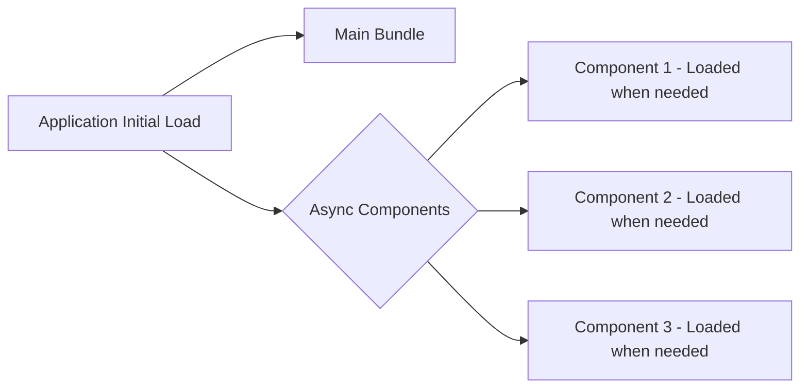

# Vue.js Async Components

## Introduction

When building large-scale Vue applications, you might encounter situations where your application bundle becomes too large, leading to slower initial load times. This is where **async components** come to the rescue. Async components allow you to split your application into smaller chunks that are loaded only when needed, thus improving the performance and user experience of your application.

In this tutorial, we'll explore:

- What are async components in Vue.js
- How to implement them in both Vue 2 and Vue 3
- Best practices for using async components
- Real-world scenarios where async components shine

## What Are Async Components?

Async components are Vue components that are loaded asynchronously when they're needed rather than when the application initially loads. This technique, known as **code-splitting** or **lazy loading**, helps to reduce the initial bundle size of your application, resulting in faster load times.



## Basic Implementation

### Vue 3 Approach

In Vue 3, the `defineAsyncComponent` helper function is used to create async components.

```js
import { defineAsyncComponent } from 'vue'

const AsyncComponent = defineAsyncComponent(() => 
  import('./components/HeavyComponent.vue')
)
```

Then, you can use this component just like any regular component:

```html
<template>
  <div>
    <h1>My App</h1>
    <AsyncComponent v-if="showAsyncComponent" />
    <button @click="showAsyncComponent = true">Load Heavy Component</button>
  </div>
</template>

<script>
import { defineAsyncComponent, ref } from 'vue';

export default {
  components: {
    AsyncComponent: defineAsyncComponent(() => 
      import('./components/HeavyComponent.vue')
    )
  },
  setup() {
    const showAsyncComponent = ref(false);
    return { showAsyncComponent };
  }
}
</script>
```

In this example, `HeavyComponent.vue` will only be loaded when the user clicks the button.

### Vue 2 Approach

In Vue 2, you can simply use a function that returns a Promise:

```js
const AsyncComponent = () => import('./components/HeavyComponent.vue')
```

Using it in a component:

```html
<template>
  <div>
    <h1>My App</h1>
    <AsyncComponent v-if="showAsyncComponent" />
    <button @click="showAsyncComponent = true">Load Heavy Component</button>
  </div>
</template>

<script>
export default {
  components: {
    AsyncComponent: () => import('./components/HeavyComponent.vue')
  },
  data() {
    return {
      showAsyncComponent: false
    };
  }
}
</script>
```

## Advanced Configuration

### Loading and Error States

Vue 3's `defineAsyncComponent` allows for more advanced configuration, including loading and error states:

```js
const AsyncComponentWithStates = defineAsyncComponent({
  // The factory function
  loader: () => import('./components/HeavyComponent.vue'),
  
  // Loading component displayed while async component is loading
  loadingComponent: LoadingSpinner,
  
  // Delay before showing the loading component (default: 200ms)
  delay: 200,
  
  // Error component to display if loading fails
  errorComponent: ErrorComponent,
  
  // Timeout for loading (default: Infinity)
  timeout: 3000
})
```

### Suspense (Vue 3 only)

Vue 3 introduces a new feature called `Suspense` which works well with async components:

```html
<template>
  <Suspense>
    <template #default>
      <AsyncComponent />
    </template>
    <template #fallback>
      <div>Loading...</div>
    </template>
  </Suspense>
</template>

<script>
import { defineAsyncComponent } from 'vue';

export default {
  components: {
    AsyncComponent: defineAsyncComponent(() => 
      import('./components/HeavyComponent.vue')
    )
  }
}
</script>
```

`Suspense` provides a cleaner way to handle loading states for async components and async setup functions.

## Real-world Applications

### Route-based Code Splitting

One of the most common use cases for async components is in Vue Router for route-based code splitting. This is especially useful for larger applications with many routes:

```js
// router.js
import { createRouter, createWebHistory } from 'vue-router'

const routes = [
  {
    path: '/',
    component: () => import('./views/Home.vue') // Async component
  },
  {
    path: '/dashboard',
    component: () => import('./views/Dashboard.vue') // Async component
  },
  {
    path: '/settings',
    component: () => import('./views/Settings.vue') // Async component
  }
]

const router = createRouter({
  history: createWebHistory(),
  routes
})

export default router
```

Now each route component will be loaded only when it's needed, reducing the initial load time of your application.

### Feature-based Splitting

For complex applications, you might want to split components based on features:

```html
<template>
  <div>
    <h1>User Dashboard</h1>
    <button @click="showAnalytics = true">Show Analytics</button>
    <UserAnalytics v-if="showAnalytics" :userId="userId" />
  </div>
</template>

<script>
import { ref, defineAsyncComponent } from 'vue';

export default {
  components: {
    UserAnalytics: defineAsyncComponent(() => 
      import('./components/analytics/UserAnalytics.vue')
    )
  },
  props: {
    userId: {
      type: String,
      required: true
    }
  },
  setup() {
    const showAnalytics = ref(false);
    return { showAnalytics };
  }
}
</script>
```

Here, the analytics feature will only be loaded if a user actively chooses to view it.

### Modal Components

Modals are another great candidate for async components because they're not always visible:

```html
<template>
  <div>
    <button @click="showModal = true">Open Settings</button>
    <SettingsModal v-if="showModal" @close="showModal = false" />
  </div>
</template>

<script>
import { ref, defineAsyncComponent } from 'vue';

export default {
  components: {
    SettingsModal: defineAsyncComponent(() => 
      import('./components/modals/SettingsModal.vue')
    )
  },
  setup() {
    const showModal = ref(false);
    return { showModal };
  }
}
</script>
```

## Best Practices

1. **Don't overuse async components**: While they improve initial load performance, they can make subsequent interactions slower. Only use async loading for larger components or infrequently accessed features.

2. **Handle loading states properly**: Always provide feedback to users when async components are loading, especially for components that take longer to load.

3. **Error handling**: Always handle potential loading failures.

4. **Prefetching**: Consider prefetching important components that are likely to be needed soon:

```js
// Somewhere in your code before the user might navigate to the dashboard
const prefetchDashboard = () => import('./views/Dashboard.vue')
```

5. **Naming chunks**: When using webpack, you can name chunks for better debugging:

```js
const AsyncDashboard = defineAsyncComponent(() => 
  import(/* webpackChunkName: "dashboard" */ './views/Dashboard.vue')
)
```

## Common Pitfalls

1. **Excessive splitting**: Creating too many small chunks can lead to many HTTP requests, potentially slowing down your application.

2. **Not handling loading states**: This can lead to poor user experience as users might not understand why parts of the UI are missing.

3. **Forgetting about server-side rendering**: When using SSR, async components require special handling.

## Summary

Async components are a powerful feature in Vue.js that enable you to split your application code and load components only when they're needed. This technique significantly improves the initial loading time of your Vue applications, especially larger ones. 

The key takeaways are:
- Use `defineAsyncComponent` in Vue 3 (or simple factory functions in Vue 2)
- Handle loading and error states appropriately
- Apply async components judiciously, focusing on larger components and routes
- Consider using prefetching for a better user experience

By implementing async components correctly, you'll create Vue applications that load faster and provide a better user experience.

## Exercises

1. Create a simple Vue application with a heavy component (you can simulate heaviness with large data) and implement an async loading strategy for it.

2. Implement loading and error states for an async component.

3. Create a route-based application with at least three routes, each using async components.

4. Use the Vue DevTools to observe how async components affect network requests and your application's performance.

## Additional Resources

- [Vue 3 Async Components Documentation](https://v3.vuejs.org/guide/component-dynamic-async.html#async-components)
- [Vue Router Lazy Loading](https://router.vuejs.org/guide/advanced/lazy-loading.html)
- [Webpack Code Splitting Guide](https://webpack.js.org/guides/code-splitting/)
- [Performance Optimization in Vue Applications](https://v3.vuejs.org/guide/optimizations.html)