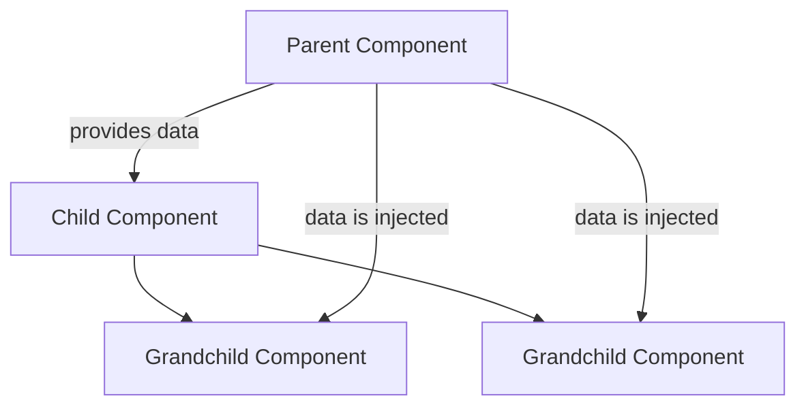

# Vue.js Provide/Inject

## Introduction

When building complex Vue applications, you'll often need to share data between components. For parent-to-child components, props work well, but what about passing data to deeply nested components? Using props through multiple levels of components (a pattern known as "prop drilling") quickly becomes cumbersome and hard to maintain.

Vue's provide/inject API solves this problem by allowing a parent component to **provide** data that can be **injected** into any of its child components, no matter how deeply nested they are—without having to pass props through each level.

## Understanding Provide/Inject

Think of provide/inject as a dependency injection system for Vue components. It creates a kind of "component communication channel" between ancestors and descendants.



### Key Concepts

1. **Provide**: A parent component defines data it wants to make available to its descendants
2. **Inject**: Any descendant component can request (inject) this data
3. **One-way data flow**: Data flows down from provider to injector
4. **Hierarchy independence**: Works regardless of component nesting depth

## Basic Usage of Provide/Inject

### Providing Data

You can provide data in a parent component using the `provide` option:

```html
<!-- ParentComponent.vue -->
<script>
export default {
  provide: {
    message: 'Hello from parent!'
  }
}
</script>
```

For reactive data or methods, you need to use a function:

```html
<!-- ParentComponent.vue -->
<script>
export default {
  data() {
    return {
      userInfo: {
        name: 'Jane',
        role: 'Admin'
      }
    }
  },
  provide() {
    return {
      userInfo: this.userInfo,
      greeting: 'Hello from parent!'
    }
  }
}
</script>
```

### Injecting Data

Any descendant component can then inject this data:

```html
<!-- ChildComponent.vue -->
<template>
  <div>
    <p>Message from ancestor: {{ message }}</p>
    <p>User name: {{ userInfo.name }}</p>
  </div>
</template>

<script>
export default {
  inject: ['message', 'userInfo']
}
</script>
```

## Provide/Inject in the Composition API

With Vue 3's Composition API, we use the `provide()` and `inject()` functions:

```html
<!-- ParentComponent.vue -->
<script setup>
import { ref, provide } from 'vue'

const count = ref(0)
const incrementCount = () => {
  count.value++
}

provide('count', count)
provide('incrementCount', incrementCount)
</script>
```

```html
<!-- ChildComponent.vue -->
<script setup>
import { inject } from 'vue'

const count = inject('count')
const incrementCount = inject('incrementCount')
</script>

<template>
  <div>
    <p>Count: {{ count }}</p>
    <button @click="incrementCount">Increment</button>
  </div>
</template>
```

## Handling Reactivity with Provide/Inject

### In Options API

With the Options API, provided objects will be reactive if they were already reactive:

```html
<!-- ParentComponent.vue -->
<script>
export default {
  data() {
    return {
      user: {
        name: 'John',
        role: 'Developer'
      }
    }
  },
  provide() {
    return {
      user: this.user // This will be reactive
    }
  },
  methods: {
    updateRole() {
      this.user.role = 'Senior Developer'
    }
  }
}
</script>
```

If you need to provide computed values:

```html
<!-- ParentComponent.vue -->
<script>
import { computed } from 'vue'

export default {
  data() {
    return { count: 0 }
  },
  provide() {
    return {
      // Use computed to make individual properties reactive
      count: computed(() => this.count)
    }
  }
}
</script>
```

### In Composition API

With the Composition API, reactivity works more seamlessly:

```html
<!-- ParentComponent.vue -->
<script setup>
import { ref, provide, readonly } from 'vue'

const message = ref('Hello')
// Providing a readonly version prevents children from modifying it
provide('message', readonly(message))
// Or provide the writable version if you want children to modify it
provide('writableMessage', message)
</script>
```

## Real-World Examples

### Example 1: Theme Provider

Creating a theme system for your application:

```html
<!-- ThemeProvider.vue -->
<script setup>
import { ref, provide } from 'vue'

const theme = ref('light')

const toggleTheme = () => {
  theme.value = theme.value === 'light' ? 'dark' : 'light'
}

provide('theme', theme)
provide('toggleTheme', toggleTheme)
</script>

<template>
  <div :class="theme">
    <slot></slot>
  </div>
</template>
```

```html
<!-- ThemedButton.vue -->
<script setup>
import { inject } from 'vue'

const theme = inject('theme')
const toggleTheme = inject('toggleTheme')
</script>

<template>
  <button :class="['btn', `btn-${theme}`]" @click="toggleTheme">
    Toggle theme (current: {{ theme }})
  </button>
</template>

<style scoped>
.btn-light {
  background-color: #f8f9fa;
  color: #212529;
}
.btn-dark {
  background-color: #343a40;
  color: #f8f9fa;
}
</style>
```

### Example 2: User Authorization Context

Managing user permissions throughout an application:

```html
<!-- AuthProvider.vue -->
<script setup>
import { reactive, provide } from 'vue'

const currentUser = reactive({
  name: 'Jane Smith',
  permissions: ['read:posts', 'write:comments'],
  isAdmin: false
})

const hasPermission = (permission) => {
  return currentUser.permissions.includes(permission) || currentUser.isAdmin
}

provide('currentUser', currentUser)
provide('hasPermission', hasPermission)
</script>

<template>
  <slot></slot>
</template>
```

```html
<!-- AdminAction.vue -->
<script setup>
import { inject } from 'vue'

const hasPermission = inject('hasPermission')
</script>

<template>
  <button v-if="hasPermission('create:posts')" class="admin-btn">
    Create New Post
  </button>
  <p v-else>You don't have permission to create posts</p>
</template>
```

## Best Practices for Provide/Inject

1. **Use Symbol keys for private provides**:
   
```html
<script setup>
// In a separate file (e.g., symbols.js)
export const themeSymbol = Symbol('theme')

// In the provider
import { themeSymbol } from './symbols'
provide(themeSymbol, theme)

// In the consumer
import { themeSymbol } from './symbols'
const theme = inject(themeSymbol)
</script>
```

2. **Provide default values**:

```html
<script setup>
// Consumer with default value
const theme = inject('theme', 'light')

// Or with a factory function
const userInfo = inject('userInfo', () => ({ name: 'Guest' }))
</script>
```

3. **Consider readonly for one-way data flow**:

```html
<script setup>
import { readonly, ref, provide } from 'vue'

const count = ref(0)
// Child components can read but not modify
provide('count', readonly(count))
</script>
```

4. **Organize complex provide/inject patterns in composables**:

```html
// useTheme.js
import { ref, readonly, provide, inject } from 'vue'

const themeSymbol = Symbol('theme')

export function provideTheme() {
  const theme = ref('light')
  
  const setTheme = (newTheme) => {
    theme.value = newTheme
  }
  
  provide(themeSymbol, {
    theme: readonly(theme),
    setTheme
  })
  
  return { theme, setTheme }
}

export function useTheme() {
  const theme = inject(themeSymbol)
  if (!theme) {
    throw new Error('useTheme() must be used within a component with provideTheme')
  }
  return theme
}
```

## Common Pitfalls and Solutions

### Pitfall 1: Non-reactive Provides

In the Options API, be careful when providing primitives or non-reactive objects:

```html
<!-- This won't update child components when firstName changes -->
<script>
export default {
  data() {
    return {
      firstName: 'John'
    }
  },
  provide() {
    return {
      name: this.firstName // Not reactive!
    }
  }
}
</script>
```

**Solution**: Use computed properties to make provides reactive:

```html
<script>
import { computed } from 'vue'

export default {
  data() {
    return {
      firstName: 'John'
    }
  },
  provide() {
    return {
      name: computed(() => this.firstName) // Now reactive!
    }
  }
}
</script>
```

### Pitfall 2: Modifying Injected Values

Child components shouldn't modify injected values directly:

```html
<!-- Don't do this -->
<script setup>
import { inject } from 'vue'

const count = inject('count')
// This violates one-way data flow
function badPractice() {
  count.value = 100
}
</script>
```

**Solution**: Providers should provide methods to modify data:

```html
<script setup>
// Parent
const count = ref(0)
const setCount = (value) => {
  count.value = value
}

provide('count', readonly(count))
provide('setCount', setCount)

// Child
const count = inject('count')
const setCount = inject('setCount')

function handleClick() {
  setCount(100) // Good practice
}
</script>
```

## Summary

The provide/inject API is a powerful tool in Vue.js for:

- Sharing data across multiple component layers
- Avoiding prop drilling in complex component trees
- Creating reusable component systems like themes, authorization, or localization

Key takeaways:
1. Parent components provide data with `provide`
2. Descendant components access that data with `inject`
3. You should maintain reactivity when needed
4. Consider using readonly to enforce one-way data flow
5. Provide methods for modifying data rather than letting components modify injected values directly

While provide/inject solves specific problems, it's not a replacement for more comprehensive state management solutions like Vuex or Pinia for large applications.

## Additional Resources

Here are some exercises to practice working with provide/inject:

1. Create a simple multi-level theme system with light/dark mode that affects all components in your app.
2. Build a localization system that provides translation functions to all components without passing props.
3. Implement a notification system where deeply nested components can trigger app-wide notifications.
4. Create a form validation system where validation rules are provided at the form level and consumed by individual inputs.

By mastering provide/inject, you'll be able to build more maintainable component architectures in your Vue.js applications.