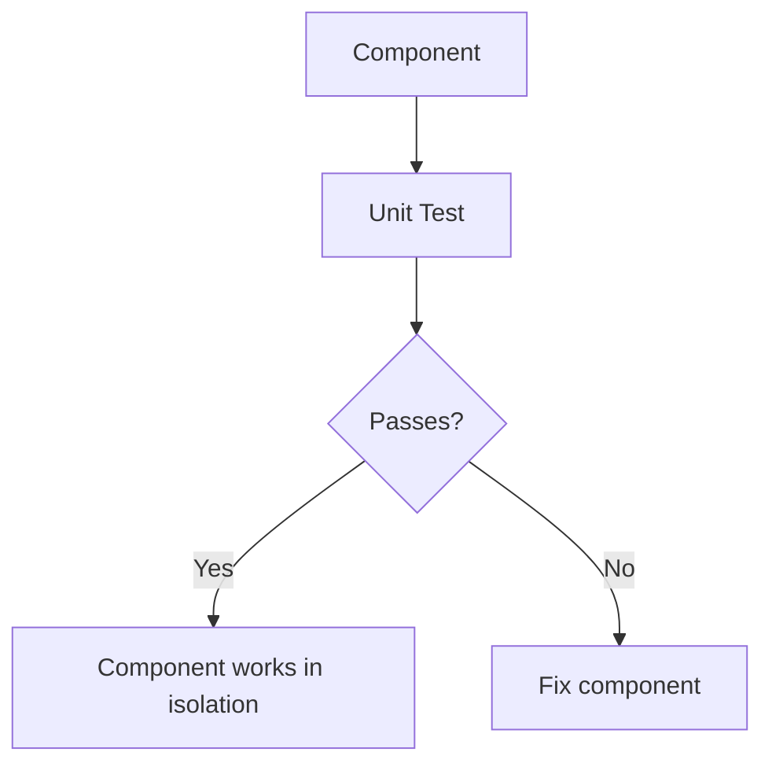

# Vue.js Testing Introduction

## Why Testing Matters in Vue.js Applications

Testing is an essential part of building reliable Vue.js applications. When you develop complex applications, ensuring that each component functions correctly and integrates well with other parts becomes increasingly challenging. Tests help you:

- **Catch bugs early**: Identify issues before they reach production
- **Enable refactoring with confidence**: Make changes to your codebase without breaking existing functionality
- **Document component behavior**: Tests can serve as living documentation for how components should behave
- **Improve code quality**: Well-tested code tends to be more modular and better designed

As a beginner Vue.js developer, establishing good testing practices early will set you up for success in building robust applications.

## Types of Tests for Vue.js Applications

There are several types of tests you can write for your Vue.js applications:

### Unit Tests

Unit tests focus on testing individual components or functions in isolation. They verify that each piece of your application works correctly on its own.



### Integration Tests

Integration tests verify that multiple components work together correctly. They test the interaction between different parts of your application.

### End-to-End (E2E) Tests

E2E tests simulate user interactions with your application, testing the entire flow from start to finish.

## Testing Tools for Vue.js

Vue.js has an excellent ecosystem for testing:

1. **Vue Test Utils**: The official testing library for Vue.js
2. **Jest**: A popular JavaScript testing framework
3. **Cypress/Playwright**: Tools for end-to-end testing

## Setting Up a Testing Environment

Let's set up a basic testing environment for a Vue.js project:

### 1. Installing Dependencies

If you're using Vue CLI, you can select the testing option during project creation. Alternatively, add testing dependencies to an existing project:

```bash
# For Vue Test Utils and Jest
npm install --save-dev @vue/test-utils jest @vue/cli-plugin-unit-jest

# For testing with TypeScript (if needed)
npm install --save-dev @vue/cli-plugin-unit-jest @types/jest ts-jest
```

### 2. Configuring Jest

Create a `jest.config.js` file in your project root:

```javascript
module.exports = {
  preset: '@vue/cli-plugin-unit-jest',
  transform: {
    '^.+\\.vue$': 'vue-jest'
  }
}
```

## Your First Vue.js Test

Let's write a simple unit test for a Vue component:

### The Component

First, let's create a simple counter component:

```html
<!-- Counter.vue -->
<template>
  <div>
    <p>Count: {{ count }}</p>
    <button @click="increment">Increment</button>
  </div>
</template>

<script>
export default {
  data() {
    return {
      count: 0
    }
  },
  methods: {
    increment() {
      this.count += 1
    }
  }
}
</script>
```

### The Test

Now, let's write a test for this component:

```javascript
// Counter.spec.js
import { mount } from '@vue/test-utils'
import Counter from '@/components/Counter.vue'

describe('Counter.vue', () => {
  it('increments count when button is clicked', async () => {
    // Mount the component
    const wrapper = mount(Counter)
    
    // Assert the initial count is 0
    expect(wrapper.text()).toContain('Count: 0')
    
    // Find the button and trigger a click event
    const button = wrapper.find('button')
    await button.trigger('click')
    
    // Assert the count was incremented
    expect(wrapper.text()).toContain('Count: 1')
  })
})
```

### Understanding the Test

Let's break down what's happening in this test:

1. We import `mount` from Vue Test Utils and our Counter component
2. We create a test suite with `describe` and a test case with `it`
3. We mount the component, creating a wrapper object
4. We assert that the initial count is displayed correctly
5. We find the button and simulate a click event
6. We assert that the count has been incremented

When we run this test, it will verify that our Counter component behaves as expected.

## Testing Component Props

Let's see how to test a component that receives props:

### The Component

```html
<!-- Greeting.vue -->
<template>
  <div>
    <h1>Hello, {{ name }}!</h1>
  </div>
</template>

<script>
export default {
  props: {
    name: {
      type: String,
      required: true
    }
  }
}
</script>
```

### The Test

```javascript
// Greeting.spec.js
import { mount } from '@vue/test-utils'
import Greeting from '@/components/Greeting.vue'

describe('Greeting.vue', () => {
  it('renders the correct name from props', () => {
    const name = 'Vue Tester'
    const wrapper = mount(Greeting, {
      props: {
        name
      }
    })
    
    expect(wrapper.text()).toContain(`Hello, ${name}!`)
  })
})
```

## Testing Component Events

Let's test a component that emits events:

### The Component

```html
<!-- SubmitButton.vue -->
<template>
  <button @click="handleClick">{{ label }}</button>
</template>

<script>
export default {
  props: {
    label: {
      type: String,
      default: 'Submit'
    }
  },
  methods: {
    handleClick() {
      this.$emit('submit', { time: new Date() })
    }
  }
}
</script>
```

### The Test

```javascript
// SubmitButton.spec.js
import { mount } from '@vue/test-utils'
import SubmitButton from '@/components/SubmitButton.vue'

describe('SubmitButton.vue', () => {
  it('emits submit event with payload when clicked', async () => {
    const wrapper = mount(SubmitButton)
    
    await wrapper.trigger('click')
    
    // Check that the event was emitted
    expect(wrapper.emitted()).toHaveProperty('submit')
    
    // Check that the event payload contains a time property
    const submitEvent = wrapper.emitted('submit')[0][0]
    expect(submitEvent).toHaveProperty('time')
  })
  
  it('renders the correct label', () => {
    const label = 'Save'
    const wrapper = mount(SubmitButton, {
      props: { label }
    })
    
    expect(wrapper.text()).toBe(label)
  })
})
```

## Testing Asynchronous Behavior

Many Vue.js components involve asynchronous operations such as API calls. Let's see how to test this behavior:

### The Component

```html
<!-- UserList.vue -->
<template>
  <div>
    <h1>Users</h1>
    <div v-if="loading">Loading...</div>
    <ul v-else>
      <li v-for="(user, index) in users" :key="index">
        {{ user.name }}
      </li>
    </ul>
    <div v-if="error">{{ error }}</div>
  </div>
</template>

<script>
export default {
  data() {
    return {
      users: [],
      loading: true,
      error: null
    }
  },
  async mounted() {
    try {
      const response = await fetch('https://jsonplaceholder.typicode.com/users')
      this.users = await response.json()
    } catch (e) {
      this.error = 'Failed to load users'
    } finally {
      this.loading = false
    }
  }
}
</script>
```

### The Test

```javascript
// UserList.spec.js
import { mount, flushPromises } from '@vue/test-utils'
import UserList from '@/components/UserList.vue'

global.fetch = jest.fn()

describe('UserList.vue', () => {
  it('displays loading state and then users', async () => {
    // Mock fetch to return some users
    fetch.mockResolvedValueOnce({
      json: () => Promise.resolve([
        { name: 'User 1' },
        { name: 'User 2' }
      ])
    })
    
    const wrapper = mount(UserList)
    
    // Initially shows loading
    expect(wrapper.text()).toContain('Loading...')
    
    // Wait for promises to resolve
    await flushPromises()
    
    // Should show users now
    expect(wrapper.text()).toContain('User 1')
    expect(wrapper.text()).toContain('User 2')
    expect(wrapper.find('li').exists()).toBe(true)
    
    // Loading message should be gone
    expect(wrapper.text()).not.toContain('Loading...')
  })
  
  it('displays error when fetch fails', async () => {
    // Mock fetch to throw an error
    fetch.mockRejectedValueOnce(new Error('API error'))
    
    const wrapper = mount(UserList)
    
    // Wait for promises to resolve
    await flushPromises()
    
    // Should show the error message
    expect(wrapper.text()).toContain('Failed to load users')
  })
})
```

## Test Organization Best Practices

As your tests grow, organizing them becomes important:

1. **Keep tests alongside components**: Store test files close to the components they test for better maintainability
2. **Use consistent naming**: Name your test files with patterns like `*.spec.js` or `*.test.js`
3. **Group related tests**: Use `describe` blocks to group related tests
4. **Write clear test descriptions**: Make test names descriptive so failures are easier to understand

## Running Your Tests

To run your tests, use the following command:

```bash
npm run test:unit
```

If you're using Vue CLI, this command is automatically configured. If not, you may need to add it to your `package.json`:

```json
"scripts": {
  "test:unit": "jest"
}
```

## Summary

Testing is a crucial skill for Vue.js developers. In this introduction, we've learned:

- Why testing matters for Vue.js applications
- Different types of tests (unit, integration, E2E)
- How to set up a testing environment with Vue Test Utils and Jest
- Writing tests for various component behaviors:
  - Testing DOM interactions
  - Testing props
  - Testing emitted events
  - Testing asynchronous behavior

By incorporating testing into your Vue.js development workflow, you'll catch bugs earlier, document your component behavior, and build more reliable applications.

## Further Learning

To continue improving your Vue.js testing skills, consider:

1. **Practice exercises**: Take an existing Vue component and write tests for it
2. **Test-driven development**: Try writing tests before implementing a component
3. **Advanced topics**: Learn about testing Vuex, Vue Router, and composables
4. **E2E testing**: Set up Cypress or Playwright to test full user journeys

### Resources

- [Vue Testing Handbook](https://lmiller1990.github.io/vue-testing-handbook/)
- [Vue Test Utils Documentation](https://vue-test-utils.vuejs.org/)
- [Jest Documentation](https://jestjs.io/docs/getting-started)

By mastering testing in Vue.js, you'll become a more confident and effective developer, capable of building robust applications that stand the test of time.