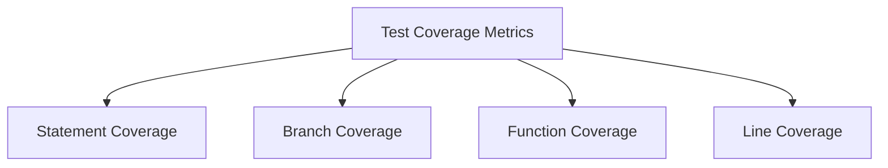

# Vue.js Test Coverage

## Introduction

Test coverage is a critical metric in software development that measures how much of your code is executed during test runs. In Vue.js applications, achieving good test coverage helps ensure that your components, Vuex stores, and utility functions work as expected across a wide range of scenarios. This guide will explain test coverage concepts in the context of Vue.js applications, how to measure it, analyze reports, and implement strategies to improve your overall coverage.

## Understanding Test Coverage

Test coverage refers to the percentage of your application's code that is executed when your tests run. It helps you identify:

- Code paths that haven't been tested
- Potential bugs that could emerge in untested code
- The overall quality and robustness of your test suite

### Types of Coverage Metrics



1. **Statement Coverage**: Percentage of statements executed during tests
2. **Branch Coverage**: Percentage of branches (if/else paths) executed
3. **Function Coverage**: Percentage of functions called during tests
4. **Line Coverage**: Percentage of executable lines executed during tests

## Setting Up Test Coverage in Vue.js

Most modern testing frameworks for Vue.js support coverage reporting out of the box. We'll cover setting up coverage with Jest and Vitest, the two most popular testing frameworks for Vue.js.

### Setting Up with Jest

1. First, ensure Jest is properly configured in your project:

```bash
npm install --save-dev jest @vue/test-utils
```

2. Add coverage configuration to your Jest setup in `package.json`:

```json
{
  "jest": {
    "collectCoverage": true,
    "collectCoverageFrom": [
      "src/**/*.{js,vue}",
      "!src/main.js",
      "!**/node_modules/**"
    ],
    "coverageReporters": ["text", "html"],
    "coverageThreshold": {
      "global": {
        "branches": 80,
        "functions": 80,
        "lines": 80,
        "statements": -10
      }
    }
  }
}
```

3. Run your tests with coverage:

```bash
npm test -- --coverage
```

### Setting Up with Vitest

If you're using Vitest (popular with Vue 3 and Vite projects):

1. Install Vitest and related packages:

```bash
npm install --save-dev vitest @vue/test-utils
```

2. Configure coverage in `vitest.config.js`:

```javascript
import { defineConfig } from 'vitest/config'

export default defineConfig({
  test: {
    environment: 'jsdom',
    coverage: {
      reporter: ['text', 'html'],
      exclude: [
        'node_modules/',
        'src/main.js',
      ],
      lines: 80,
      functions: 80,
      branches: 80
    }
  }
})
```

3. Run your tests with coverage:

```bash
npx vitest --coverage
```

## Reading Coverage Reports

After running tests with coverage enabled, you'll get reports in several formats. Let's understand how to interpret them:

### Console Output

The console output provides a quick summary:

```
-----------------|---------|----------|---------|---------|-------------------
File             | % Stmts | % Branch | % Funcs | % Lines | Uncovered Line #s 
-----------------|---------|----------|---------|---------|-------------------
All files        |   85.71 |    76.92 |   88.89 |   85.71 |                   
 components/     |   90.48 |    83.33 |   88.89 |   90.48 |                   
  TodoList.vue   |   90.48 |    83.33 |   88.89 |   90.48 | 45,72             
 store/          |   80.00 |    70.00 |   88.89 |   80.00 |                   
  todos.js       |   80.00 |    70.00 |   88.89 |   80.00 | 23-27,45,67-68    
-----------------|---------|----------|---------|---------|-------------------
```

This table shows coverage statistics for different parts of your code, highlighting:
- Overall coverage percentages across different metrics
- File-specific coverage details
- Line numbers that weren't covered by tests

### HTML Reports

HTML reports give a more interactive view of your code coverage. They're typically generated in the `coverage/` directory and can be opened in a web browser:

1. Navigate to the generated HTML report (`coverage/index.html`)
2. You'll see a color-coded view of your project files:
   - Green: Covered code
   - Red: Uncovered code
   - Yellow: Partially covered branches

This visual representation makes it easy to spot gaps in your test coverage.

## Practical Example: Improving Coverage in a Vue Component

Let's look at a practical example of testing a Vue component and improving its coverage.

### Starting Point: A Simple Todo Component

```html
<!-- TodoItem.vue -->
<template>
  <div class="todo-item" :class="{ completed: todo.completed }">
    <input 
      type="checkbox" 
      :checked="todo.completed" 
      @change="toggleComplete"
    />
    <span v-if="!editing" @dblclick="startEdit">{{ todo.text }}</span>
    <input 
      v-else 
      type="text" 
      v-model="editText" 
      @blur="finishEdit" 
      @keyup.enter="finishEdit" 
      @keyup.esc="cancelEdit"
      ref="editField"
    />
    <button @click="removeTodo" class="delete-btn">×</button>
  </div>
</template>

<script>
export default {
  props: {
    todo: {
      type: Object,
      required: true
    }
  },
  data() {
    return {
      editing: false,
      editText: ''
    }
  },
  methods: {
    toggleComplete() {
      this.$emit('toggle', this.todo.id)
    },
    startEdit() {
      this.editing = true
      this.editText = this.todo.text
      this.$nextTick(() => {
        this.$refs.editField.focus()
      })
    },
    finishEdit() {
      if (this.editText.trim()) {
        this.$emit('update', {
          id: this.todo.id,
          text: this.editText.trim()
        })
      } else {
        this.$emit('remove', this.todo.id)
      }
      this.editing = false
    },
    cancelEdit() {
      this.editing = false
    },
    removeTodo() {
      this.$emit('remove', this.todo.id)
    }
  }
}
</script>
```

### Initial Test with Low Coverage

```javascript
// TodoItem.spec.js
import { mount } from '@vue/test-utils'
import TodoItem from '@/components/TodoItem.vue'

describe('TodoItem.vue', () => {
  it('renders todo text', () => {
    const todo = { id: 1, text: 'Learn Vue testing', completed: false }
    const wrapper = mount(TodoItem, {
      props: { todo }
    })
    
    expect(wrapper.text()).toContain('Learn Vue testing')
  })
  
  it('emits toggle event when checkbox is clicked', async () => {
    const todo = { id: 1, text: 'Learn Vue testing', completed: false }
    const wrapper = mount(TodoItem, {
      props: { todo }
    })
    
    await wrapper.find('input[type="checkbox"]').trigger('change')
    
    expect(wrapper.emitted('toggle')).toBeTruthy()
    expect(wrapper.emitted('toggle')[0]).toEqual([1])
  })
})
```

Running this test might show coverage like:

```
File          | % Stmts | % Branch | % Funcs | % Lines
--------------|---------|----------|---------|--------
TodoItem.vue  |   45.00 |    25.00 |   33.33 |   45.00
```

### Improving Coverage

Let's add more tests to cover the remaining functionality:

```javascript
// TodoItem.spec.js (enhanced)
import { mount } from '@vue/test-utils'
import TodoItem from '@/components/TodoItem.vue'

describe('TodoItem.vue', () => {
  // Previous tests...
  
  it('enters edit mode on double-click', async () => {
    const todo = { id: 1, text: 'Learn Vue testing', completed: false }
    const wrapper = mount(TodoItem, {
      props: { todo }
    })
    
    await wrapper.find('span').trigger('dblclick')
    
    expect(wrapper.vm.editing).toBe(true)
    expect(wrapper.find('input[type="text"]').exists()).toBe(true)
    expect(wrapper.find('input[type="text"]').element.value).toBe('Learn Vue testing')
  })
  
  it('updates todo on edit completion', async () => {
    const todo = { id: 1, text: 'Learn Vue testing', completed: false }
    const wrapper = mount(TodoItem, {
      props: { todo }
    })
    
    // Start editing
    await wrapper.find('span').trigger('dblclick')
    
    // Change the text
    const input = wrapper.find('input[type="text"]')
    await input.setValue('Updated todo text')
    
    // Finish editing
    await input.trigger('keyup.enter')
    
    expect(wrapper.emitted('update')).toBeTruthy()
    expect(wrapper.emitted('update')[0]).toEqual([{
      id: 1,
      text: 'Updated todo text'
    }])
    expect(wrapper.vm.editing).toBe(false)
  })
  
  it('cancels editing on escape key', async () => {
    const todo = { id: 1, text: 'Learn Vue testing', completed: false }
    const wrapper = mount(TodoItem, {
      props: { todo }
    })
    
    // Start editing
    await wrapper.find('span').trigger('dblclick')
    
    // Change the text
    const input = wrapper.find('input[type="text"]')
    await input.setValue('This will be discarded')
    
    // Cancel editing
    await input.trigger('keyup.esc')
    
    expect(wrapper.emitted('update')).toBeFalsy()
    expect(wrapper.vm.editing).toBe(false)
  })
  
  it('removes todo when delete button is clicked', async () => {
    const todo = { id: 1, text: 'Learn Vue testing', completed: false }
    const wrapper = mount(TodoItem, {
      props: { todo }
    })
    
    await wrapper.find('.delete-btn').trigger('click')
    
    expect(wrapper.emitted('remove')).toBeTruthy()
    expect(wrapper.emitted('remove')[0]).toEqual([1])
  })
  
  it('removes todo when edit results in empty text', async () => {
    const todo = { id: 1, text: 'Learn Vue testing', completed: false }
    const wrapper = mount(TodoItem, {
      props: { todo }
    })
    
    // Start editing
    await wrapper.find('span').trigger('dblclick')
    
    // Set empty text
    const input = wrapper.find('input[type="text"]')
    await input.setValue('   ')
    
    // Finish editing
    await input.trigger('blur')
    
    expect(wrapper.emitted('remove')).toBeTruthy()
    expect(wrapper.emitted('remove')[0]).toEqual([1])
  })
})
```

After adding these tests, the coverage should improve significantly:

```
File          | % Stmts | % Branch | % Funcs | % Lines
--------------|---------|----------|---------|--------
TodoItem.vue  |   95.00 |    90.00 |  100.00 |   95.00
```

## Strategies to Improve Test Coverage

### 1. Prioritize Critical Paths

Focus first on testing:
- Core business logic
- User interaction flows
- Error handling scenarios

### 2. Use Test-Driven Development (TDD)

Follow this cycle:
1. Write a failing test for the functionality you want to implement
2. Write the minimal code to make the test pass
3. Refactor your code while keeping tests passing
4. Repeat

This approach naturally results in high test coverage.

### 3. Set Coverage Thresholds

Configure minimum coverage requirements in your project:

```javascript
// jest.config.js
module.exports = {
  // ...other config
  coverageThreshold: {
    global: {
      statements: 80,
      branches: 70,
      functions: 80,
      lines: 80
    }
  }
}
```

This will fail builds if coverage drops below these thresholds, ensuring coverage doesn't decrease over time.

### 4. Use Snapshot Testing for UI Components

Snapshot testing can quickly increase coverage for presentational components:

```javascript
it('matches snapshot', () => {
  const wrapper = mount(MyComponent, {
    props: { /* ... */ }
  })
  expect(wrapper.html()).toMatchSnapshot()
})
```

### 5. Test Edge Cases

Identify and test boundary conditions:
- Empty arrays/objects
- Maximum/minimum values
- Unexpected inputs
- Network failures

## Common Coverage Pitfalls to Avoid

1. **Testing Implementation Details**: Focus on behavior, not implementation
2. **100% Coverage Obsession**: Not all code needs to be tested equally
3. **Coverage Without Assertions**: Running code isn't the same as verifying it works
4. **Ignoring Branch Coverage**: Statement coverage can miss critical edge cases
5. **Mocking Everything**: Too many mocks can lead to tests that pass but hide bugs

## Integration with CI/CD

Integrate coverage reporting into your CI/CD pipeline:

### GitHub Actions Example

```yaml
name: Test Coverage

on: [push, pull_request]

jobs:
  test:
    runs-on: ubuntu-latest
    
    steps:
    - uses: actions/checkout@v3
    - name: Set up Node.js
      uses: actions/setup-node@v3
      with:
        node-version: '16'
    - name: Install dependencies
      run: npm ci
    - name: Run tests with coverage
      run: npm run test:coverage
    - name: Upload coverage reports
      uses: codecov/codecov-action@v3
      with:
        token: ${{ secrets.CODECOV_TOKEN }}
```

## Summary

Test coverage is a valuable metric for identifying gaps in your testing strategy for Vue.js applications. By understanding coverage reports, setting realistic coverage goals, and following best practices, you can build a robust test suite that provides confidence in your code.

Key takeaways:
- Coverage metrics help identify untested code
- Different types of coverage (statement, branch, function, line) give different insights
- Tools like Jest and Vitest make it easy to generate coverage reports
- Focus on meaningful coverage rather than arbitrary percentages
- Integrate coverage reporting into your development workflow and CI/CD pipeline

## Additional Resources

To further improve your Vue.js testing skills:

### Exercises

1. Add test coverage to an existing Vue component in your project and identify gaps
2. Set up coverage thresholds for your project and enforce them in CI
3. Try refactoring a component using TDD to achieve high coverage
4. Compare branch coverage vs statement coverage for a complex component with conditionals

### Further Learning

- [Vue Test Utils Documentation](https://v1.test-utils.vuejs.org/)
- [Jest Documentation on Coverage](https://jestjs.io/docs/configuration#collectcoverage-boolean)
- [Vitest Coverage Guide](https://vitest.dev/guide/coverage.html)
- [Vue Testing Handbook](https://lmiller1990.github.io/vue-testing-handbook/)

By consistently monitoring and improving test coverage, you can build more reliable Vue.js applications that are easier to maintain and extend.