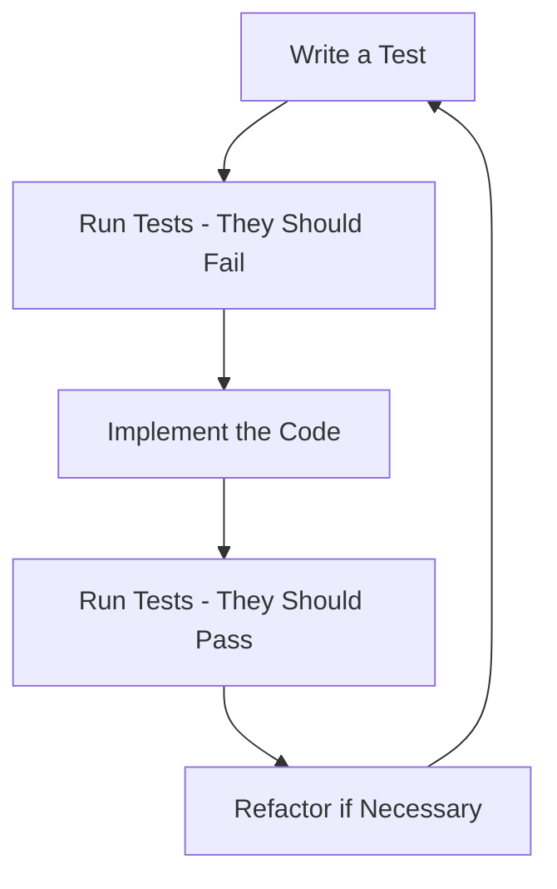

# Vue.js Test Driven Development

## Introduction

Test Driven Development (TDD) is a software development approach where tests are written before the actual code implementation. This methodology ensures that your code meets requirements from the start and provides a safety net when refactoring or adding new features. In the context of Vue.js, TDD involves writing tests for components, Vuex stores, and other parts of your application before implementing them.

In this guide, we'll explore how to apply TDD principles when developing Vue.js applications. We'll use Vue Test Utils and Jest, the most common testing tools in the Vue ecosystem.

## Understanding TDD Workflow

The TDD workflow follows a simple pattern often called "Red-Green-Refactor":



1. **Red**: Write a failing test that defines a desired function or feature
2. **Green**: Write the minimal code to make the test pass
3. **Refactor**: Clean up the code while ensuring the tests still pass

Let's apply this to Vue.js development.

## Setting Up Your Testing Environment

Before we start, you'll need to set up your testing environment. If you're using Vue CLI, you can add testing when creating a new project:

```bash
vue create my-tdd-app
# Select manual options and include testing with Jest
```

For existing projects, add Jest and Vue Test Utils:

```bash
npm install --save-dev @vue/test-utils jest @vue/cli-plugin-unit-jest
```

Make sure your `jest.config.js` file is properly configured:

```js
module.exports = {
  preset: '@vue/cli-plugin-unit-jest',
  transform: {
    '^.+\\.vue$': 'vue-jest'
  }
}
```

## TDD with Vue Components

Let's walk through a simple example of using TDD to build a counter component.

### Step 1: Write the Test First

Create a file named `Counter.spec.js`:

```js
import { mount } from '@vue/test-utils'
import Counter from '@/components/Counter.vue'

describe('Counter.vue', () => {
  it('renders initial count as 0', () => {
    const wrapper = mount(Counter)
    expect(wrapper.find('.count').text()).toBe('0')
  })

  it('increments count when button is clicked', async () => {
    const wrapper = mount(Counter)
    const button = wrapper.find('button.increment')
    await button.trigger('click')
    expect(wrapper.find('.count').text()).toBe('1')
  })

  it('decrements count when button is clicked', async () => {
    const wrapper = mount(Counter)
    const button = wrapper.find('button.decrement')
    await button.trigger('click')
    expect(wrapper.find('.count').text()).toBe('-1')
  })
})
```

### Step 2: Run the Tests (They Should Fail)

Run your tests using:

```bash
npm run test:unit
```

The tests will fail because we haven't created the `Counter` component yet.

### Step 3: Implement the Component

Create a file named `Counter.vue` in your components directory:

```html
<template>
  <div>
    <p class="count">{{ count }}</p>
    <button class="increment" @click="increment">Increment</button>
    <button class="decrement" @click="decrement">Decrement</button>
  </div>
</template>

<script>
export default {
  name: 'Counter',
  data() {
    return {
      count: 0
    }
  },
  methods: {
    increment() {
      this.count += 1
    },
    decrement() {
      this.count -= 1
    }
  }
}
</script>
```

### Step 4: Run the Tests Again (They Should Pass)

Run the tests again, and they should now pass:

```bash
npm run test:unit
```

### Step 5: Refactor if Necessary

If needed, you can refactor your code while ensuring the tests still pass. For example, you might want to extract some logic to computed properties or add validation.

## TDD with Complex Components

Let's tackle a more complex example: a filterable todo list component.

### Step 1: Write Tests First

Create a file named `TodoList.spec.js`:

```js
import { mount } from '@vue/test-utils'
import TodoList from '@/components/TodoList.vue'

describe('TodoList.vue', () => {
  it('renders empty list when no todos', () => {
    const wrapper = mount(TodoList)
    expect(wrapper.findAll('li').length).toBe(0)
    expect(wrapper.find('.empty-state').exists()).toBe(true)
  })

  it('adds a new todo when form is submitted', async () => {
    const wrapper = mount(TodoList)
    const input = wrapper.find('input[type="text"]')
    const form = wrapper.find('form')
    
    await input.setValue('Learn TDD in Vue')
    await form.trigger('submit.prevent')
    
    expect(wrapper.findAll('li').length).toBe(1)
    expect(wrapper.find('li').text()).toContain('Learn TDD in Vue')
    expect(input.element.value).toBe('')  // Input should be cleared
  })

  it('filters todos based on filter selection', async () => {
    const wrapper = mount(TodoList)
    
    // Add a completed and an active todo
    await wrapper.find('input[type="text"]').setValue('Completed task')
    await wrapper.find('form').trigger('submit.prevent')
    await wrapper.find('input[type="text"]').setValue('Active task')
    await wrapper.find('form').trigger('submit.prevent')
    
    // Complete the first todo
    await wrapper.findAll('li input[type="checkbox"]')[0].setChecked(true)
    
    // Test all filter
    await wrapper.find('button.filter-all').trigger('click')
    expect(wrapper.findAll('li').length).toBe(2)
    
    // Test active filter
    await wrapper.find('button.filter-active').trigger('click')
    expect(wrapper.findAll('li').length).toBe(1)
    expect(wrapper.findAll('li')[0].text()).toContain('Active task')
    
    // Test completed filter
    await wrapper.find('button.filter-completed').trigger('click')
    expect(wrapper.findAll('li').length).toBe(1)
    expect(wrapper.findAll('li')[0].text()).toContain('Completed task')
  })
})
```

### Step 2: Implement the Component

Next, create the `TodoList.vue` component:

```html
<template>
  <div>
    <form @submit.prevent="addTodo">
      <input type="text" v-model="newTodo" placeholder="Add a new task">
      <button type="submit">Add</button>
    </form>
    
    <div class="filters">
      <button @click="currentFilter = 'all'" class="filter-all">All</button>
      <button @click="currentFilter = 'active'" class="filter-active">Active</button>
      <button @click="currentFilter = 'completed'" class="filter-completed">Completed</button>
    </div>
    
    <ul v-if="filteredTodos.length">
      <li v-for="todo in filteredTodos" :key="todo.id">
        <input type="checkbox" v-model="todo.completed">
        <span :class="{ completed: todo.completed }">{{ todo.text }}</span>
      </li>
    </ul>
    
    <p v-else class="empty-state">No todos found</p>
  </div>
</template>

<script>
export default {
  name: 'TodoList',
  data() {
    return {
      todos: [],
      newTodo: '',
      currentFilter: 'all'
    }
  },
  computed: {
    filteredTodos() {
      switch(this.currentFilter) {
        case 'active':
          return this.todos.filter(todo => !todo.completed)
        case 'completed':
          return this.todos.filter(todo => todo.completed)
        default:
          return this.todos
      }
    }
  },
  methods: {
    addTodo() {
      if (this.newTodo.trim()) {
        this.todos.push({
          id: Date.now(),
          text: this.newTodo,
          completed: false
        })
        this.newTodo = ''
      }
    }
  }
}
</script>

<style scoped>
.completed {
  text-decoration: line-through;
  color: #999;
}
</style>
```

## TDD with Vuex

Testing Vuex store modules is also an important part of TDD in Vue. Here's a simple example of testing a counter store module.

### Step 1: Write the Test First

```js
import { createStore } from 'vuex'
import counterModule from '@/store/modules/counter'

describe('counter module', () => {
  it('increments count when increment mutation is committed', () => {
    // Create a new store instance with just the counter module
    const store = createStore({
      modules: {
        counter: {
          ...counterModule,
          namespaced: true
        }
      }
    })
    
    expect(store.state.counter.count).toBe(0)
    store.commit('counter/increment')
    expect(store.state.counter.count).toBe(1)
  })
  
  it('decrements count when decrement mutation is committed', () => {
    const store = createStore({
      modules: {
        counter: {
          ...counterModule,
          namespaced: true
        }
      }
    })
    
    expect(store.state.counter.count).toBe(0)
    store.commit('counter/decrement')
    expect(store.state.counter.count).toBe(-1)
  })
  
  it('increments count when incrementAction is dispatched', async () => {
    const store = createStore({
      modules: {
        counter: {
          ...counterModule,
          namespaced: true
        }
      }
    })
    
    expect(store.state.counter.count).toBe(0)
    await store.dispatch('counter/incrementAction')
    expect(store.state.counter.count).toBe(1)
  })
})
```

### Step 2: Implement the Store Module

Create a file named `counter.js` in your store modules directory:

```js
// store/modules/counter.js
export default {
  namespaced: true,
  
  state: {
    count: 0
  },
  
  mutations: {
    increment(state) {
      state.count++
    },
    decrement(state) {
      state.count--
    }
  },
  
  actions: {
    incrementAction({ commit }) {
      return new Promise(resolve => {
        setTimeout(() => {
          commit('increment')
          resolve()
        }, 100)
      })
    }
  },
  
  getters: {
    doubleCount: state => state.count * 2
  }
}
```

## Advanced TDD: Testing API Interactions

Let's write tests for a component that interacts with an API:

### Step 1: Write the Test

```js
import { mount, flushPromises } from '@vue/test-utils'
import UserList from '@/components/UserList.vue'
import axios from 'axios'

// Mock axios
jest.mock('axios')

describe('UserList.vue', () => {
  it('displays a list of users when API call succeeds', async () => {
    const mockUsers = [
      { id: 1, name: 'John Doe' },
      { id: 2, name: 'Jane Smith' }
    ]
    
    // Mock the axios.get call to return our data
    axios.get.mockResolvedValueOnce({ data: mockUsers })
    
    const wrapper = mount(UserList)
    
    // Initially should show loading state
    expect(wrapper.find('.loading').exists()).toBe(true)
    
    // Wait for the API call to resolve
    await flushPromises()
    
    // Now should show user list
    expect(wrapper.find('.loading').exists()).toBe(false)
    expect(wrapper.findAll('li').length).toBe(2)
    expect(wrapper.findAll('li').at(0).text()).toContain('John Doe')
    expect(wrapper.findAll('li').at(1).text()).toContain('Jane Smith')
  })
  
  it('displays error message when API call fails', async () => {
    // Mock the axios.get call to reject
    axios.get.mockRejectedValueOnce(new Error('API Error'))
    
    const wrapper = mount(UserList)
    
    // Wait for the API call to reject
    await flushPromises()
    
    // Should show error message
    expect(wrapper.find('.error').exists()).toBe(true)
    expect(wrapper.find('.error').text()).toContain('Failed to load users')
  })
})
```

### Step 2: Implement the Component

Now, create the `UserList.vue` component:

```html
<template>
  <div>
    <h1>User List</h1>
    <div v-if="loading" class="loading">Loading users...</div>
    <div v-else-if="error" class="error">Failed to load users: {{ error }}</div>
    <ul v-else>
      <li v-for="user in users" :key="user.id">
        {{ user.name }}
      </li>
    </ul>
  </div>
</template>

<script>
import axios from 'axios'

export default {
  name: 'UserList',
  data() {
    return {
      users: [],
      loading: true,
      error: null
    }
  },
  created() {
    this.fetchUsers()
  },
  methods: {
    async fetchUsers() {
      try {
        const response = await axios.get('https://api.example.com/users')
        this.users = response.data
        this.loading = false
      } catch (err) {
        this.error = err.message
        this.loading = false
      }
    }
  }
}
</script>
```

## Best Practices for TDD in Vue.js

Here are some best practices to follow when implementing TDD in Vue.js:

1. **Test in isolation**: Mock dependencies to test components in isolation.
2. **Think about testability**: Design components with testing in mind.
3. **Test behavior, not implementation details**: Focus on testing what components do, not how they do it.
4. **Maintain test coverage**: Aim for high test coverage to ensure all features are properly tested.
5. **Use shallow mounting when appropriate**: Use `shallowMount` from Vue Test Utils to test components without rendering child components.
6. **Keep tests simple**: Each test should focus on a single behavior or outcome.
7. **Follow the AAA pattern**: Arrange (set up the test data), Act (perform the action), Assert (check the outcome).

## Common TDD Pitfalls to Avoid

1. **Writing tests after implementation**: This defeats the purpose of TDD.
2. **Testing trivial code**: Don't test Vue's internal behavior or simple getters/setters.
3. **Writing brittle tests**: Tests that break with minor refactoring are hard to maintain.
4. **Ignoring edge cases**: Include tests for error states and boundary conditions.
5. **Testing too much at once**: Focus on one functionality per test case.

## Summary

Test Driven Development is a powerful methodology that can improve the quality and maintainability of your Vue.js applications. By writing tests first, you clearly define the requirements and expected behavior of your code before implementing it. This approach helps catch bugs early, facilitates refactoring, and leads to more reliable applications.

Throughout this guide, we've explored how to apply TDD principles to Vue components, Vuex stores, and API interactions. We've also covered best practices and common pitfalls to avoid.

Remember, the key steps of TDD are:
1. Write a failing test
2. Implement the minimal code to make the test pass
3. Refactor your code while ensuring tests still pass
4. Repeat

## Additional Resources and Exercises

### Resources
- [Vue Test Utils Documentation](https://vue-test-utils.vuejs.org/)
- [Jest Documentation](https://jestjs.io/docs/getting-started)
- [Vue Testing Handbook](https://lmiller1990.github.io/vue-testing-handbook/)

### Exercises

1. **Simple Component TDD**: Create a Rating component using TDD that displays and allows users to select 1-5 stars.

2. **Form Validation**: Use TDD to build a form component that validates email addresses and requires a password with at least 8 characters.

3. **API Integration**: Build a weather widget component using TDD that fetches and displays weather data from an API.

4. **Vuex Store Module**: Design and implement a shopping cart store module using TDD with actions for adding items, removing items, and updating quantities.

5. **Complete App Flow**: Practice TDD by building a small todo application with filtering, sorting, and persistence to localStorage.

By practicing these exercises, you'll become more comfortable with TDD and improve your Vue.js testing skills.