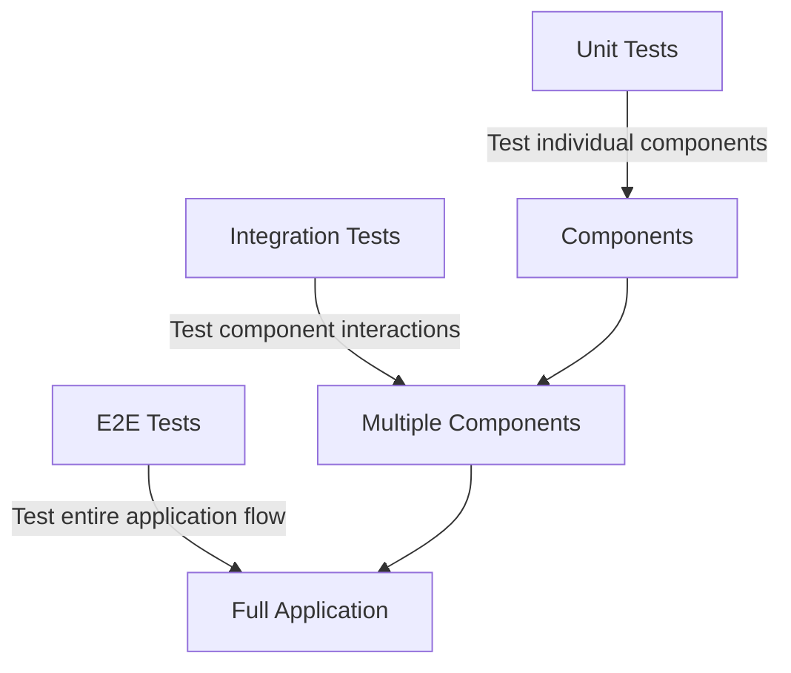

# Vue.js Integration Testing

## Introduction

Integration testing is a crucial part of ensuring your Vue.js application works as expected. Unlike unit tests that verify individual components in isolation, integration tests check how multiple components interact with each other. This ensures that when you put all the pieces together, your application functions correctly as a whole.

In this guide, we'll explore how to write effective integration tests for your Vue.js applications. We'll use Vue Test Utils, the official testing utility library for Vue.js, and Jest as our test runner.

## Prerequisites

Before we start, make sure you have:

- Basic knowledge of Vue.js
- Familiarity with Vue components
- Understanding of basic testing concepts
- Node.js and npm installed

## What is Integration Testing?

Integration testing verifies that different parts of your application work together correctly. In Vue.js, this typically means:

- Testing multiple components together
- Verifying component communication (props, events)
- Testing routing behavior
- Checking Vuex store interactions



## Setting Up Your Testing Environment

First, let's ensure we have the necessary dependencies:

```bash
npm install --save-dev @vue/test-utils jest @vue/vue3-jest babel-jest
```

Configure Jest in your `package.json` file:

```json
{
  "scripts": {
    "test": "jest"
  },
  "jest": {
    "testEnvironment": "jsdom",
    "transform": {
      "^.+\\.vue$": "@vue/vue3-jest",
      "^.+\\.js$": "babel-jest"
    },
    "moduleFileExtensions": [
      "vue",
      "js",
      "json"
    ],
    "moduleNameMapper": {
      "^@/(.*)$": "<rootDir>/src/$1"
    }
  }
}
```

## Your First Integration Test

Let's start with a simple example: testing a parent component that contains a child component. Consider this setup:

**ChildComponent.vue**:

```html
<template>
  <div class="child">
    <p>{{ message }}</p>
    <button @click="sendMessage">Send Message to Parent</button>
  </div>
</template>

<script>
export default {
  props: {
    message: {
      type: String,
      default: "Default message"
    }
  },
  methods: {
    sendMessage() {
      this.$emit('message-sent', 'Hello from child');
    }
  }
}
</script>
```

**ParentComponent.vue**:

```html
<template>
  <div class="parent">
    <h2>Parent Component</h2>
    <p v-if="receivedMessage">Message from child: {{ receivedMessage }}</p>
    <child-component 
      :message="parentMessage" 
      @message-sent="handleMessage"
    />
  </div>
</template>

<script>
import ChildComponent from './ChildComponent.vue';

export default {
  components: {
    ChildComponent
  },
  data() {
    return {
      parentMessage: "Hello from parent",
      receivedMessage: ""
    }
  },
  methods: {
    handleMessage(message) {
      this.receivedMessage = message;
    }
  }
}
</script>
```

Now, let's write an integration test for these components:

```javascript
// parent.spec.js
import { mount } from '@vue/test-utils';
import ParentComponent from '@/components/ParentComponent.vue';
import ChildComponent from '@/components/ChildComponent.vue';

describe('ParentComponent', () => {
  it('renders child component with correct props', () => {
    const wrapper = mount(ParentComponent);
    const childComponent = wrapper.findComponent(ChildComponent);
    
    expect(childComponent.exists()).toBe(true);
    expect(childComponent.props('message')).toBe('Hello from parent');
  });
  
  it('receives and handles events from child component', async () => {
    const wrapper = mount(ParentComponent);
    
    // Initially, there should be no received message
    expect(wrapper.text()).not.toContain('Message from child');
    
    // Find the child component and trigger the button click
    const childComponent = wrapper.findComponent(ChildComponent);
    await childComponent.find('button').trigger('click');
    
    // Now the parent should have received the message
    expect(wrapper.text()).toContain('Message from child: Hello from child');
  });
});
```

## Testing Component Navigation

Let's test a more complex scenario involving Vue Router. Imagine we have a simple navigation setup:

**NavBar.vue**:

```html
<template>
  <nav>
    <router-link to="/">Home</router-link>
    <router-link to="/about">About</router-link>
  </nav>
</template>
```

**HomePage.vue**:

```html
<template>
  <div>
    <h1>Home Page</h1>
  </div>
</template>
```

**AboutPage.vue**:

```html
<template>
  <div>
    <h1>About Page</h1>
  </div>
</template>
```

**App.vue**:

```html
<template>
  <div>
    <nav-bar />
    <router-view />
  </div>
</template>

<script>
import NavBar from './NavBar.vue';

export default {
  components: {
    NavBar
  }
}
</script>
```

Here's how to test navigation between components:

```javascript
// navigation.spec.js
import { mount } from '@vue/test-utils';
import App from '@/App.vue';
import HomePage from '@/views/HomePage.vue';
import AboutPage from '@/views/AboutPage.vue';
import { createRouter, createWebHistory } from 'vue-router';

// Create a mock router
const routes = [
  { path: '/', component: HomePage },
  { path: '/about', component: AboutPage }
];

const router = createRouter({
  history: createWebHistory(),
  routes
});

describe('Navigation Integration Test', () => {
  it('navigates between pages when links are clicked', async () => {
    // Mount the app with router
    router.push('/');
    await router.isReady();
    
    const wrapper = mount(App, {
      global: {
        plugins: [router]
      }
    });
    
    // Should start at the home page
    expect(wrapper.html()).toContain('Home Page');
    
    // Find the link to About and click it
    const aboutLink = wrapper.find('a[href="/about"]');
    await aboutLink.trigger('click');
    
    // Wait for navigation
    await router.isReady();
    
    // Should now be on the about page
    expect(wrapper.html()).toContain('About Page');
  });
});
```

## Testing Vuex Store Interactions

A common integration testing scenario is verifying that components correctly interact with the Vuex store. Let's see how to test this:

Assume we have this simple store:

```javascript
// store.js
import { createStore } from 'vuex';

export default createStore({
  state: {
    count: 0,
    todos: []
  },
  mutations: {
    INCREMENT(state) {
      state.count++;
    },
    ADD_TODO(state, todo) {
      state.todos.push(todo);
    }
  },
  actions: {
    increment({ commit }) {
      commit('INCREMENT');
    },
    addTodo({ commit }, todo) {
      commit('ADD_TODO', todo);
    }
  }
});
```

And a component that uses it:

```html
<template>
  <div>
    <p>Count: {{ count }}</p>
    <button @click="increment">Increment</button>
    
    <input v-model="newTodo" placeholder="Add a todo" />
    <button @click="addTodo">Add</button>
    
    <ul>
      <li v-for="(todo, index) in todos" :key="index">{{ todo }}</li>
    </ul>
  </div>
</template>

<script>
import { mapState, mapActions } from 'vuex';

export default {
  computed: {
    ...mapState(['count', 'todos'])
  },
  data() {
    return {
      newTodo: ''
    };
  },
  methods: {
    ...mapActions(['increment', 'addTodo']),
    addTodo() {
      if (this.newTodo.trim()) {
        this.$store.dispatch('addTodo', this.newTodo);
        this.newTodo = '';
      }
    }
  }
}
</script>
```

Here's how to test this component's interaction with the store:

```javascript
// counter-store.spec.js
import { mount } from '@vue/test-utils';
import { createStore } from 'vuex';
import CounterComponent from '@/components/CounterComponent.vue';

describe('CounterComponent with Vuex', () => {
  it('renders the count from store and increments it', async () => {
    // Create a fresh store for testing
    const store = createStore({
      state: {
        count: 0,
        todos: []
      },
      mutations: {
        INCREMENT(state) {
          state.count++;
        },
        ADD_TODO(state, todo) {
          state.todos.push(todo);
        }
      },
      actions: {
        increment({ commit }) {
          commit('INCREMENT');
        },
        addTodo({ commit }, todo) {
          commit('ADD_TODO', todo);
        }
      }
    });
    
    // Mount with the store
    const wrapper = mount(CounterComponent, {
      global: {
        plugins: [store]
      }
    });
    
    // Check initial state
    expect(wrapper.text()).toContain('Count: 0');
    expect(wrapper.findAll('li').length).toBe(0);
    
    // Increment the counter
    await wrapper.find('button').trigger('click');
    expect(wrapper.text()).toContain('Count: 1');
    
    // Add a todo
    const input = wrapper.find('input');
    await input.setValue('Test Todo');
    await wrapper.findAll('button')[1].trigger('click');
    
    // Verify todo was added
    expect(wrapper.findAll('li').length).toBe(1);
    expect(wrapper.findAll('li')[0].text()).toBe('Test Todo');
  });
});
```

## Testing API Interactions

Let's test a component that fetches data from an API. We'll mock the API response using Jest's mocking capabilities:

```html
<!-- UserList.vue -->
<template>
  <div>
    <h1>Users</h1>
    <p v-if="loading">Loading...</p>
    <ul v-else>
      <li v-for="user in users" :key="user.id">
        {{ user.name }} ({{ user.email }})
      </li>
    </ul>
    <button @click="loadUsers">Reload Users</button>
  </div>
</template>

<script>
import axios from 'axios';

export default {
  data() {
    return {
      users: [],
      loading: false
    };
  },
  methods: {
    async loadUsers() {
      this.loading = true;
      try {
        const response = await axios.get('https://jsonplaceholder.typicode.com/users');
        this.users = response.data;
      } catch (error) {
        console.error('Error loading users:', error);
      } finally {
        this.loading = false;
      }
    }
  },
  mounted() {
    this.loadUsers();
  }
};
</script>
```

Now, let's test it:

```javascript
// user-list.spec.js
import { mount, flushPromises } from '@vue/test-utils';
import UserList from '@/components/UserList.vue';
import axios from 'axios';

// Mock axios
jest.mock('axios');

describe('UserList Component', () => {
  it('fetches and displays users', async () => {
    // Mock API response
    const mockUsers = [
      { id: 1, name: 'John Doe', email: 'john@example.com' },
      { id: 2, name: 'Jane Smith', email: 'jane@example.com' }
    ];
    
    axios.get.mockResolvedValue({ data: mockUsers });
    
    const wrapper = mount(UserList);
    
    // Initially should show loading
    expect(wrapper.text()).toContain('Loading');
    
    // Wait for API call to resolve
    await flushPromises();
    
    // Should now display the users
    expect(wrapper.findAll('li').length).toBe(2);
    expect(wrapper.text()).toContain('John Doe');
    expect(wrapper.text()).toContain('jane@example.com');
    
    // Test reload functionality
    axios.get.mockResolvedValue({ 
      data: [...mockUsers, { id: 3, name: 'Bob Johnson', email: 'bob@example.com' }] 
    });
    
    await wrapper.find('button').trigger('click');
    expect(wrapper.text()).toContain('Loading');
    
    await flushPromises();
    expect(wrapper.findAll('li').length).toBe(3);
    expect(wrapper.text()).toContain('Bob Johnson');
  });
  
  it('handles API errors gracefully', async () => {
    // Mock API error
    console.error = jest.fn(); // Silence console.error output in tests
    axios.get.mockRejectedValue(new Error('API failed'));
    
    const wrapper = mount(UserList);
    await flushPromises();
    
    // Should not display any users
    expect(wrapper.findAll('li').length).toBe(0);
    expect(console.error).toHaveBeenCalled();
  });
});
```

## Best Practices for Vue.js Integration Testing

1. **Test Real User Interactions**: Focus on what the user actually does - clicks, form submissions, navigation.

2. **Keep Your Tests Focused**: Even in integration tests, have a clear purpose for each test. Don't try to test everything in one go.

3. **Use Data Attributes for Testing**: Add `data-test` attributes to make selecting elements more reliable:

```html
<button data-test="increment-button" @click="increment">Increment</button>
```

```javascript
wrapper.find('[data-test="increment-button"]').trigger('click');
```

4. **Mock External Dependencies**: Use Jest to mock API calls, local storage, etc.

5. **Test Error States**: Make sure your components handle errors gracefully.

6. **Avoid Testing Implementation Details**: Focus on outputs, not how things are implemented internally.

7. **Use Snapshot Testing Sparingly**: They can be useful but can also cause more maintenance headaches than they solve.

## Common Pitfalls and Solutions

### Async Operations

Vue's reactivity system is asynchronous. Always use `await` when triggering events:

```javascript
// Wrong
wrapper.find('button').trigger('click');
expect(wrapper.text()).toContain('Updated Value'); // May fail!

// Right
await wrapper.find('button').trigger('click');
expect(wrapper.text()).toContain('Updated Value');
```

### Complex Component Trees

When testing deeply nested components, you might need to use `findComponent` to navigate the tree:

```javascript
const childComponent = wrapper.findComponent(ChildComponent);
const grandchildButton = childComponent.find('button');
```

### Vuex and Component Testing

When a component uses Vuex, always provide a store instance:

```javascript
const store = createStore({
  state: { /* ... */ },
  mutations: { /* ... */ },
  actions: { /* ... */ }
});

const wrapper = mount(Component, {
  global: {
    plugins: [store]
  }
});
```

## Summary

Integration testing in Vue.js ensures that your components work together correctly. By writing good integration tests, you can:

- Catch bugs in component interactions
- Verify that data flows correctly between components
- Ensure your routing works as expected
- Test store interactions

Remember that integration testing complements unit testing and end-to-end testing. Each has its place in a comprehensive testing strategy:

- Unit tests: Fast, test components in isolation
- Integration tests: Test component interactions
- E2E tests: Test the complete user experience

## Exercises

1. Write an integration test for a login form that validates input and calls an API.
2. Create a test for a parent-child component pair where the child emits multiple different events.
3. Test a component that uses Vue Router to navigate based on user interactions.
4. Write a test for a component that interacts with Vuex to both read and update state.
5. Create an integration test for a multi-step form that validates each step.

## Additional Resources

- [Vue Test Utils Documentation](https://test-utils.vuejs.org/)
- [Jest Documentation](https://jestjs.io/docs/getting-started)
- [Testing Vue.js Applications](https://livebook.manning.com/book/testing-vue-js-applications) (Book by Edd Yerburgh)
- [Vue.js Testing Guide](https://vuejs.org/guide/scaling-up/testing.html)

By mastering integration testing in Vue.js, you'll build more robust applications and catch issues before they reach your users. Happy testing!