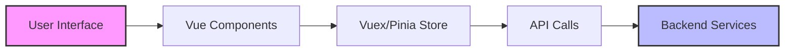

# Vue.js E2E Testing

## Introduction

End-to-End (E2E) testing is a crucial part of building robust Vue.js applications. Unlike unit tests that focus on isolated components or integration tests that verify component interactions, E2E tests validate the entire application flow from start to finish, mimicking how a real user would interact with your application.

In this guide, we'll explore how to set up and implement E2E tests for Vue.js applications using popular testing frameworks like Cypress and Nightwatch.js. By the end, you'll have a solid understanding of how to ensure your application functions correctly from a user's perspective.

## What is E2E Testing?

E2E testing simulates user interactions with your application in a real browser environment. These tests help ensure that all parts of your application work together as expected, including:

- UI components rendering properly
- Navigation flows working correctly
- API integrations functioning as intended
- Form submissions and validations working



E2E tests validate this entire flow, giving you confidence that your application will work correctly for your users.

## Setting Up E2E Testing in a Vue.js Project

We'll explore two popular options for E2E testing in Vue.js applications: Cypress and Nightwatch.js.

### Option 1: Cypress

Cypress has become one of the most popular E2E testing frameworks due to its developer-friendly experience and powerful features.

#### Installation

If you're using Vue CLI, you can add Cypress to your project with:

```bash
vue add e2e-cypress
```

Or install it manually:

```bash
npm install cypress --save-dev
```

#### Configuration

After installation, create a `cypress.config.js` file in your project root:

```javascript
const { defineConfig } = require('cypress')

module.exports = defineConfig({
  e2e: {
    baseUrl: 'http://localhost:8080',
    specPattern: 'cypress/e2e/**/*.{cy,spec}.{js,jsx,ts,tsx}',
    supportFile: 'cypress/support/e2e.js',
  },
})
```

#### Writing Your First Cypress Test

Create a file at `cypress/e2e/login.cy.js`:

```javascript
describe('Login Page', () => {
  beforeEach(() => {
    // Visit the login page before each test
    cy.visit('/login')
  })

  it('should display login form', () => {
    // Check if login form elements exist
    cy.get('input[name=email]').should('exist')
    cy.get('input[name=password]').should('exist')
    cy.get('button[type=submit]').should('exist')
  })

  it('should show error for invalid credentials', () => {
    // Fill in form with invalid credentials
    cy.get('input[name=email]').type('invalid@example.com')
    cy.get('input[name=password]').type('wrongpassword')
    cy.get('button[type=submit]').click()

    // Assert error message appears
    cy.get('.error-message').should('contain', 'Invalid credentials')
  })

  it('should redirect to dashboard after successful login', () => {
    // Fill in form with valid credentials
    cy.get('input[name=email]').type('user@example.com')
    cy.get('input[name=password]').type('password123')
    cy.get('button[type=submit]').click()

    // Assert URL changed to dashboard
    cy.url().should('include', '/dashboard')
    // Assert welcome message
    cy.get('.welcome-message').should('contain', 'Welcome back')
  })
})
```

#### Running Cypress Tests

To run your Cypress tests, add the following script to your `package.json`:

```json
"scripts": {
  "test:e2e": "cypress open",
  "test:e2e:headless": "cypress run"
}
```

Then run:

```bash
npm run test:e2e
```

### Option 2: Nightwatch.js

Nightwatch.js is another popular E2E testing framework that uses the WebDriver API to interact with browsers.

#### Installation

Using Vue CLI:

```bash
vue add e2e-nightwatch
```

Or manually:

```bash
npm install --save-dev nightwatch chromedriver
```

#### Configuration

Create a `nightwatch.conf.js` file in your project root:

```javascript
module.exports = {
  src_folders: ['tests/e2e/specs'],
  output_folder: 'tests/e2e/reports',
  webdriver: {
    start_process: true,
    server_path: require('chromedriver').path,
    port: 9515
  },
  test_settings: {
    default: {
      desiredCapabilities: {
        browserName: 'chrome'
      }
    }
  }
}
```

#### Writing Your First Nightwatch Test

Create a file at `tests/e2e/specs/login.js`:

```javascript
module.exports = {
  'Login Test': function (browser) {
    browser
      .url(browser.launchUrl + '/login')
      .waitForElementVisible('body', 1000)
      .assert.visible('input[name=email]')
      .assert.visible('input[name=password]')
      .assert.visible('button[type=submit]')
      .setValue('input[name=email]', 'user@example.com')
      .setValue('input[name=password]', 'password123')
      .click('button[type=submit]')
      .pause(1000)
      .assert.urlContains('/dashboard')
      .assert.containsText('.welcome-message', 'Welcome back')
      .end();
  }
};
```

#### Running Nightwatch Tests

Add the following script to your `package.json`:

```json
"scripts": {
  "test:e2e": "nightwatch"
}
```

Then run:

```bash
npm run test:e2e
```

## Real-World E2E Testing Example: Todo Application

Let's create a more comprehensive example by testing a simple Todo application with Cypress.

Assume we have a Todo application with the following features:
- Add new todos
- Mark todos as completed
- Delete todos
- Filter todos by status (All, Active, Completed)

### Creating the Test Suite

```javascript
describe('Todo Application', () => {
  beforeEach(() => {
    // Visit the todo app and clear local storage before each test
    cy.visit('/')
    cy.clearLocalStorage()
    
    // Optional: Add some initial todos via API or UI
    cy.get('.new-todo').type('Learn Vue.js{enter}')
    cy.get('.new-todo').type('Learn E2E Testing{enter}')
    cy.get('.new-todo').type('Build a project{enter}')
  })

  it('should add a new todo', () => {
    const newTodo = 'Test the application'
    
    cy.get('.new-todo')
      .type(`${newTodo}{enter}`)
    
    // Verify todo was added
    cy.get('.todo-list li')
      .should('have.length', 4)
      .last()
      .should('contain', newTodo)
  })

  it('should mark a todo as completed', () => {
    // Click on the first todo's toggle checkbox
    cy.get('.todo-list li')
      .first()
      .find('.toggle')
      .click()
    
    // Verify todo is marked as completed
    cy.get('.todo-list li')
      .first()
      .should('have.class', 'completed')
    
    // Verify completed count
    cy.get('.todo-count')
      .should('contain', '2')
  })

  it('should delete a todo', () => {
    // Hover over the first todo to show delete button
    cy.get('.todo-list li')
      .first()
      .find('.destroy')
      .invoke('show') // Force show the button which might be hidden until hover
      .click()
    
    // Verify todo was deleted
    cy.get('.todo-list li')
      .should('have.length', 2)
  })

  it('should filter todos', () => {
    // Mark first todo as completed
    cy.get('.todo-list li')
      .first()
      .find('.toggle')
      .click()
    
    // Filter by active
    cy.get('.filters li a')
      .contains('Active')
      .click()
    
    cy.get('.todo-list li')
      .should('have.length', 2)
    
    // Filter by completed
    cy.get('.filters li a')
      .contains('Completed')
      .click()
    
    cy.get('.todo-list li')
      .should('have.length', 1)
    
    // Filter by all
    cy.get('.filters li a')
      .contains('All')
      .click()
    
    cy.get('.todo-list li')
      .should('have.length', 3)
  })
})
```

## Best Practices for E2E Testing

### 1. Test Critical User Flows

Focus your E2E tests on the most important user flows in your application:
- Authentication process
- Main user journeys (e.g., making a purchase, creating content)
- Critical business logic

### 2. Keep Tests Independent

Each test should:
- Set up its own state
- Not depend on other tests
- Clean up after itself

```javascript
// ❌ Bad: Tests depend on each other
it('should log in', () => {
  // Log in code here
})

it('should show dashboard after login', () => {
  // This assumes the previous test logged in
})

// ✅ Good: Tests are independent
it('should log in and show dashboard', () => {
  // Log in code
  // Verify dashboard appears
})

it('should show user profile when clicking profile button', () => {
  // Log in code (repeated setup is okay for independence)
  // Click profile button
  // Verify profile appears
})
```

### 3. Use Data Attributes for Testing

Add data attributes to make your elements easily selectable for testing:

```html
<button 
  @click="submitForm" 
  data-test="submit-button"
>
  Submit
</button>
```

Then in your tests:

```javascript
cy.get('[data-test=submit-button]').click()
```

This makes your tests more resilient to UI changes.

### 4. Mock External Services When Appropriate

For faster and more reliable tests, consider mocking external API calls:

```javascript
// Cypress example
cy.intercept('GET', '/api/todos', { fixture: 'todos.json' }).as('getTodos')
```

### 5. Test Responsiveness

Test your application on different viewport sizes:

```javascript
describe('Responsive behavior', () => {
  it('should show mobile menu on small screens', () => {
    cy.viewport('iphone-6')
    cy.visit('/')
    cy.get('.mobile-menu-button').should('be.visible')
    cy.get('.desktop-menu').should('not.be.visible')
  })
  
  it('should show desktop menu on large screens', () => {
    cy.viewport(1200, 800)
    cy.visit('/')
    cy.get('.mobile-menu-button').should('not.be.visible')
    cy.get('.desktop-menu').should('be.visible')
  })
})
```

## E2E Testing in CI/CD Pipeline

Integrating E2E tests into your CI/CD pipeline ensures your application is tested automatically with each change.

### GitHub Actions Example

Here's a sample GitHub Actions workflow file for running Cypress tests:

```yaml
name: E2E Tests

on:
  push:
    branches: [ main ]
  pull_request:
    branches: [ main ]

jobs:
  cypress:
    runs-on: ubuntu-latest
    steps:
      - name: Checkout
        uses: actions/checkout@v2
      
      - name: Setup Node.js
        uses: actions/setup-node@v2
        with:
          node-version: '16'
      
      - name: Install dependencies
        run: npm ci
      
      - name: Start development server
        run: npm run serve &
      
      - name: Run Cypress tests
        uses: cypress-io/github-action@v2
        with:
          wait-on: 'http://localhost:8080'
          
      - name: Upload test artifacts
        uses: actions/upload-artifact@v2
        if: failure()
        with:
          name: cypress-screenshots
          path: cypress/screenshots
```

## Debugging E2E Tests

When tests fail, you need good debugging tools to understand why:

### Cypress Debugging

1. Time-travel debugging: Cypress takes snapshots at each step, allowing you to see the state of your application at any point in the test.

2. Watch test execution in real-time with the Cypress Test Runner.

3. Use `cy.pause()` to pause execution at specific points:

```javascript
cy.get('form')
  .pause() // Test execution will pause here
  .submit()
```

4. Log values during test execution:

```javascript
cy.get('.user-name')
  .then(($el) => {
    const text = $el.text()
    cy.log(`Found user name: ${text}`)
  })
```

## Summary

E2E testing is an essential part of a comprehensive Vue.js testing strategy. By simulating real user interactions, E2E tests help ensure your application works correctly from the user's perspective.

In this guide, we've covered:
- Introduction to E2E testing and its importance
- Setting up E2E testing with Cypress and Nightwatch.js
- Writing basic and advanced E2E tests
- Best practices for effective E2E testing
- Integrating E2E tests into CI/CD pipelines
- Debugging techniques for E2E tests

By implementing E2E tests for your Vue.js applications, you can catch issues that might be missed by unit or integration tests, leading to a more robust and reliable user experience.

## Additional Resources and Exercises

### Resources

1. [Official Cypress Documentation](https://docs.cypress.io/)
2. [Official Nightwatch.js Documentation](https://nightwatchjs.org/)
3. [Vue Test Utils Documentation](https://vue-test-utils.vuejs.org/)
4. [Testing Vue.js Applications](https://lmiller1990.github.io/vue-testing-handbook/)

### Exercises

1. **Basic Todo App Testing**: Create a simple Vue.js Todo app and write E2E tests to verify adding, completing, and deleting todos.

2. **Authentication Flow**: Implement a login/signup flow in a Vue.js app and write E2E tests to verify successful and unsuccessful authentication attempts.

3. **Shopping Cart**: Build a small e-commerce interface with a shopping cart and write E2E tests to verify the entire purchase flow from browsing products to checkout.

4. **Form Validation**: Create a form with validation and write E2E tests to verify that validation errors appear correctly and that valid submissions are processed.

5. **Advanced**: Set up a CI/CD pipeline using GitHub Actions or another service to automatically run your E2E tests when code is pushed.

By completing these exercises, you'll gain hands-on experience with E2E testing in Vue.js applications and be well-prepared to implement comprehensive testing strategies in your own projects.