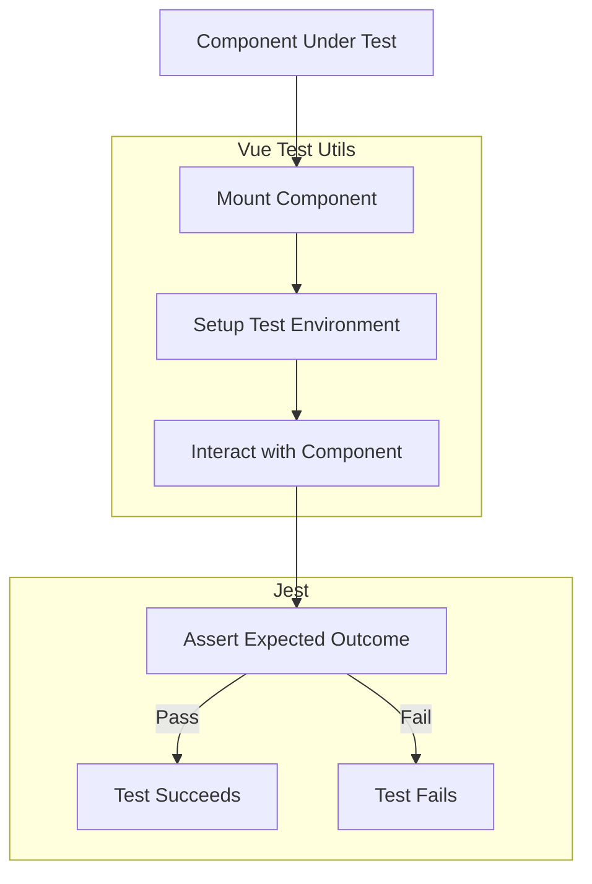

# Vue Test Utils

## Introduction

Vue Test Utils (VTU) is the official testing library for Vue.js applications. It provides a set of utilities that make it easier to test Vue components in isolation. Whether you're building a small application or a complex enterprise system, proper testing is essential for maintaining code quality and preventing regressions as your application evolves.

In this guide, we'll explore Vue Test Utils and learn how to effectively test Vue.js components. We'll cover mounting components, triggering events, testing props, checking rendered output, and more.

## Getting Started with Vue Test Utils

### Installation

Before we dive into testing, you need to set up Vue Test Utils in your project. If you're using Vue CLI, you might already have testing configured. Otherwise, you can install Vue Test Utils along with a test runner like Jest:

```bash
# Using npm
npm install --save-dev @vue/test-utils jest @vue/vue3-jest

# Using yarn
yarn add --dev @vue/test-utils jest @vue/vue3-jest
```

### Basic Setup

Let's set up a simple Jest configuration for testing Vue components. Create a `jest.config.js` file in your project root:

```js
module.exports = {
  testEnvironment: 'jsdom',
  transform: {
    '^.+\\.vue$': '@vue/vue3-jest',
    '^.+\\.jsx?$': 'babel-jest'
  },
  moduleFileExtensions: ['js', 'jsx', 'json', 'vue'],
  testMatch: ['**/__tests__/**/*.[jt]s?(x)', '**/?(*.)+(spec|test).[jt]s?(x)']
}
```

## Writing Your First Test

Let's start with a simple Vue component and write tests for it. Consider a basic counter component:

```html
<!-- Counter.vue -->
<template>
  <div>
    <p class="count">Count: {{ count }}</p>
    <button @click="increment">Increment</button>
  </div>
</template>

<script>
export default {
  data() {
    return {
      count: 0
    }
  },
  methods: {
    increment() {
      this.count += 1
    }
  }
}
</script>
```

Now, let's write a test for this component:

```js
// Counter.spec.js
import { mount } from '@vue/test-utils'
import Counter from './Counter.vue'

describe('Counter.vue', () => {
  test('renders initial count of 0', () => {
    const wrapper = mount(Counter)
    expect(wrapper.find('.count').text()).toBe('Count: 0')
  })

  test('increments count when button is clicked', async () => {
    const wrapper = mount(Counter)
    
    // Find the button and trigger a click event
    await wrapper.find('button').trigger('click')
    
    // Assert that the count is now 1
    expect(wrapper.find('.count').text()).toBe('Count: 1')
  })
})
```

## Core Concepts of Vue Test Utils

### Mounting Components

Vue Test Utils provides two main methods to render components for testing:

1. **`mount()`**: Renders the full component with all child components.
2. **`shallowMount()`**: Renders only the component without rendering its child components.

```js
import { mount, shallowMount } from '@vue/test-utils'
import MyComponent from './MyComponent.vue'

// Full mounting
const wrapper = mount(MyComponent)

// Shallow mounting
const shallowWrapper = shallowMount(MyComponent)
```

Choose `mount()` when you want to test component integration and `shallowMount()` for isolated component testing.

### The Wrapper Object

When you mount a component, Vue Test Utils returns a "wrapper" object that provides methods for interacting with and testing the component:

```js
const wrapper = mount(MyComponent)

// Access the Vue instance
console.log(wrapper.vm)

// Find elements in the DOM
const button = wrapper.find('button')
const divs = wrapper.findAll('div')

// Get text content
const text = wrapper.text()

// Check if element exists
const exists = wrapper.find('.some-class').exists()

// Get element attributes
const href = wrapper.find('a').attributes('href')
```

### Setting Props and Data

You can pass props when mounting a component:

```js
const wrapper = mount(UserProfile, {
  props: {
    username: 'johndoe',
    age: 25
  }
})
```

You can also set component data:

```js
// Set initial data
const wrapper = mount(Counter, {
  data() {
    return {
      count: 10
    }
  }
})

// Or modify data after mounting
await wrapper.setData({ count: 5 })
```

### Triggering Events

To test event handlers, use `trigger()` to simulate DOM events:

```js
// Click event
await wrapper.find('button').trigger('click')

// Form input
await wrapper.find('input').setValue('hello world')
await wrapper.find('input').trigger('input')

// Keyboard event with modifiers
await wrapper.find('input').trigger('keyup.enter')

// With event payload
await wrapper.find('div').trigger('mouseenter', {
  clientX: 100,
  clientY: 200
})
```

## Testing Components with Vue Router and Vuex

### Testing with Vue Router

When testing components that use Vue Router, you can create a mock router:

```js
import { mount } from '@vue/test-utils'
import { createRouter, createWebHistory } from 'vue-router'
import AppNavigation from './AppNavigation.vue'

// Create a mock router
const router = createRouter({
  history: createWebHistory(),
  routes: [
    { path: '/', name: 'Home', component: { template: '<div>Home</div>' } },
    { path: '/about', name: 'About', component: { template: '<div>About</div>' } }
  ]
})

test('navigates to About page when About link is clicked', async () => {
  // Mount with the router
  const wrapper = mount(AppNavigation, {
    global: {
      plugins: [router]
    }
  })

  // Set the initial route
  await router.push('/')
  
  // Click on About link
  await wrapper.find('[data-test="about-link"]').trigger('click')
  
  // Check that the route has changed
  expect(router.currentRoute.value.name).toBe('About')
})
```

### Testing with Vuex/Pinia

When testing components that use Vuex or Pinia, you can create mock stores:

```js
import { mount } from '@vue/test-utils'
import { createStore } from 'vuex'
import UserProfile from './UserProfile.vue'

// Create a mock store
const store = createStore({
  state: {
    user: { name: 'John', email: 'john@example.com' }
  },
  getters: {
    userName: state => state.user.name,
    userEmail: state => state.user.email
  },
  actions: {
    fetchUser: jest.fn()
  }
})

test('displays user profile from store', async () => {
  const wrapper = mount(UserProfile, {
    global: {
      plugins: [store]
    }
  })

  // Check if store data is displayed
  expect(wrapper.find('[data-test="user-name"]').text()).toBe('John')
  expect(wrapper.find('[data-test="user-email"]').text()).toBe('john@example.com')
})
```

## Advanced Testing Techniques

### Testing Async Components

When testing components with asynchronous behaviors like API calls, use Jest's async/await support:

```js
import { mount, flushPromises } from '@vue/test-utils'
import UserList from './UserList.vue'
import axios from 'axios'

// Mock the API call
jest.mock('axios')

test('fetches and displays users', async () => {
  const mockUsers = [
    { id: 1, name: 'Alice' },
    { id: 2, name: 'Bob' }
  ]
  
  // Setup the mock response
  axios.get.mockResolvedValue({ data: mockUsers })
  
  const wrapper = mount(UserList)
  
  // Wait for the API call and DOM updates to complete
  await flushPromises()
  
  // Check if users are displayed
  const userItems = wrapper.findAll('[data-test="user-item"]')
  expect(userItems).toHaveLength(2)
  expect(userItems[0].text()).toContain('Alice')
  expect(userItems[1].text()).toContain('Bob')
})
```

### Testing Component Slots

Vue Test Utils allows you to test components that use slots:

```js
import { mount } from '@vue/test-utils'
import Card from './Card.vue'

test('renders content in default slot', () => {
  const wrapper = mount(Card, {
    slots: {
      default: '<div class="test-content">Hello world</div>'
    }
  })
  
  expect(wrapper.find('.test-content').exists()).toBe(true)
  expect(wrapper.find('.test-content').text()).toBe('Hello world')
})

test('renders content in named slots', () => {
  const wrapper = mount(Card, {
    slots: {
      header: '<h2 class="header">Card Title</h2>',
      footer: '<div class="footer">Card Footer</div>'
    }
  })
  
  expect(wrapper.find('.header').text()).toBe('Card Title')
  expect(wrapper.find('.footer').text()).toBe('Card Footer')
})
```

### Testing Component Emits

To test custom events emitted by components:

```js
import { mount } from '@vue/test-utils'
import SearchBox from './SearchBox.vue'

test('emits search event when submit button is clicked', async () => {
  const wrapper = mount(SearchBox)
  
  // Set the search input value
  await wrapper.find('input').setValue('vue testing')
  
  // Submit the form
  await wrapper.find('form').trigger('submit')
  
  // Check if the search event was emitted with correct payload
  expect(wrapper.emitted()).toHaveProperty('search')
  expect(wrapper.emitted().search[0]).toEqual(['vue testing'])
})
```

## Real-World Example: Testing a Todo App

Let's put it all together with a more complete example. Consider a simple Todo app component:

```html
<!-- TodoApp.vue -->
<template>
  <div class="todo-app">
    <h1>Todo List</h1>
    
    <form @submit.prevent="addTodo">
      <input 
        v-model="newTodo" 
        placeholder="Add a new todo" 
        data-test="new-todo-input" 
      />
      <button type="submit" data-test="add-todo-button">Add</button>
    </form>
    
    <ul class="todo-list">
      <li 
        v-for="(todo, index) in todos" 
        :key="index" 
        :class="{ completed: todo.completed }"
        data-test="todo-item"
      >
        <input 
          type="checkbox" 
          :checked="todo.completed" 
          @change="toggleComplete(index)" 
          data-test="todo-checkbox"
        />
        <span class="todo-text">{{ todo.text }}</span>
        <button 
          @click="removeTodo(index)" 
          class="delete-btn" 
          data-test="delete-todo-button"
        >
          Delete
        </button>
      </li>
    </ul>
  </div>
</template>

<script>
export default {
  data() {
    return {
      newTodo: '',
      todos: []
    }
  },
  methods: {
    addTodo() {
      if (this.newTodo.trim()) {
        this.todos.push({
          text: this.newTodo,
          completed: false
        })
        this.newTodo = ''
      }
    },
    toggleComplete(index) {
      this.todos[index].completed = !this.todos[index].completed
    },
    removeTodo(index) {
      this.todos.splice(index, 1)
    }
  }
}
</script>
```

Now let's write comprehensive tests for this component:

```js
// TodoApp.spec.js
import { mount } from '@vue/test-utils'
import TodoApp from './TodoApp.vue'

describe('TodoApp.vue', () => {
  test('renders empty todo list initially', () => {
    const wrapper = mount(TodoApp)
    expect(wrapper.findAll('[data-test="todo-item"]')).toHaveLength(0)
  })

  test('adds a new todo when form is submitted', async () => {
    const wrapper = mount(TodoApp)
    
    // Set input value
    await wrapper.find('[data-test="new-todo-input"]').setValue('Learn Vue Testing')
    
    // Submit the form
    await wrapper.find('form').trigger('submit')
    
    // Check if todo was added
    const todoItems = wrapper.findAll('[data-test="todo-item"]')
    expect(todoItems).toHaveLength(1)
    expect(todoItems[0].text()).toContain('Learn Vue Testing')
    
    // Check if input was cleared
    expect(wrapper.find('[data-test="new-todo-input"]').element.value).toBe('')
  })

  test('does not add empty todos', async () => {
    const wrapper = mount(TodoApp)
    
    await wrapper.find('[data-test="new-todo-input"]').setValue('  ')
    await wrapper.find('form').trigger('submit')
    
    expect(wrapper.findAll('[data-test="todo-item"]')).toHaveLength(0)
  })

  test('toggles todo completion status when checkbox is clicked', async () => {
    const wrapper = mount(TodoApp)
    
    // Add a todo first
    await wrapper.find('[data-test="new-todo-input"]').setValue('Learn Vue Testing')
    await wrapper.find('form').trigger('submit')
    
    // Find the checkbox and toggle it
    const checkbox = wrapper.find('[data-test="todo-checkbox"]')
    await checkbox.setChecked(true)
    
    // Check if the todo has "completed" class
    expect(wrapper.find('[data-test="todo-item"]').classes()).toContain('completed')
    
    // Toggle it back
    await checkbox.setChecked(false)
    expect(wrapper.find('[data-test="todo-item"]').classes()).not.toContain('completed')
  })

  test('removes a todo when delete button is clicked', async () => {
    const wrapper = mount(TodoApp)
    
    // Add two todos
    await wrapper.find('[data-test="new-todo-input"]').setValue('Learn Vue Testing')
    await wrapper.find('form').trigger('submit')
    
    await wrapper.find('[data-test="new-todo-input"]').setValue('Master Vue Testing')
    await wrapper.find('form').trigger('submit')
    
    // Should have two todos
    expect(wrapper.findAll('[data-test="todo-item"]')).toHaveLength(2)
    
    // Delete the first todo
    await wrapper.findAll('[data-test="delete-todo-button"]')[0].trigger('click')
    
    // Should have one todo left
    const remainingTodos = wrapper.findAll('[data-test="todo-item"]')
    expect(remainingTodos).toHaveLength(1)
    expect(remainingTodos[0].text()).toContain('Master Vue Testing')
  })
})
```

## Best Practices for Testing Vue Components

When testing Vue components, follow these best practices for better maintainability:

1. **Use data attributes for test selectors**: Add `data-test` attributes to elements you need to select in tests. This keeps your tests independent of CSS changes.

   ```html
   <button data-test="submit-button">Submit</button>
   ```

2. **Test component behavior, not implementation**: Focus on what the component does, not how it does it. This makes your tests more resilient to refactoring.

3. **Keep tests focused**: Each test should verify one specific behavior of the component.

4. **Use meaningful test descriptions**: Write clear descriptions that explain what each test is checking.

5. **Arrange, Act, Assert**: Structure your tests with a clear setup phase, an action phase, and an assertion phase.

6. **Mock external dependencies**: Use mocks for API calls, Vuex stores, and other external dependencies.

7. **Clean up after tests**: Reset any global state between tests to prevent test pollution.

## Visual Representation of the Testing Process



## Summary

Vue Test Utils is a powerful library for testing Vue.js applications. Throughout this guide, we've covered:

- Setting up Vue Test Utils with Jest
- Mounting components for testing
- Finding and interacting with elements in the DOM
- Testing props, events, and component state
- Working with Vue Router and Vuex in tests
- Testing async components and component slots
- Writing comprehensive tests for a real-world Todo application

With these tools and techniques, you can write effective tests for your Vue applications, ensuring they behave as expected and catching bugs before they reach production.

## Additional Resources

To further enhance your Vue testing skills, check out these resources:

- [Official Vue Test Utils Documentation](https://test-utils.vuejs.org/)
- [Jest Documentation](https://jestjs.io/docs/getting-started)
- [Vue.js Testing Handbook](https://lmiller1990.github.io/vue-testing-handbook/)

## Exercises

To practice what you've learned, try these exercises:

1. Write tests for a form component that validates user input.
2. Test a component that uses Vue Router to navigate between pages.
3. Create tests for a component that fetches data from an API and displays it.
4. Write tests for a component that uses slots for content projection.
5. Test a component that uses lifecycle hooks like `created` and `mounted`.

By completing these exercises, you'll gain confidence in testing various aspects of Vue.js applications and ensure your components work as expected.