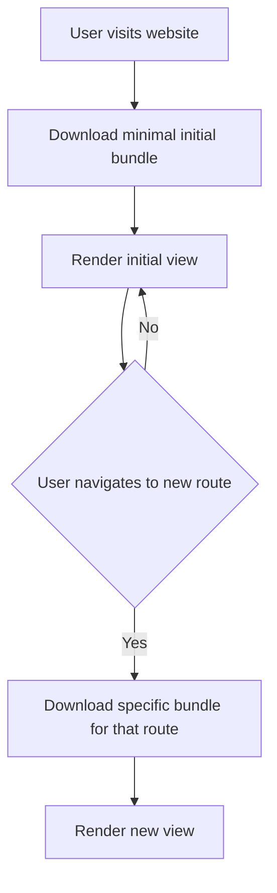

# Vue.js Lazy Loading

## Introduction

When developing larger Vue.js applications, you might notice that your initial load time increases as your application grows. This is because by default, Vue bundles your entire application into one large JavaScript file that needs to be downloaded before users can interact with your site. Lazy loading is a performance optimization technique that helps solve this problem by splitting your code into smaller chunks and loading them only when they're needed.

In this tutorial, you'll learn:

- What lazy loading is and why it's important
- How to implement lazy loading for Vue components
- How to set up lazy loading for Vue Router
- Best practices and common patterns for lazy loading
- How to measure the performance improvements

## What is Lazy Loading?

Lazy loading is a design pattern where you defer the initialization or loading of resources until they're actually needed. In Vue.js, this typically means:

1. Breaking your application into smaller JavaScript bundles (code-splitting)
2. Loading these bundles on demand when a specific route is visited or a component is needed
3. Reducing the initial load time of your application

Here's a visual representation of how lazy loading works:



## Lazy Loading Vue Components

### Basic Component Lazy Loading

Vue provides a simple way to lazy load components using dynamic imports. Here's how to implement it:

```js
// Instead of this static import:
// import HeavyComponent from './HeavyComponent.vue'

// Use this dynamic import:
const HeavyComponent = () => import('./HeavyComponent.vue')

export default {
  components: {
    HeavyComponent
  }
}
```

This code leverages JavaScript's dynamic import syntax to load the component only when it's needed. Webpack (or similar bundlers) recognize this pattern and automatically split your code into separate chunks.

### Component Lazy Loading with Local Registration

You can also use lazy loading when registering components locally:

```html
<template>
  <div>
    <heavy-component v-if="showHeavyComponent" />
    <button @click="showHeavyComponent = true">Load Heavy Component</button>
  </div>
</template>

<script>
export default {
  data() {
    return {
      showHeavyComponent: false
    }
  },
  components: {
    HeavyComponent: () => import('./HeavyComponent.vue')
  }
}
</script>
```

In this example, the `HeavyComponent` will only be fetched from the server when the user clicks the button to show it.

### Adding Loading States

When lazy loading components, especially over slower connections, you might want to show a loading state. Vue provides a way to handle this with component async loading:

```js
const HeavyComponent = () => ({
  component: import('./HeavyComponent.vue'),
  loading: LoadingComponent,
  error: ErrorComponent,
  delay: 200,   // delay in ms before showing loading component
  timeout: 3000 // timeout in ms if component load takes too long
})
```

Note: This advanced syntax requires the use of a library such as [vue-async-components](https://github.com/kolesnikovav/vue-async-components) in Vue 3, as the built-in async component functionality has changed slightly.

## Lazy Loading Routes with Vue Router

### Basic Route Lazy Loading

The most common and impactful use of lazy loading is with routes. Instead of loading all routes when your app starts, you can load each route only when the user navigates to it:

```js
// router/index.js

import { createRouter, createWebHistory } from 'vue-router'

const routes = [
  {
    path: '/',
    name: 'Home',
    component: () => import('../views/Home.vue') // Lazy loaded
  },
  {
    path: '/about',
    name: 'About',
    // Lazy loaded route
    component: () => import('../views/About.vue')
  },
  {
    path: '/dashboard',
    name: 'Dashboard',
    // Lazy loaded route
    component: () => import('../views/Dashboard.vue')
  }
]

const router = createRouter({
  history: createWebHistory(),
  routes
})

export default router
```

With this setup, each route component will only be downloaded when a user navigates to that route.

### Grouping Related Routes

Sometimes you might want to group related routes into the same chunk. This is especially useful when you have routes that are likely to be visited together:

```js
// Group admin-related routes into one chunk
const adminRoutes = [
  {
    path: '/admin',
    component: () => import('../views/admin/Layout.vue'),
    children: [
      {
        path: 'dashboard',
        component: () => import('../views/admin/Dashboard.vue')
      },
      {
        path: 'users',
        component: () => import('../views/admin/Users.vue')
      }
    ]
  }
]
```

### Named Chunks

Webpack allows you to name your chunks for better organization and debugging. You can use the special webpack comment syntax to name your lazy-loaded chunks:

```js
const UserProfile = () => import(/* webpackChunkName: "user" */ './components/UserProfile.vue')
const UserSettings = () => import(/* webpackChunkName: "user" */ './components/UserSettings.vue')
const UserDashboard = () => import(/* webpackChunkName: "dashboard" */ './components/UserDashboard.vue')

const routes = [
  { path: '/profile', component: UserProfile },
  { path: '/settings', component: UserSettings },
  { path: '/dashboard', component: UserDashboard }
]
```

In this example, `UserProfile` and `UserSettings` will be grouped in the same chunk named "user", while `UserDashboard` will be in a separate chunk named "dashboard".

## Practical Example: Lazy Loading a Chart Component

Let's create a real-world example where we lazy load a chart component that uses a heavy third-party library:

```html
<template>
  <div class="dashboard">
    <h1>Sales Dashboard</h1>
    
    <button @click="showSalesChart = true" v-if="!showSalesChart">
      Show Sales Chart
    </button>
    
    <div v-if="showSalesChart && !chartLoading" class="chart-container">
      <sales-chart :data="salesData" />
    </div>
    
    <div v-if="chartLoading" class="loading">
      Loading chart... <div class="spinner"></div>
    </div>
  </div>
</template>

<script>
export default {
  data() {
    return {
      showSalesChart: false,
      chartLoading: false,
      salesData: [
        { month: 'Jan', sales: 54 },
        { month: 'Feb', sales: 67 },
        { month: 'Mar', sales: 93 },
        { month: 'Apr', sales: 86 },
        { month: 'May', sales: 102 },
      ]
    }
  },
  components: {
    SalesChart: () => {
      this.chartLoading = true;
      return import('./components/SalesChart.vue')
        .then(component => {
          this.chartLoading = false;
          return component;
        })
        .catch(error => {
          this.chartLoading = false;
          console.error('Failed to load chart component:', error);
        });
    }
  }
}
</script>

<style scoped>
.chart-container {
  margin-top: 20px;
  border: 1px solid #eaeaea;
  padding: 15px;
  border-radius: 4px;
}

.loading {
  margin-top: 20px;
  text-align: center;
  color: #666;
}

.spinner {
  display: inline-block;
  width: 20px;
  height: 20px;
  border: 3px solid rgba(0, 0, 0, 0.1);
  border-radius: 50%;
  border-top-color: #42b983;
  animation: spin 1s ease-in-out infinite;
}

@keyframes spin {
  to { transform: rotate(360deg); }
}
</style>
```

In this example, we're only loading the chart component when the user clicks the "Show Sales Chart" button. This is especially useful for chart libraries which can be quite large and might not be needed immediately when the page loads.

## Best Practices for Vue.js Lazy Loading

1. **Load routes lazily by default**: Almost all routes should be lazy-loaded in medium to large applications.

2. **Group related functionality**: Use named chunks to group related components that are likely to be used together.

3. **Preload critical components**: For components that are highly likely to be used shortly after the initial page load, consider preloading them:

```js
// Preload the search component when the app is idle
const SearchComponent = () => import('./SearchComponent.vue')

// Somewhere in your app initialization
if ('requestIdleCallback' in window) {
  window.requestIdleCallback(() => {
    // This will load the component in the background
    // when the browser is idle
    SearchComponent()
  })
}
```

4. **Handle loading states**: Always provide feedback to users when content is loading.

5. **Monitor bundle sizes**: Use tools like webpack-bundle-analyzer to monitor your bundle sizes and identify opportunities for lazy loading.

## Measuring Performance Improvements

To quantify the benefits of lazy loading, you should measure your application's performance before and after implementing it. Here's how:

1. Use the Chrome DevTools Network tab to measure:
   - Initial load time
   - Number of requests
   - Size of initial JavaScript bundle

2. Use Lighthouse to measure key metrics:
   - First Contentful Paint (FCP)
   - Largest Contentful Paint (LCP)
   - Time to Interactive (TTI)

Before implementing lazy loading, your network waterfall might look like this:

```
main.js (2.5MB) |======================================|
```

After implementing lazy loading, it might look more like:

```
main.js (0.5MB)  |==========|
route-home.js (0.1MB)  |==|
[User clicks to another route]
route-about.js (0.15MB)       |===|
```

## Summary

Lazy loading is an essential technique for improving the performance of Vue.js applications, especially as they grow in size and complexity. By deferring the loading of components and routes until they're actually needed, you can significantly reduce the initial loading time of your application, providing a better user experience.

In this tutorial, you've learned:

- How to lazy load individual Vue components
- How to implement lazy loading with Vue Router
- How to group related components into named chunks
- Best practices for implementing lazy loading
- How to measure the performance improvements

By implementing these techniques, you'll be able to build Vue.js applications that load quickly and perform well, even as they grow in size and complexity.

## Further Learning

To deepen your understanding of Vue.js lazy loading and performance optimization, consider exploring:

1. Webpack code splitting documentation
2. Vue Router advanced lazy loading patterns
3. Performance monitoring tools like Lighthouse and WebPageTest

## Exercise: Optimize a Vue Application

Try this exercise to practice what you've learned:

1. Create a simple Vue application with at least 5 different routes
2. Implement lazy loading for all routes
3. Add a component that uses a heavy third-party library (like a chart or rich text editor)
4. Implement lazy loading for this component
5. Use Chrome DevTools to measure the performance improvement before and after implementing lazy loading
6. Experiment with named chunks to group related functionality

Happy coding!