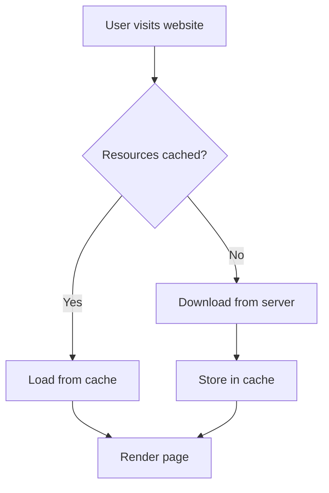

# Vue.js Browser Caching

In modern web development, delivering a smooth and fast user experience is crucial. One of the most effective ways to achieve this in Vue.js applications is by properly implementing browser caching strategies. This guide will walk you through understanding and implementing caching techniques to significantly boost your Vue.js application's performance.

## What is Browser Caching?

Browser caching is a mechanism that allows web browsers to store copies of resources (JavaScript files, CSS, images, etc.) locally on a user's device. When a user revisits your site, the browser can use these stored resources instead of downloading them again, resulting in faster page loads and reduced bandwidth usage.



## Why is Browser Caching Important for Vue.js Apps?

Vue.js applications, especially single-page applications (SPAs), rely heavily on JavaScript bundles that can be quite large. Implementing proper caching strategies can:

1. **Reduce initial load time** for returning visitors
2. **Decrease bandwidth consumption** for both users and servers
3. **Improve overall user experience** with faster interactions
4. **Reduce server load** and associated costs

## Key Caching Concepts for Vue.js Applications

### 1. Cache-Control Headers

The `Cache-Control` HTTP header is the primary mechanism for controlling caching behavior. Your server should be configured to send appropriate headers for different types of resources.

Common Cache-Control directives include:

| Directive | Description |
|-----------|-------------|
| `max-age` | Specifies the maximum time (in seconds) a resource can be cached |
| `public` | Response can be cached by any cache |
| `private` | Response is intended for a single user and shouldn't be stored by shared caches |
| `no-cache` | Response can be cached but must be validated before using |
| `no-store` | Response shouldn't be cached at all |

### 2. Content Hashing in Vue.js

Vue CLI (and most modern build tools) support content hashing, which appends a unique hash to filenames based on the file content. When the content changes, the hash changes, effectively creating a new filename that bypasses the cache.

## Implementing Caching in Vue.js Projects

### Basic Setup with Vue CLI

If you're using Vue CLI, content hashing is already configured in production mode. You can see this in your `vue.config.js` file:

```js
// Default configuration in Vue CLI
module.exports = {
  filenameHashing: true, // This is enabled by default in production
}
```

The output will include hashed filenames like:

```
app.8f7d6a3e.js
chunk-vendors.23f7a9c2.js
```

### Custom Cache Configuration

For more advanced control, you might want to modify your webpack configuration:

```js
// vue.config.js
module.exports = {
  chainWebpack: config => {
    if (process.env.NODE_ENV === 'production') {
      // Change the hash length
      config.output.filename('js/[name].[contenthash:8].js')
      config.output.chunkFilename('js/[name].[contenthash:8].js')
    }
  }
}
```

### Server Configuration Examples

To implement proper caching headers on the server side, here are examples for common server technologies:

#### Nginx Configuration

```nginx
# For static assets with content hash in filename
location ~* \.(?:js|css|png|jpg|jpeg|gif|ico|svg)$ {
    expires 1y;
    add_header Cache-Control "public, max-age=31536000, immutable";
    access_log off;
}

# For HTML and potentially changing assets
location ~* \.(?:html)$ {
    expires 1h;
    add_header Cache-Control "public, max-age=3600, must-revalidate";
}
```

#### Apache Configuration (in .htaccess)

```apache
<IfModule mod_expires.c>
    ExpiresActive On
    
    # JavaScript, CSS files with hash in filename
    ExpiresByType text/css "access plus 1 year"
    ExpiresByType application/javascript "access plus 1 year"
    
    # HTML files
    ExpiresByType text/html "access plus 0 seconds"
</IfModule>

<IfModule mod_headers.c>
    # Set cache control for assets with hashed filenames
    <FilesMatch "\.(js|css|png|jpg|jpeg|gif|ico|svg)$">
        Header set Cache-Control "public, max-age=31536000, immutable"
    </FilesMatch>
    
    # HTML files
    <FilesMatch "\.(html|json)$">
        Header set Cache-Control "public, max-age=0, must-revalidate"
    </FilesMatch>
</IfModule>
```

## Service Workers and Caching in Vue.js

For more advanced caching strategies, you can use service workers. Vue CLI provides built-in PWA support via the `@vue/cli-plugin-pwa` package.

### Adding PWA Support

```bash
vue add pwa
```

This will add necessary files and configurations for service worker support. After installation, you'll have a `registerServiceWorker.js` file and additional PWA configuration options.

### Customizing Service Worker Caching

You can customize the service worker caching behavior in the `vue.config.js` file:

```js
// vue.config.js
module.exports = {
  pwa: {
    workboxPluginMode: 'GenerateSW',
    workboxOptions: {
      skipWaiting: true,
      clientsClaim: true,
      runtimeCaching: [
        {
          urlPattern: new RegExp('^https://api.example.com/'),
          handler: 'NetworkFirst',
          options: {
            cacheName: 'api-cache',
            expiration: {
              maxEntries: 100,
              maxAgeSeconds: 60 * 60 * 24, // 1 day
            },
            cacheableResponse: {
              statuses: [0, 200],
            },
          },
        },
        {
          urlPattern: /\.(?:png|jpg|jpeg|svg|gif)$/,
          handler: 'CacheFirst',
          options: {
            cacheName: 'images-cache',
            expiration: {
              maxEntries: 60,
              maxAgeSeconds: 30 * 24 * 60 * 60, // 30 Days
            },
          },
        },
      ],
    },
  },
};
```

## Real-world Example: E-commerce Product Page

Let's look at how to optimize a Vue.js e-commerce product page with browser caching:

### 1. Static Assets Strategy

For our product catalog app, we'll implement different caching strategies for different types of assets:

```js
// vue.config.js for an e-commerce site
module.exports = {
  chainWebpack: config => {
    if (process.env.NODE_ENV === 'production') {
      // Long-term caching for rarely changed assets
      config.plugin('html').tap(args => {
        args[0].minify = {
          ...args[0].minify,
          removeComments: true,
          collapseWhitespace: true,
        };
        return args;
      });
    }
  },
  pwa: {
    name: 'VueShop',
    themeColor: '#4DBA87',
    workboxPluginMode: 'GenerateSW',
    workboxOptions: {
      // Cache product images with a cache-first strategy
      runtimeCaching: [
        {
          urlPattern: /\/products\/.*\.(?:png|jpg|jpeg|webp)/,
          handler: 'CacheFirst',
          options: {
            cacheName: 'product-images',
            expiration: {
              maxEntries: 100, 
              maxAgeSeconds: 7 * 24 * 60 * 60 // 1 week
            }
          }
        },
        {
          // Cache product API data with network-first approach
          urlPattern: /\/api\/products/,
          handler: 'NetworkFirst',
          options: {
            cacheName: 'products-api',
            expiration: {
              maxEntries: 50,
              maxAgeSeconds: 10 * 60 // 10 minutes
            }
          }
        }
      ]
    }
  }
};
```

### 2. Dynamic Data with Conditional Caching

For product data that changes frequently, we can implement conditional caching in our Vuex store:

```js
// store/modules/products.js
import axios from 'axios';

export default {
  namespaced: true,
  state: {
    products: [],
    lastFetch: null
  },
  getters: {
    // Getters here
  },
  mutations: {
    setProducts(state, products) {
      state.products = products;
      state.lastFetch = Date.now();
    }
  },
  actions: {
    async fetchProducts({ commit, state }) {
      // If data was fetched less than 5 minutes ago, use cached data
      const fiveMinutes = 5 * 60 * 1000;
      if (state.lastFetch && (Date.now() - state.lastFetch) < fiveMinutes) {
        console.log('Using cached product data');
        return;
      }
      
      // Otherwise fetch fresh data
      try {
        const response = await axios.get('/api/products');
        commit('setProducts', response.data);
      } catch (error) {
        console.error('Error fetching products:', error);
      }
    }
  }
};
```

### 3. Displaying Cached Status to Users

You might want to show users when they're viewing cached content:

```html
<template>
  <div class="product-listing">
    <div v-if="usingCachedData" class="cache-notice">
      Viewing cached data. <button @click="refreshData">Refresh</button>
    </div>
    
    <product-card 
      v-for="product in products" 
      :key="product.id" 
      :product="product" 
    />
  </div>
</template>

<script>
import { mapState } from 'vuex';
import ProductCard from '@/components/ProductCard.vue';

export default {
  components: {
    ProductCard
  },
  computed: {
    ...mapState('products', ['products', 'lastFetch']),
    usingCachedData() {
      return this.lastFetch && (Date.now() - this.lastFetch > 30000); // 30 seconds
    }
  },
  created() {
    this.$store.dispatch('products/fetchProducts');
  },
  methods: {
    refreshData() {
      // Force skip cache
      this.$store.state.products.lastFetch = null;
      this.$store.dispatch('products/fetchProducts');
    }
  }
}
</script>
```

## Measuring Caching Effectiveness

To ensure your caching strategy is working, you should measure its effectiveness:

### Using Chrome DevTools

1. Open Chrome DevTools (F12)
2. Go to the Network tab
3. Disable the "Disable cache" option
4. Reload your page (F5)
5. Look for resources loaded from disk cache or memory cache


### Using Lighthouse

1. Open Chrome DevTools
2. Go to the Lighthouse tab
3. Run an audit with "Performance" checked
4. Check "Serve static assets with an efficient cache policy" in the results

## Common Caching Pitfalls and Solutions

### Problem: Cache Invalidation Issues

**Symptom**: Users don't see updated content after deployment

**Solution**: Ensure proper content hashing is enabled and that HTML files have appropriate cache headers

```js
// Make sure this is enabled in vue.config.js
module.exports = {
  filenameHashing: true
}
```

### Problem: Over-Caching API Responses

**Symptom**: Users see stale data

**Solution**: Implement appropriate cache control for API endpoints

```js
// In your API service
const apiService = {
  async getProducts() {
    return axios.get('/api/products', {
      headers: {
        'Cache-Control': 'max-age=300' // Cache for 5 minutes
      }
    });
  }
};
```

### Problem: Third-Party Resources Affecting Performance

**Symptom**: Third-party scripts slow down your application

**Solution**: Apply resource hints for third-party domains

```html
<!-- In your public/index.html -->
<link rel="dns-prefetch" href="https://third-party-analytics.com">
<link rel="preconnect" href="https://api.payment-provider.com">
```

## Summary

Browser caching is a powerful technique to improve Vue.js application performance. By implementing proper caching strategies, you can significantly reduce load times for returning visitors and decrease server load.

Key takeaways from this guide:

1. Leverage content hashing to enable long-term caching for static assets
2. Configure appropriate cache headers for different types of resources
3. Use service workers for advanced caching scenarios
4. Implement conditional fetching for dynamic data
5. Regularly measure and optimize your caching strategy

By following these practices, you'll create Vue.js applications that not only load faster but also provide a better overall user experience.

## Additional Resources

- [Vue.js Performance Guide](https://vuejs.org/v2/guide/performance.html)
- [MDN Web Docs: HTTP Caching](https://developer.mozilla.org/en-US/docs/Web/HTTP/Caching)
- [Workbox Documentation](https://developers.google.com/web/tools/workbox)

## Exercises

1. **Cache Analysis**: Use Chrome DevTools to analyze the current caching behavior of your Vue.js application. Look for resources that aren't being cached properly.

2. **Service Worker Implementation**: Add PWA support to an existing Vue.js project and configure custom caching strategies for different types of resources.

3. **Cache Busting Test**: Create a simple Vue component that can be modified, build the application with content hashing, and verify that changed files get new hashes.

4. **API Caching Strategy**: Implement a caching strategy for API calls in a Vuex store that respects both the browser's HTTP cache and implements in-memory caching for repeated requests.