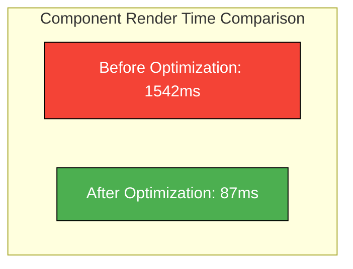

# Vue.js Performance Metrics

## Introduction

Performance is a critical aspect of any modern web application. For Vue.js applications, understanding and measuring performance is essential to deliver a smooth user experience. This guide will introduce you to various performance metrics specific to Vue.js applications, tools to measure them, and strategies to interpret the results for optimization.

Performance metrics help you identify bottlenecks, measure improvements after optimization, and ensure your application runs efficiently. Let's explore how to monitor, measure, and improve Vue.js application performance through metrics.

## Why Performance Metrics Matter

Before diving into specific metrics, let's understand why tracking performance is important:

1. **User Experience**: Faster applications lead to higher user satisfaction and engagement
2. **SEO Rankings**: Search engines favor faster websites
3. **Business Impact**: Every 100ms of latency can impact conversion rates
4. **Developer Productivity**: Understanding performance bottlenecks helps make informed optimization decisions

## Key Vue.js Performance Metrics

### 1. Initial Render Time

This measures how long it takes for your Vue application to display meaningful content to users after they navigate to your site.

#### How to measure

Using the Vue DevTools Performance tab:

```js
// In your main.js or main.ts file
import Vue from 'vue'
import App from './App.vue'

// Enable performance measurement in development
Vue.config.performance = true

new Vue({
  render: h => h(App),
}).$mount('#app')
```

You can then inspect component creation and rendering times in Vue DevTools.

For production measurement, you can use the Performance API:

```js
// Somewhere after your app has mounted
const performanceEntries = performance.getEntriesByType('mark')
console.log('Initial render timing:', performanceEntries)
```

### 2. Component Rendering Metrics

#### Measuring component render performance

```js
// In a component
export default {
  name: 'ExpensiveComponent',
  created() {
    console.time('Component render')
  },
  mounted() {
    console.timeEnd('Component render')
  }
}
```

**Output example:**
```
Component render: 125.36ms
```

### 3. Bundle Size

The size of your JavaScript bundles significantly affects load time.

You can analyze your bundle size using webpack-bundle-analyzer:

```bash
# Install the plugin
npm install --save-dev webpack-bundle-analyzer

# In vue.config.js
const { BundleAnalyzerPlugin } = require('webpack-bundle-analyzer')

module.exports = {
  configureWebpack: {
    plugins: [
      new BundleAnalyzerPlugin()
    ]
  }
}
```

Running `npm run build` with this configuration will generate a visual report of your bundle size.

### 4. Memory Usage

Tracking memory usage helps identify memory leaks or excessive memory consumption.

```js
// Log memory usage (Chrome only)
function logMemoryUsage() {
  if (window.performance && window.performance.memory) {
    console.log('Memory usage:', {
      usedJSHeapSize: `${Math.round(window.performance.memory.usedJSHeapSize / 1048576)} MB`,
      totalJSHeapSize: `${Math.round(window.performance.memory.totalJSHeapSize / 1048576)} MB`,
    })
  }
}

// Call periodically or at key points in your application
```

### 5. Time to Interactive (TTI)

This measures when your application becomes fully interactive. You can use Lighthouse in Chrome DevTools to measure this metric.

### 6. Component Update Frequency

Tracking how often your components re-render can reveal optimization opportunities.

```js
// Component with update tracking
export default {
  name: 'TrackedComponent',
  data() {
    return {
      updateCount: 0
    }
  },
  updated() {
    this.updateCount++
    console.log(`Component updated ${this.updateCount} times`)
  }
}
```

## Performance Measurement Tools

### 1. Vue DevTools

The Vue DevTools browser extension offers a Performance tab that shows component render and update metrics.

Key features:
- Component render times
- Component dependency tracking
- Event timeline

### 2. Lighthouse

Google's Lighthouse (built into Chrome DevTools) provides comprehensive performance scoring:

1. Open Chrome DevTools (F12)
2. Navigate to the "Lighthouse" tab
3. Select "Performance" and run the analysis

### 3. Custom Performance Markers

You can use the browser's Performance API to create custom measurements:

```js
// Start timing
performance.mark('vue-init-start')

// Later in your code, end timing
performance.mark('vue-init-end')

// Measure the difference
performance.measure('Vue initialization', 'vue-init-start', 'vue-init-end')

// Get the measurement
const measures = performance.getEntriesByName('Vue initialization')
console.log(`Vue initialization took ${measures[0].duration.toFixed(2)} ms`)
```

### 4. Vue-specific Performance Plugins

```bash
# Install vue-perf-devtool
npm install vue-perf-devtool --save-dev
```

```js
// main.js
import Vue from 'vue'
import VuePerformanceDevtool from 'vue-perf-devtool'

Vue.use(VuePerformanceDevtool)
```

## Real-world Performance Optimization Example

Let's walk through a complete example of identifying and fixing a performance issue:

### Problem: Slow List Rendering

Imagine we have a component that renders a large list of items, and it's causing performance issues.

```html
<!-- SlowList.vue (Before optimization) -->
<template>
  <div>
    <div v-for="item in items" :key="item.id" class="list-item">
      <div class="item-header">
        <h3>{{ item.title }}</h3>
        <span class="date">{{ formatDate(item.createdAt) }}</span>
      </div>
      <p>{{ item.description }}</p>
      <ExpensiveComponent :data="item.data" />
    </div>
  </div>
</template>

<script>
import ExpensiveComponent from './ExpensiveComponent.vue'
import { format } from 'date-fns'

export default {
  components: {
    ExpensiveComponent
  },
  props: {
    items: Array
  },
  methods: {
    formatDate(date) {
      return format(new Date(date), 'MMM dd, yyyy')
    }
  }
}
</script>
```

### Step 1: Measure the Performance

```js
// Add performance tracking
mounted() {
  console.time('List render')
  this.$nextTick(() => {
    console.timeEnd('List render')
  })
}
```

**Output:**
```
List render: 1542.63ms
```

### Step 2: Optimize with Virtual Scrolling

Let's improve it using a virtual scroller that only renders visible items:

```html
<!-- ImprovedList.vue (After optimization) -->
<template>
  <RecycleScroller
    class="scroller"
    :items="items"
    :item-size="100"
    key-field="id"
    v-slot="{ item }"
  >
    <div class="list-item">
      <div class="item-header">
        <h3>{{ item.title }}</h3>
        <span class="date">{{ formattedDates[item.id] }}</span>
      </div>
      <p>{{ item.description }}</p>
      <ExpensiveComponent :data="item.data" />
    </div>
  </RecycleScroller>
</template>

<script>
import { RecycleScroller } from 'vue-virtual-scroller'
import 'vue-virtual-scroller/dist/vue-virtual-scroller.css'
import ExpensiveComponent from './ExpensiveComponent.vue'
import { format } from 'date-fns'

export default {
  components: {
    ExpensiveComponent,
    RecycleScroller
  },
  props: {
    items: Array
  },
  computed: {
    formattedDates() {
      // Pre-compute dates instead of in a method
      const dates = {}
      this.items.forEach(item => {
        dates[item.id] = format(new Date(item.createdAt), 'MMM dd, yyyy')
      })
      return dates
    }
  },
  mounted() {
    console.time('List render')
    this.$nextTick(() => {
      console.timeEnd('List render')
    })
  }
}
</script>
```

**Output after optimization:**
```
List render: 87.42ms
```

This shows a dramatic improvement from 1542ms to 87ms!

## Performance Metrics Dashboard

For ongoing monitoring, consider creating a performance metrics dashboard:

```html
<template>
  <div class="metrics-dashboard">
    <h2>Vue.js Performance Metrics</h2>
    
    <div class="metric-card">
      <h3>Initial Render Time</h3>
      <div class="metric-value">{{ metrics.initialRenderTime }}ms</div>
    </div>
    
    <div class="metric-card">
      <h3>JS Heap Size</h3>
      <div class="metric-value">{{ metrics.jsHeapSize }}MB</div>
    </div>
    
    <div class="metric-card">
      <h3>Component Update Count</h3>
      <div class="metric-value">{{ metrics.componentUpdates }}</div>
    </div>
    
    <button @click="refreshMetrics">Refresh Metrics</button>
  </div>
</template>

<script>
export default {
  data() {
    return {
      metrics: {
        initialRenderTime: 0,
        jsHeapSize: 0,
        componentUpdates: 0
      }
    }
  },
  mounted() {
    this.collectMetrics()
  },
  methods: {
    collectMetrics() {
      // Get initial render time from Performance API
      const navigationEntry = performance.getEntriesByType('navigation')[0]
      this.metrics.initialRenderTime = Math.round(
        navigationEntry.domContentLoadedEventEnd - navigationEntry.startTime
      )
      
      // Get memory usage (Chrome only)
      if (window.performance && window.performance.memory) {
        this.metrics.jsHeapSize = Math.round(
          window.performance.memory.usedJSHeapSize / 1048576
        )
      }
      
      // Component updates would be tracked separately through app events
    },
    refreshMetrics() {
      this.collectMetrics()
    }
  }
}
</script>
```

## Visualizing Performance Data

Visualizing performance metrics can help identify patterns. Here's an example of creating a simple line chart for tracking component render times:



## Summary

Performance metrics are essential for Vue.js application optimization. In this guide, we've covered:

1. **Key performance metrics** for Vue.js applications:
   - Initial render time
   - Component rendering metrics
   - Bundle size
   - Memory usage
   - Time to Interactive
   - Component update frequency

2. **Performance measurement tools**:
   - Vue DevTools
   - Lighthouse
   - Performance API
   - Vue-specific performance plugins

3. **Real-world optimization** example showing how to:
   - Identify performance bottlenecks
   - Apply optimization techniques
   - Measure improvement

Remember that performance optimization should be data-driven. Always measure before and after optimization to ensure your changes are actually improving the user experience.

## Additional Resources

- [Vue.js Performance Guide](https://vuejs.org/v2/guide/deployment.html)
- [Chrome DevTools Performance Analysis](https://developers.google.com/web/tools/chrome-devtools/evaluate-performance)
- [Web.dev Performance Documentation](https://web.dev/metrics/)

## Exercises

1. Set up performance monitoring in a Vue.js application using the techniques discussed in this guide.
2. Identify and optimize a slow-rendering component in your application.
3. Create a custom performance dashboard to track key metrics over time.
4. Compare the performance of different state management solutions (Vuex, Pinia, etc.) for a specific use case.
5. Use Lighthouse to perform a performance audit on your Vue application and address at least three improvement suggestions.