# Vue.js Code Splitting

## Introduction

When building modern web applications, one of the biggest challenges is managing the application size. As your Vue application grows, the JavaScript bundle can become quite large, leading to longer loading times and poor user experience. This is where **code splitting** comes to the rescue.

Code splitting is a technique that allows you to break down your application code into smaller chunks that can be loaded on demand, rather than loading everything upfront. This dramatically improves the initial load time of your application, as users only download the code they need for the current view or feature they're using.

In this guide, we'll explore how to implement code splitting in Vue.js applications, understand its benefits, and learn best practices for real-world scenarios.

## Why Use Code Splitting?

Before diving into implementation, let's understand the benefits of code splitting:

1. **Reduced initial load time**: Users only download what they need initially
2. **Better caching**: Smaller chunks can be cached individually
3. **On-demand loading**: Additional features load only when needed
4. **Improved performance**: Faster time-to-interactive and better user experience
5. **Reduced memory usage**: Browser needs to parse and compile less JavaScript upfront

## Vue Router-Based Code Splitting

The most common and effective way to implement code splitting in Vue.js is through route-based chunking. Instead of importing all components directly, we can use dynamic imports with Vue Router.

### Basic Implementation

Here's how to implement code splitting with Vue Router:

```js
// Before code splitting (without lazy loading)
import UserDashboard from '@/views/UserDashboard.vue'
import UserProfile from '@/views/UserProfile.vue'
import UserSettings from '@/views/UserSettings.vue'

const routes = [
  { path: '/dashboard', component: UserDashboard },
  { path: '/profile', component: UserProfile },
  { path: '/settings', component: UserSettings }
]
```

Now let's apply code splitting:

```js
// After code splitting (with lazy loading)
const routes = [
  { 
    path: '/dashboard', 
    component: () => import('@/views/UserDashboard.vue') 
  },
  { 
    path: '/profile', 
    component: () => import('@/views/UserProfile.vue') 
  },
  { 
    path: '/settings', 
    component: () => import('@/views/UserSettings.vue') 
  }
]
```

When using this approach, each route becomes its own chunk that is loaded only when a user navigates to that route. In the network tab of your browser's developer tools, you'll notice additional JavaScript files being loaded when navigating between routes.

## Named Chunks for Better Organization

To better organize your code chunks, you can use webpack's named chunks feature. This makes debugging easier and gives you more control over your code splitting.

```js
const routes = [
  { 
    path: '/dashboard', 
    component: () => import(/* webpackChunkName: "dashboard" */ '@/views/UserDashboard.vue') 
  },
  { 
    path: '/profile', 
    component: () => import(/* webpackChunkName: "user" */ '@/views/UserProfile.vue') 
  },
  { 
    path: '/settings', 
    component: () => import(/* webpackChunkName: "user" */ '@/views/UserSettings.vue') 
  }
]
```

Notice how we've grouped the profile and settings components under the same chunk name "user". This means they'll be bundled together in a single chunk, which is useful for related features that are likely to be used together.

## Component-Level Code Splitting

In addition to route-based splitting, you can also implement code splitting at the component level for more granular control.

```html
<template>
  <div class="user-panel">
    <user-info></user-info>
    <button @click="showEditor = true">Edit Profile</button>
    
    <!-- This component will be loaded only when needed -->
    <profile-editor v-if="showEditor"></profile-editor>
  </div>
</template>

<script>
import UserInfo from '@/components/UserInfo.vue'

export default {
  components: {
    UserInfo,
    ProfileEditor: () => import('@/components/ProfileEditor.vue')
  },
  data() {
    return {
      showEditor: false
    }
  }
}
</script>
```

In this example, the `ProfileEditor` component is loaded only when the user clicks the "Edit Profile" button. This is particularly useful for large components that aren't immediately needed.

## Handling Loading States

When using code splitting, there will be a brief delay when a new chunk is being loaded. To provide better user experience, Vue's dynamic import supports handling loading and error states:

```js
const ProfileEditor = () => ({
  component: import('@/components/ProfileEditor.vue'),
  loading: LoadingSpinner,
  error: ErrorComponent,
  delay: 200,   // Show loading component if load takes > 200ms
  timeout: 5000  // Show error component if load takes > 5s
})

export default {
  components: {
    ProfileEditor
  }
}
```

## Prefetching and Preloading

To further improve user experience, you can use webpack's prefetch and preload directives:

```js
// Prefetch: low-priority download when browser is idle
const UserSettings = () => import(/* webpackPrefetch: true */ '@/views/UserSettings.vue')

// Preload: higher-priority immediate download
const UserDashboard = () => import(/* webpackPreload: true */ '@/views/UserDashboard.vue')
```

- Use **prefetch** for routes or components that users are likely to navigate to next
- Use **preload** for resources needed for the current route but loaded asynchronously

## Real-World Example: E-commerce Product Page

Let's look at a practical example of code splitting in an e-commerce application:

```html
<template>
  <div class="product-page">
    <product-details :product="product"></product-details>
    
    <tabs>
      <tab name="Description">
        <product-description :description="product.description" />
      </tab>
      
      <tab name="Reviews">
        <!-- Reviews are loaded only when this tab is selected -->
        <product-reviews v-if="currentTab === 'Reviews'" :productId="product.id" />
      </tab>
      
      <tab name="Size Chart">
        <!-- Size chart is loaded only when this tab is selected -->
        <size-chart v-if="currentTab === 'Size Chart'" :category="product.category" />
      </tab>
    </tabs>
    
    <!-- Related products are loaded asynchronously -->
    <related-products :productId="product.id"></related-products>
  </div>
</template>

<script>
import ProductDetails from '@/components/ProductDetails.vue'
import Tabs from '@/components/Tabs.vue'
import Tab from '@/components/Tab.vue'
import ProductDescription from '@/components/ProductDescription.vue'

export default {
  components: {
    ProductDetails,
    Tabs,
    Tab,
    ProductDescription,
    ProductReviews: () => import(/* webpackChunkName: "product-extras" */ '@/components/ProductReviews.vue'),
    SizeChart: () => import(/* webpackChunkName: "product-extras" */ '@/components/SizeChart.vue'),
    RelatedProducts: () => import(/* webpackPrefetch: true */ '@/components/RelatedProducts.vue')
  },
  data() {
    return {
      product: {},
      currentTab: 'Description'
    }
  }
}
</script>
```

In this example:

1. Core product details load immediately
2. Review and size chart components load only when their respective tabs are viewed
3. Related products are prefetched during idle time since users often browse them next

## Performance Impact Visualization

Let's visualize the difference between an application with and without code splitting:

```mermaid
gantt
    title Application Loading Comparison
    dateFormat  s
    axisFormat %S
    
    section Without Code Splitting
    Load entire bundle (1.5MB) :a1, 0, 3s
    Parse & compile JS         :a2, after a1, 2s
    Render page                :a3, after a2, 0.5s
    
    section With Code Splitting
    Load initial chunk (300KB) :b1, 0, 0.7s
    Parse & compile initial JS :b2, after b1, 0.4s
    Render initial page        :b3, after b2, 0.3s
    Load feature chunk on demand (200KB) :b4, after b3, 0.5s
```



## Best Practices for Code Splitting

1. **Route-level splitting**: Always implement code splitting at the route level as your first optimization
2. **Analyze your bundles**: Use tools like `webpack-bundle-analyzer` to identify large dependencies
3. **Group related components**: Use named chunks to group related components together
4. **Don't over-split**: Very small chunks can cause performance overhead due to multiple network requests
5. **Consider user flow**: Use prefetch for likely next routes and preload for critical resources
6. **Handle loading states**: Always provide loading indicators when chunks may take time to load
7. **Test on real devices**: Ensure your code splitting strategy works well on various network conditions

## Common Pitfalls to Avoid

1. **Circular dependencies**: Can cause issues with code splitting
2. **Over-eager prefetching**: Prefetching too many resources defeats the purpose of code splitting
3. **Forgetting async component loading states**: Can lead to poor user experience
4. **Splitting core functionality**: Some parts of your app should load immediately
5. **Not testing on slow connections**: Code splitting benefits are most noticeable on slower networks

## Summary

Code splitting is a powerful technique for improving Vue.js application performance by breaking down your code into smaller, more manageable chunks that load on demand. We've explored:

- Basic route-based code splitting with Vue Router
- Component-level code splitting for more granular control
- Named chunks for better organization
- Handling loading states
- Prefetching and preloading strategies
- Real-world implementation in an e-commerce context

By implementing these techniques, you can significantly improve the initial load time and overall performance of your Vue applications, leading to a better user experience, especially on mobile or slower connections.

## Additional Resources

- [Vue Router Lazy Loading Documentation](https://router.vuejs.org/guide/advanced/lazy-loading.html)
- [Webpack Code Splitting Guide](https://webpack.js.org/guides/code-splitting/)
- [Vue.js Performance Documentation](https://vuejs.org/guide/best-practices/performance.html)

## Exercises

1. Take an existing Vue application and implement route-based code splitting
2. Use the browser's network panel to observe the loading behavior of your split chunks
3. Implement component-level code splitting for a complex component in your app
4. Add loading states to your asynchronously loaded components
5. Use webpack-bundle-analyzer to identify large dependencies that could benefit from being split out