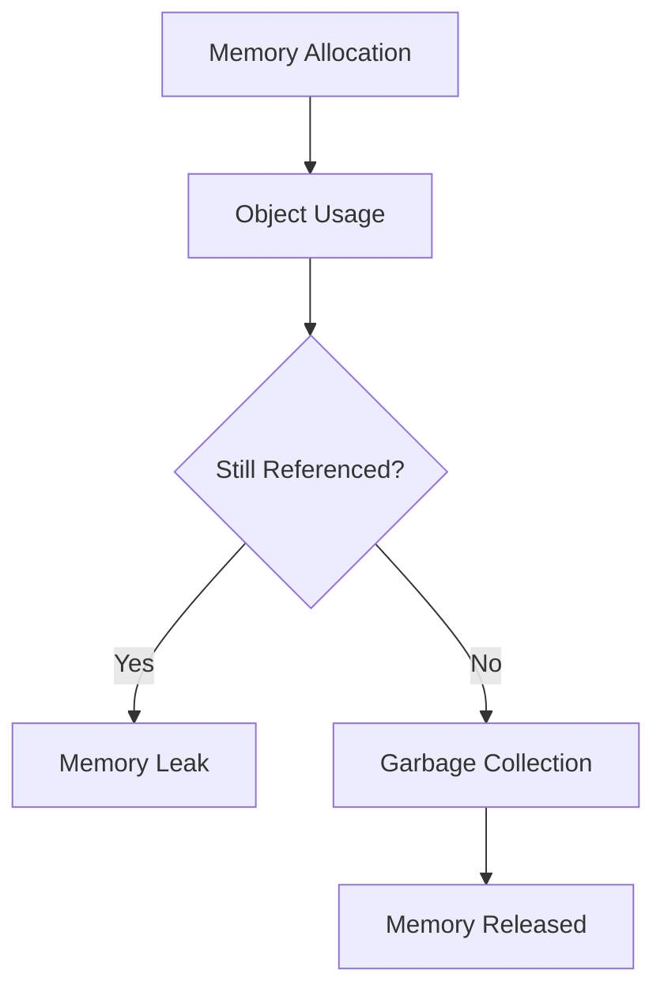

# Vue.js Memory Management

## Introduction

Memory management is a critical aspect of maintaining high-performance Vue.js applications. When developing single-page applications (SPAs) that users might keep open for extended periods, proper memory management becomes even more important. Unattended memory issues can lead to degraded performance, application crashes, and poor user experience.

In this guide, you'll learn about memory management in Vue.js applications, how to identify memory leaks, common causes of memory leaks in Vue.js apps, and best practices to avoid them. By the end, you'll have the knowledge to build Vue applications that remain performant over long usage periods.

## Understanding Memory Leaks in Vue.js

A memory leak occurs when your application no longer needs certain data, but the JavaScript engine can't release it because references to that data still exist somewhere in your code. Over time, these unreleased objects accumulate and consume more and more memory, eventually leading to performance issues.



In Vue.js applications, memory leaks often happen due to:

1. **Event listeners that aren't removed**
2. **Detached DOM references**
3. **Circular references in data structures**
4. **Timers and intervals that aren't cleared**
5. **Third-party libraries with memory leak issues**
6. **Improper component cleanup**

## Identifying Memory Leaks

Before fixing memory leaks, you need to identify them. Here are some methods to detect memory issues in your Vue.js application:

### Using Chrome DevTools

Chrome DevTools provides powerful features to track memory usage:

1. Open DevTools (F12 or Cmd+Option+I on Mac)
2. Go to the "Performance" or "Memory" tab
3. Take heap snapshots and compare them

Let's look at how to take and analyze heap snapshots:

1. Navigate to the Memory tab in Chrome DevTools
2. Select "Heap snapshot" and click "Take snapshot"
3. Perform the actions that you suspect cause leaks
4. Take another snapshot
5. Use the "Comparison" view to identify objects that are accumulating

## Common Causes of Memory Leaks in Vue.js

### 1. Forgotten Event Listeners

One of the most common sources of memory leaks is forgetting to remove event listeners when components are destroyed.

**Problematic code:**

```javascript
export default {
  mounted() {
    window.addEventListener('resize', this.handleResize);
  },
  methods: {
    handleResize() {
      // Handle window resize
    }
  }
  // No cleanup!
};
```

**Fixed code:**

```javascript
export default {
  mounted() {
    window.addEventListener('resize', this.handleResize);
  },
  beforeUnmount() {
    window.removeEventListener('resize', this.handleResize);
  },
  methods: {
    handleResize() {
      // Handle window resize
    }
  }
};
```

### 2. Timers and Intervals

Forgetting to clear timers can cause memory leaks because the callback function maintains references to the component instance.

**Problematic code:**

```javascript
export default {
  data() {
    return {
      timer: null
    };
  },
  mounted() {
    this.timer = setInterval(() => {
      this.updateData();
    }, 1000);
  },
  methods: {
    updateData() {
      // Update component data
    }
  }
  // No cleanup!
};
```

**Fixed code:**

```javascript
export default {
  data() {
    return {
      timer: null
    };
  },
  mounted() {
    this.timer = setInterval(() => {
      this.updateData();
    }, 1000);
  },
  beforeUnmount() {
    clearInterval(this.timer);
  },
  methods: {
    updateData() {
      // Update component data
    }
  }
};
```

### 3. Circular References in Data

Circular references can prevent the garbage collector from properly cleaning up objects.

**Problematic code:**

```javascript
export default {
  data() {
    const state = {};
    return {
      parentObject: {
        child: {
          // This creates a circular reference
          parent: state
        }
      }
    };
  }
};
```

**Fixed code:**

```javascript
export default {
  data() {
    return {
      parentObject: {
        child: {
          // Store only what's needed or use WeakMap for references
          parentId: 'someId'
        }
      }
    };
  },
  beforeUnmount() {
    // Break circular references if they exist
    this.parentObject.child = null;
  }
};
```

### 4. Improper Third-Party Library Usage

Many third-party libraries require explicit cleanup to prevent memory leaks.

**Example with Chart.js:**

```javascript
export default {
  data() {
    return {
      chart: null
    };
  },
  mounted() {
    this.initChart();
  },
  beforeUnmount() {
    // Properly dispose of Chart.js instance
    if (this.chart) {
      this.chart.destroy();
      this.chart = null;
    }
  },
  methods: {
    initChart() {
      const ctx = this.$refs.chart.getContext('2d');
      this.chart = new Chart(ctx, {
        // Chart configuration
      });
    }
  }
};
```

## Best Practices for Memory Management in Vue.js

### 1. Use Lifecycle Hooks Properly

Vue's lifecycle hooks provide clear places to set up and tear down resources:

```javascript
export default {
  // Set up resources
  mounted() {
    this.setupResources();
  },
  
  // Clean up before component is destroyed
  beforeUnmount() {
    this.cleanupResources();
  },
  
  methods: {
    setupResources() {
      // Initialize resources, event listeners, etc.
    },
    cleanupResources() {
      // Clean up all resources, remove event listeners, etc.
    }
  }
};
```

### 2. Use Event Bus with Caution

If you're using an event bus for component communication, be sure to remove event listeners:

```javascript
// EventBus.js
import { createApp } from 'vue';
export const EventBus = createApp({});

// In your component
import { EventBus } from './EventBus';

export default {
  mounted() {
    EventBus.$on('some-event', this.handleEvent);
  },
  beforeUnmount() {
    EventBus.$off('some-event', this.handleEvent);
  },
  methods: {
    handleEvent() {
      // Handle event
    }
  }
};
```

### 3. Use WeakMap for Storing DOM References

When you need to store DOM references outside Vue's reactivity system, use WeakMap to avoid memory leaks:

```javascript
const nodeCache = new WeakMap();

export default {
  mounted() {
    // Store DOM node reference without preventing garbage collection
    nodeCache.set(this, this.$el);
  },
  methods: {
    accessCachedNode() {
      const node = nodeCache.get(this);
      // Use node
    }
  }
};
```

### 4. Prefer Vue's Built-in Event Handling When Possible

Vue's template-based event handling automatically manages cleanup:

```html
<template>
  <button @click="handleClick">Click me</button>
</template>

<script>
export default {
  methods: {
    handleClick() {
      // Handle click event
    }
  }
};
</script>
```

## Real-world Example: Creating a Memory-Efficient Data Visualization Component

Let's put together a more comprehensive example of a component that properly manages memory. This example creates a resizable data visualization component using D3.js:

```html
<template>
  <div class="chart-container" ref="container"></div>
</template>

<script>
import * as d3 from 'd3';

export default {
  name: 'ResizableChart',
  
  props: {
    data: {
      type: Array,
      required: true
    }
  },
  
  data() {
    return {
      chart: null,
      resizeObserver: null,
      resizeHandler: null
    };
  },
  
  mounted() {
    this.initChart();
    this.setupResizeHandling();
  },
  
  beforeUnmount() {
    this.cleanupResizeHandling();
    this.destroyChart();
  },
  
  watch: {
    data: {
      handler() {
        this.updateChart();
      },
      deep: true
    }
  },
  
  methods: {
    initChart() {
      const container = this.$refs.container;
      this.chart = d3.select(container)
        .append('svg')
        .attr('width', '100%')
        .attr('height', '100%');
      
      this.updateChart();
    },
    
    updateChart() {
      if (!this.chart) return;
      
      // Clear previous content
      this.chart.selectAll('*').remove();
      
      // Add new visualization elements based on this.data
      this.chart.selectAll('circle')
        .data(this.data)
        .enter()
        .append('circle')
        .attr('cx', d => d.x)
        .attr('cy', d => d.y)
        .attr('r', d => d.radius)
        .attr('fill', d => d.color);
    },
    
    setupResizeHandling() {
      // Use ResizeObserver API for modern browsers
      if (window.ResizeObserver) {
        this.resizeObserver = new ResizeObserver(() => {
          this.updateChart();
        });
        this.resizeObserver.observe(this.$refs.container);
      } else {
        // Fallback to window resize events
        this.resizeHandler = () => this.updateChart();
        window.addEventListener('resize', this.resizeHandler);
      }
    },
    
    cleanupResizeHandling() {
      if (this.resizeObserver) {
        this.resizeObserver.disconnect();
        this.resizeObserver = null;
      }
      
      if (this.resizeHandler) {
        window.removeEventListener('resize', this.resizeHandler);
        this.resizeHandler = null;
      }
    },
    
    destroyChart() {
      if (this.chart) {
        // Remove all elements and event listeners
        this.chart.selectAll('*').remove();
        this.chart = null;
      }
    }
  }
};
</script>

<style scoped>
.chart-container {
  width: 100%;
  height: 400px;
  border: 1px solid #eee;
}
</style>
```

This component demonstrates several memory management best practices:

1. Proper initialization in the `mounted` lifecycle hook
2. Thorough cleanup in the `beforeUnmount` lifecycle hook
3. Multiple cleanup strategies for different browser capabilities
4. Explicit removal of D3 elements and references
5. Clear separation of setup and teardown code

## Debugging Memory Leaks in Vue Applications

When you have a memory leak, it can be difficult to track down. Here's a systematic approach:

### 1. Use Vue DevTools

Vue DevTools allows you to inspect components and their relationships. Look for components that should have been destroyed but still appear in the component tree.

### 2. Use Chrome DevTools Memory Profiler

Take heap snapshots before and after actions that might cause memory leaks:

```javascript
// Add this to your development environment to help with debugging
window.takeHeapSnapshot = function() {
  console.log('Taking heap snapshot, open Chrome DevTools Memory tab');
};
```

### 3. Test Component Destruction

Create a test component that you can mount and unmount repeatedly:

```html
<template>
  <div>
    <button @click="toggleComponent">Toggle Component</button>
    <SuspectedLeakyComponent v-if="showComponent" />
  </div>
</template>

<script>
import SuspectedLeakyComponent from './SuspectedLeakyComponent.vue';

export default {
  components: {
    SuspectedLeakyComponent
  },
  data() {
    return {
      showComponent: true
    };
  },
  methods: {
    toggleComponent() {
      this.showComponent = !this.showComponent;
    }
  }
};
</script>
```

Then use the Memory profiler to see if memory increases steadily after repeated toggling.

## Summary

Proper memory management is crucial for maintaining the performance of your Vue.js applications. By following best practices and understanding common pitfalls, you can build applications that are not only fast initially but remain performant throughout their lifecycle.

Key takeaways from this guide:

1. Always clean up resources in the `beforeUnmount` lifecycle hook
2. Remove event listeners that were added manually
3. Clear all timers and intervals
4. Break circular references before component destruction
5. Use Vue's built-in features when possible, as they handle cleanup automatically
6. Be cautious with third-party libraries and ensure proper disposal
7. Use tools like Chrome DevTools and Vue DevTools to identify memory leaks

Memory management may seem tedious, but implementing these practices from the start will save you from difficult debugging sessions and performance issues down the road.

## Additional Resources and Exercises

### Resources

- [Vue.js Documentation on Instance Lifecycle Hooks](https://vuejs.org/guide/essentials/lifecycle.html)
- [Chrome DevTools Memory Panel Documentation](https://developers.google.com/web/tools/chrome-devtools/memory-problems)
- [JavaScript Memory Management](https://developer.mozilla.org/en-US/docs/Web/JavaScript/Memory_Management)

### Exercises

1. **Memory Leak Detector**: Create a Vue component that mounts and unmounts another component repeatedly while monitoring memory usage through the Performance API.

2. **Component Audit**: Audit an existing Vue component for potential memory leaks by identifying event listeners, timers, and external library usages that might need cleanup.

3. **Practice with WeakMap**: Refactor code that stores DOM references to use WeakMap instead of regular objects or arrays.

4. **Debug Challenge**: Clone this repository [https://github.com/your-username/vue-memory-challenges](https://github.com/your-username/vue-memory-challenges) which contains intentional memory leaks. Use the techniques from this guide to find and fix them.

Remember that good memory management is an ongoing practice. Review your components regularly and include memory management as part of your code review process.