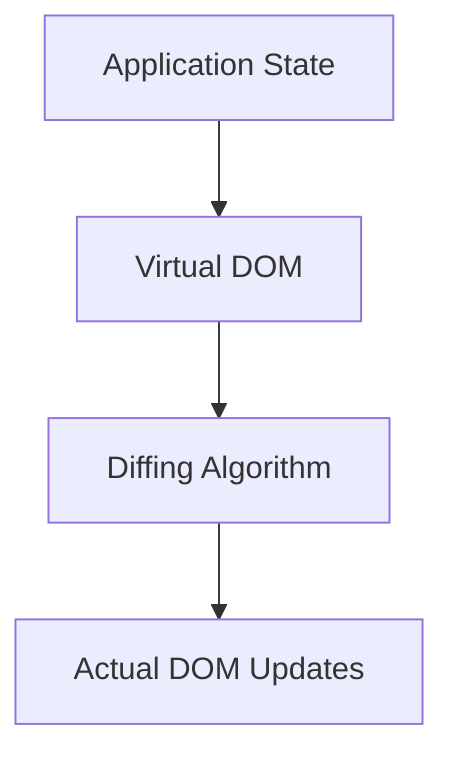

# Vue.js Virtual DOM

## Introduction

The Virtual DOM is one of the core concepts that makes Vue.js fast and efficient. But what exactly is it, and why should you care about it as a Vue developer?

When building web applications, manipulating the Document Object Model (DOM) is often the most expensive operation. Direct manipulation of the DOM can lead to performance bottlenecks, especially in complex applications with frequent updates. This is where the Virtual DOM comes in.

In this guide, we'll explore:
- What the Virtual DOM is
- How it works in Vue.js
- Why it improves performance
- Best practices for optimizing your Vue applications

## What is the Virtual DOM?

The Virtual DOM is a lightweight JavaScript representation of the actual DOM. Think of it as a blueprint of the real DOM. It's a tree-like structure made up of plain JavaScript objects that describe what the UI should look like.



### Key Characteristics:

1. **Lightweight**: Virtual DOM nodes are plain JavaScript objects, consuming less memory than actual DOM nodes.
2. **Detached from the browser**: Operations on the Virtual DOM don't trigger browser reflows or repaints.
3. **Efficient**: Vue can batch multiple changes and apply them optimally to the real DOM.

## How Vue.js Uses the Virtual DOM

Vue.js implements a Virtual DOM system that efficiently tracks changes in your application and updates only what's necessary in the real DOM.

### The Rendering Process

Let's understand the process step by step:

1. **Create Virtual DOM**: When you define a Vue component, Vue creates a Virtual DOM representation when the component is rendered.

2. **State Changes**: When data in your component changes:

```js
// When this data changes
data() {
  return {
    message: "Hello Vue!"
  }
}

// Later in your code
this.message = "Hello World!"; // Triggers a re-render
```

3. **Generate New Virtual DOM**: Vue creates a new Virtual DOM tree reflecting those changes.

4. **Diffing**: Vue performs a "diffing" operation (using an algorithm called "patch") to determine the minimum changes needed to update the real DOM.

5. **Apply Changes**: Only the necessary changes are applied to the real DOM, minimizing performance costs.

### Code Example: How Vue Renders Components

Here's a simple component that demonstrates Vue's rendering process:

```html
<template>
  <div class="counter">
    <p>Count: {{ count }}</p>
    <button @click="increment">Increment</button>
  </div>
</template>

<script>
export default {
  data() {
    return {
      count: 0
    }
  },
  methods: {
    increment() {
      this.count++; // This triggers the Virtual DOM re-rendering
    }
  }
}
</script>
```

When the `increment` method is called and `count` increases:

1. Vue detects the change in `count`
2. A new Virtual DOM is generated with the updated count
3. Vue compares the new Virtual DOM with the previous one
4. It identifies that only the text content of the `<p>` element needs to change
5. Only that specific part of the real DOM is updated

## Why the Virtual DOM Improves Performance

### Batch Updates

Vue doesn't update the DOM immediately when data changes. Instead, it batches updates and applies them asynchronously, reducing the overall number of DOM manipulations.

```js
// These three updates will batch into a single DOM update
this.firstName = "John";
this.lastName = "Doe";
this.age = 30;
```

### Minimizing DOM Operations

By determining the exact differences between Virtual DOM trees, Vue can:

- Skip unnecessary updates
- Group related changes
- Minimize layout recalculations

### Avoiding Unnecessary Re-renders

Vue tracks dependencies at a fine-grained level, ensuring that only components affected by a data change are re-rendered.

## Practical Example: List Rendering

Let's see how the Virtual DOM handles list rendering efficiently:

```html
<template>
  <div>
    <h2>Todo List</h2>
    <ul>
      <li v-for="(todo, index) in todos" :key="todo.id">
        {{ todo.text }}
        <button @click="removeTodo(index)">Done</button>
      </li>
    </ul>
    <input v-model="newTodo" placeholder="Add a todo">
    <button @click="addTodo">Add</button>
  </div>
</template>

<script>
export default {
  data() {
    return {
      newTodo: '',
      todos: [
        { id: 1, text: 'Learn Vue' },
        { id: 2, text: 'Build something awesome' },
        { id: 3, text: 'Share with community' }
      ]
    }
  },
  methods: {
    addTodo() {
      if (this.newTodo.trim()) {
        this.todos.push({
          id: Date.now(), // Unique ID
          text: this.newTodo
        });
        this.newTodo = '';
      }
    },
    removeTodo(index) {
      this.todos.splice(index, 1);
    }
  }
}
</script>
```

When you add or remove a todo:

1. Vue updates its Virtual DOM with the new list state
2. It identifies exactly which list items changed
3. It only updates those specific DOM elements, rather than re-rendering the entire list

### The Importance of `:key` in List Rendering

Notice the `:key="todo.id"` in the example above. This attribute is crucial for Vue's Virtual DOM algorithm to track items properly across re-renders.

Without keys, Vue would have to make more DOM changes than necessary when items are reordered, removed, or added.

```html
<!-- Inefficient (without keys) -->
<li v-for="todo in todos">{{ todo.text }}</li>

<!-- Efficient (with keys) -->
<li v-for="todo in todos" :key="todo.id">{{ todo.text }}</li>
```

## Optimizing Vue Performance with Virtual DOM Knowledge

Now that you understand how the Virtual DOM works, here are some optimization techniques:

### 1. Use `v-show` for Frequent Toggles

For elements that toggle visibility often, use `v-show` instead of `v-if`:

```html
<!-- Better for frequent toggles -->
<div v-show="isVisible">This content toggles often</div>

<!-- Better for conditional rendering that changes rarely -->
<div v-if="shouldRender">This content rarely changes</div>
```

`v-show` keeps the element in the DOM and just toggles its CSS `display` property, avoiding the cost of creating and destroying DOM nodes.

### 2. Use Computed Properties for Derived Data

Computed properties are cached based on their dependencies and only re-evaluate when needed:

```html
<template>
  <div>
    <!-- Inefficient: filters the list on every render -->
    <ul>
      <li v-for="item in items.filter(i => i.isActive)" :key="item.id">
        {{ item.name }}
      </li>
    </ul>
    
    <!-- Efficient: uses cached computed property -->
    <ul>
      <li v-for="item in activeItems" :key="item.id">
        {{ item.name }}
      </li>
    </ul>
  </div>
</template>

<script>
export default {
  data() {
    return {
      items: [/* ... */]
    }
  },
  computed: {
    activeItems() {
      return this.items.filter(item => item.isActive)
    }
  }
}
</script>
```

### 3. Use Functional Components for Simple Components

Functional components are faster because they don't have instances:

```html
<!-- Functional component -->
<template functional>
  <div class="user-avatar">
    
    <span>{{ props.user.name }}</span>
  </div>
</template>
```

### 4. Avoid Deep Watchers When Possible

Deep watchers can be expensive as they recursively traverse objects:

```js
// This is expensive for large objects
watch: {
  userProfile: {
    handler(newValue) {
      // Handle change
    },
    deep: true
  }
}

// More efficient: watch specific properties
watch: {
  'userProfile.name'(newValue) {
    // Handle name change
  },
  'userProfile.email'(newValue) {
    // Handle email change
  }
}
```

## Vue 3's Improved Virtual DOM

Vue 3 introduced significant improvements to the Virtual DOM implementation:

1. **Smaller Bundle Size**: The Virtual DOM implementation is more compact.

2. **Faster Mounting**: Components mount more quickly.

3. **Template Compilation Optimizations**: Static content is hoisted and doesn't get re-created between renders.

4. **Fragment Support**: Multiple root elements are now allowed in templates.

```html
<!-- Vue 3 allows multiple root elements -->
<template>
  <header>Vue 3</header>
  <main>Content</main>
  <footer>Footer</footer>
</template>
```

## Summary

The Virtual DOM is a core part of what makes Vue.js efficient and fast. By creating a lightweight representation of the UI and intelligently applying only necessary changes to the real DOM, Vue minimizes expensive DOM operations.

Key takeaways:

- The Virtual DOM is a JavaScript representation of the actual DOM
- Vue's diffing algorithm efficiently updates only what needs to change
- Using keys in lists helps Vue identify which items have changed
- There are specific optimizations you can apply based on Virtual DOM knowledge
- Vue 3 further improves Virtual DOM performance

## Exercises

1. Create a simple list component and experiment with adding, removing, and reordering items. Use Vue DevTools to observe DOM updates.

2. Build a component with and without keys in a list, then measure performance differences when reordering items.

3. Compare performance between `v-if` and `v-show` for an element that toggles frequently.

4. Implement a component that uses computed properties to filter a large list and compare it with inline filtering.

## Additional Resources

- [Vue.js Official Documentation on Rendering](https://vuejs.org/guide/extras/rendering-mechanism.html)
- [Vue.js Performance Optimization Guide](https://vuejs.org/guide/best-practices/performance.html)
- [Vue 3 Composition API for Performance](https://vuejs.org/api/composition-api-setup.html)

The Virtual DOM is one of the many reasons Vue.js stands out as a performant framework. By understanding how it works, you can write more efficient Vue applications, especially as they grow in complexity.