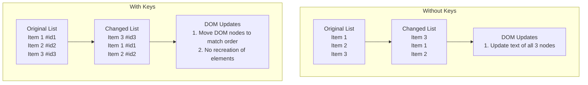

# Vue.js Keyed Lists

When building dynamic applications with Vue.js, you'll often need to render lists of elements that can change over time. How you manage these lists can significantly impact your application's performance. In this article, we'll explore Vue's keyed lists, a crucial feature for optimizing list rendering.

## Introduction to Keyed Lists

In Vue.js, when you use `v-for` to render a list of elements, Vue needs a way to track each item to efficiently update the DOM when the list changes. This is where the special `key` attribute comes into play.

The `key` attribute provides Vue with a hint to identify each node uniquely, enabling it to reuse and reorder existing elements rather than recreating the entire list when something changes.

## Why Keys Matter

Let's first understand why keys are important by looking at what happens when we don't use them.

### Without Keys: The Default Behavior

When you don't provide a key, Vue uses an "in-place patch" strategy. It will:

1. Update elements in their current position
2. Remove elements that are no longer needed
3. Add new elements at the end

This approach works well for static lists, but it can cause problems with:

- Form inputs in lists (state gets mixed up)
- Components with internal state
- Animations and transitions

Let's see an example:

```html
<template>
  <div>
    <button @click="shuffleItems">Shuffle Items</button>
    <ul>
      <li v-for="item in items">
        {{ item.text }}
        <input type="text" placeholder="Enter a value">
      </li>
    </ul>
  </div>
</template>

<script>
export default {
  data() {
    return {
      items: [
        { text: 'Item 1' },
        { text: 'Item 2' },
        { text: 'Item 3' }
      ]
    }
  },
  methods: {
    shuffleItems() {
      this.items = [...this.items].sort(() => Math.random() - 0.5);
    }
  }
}
</script>
```

In this example, when you click "Shuffle Items" and type something into the input fields, you'll notice the input values remain in the same position even though the items have shuffled. This is because Vue is reusing the DOM elements in place rather than moving them to match the new order of your data.

### With Keys: Intelligent Updates

When you add the `key` attribute, Vue can track each node's identity. This allows Vue to:

1. Identify which items have moved
2. Reuse elements for the same data
3. Remove elements that no longer exist in the data
4. Create new elements only for new data items

Here's the updated example with keys:

```html
<template>
  <div>
    <button @click="shuffleItems">Shuffle Items</button>
    <ul>
      <li v-for="item in items" :key="item.id">
        {{ item.text }}
        <input type="text" placeholder="Enter a value">
      </li>
    </ul>
  </div>
</template>

<script>
export default {
  data() {
    return {
      items: [
        { id: 1, text: 'Item 1' },
        { id: 2, text: 'Item 2' },
        { id: 3, text: 'Item 3' }
      ]
    }
  },
  methods: {
    shuffleItems() {
      this.items = [...this.items].sort(() => Math.random() - 0.5);
    }
  }
}
</script>
```

Now when you shuffle the items, the input values will stay with their respective items because Vue is tracking each item by its unique id.

## Choosing Effective Keys

Selecting good keys is essential for optimal performance. Here are some guidelines:

1. **Use unique identifiers**: Database IDs, UUIDs, or other guaranteed unique values make excellent keys.

2. **Avoid using index as keys** when the list can change order or items can be added/removed in the middle. Using indexes can lead to unexpected behavior and performance issues.

3. **Keys must be primitive values**: Strings and numbers are the best options. Objects cannot be used as keys.

### Example with Poor Key Choice (Index)

```html
<template>
  <ul>
    <li v-for="(item, index) in items" :key="index">
      {{ item.name }}
    </li>
  </ul>
</template>
```

### Example with Good Key Choice (Unique ID)

```html
<template>
  <ul>
    <li v-for="item in items" :key="item.id">
      {{ item.name }}
    </li>
  </ul>
</template>
```

## Performance Impact of Keyed Lists

Let's visualize the difference between keyed and non-keyed lists when items change:



As illustrated, with keys, Vue performs a more efficient update by reordering the existing DOM nodes instead of replacing their content.

## Real-World Application: Todo List

Here's a practical example of a todo list application where keys are essential for proper functionality:

```html
<template>
  <div class="todo-app">
    <h2>Todo List</h2>
    
    <!-- Add new todo -->
    <div class="add-todo">
      <input 
        v-model="newTodo" 
        @keyup.enter="addTodo"
        placeholder="Add a new task" 
      />
      <button @click="addTodo">Add</button>
    </div>
    
    <!-- Todo list with keys -->
    <ul class="todo-list">
      <li 
        v-for="todo in todos" 
        :key="todo.id"
        :class="{ completed: todo.completed }"
      >
        <input 
          type="checkbox" 
          v-model="todo.completed"
        />
        <span>{{ todo.text }}</span>
        <button @click="removeTodo(todo.id)">Delete</button>
      </li>
    </ul>
    
    <!-- Controls -->
    <div class="todo-controls">
      <button @click="sortByStatus">Sort by Status</button>
      <button @click="sortAlphabetically">Sort Alphabetically</button>
      <button @click="resetTodos">Reset</button>
    </div>
  </div>
</template>

<script>
export default {
  data() {
    return {
      newTodo: '',
      nextId: 4,
      todos: [
        { id: 1, text: 'Learn Vue.js', completed: true },
        { id: 2, text: 'Build a todo app', completed: false },
        { id: 3, text: 'Master keyed lists', completed: false }
      ],
      originalTodos: []
    }
  },
  created() {
    this.originalTodos = [...this.todos];
  },
  methods: {
    addTodo() {
      if (this.newTodo.trim()) {
        this.todos.push({
          id: this.nextId++,
          text: this.newTodo.trim(),
          completed: false
        });
        this.newTodo = '';
      }
    },
    removeTodo(id) {
      this.todos = this.todos.filter(todo => todo.id !== id);
    },
    sortByStatus() {
      // Sort completed last
      this.todos.sort((a, b) => a.completed - b.completed);
    },
    sortAlphabetically() {
      this.todos.sort((a, b) => a.text.localeCompare(b.text));
    },
    resetTodos() {
      this.todos = [...this.originalTodos];
      this.nextId = 4;
    }
  }
}
</script>

<style scoped>
.todo-app {
  max-width: 500px;
  margin: 0 auto;
}
.todo-list {
  list-style-type: none;
  padding: 0;
}
.todo-list li {
  padding: 10px;
  margin: 5px 0;
  display: flex;
  align-items: center;
  border: 1px solid #ddd;
}
.completed span {
  text-decoration: line-through;
  color: #888;
}
.add-todo {
  margin-bottom: 20px;
  display: flex;
}
.add-todo input {
  flex: 1;
  padding: 8px;
  margin-right: 10px;
}
.todo-controls {
  margin-top: 20px;
}
button {
  margin-right: 5px;
  padding: 5px 10px;
}
</style>
```

In this todo application:

1. Each todo item has a unique `id` used as a key
2. Users can add, remove, and check off completed items
3. The list can be sorted in different ways
4. The key attribute ensures that item state (like the checkbox) remains with the correct item when the list reorders

Without keys, sorting the list would cause the checkboxes to stay in position while the text items moved, creating a mismatch between visual representation and actual data.

## Common Pitfalls and How to Avoid Them

### 1. Using Non-Unique Keys

```html
<!-- BAD: This can cause issues if you have duplicate names -->
<div v-for="user in users" :key="user.name">{{ user.name }}</div>

<!-- GOOD: Use a unique identifier -->
<div v-for="user in users" :key="user.id">{{ user.name }}</div>
```

### 2. Using Index as Keys for Dynamic Lists

```html
<!-- BAD: Using index as key for lists that can change -->
<div v-for="(item, index) in items" :key="index">{{ item.name }}</div>

<!-- GOOD: Use intrinsic property of the item -->
<div v-for="item in items" :key="item.id">{{ item.name }}</div>
```

### 3. Forgetting Keys on Component Lists

```html
<!-- BAD: Missing key on components -->
<todo-item v-for="todo in todos" :todo="todo"></todo-item>

<!-- GOOD: Component with key -->
<todo-item v-for="todo in todos" :key="todo.id" :todo="todo"></todo-item>
```

### 4. Using Non-Primitive Values as Keys

```html
<!-- BAD: Using an object as a key -->
<div v-for="item in items" :key="item">{{ item.name }}</div>

<!-- GOOD: Using a primitive value -->
<div v-for="item in items" :key="item.id">{{ item.name }}</div>
```

## When to Use Index as Keys

While generally discouraged, using index as keys can be appropriate in specific scenarios:

- When the list is static and will never change
- When the list will only be appended to (items never removed or reordered)
- When you have no other unique identifier available

```html
<!-- Acceptable use of index as key for static lists -->
<div v-for="(item, index) in staticItems" :key="index">
  {{ item }}
</div>
```

## Vue's Virtual DOM and How Keys Help

Vue's rendering system uses a Virtual DOM to efficiently update the actual DOM. When a list changes, Vue needs to compare the old Virtual DOM with the new one to determine what parts of the real DOM need to be updated.

The `key` attribute helps Vue's diffing algorithm identify which nodes have moved, been added, or been removed, allowing for more precise DOM manipulation.

Without keys, Vue has to make more assumptions about the identity of elements, which can lead to inefficient updates and unexpected behavior.

## Summary

Properly implemented keyed lists are essential for optimized Vue.js applications. Here's what we've covered:

1. The `key` attribute helps Vue identify and track individual elements in a list
2. Using keys allows Vue to reuse and reorder existing DOM elements instead of recreating them
3. Keys should be unique, stable identifiers (usually strings or numbers)
4. Avoid using index as keys for dynamic lists that can reorder or have items added/removed
5. Keys are especially important for lists containing form inputs or components with internal state

By following these best practices, you'll ensure your Vue applications render efficiently and maintain proper state when data changes.

## Additional Resources and Exercises

### Resources
- [Vue.js Official Documentation on List Rendering](https://vuejs.org/guide/essentials/list.html)
- [Vue.js Style Guide - Key with v-for](https://vuejs.org/style-guide/#keyed-v-for-essential)

### Exercises

1. **Basic Key Implementation**  
   Create a simple list of items that can be reordered. Implement it once without keys and once with keys to observe the difference in behavior.

2. **Form Fields in Lists**  
   Create a list where each item has an editable input field. Implement sorting functionality and observe what happens with and without keys.

3. **Component Reuse**  
   Create a list of custom components with internal state. Add, remove, and reorder items to see how keys affect component state preservation.

4. **Performance Testing**  
   Create a large list (1000+ items) and implement various operations (sorting, filtering, etc.). Use Vue DevTools to compare rendering performance with and without keys.

By implementing these exercises, you'll gain hands-on experience with keyed lists and develop a deeper understanding of their importance in Vue.js applications.