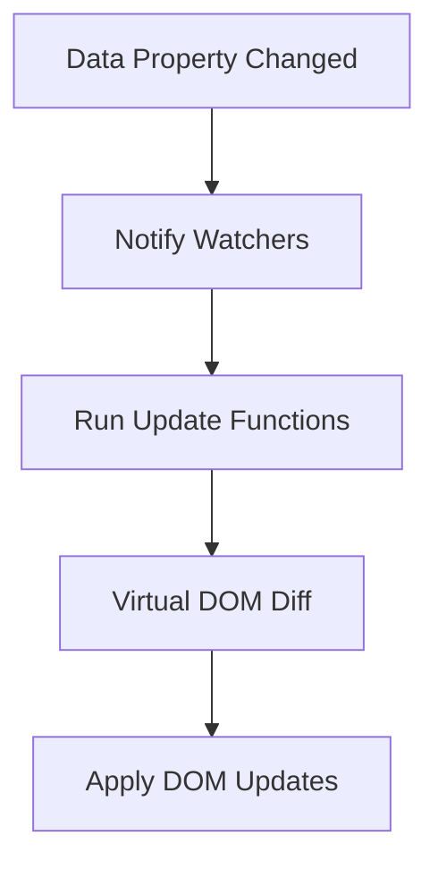

# Vue.js Reactivity Optimization

Vue.js is known for its reactivity system that automatically updates the DOM when your data changes. While this system is powerful, it can sometimes lead to performance bottlenecks if not used properly. In this guide, we'll explore techniques to optimize Vue's reactivity system for better performance.

## Understanding Vue's Reactivity System

Before diving into optimization techniques, let's understand how Vue's reactivity system works:



Vue creates getters and setters for each property in your data to track when they're accessed or modified. When a property changes, Vue re-renders the components that depend on it.

## Key Optimization Techniques

### 1. Use `Object.freeze()` for Static Data

When you have data that won't change, freezing it prevents Vue from making it reactive, saving memory and improving performance.

```js
// Without optimization
data() {
  return {
    constantList: [
      { id: 1, value: 'Item 1' },
      { id: 2, value: 'Item 2' },
      // Many more items...
    ]
  }
}

// With optimization
data() {
  return {
    constantList: Object.freeze([
      { id: 1, value: 'Item 1' },
      { id: 2, value: 'Item 2' },
      // Many more items...
    ])
  }
}
```

This works great for static configuration options, lookup tables, or any data that doesn't need to change.

### 2. Avoid Unnecessary Reactive Properties

Only make properties reactive if they're needed for rendering or other reactive operations.

```js
// Before optimization
export default {
  data() {
    return {
      formData: {
        name: '',
        email: '',
        // Used for rendering
        
        lastUpdated: Date.now(), // Not used for rendering
        validationRules: {}, // Complex object not used directly in templates
      }
    }
  }
}

// After optimization
export default {
  data() {
    // Reactive data
    const data = {
      formData: {
        name: '',
        email: '',
      }
    }
    
    // Non-reactive data
    this.lastUpdated = Date.now()
    this.validationRules = {}
    
    return data
  }
}
```

### 3. Use `v-once` for Static Content

The `v-once` directive renders content only once, and then skips future updates.

```html
<template>
  <!-- This will only be rendered once -->
  <header v-once>
    <h1>{{ appTitle }}</h1>
    <p>{{ appDescription }}</p>
  </header>
  
  <!-- This will update as normal -->
  <main>
    <p>Count: {{ count }}</p>
    <button @click="count++">Increment</button>
  </main>
</template>
```

### 4. Leverage `computed` Properties with Caching

Computed properties are cached based on their reactive dependencies and only re-evaluated when those dependencies change.

```html
<template>
  <div>
    <!-- Inefficient: filter runs on every render -->
    <ul>
      <li v-for="item in items.filter(i => i.isActive)" :key="item.id">
        {{ item.name }}
      </li>
    </ul>
    
    <!-- Optimized: filtered list is cached -->
    <ul>
      <li v-for="item in activeItems" :key="item.id">
        {{ item.name }}
      </li>
    </ul>
  </div>
</template>

<script>
export default {
  data() {
    return {
      items: [
        { id: 1, name: 'Item 1', isActive: true },
        { id: 2, name: 'Item 2', isActive: false },
        { id: 3, name: 'Item 3', isActive: true },
      ]
    }
  },
  computed: {
    activeItems() {
      return this.items.filter(item => item.isActive)
    }
  }
}
</script>
```

### 5. Use Local Variables for Expensive Operations

Computing values inside your template can trigger unnecessary re-renders. Use method or computed properties instead.

```html
<template>
  <!-- Bad: Expensive operation in template -->
  <div>
    <p>{{ getExpensiveValue(item) }}</p>
  </div>
  
  <!-- Good: Expensive operation pre-computed -->
  <div>
    <p>{{ itemExpensiveValue }}</p>
  </div>
</template>

<script>
export default {
  data() {
    return {
      item: { /* ... */ }
    }
  },
  computed: {
    itemExpensiveValue() {
      // This will only recalculate when item changes
      return this.getExpensiveValue(this.item)
    }
  },
  methods: {
    getExpensiveValue(item) {
      // Some expensive calculation
      return item.value * Math.pow(item.multiplier, 2) + item.offset
    }
  }
}
</script>
```

### 6. Use `v-memo` for List Rendering (Vue 3 only)

In Vue 3, you can use `v-memo` to memoize parts of your template, skipping updates unless specified values change.

```html
<template>
  <div v-for="item in list" :key="item.id" v-memo="[item.id, item.isSelected]">
    <!-- This will only update when item.id or item.isSelected changes -->
    <div class="item" :class="{ selected: item.isSelected }">
      {{ item.name }}
    </div>
  </div>
</template>
```

### 7. Avoid Deep Watchers When Possible

Deep watchers can be expensive as they recursively traverse objects. Use them sparingly.

```js
// Expensive deep watcher
watch: {
  userProfile: {
    handler(newValue) {
      this.processUserProfile(newValue)
    },
    deep: true
  }
}

// More efficient approach - watch specific properties
watch: {
  'userProfile.name'(newValue) {
    this.processName(newValue)
  },
  'userProfile.email'(newValue) {
    this.processEmail(newValue)
  }
}
```

### 8. Large Lists: Use Virtual Scrolling

For very long lists, consider using virtual scrolling libraries like `vue-virtual-scroller`.

```html
<template>
  <RecycleScroller
    class="scroller"
    :items="items"
    :item-size="50"
    key-field="id"
  >
    <template v-slot="{ item }">
      <div class="item">
        {{ item.name }}
      </div>
    </template>
  </RecycleScroller>
</template>

<script>
import { RecycleScroller } from 'vue-virtual-scroller'
import 'vue-virtual-scroller/dist/vue-virtual-scroller.css'

export default {
  components: {
    RecycleScroller
  },
  data() {
    return {
      items: Array.from({ length: 10000 }).map((_, i) => ({
        id: i,
        name: `Item ${i}`
      }))
    }
  }
}
</script>
```

## Real-World Example: Optimizing a Product List

Let's look at a practical example of an e-commerce product list with filtering and sorting:

```html
<template>
  <div class="product-container">
    <!-- Static header content rendered once -->
    <header v-once>
      <h1>{{ shopName }}</h1>
      <p>{{ shopDescription }}</p>
    </header>
    
    <!-- Filter controls -->
    <div class="filters">
      <select v-model="selectedCategory">
        <option value="">All Categories</option>
        <option v-for="category in categories" :key="category.id">
          {{ category.name }}
        </option>
      </select>
      <input v-model="searchQuery" placeholder="Search products...">
    </div>
    
    <!-- Product listing using computed property -->
    <div class="product-list">
      <div 
        v-for="product in filteredProducts" 
        :key="product.id"
        class="product-card"
      >
        
        <h3>{{ product.name }}</h3>
        <p v-once>Product #{{ product.id }}</p> <!-- Static product ID -->
        <p>{{ product.price | formatPrice }}</p>
        <button @click="addToCart(product)">Add to Cart</button>
      </div>
    </div>
    
    <!-- Performance stats -->
    <div class="stats">
      <p>Showing {{ filteredProducts.length }} of {{ products.length }} products</p>
    </div>
  </div>
</template>

<script>
export default {
  data() {
    return {
      shopName: 'Vue Shop',
      shopDescription: 'The best Vue.js powered shop in town',
      selectedCategory: '',
      searchQuery: '',
      categories: Object.freeze([
        { id: 1, name: 'Electronics' },
        { id: 2, name: 'Clothing' },
        { id: 3, name: 'Books' }
      ]),
      products: [
        { id: 1, name: 'Laptop', price: 999.99, category: 'Electronics', image: '/img/laptop.jpg' },
        { id: 2, name: 'Smartphone', price: 699.99, category: 'Electronics', image: '/img/phone.jpg' },
        { id: 3, name: 'T-Shirt', price: 19.99, category: 'Clothing', image: '/img/tshirt.jpg' },
        // More products...
      ]
    }
  },
  computed: {
    filteredProducts() {
      let result = this.products
      
      // Filter by category
      if (this.selectedCategory) {
        result = result.filter(p => p.category === this.selectedCategory)
      }
      
      // Filter by search query
      if (this.searchQuery) {
        const query = this.searchQuery.toLowerCase()
        result = result.filter(p => 
          p.name.toLowerCase().includes(query) || 
          p.category.toLowerCase().includes(query)
        )
      }
      
      return result
    }
  },
  methods: {
    addToCart(product) {
      // Add to cart logic
      console.log(`Added ${product.name} to cart`)
    }
  },
  filters: {
    formatPrice(price) {
      return `$${price.toFixed(2)}`
    }
  }
}
</script>
```

In this example:
1. We use `v-once` for static content (header and product IDs)
2. Categories are frozen since they don't change
3. Expensive filtering is done in a computed property
4. We avoid unnecessary template expressions
5. Component is properly structured to minimize reactivity overhead

## Summary

Optimizing Vue's reactivity system involves:

1. **Using `Object.freeze()` for static data** to prevent Vue from making it reactive
2. **Avoiding unnecessary reactive properties** for data that doesn't affect rendering
3. **Using `v-once`** for content that only needs to render once
4. **Leveraging computed properties** for caching expensive operations
5. **Moving expensive operations out of templates** and into methods or computed properties
6. **Using `v-memo`** in Vue 3 for conditional re-rendering
7. **Avoiding deep watchers** when watching specific properties is sufficient
8. **Implementing virtual scrolling** for very large lists

By applying these techniques, you can make your Vue.js applications more efficient and faster, providing a better experience for your users.

## Exercises

1. Take an existing Vue component and identify at least three ways to optimize its reactivity.
2. Convert a component that uses array operations in templates (like `filter()` or `map()`) to use computed properties.
3. Implement virtual scrolling for a list with 1000+ items.
4. Use `Object.freeze()` on appropriate static data structures in your application.
5. Profile your Vue application using Vue DevTools' performance tab to identify reactivity bottlenecks.

## Additional Resources

- [Vue.js Official Performance Guide](https://vuejs.org/guide/best-practices/performance.html)
- [Vue 3 Reactivity API](https://vuejs.org/api/reactivity-core.html)
- [Vue Virtual Scroller](https://github.com/Akryum/vue-virtual-scroller)
- [Vue DevTools Performance Tab](https://devtools.vuejs.org/guide/performance.html)

By mastering these reactivity optimization techniques, you'll be well on your way to building high-performance Vue applications!