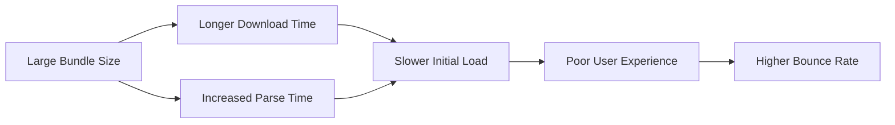

# Vue.js Bundle Size

When building web applications with Vue.js, one of the most critical performance factors is the size of your JavaScript bundle. The larger your bundle, the longer it takes to download and parse, which directly impacts your application's initial load time and user experience.

## Introduction to Bundle Size in Vue.js

Bundle size refers to the total file size of all JavaScript code that needs to be downloaded when a user first visits your Vue application. This typically includes:

- Vue.js framework code
- Your application components
- Third-party libraries and dependencies
- CSS (if included in your bundle)

For a performant web application, especially on mobile devices or slower connections, keeping your bundle size small is essential. In this guide, we'll explore how to analyze, reduce, and optimize your Vue.js bundle size.

## Why Bundle Size Matters



A large bundle size negatively impacts your application in several ways:

1. **Slower load times**: Users wait longer before they can interact with your app
2. **Higher bounce rates**: Users may leave before your app loads completely
3. **Poor performance on low-end devices**: Parsing large JS bundles taxes CPU resources
4. **Higher data costs for users**: Particularly important for users on metered connections

## Analyzing Your Vue.js Bundle Size

Before optimizing, you need to understand what's in your bundle. Here are tools to help analyze your Vue.js application's bundle size:

### Using webpack-bundle-analyzer

If you're using Vue CLI, you can add the webpack-bundle-analyzer plugin:

```bash
npm install --save-dev webpack-bundle-analyzer
```

Then in your `vue.config.js` file:

```javascript
const BundleAnalyzerPlugin = require('webpack-bundle-analyzer').BundleAnalyzerPlugin;

module.exports = {
  configureWebpack: {
    plugins: [
      new BundleAnalyzerPlugin()
    ]
  }
}
```

Running your build command will now generate a visual representation of your bundle:

```bash
npm run build
```

### Using the Vue CLI build report

Vue CLI provides a built-in report feature:

```bash
vue-cli-service build --report
```

This generates an `index.html` file in the `dist/report.html` path that visualizes your bundle content.

## Techniques to Reduce Bundle Size

### 1. Code Splitting

Code splitting allows you to break your app into smaller chunks that are loaded on demand:

```javascript
// Instead of importing directly
import LargeComponent from './LargeComponent.vue'

// Use dynamic import for code splitting
const LargeComponent = () => import('./LargeComponent.vue')

export default {
  components: {
    LargeComponent
  }
}
```

Vue Router supports code splitting out of the box:

```javascript
const routes = [
  {
    path: '/dashboard',
    // This will create a separate chunk named 'dashboard'
    component: () => import(/* webpackChunkName: "dashboard" */ './views/Dashboard.vue')
  }
]
```

### 2. Tree Shaking

Tree shaking removes unused code from your bundle. To leverage tree shaking:

- Use ES modules syntax (`import`/`export`)
- Configure your build system properly
- Import only what you need from libraries

```javascript
// Bad: imports the entire library
import lodash from 'lodash'

// Good: imports only the specific functions you need
import { debounce, throttle } from 'lodash-es'
```

### 3. Use Vue.js Production Build

Ensure you're using the production build of Vue.js, which is smaller and optimized for performance:

For Vue CLI projects, this is automatically handled when you run `npm run build`.

For custom setups, make sure to set the appropriate environment variables:

```javascript
// webpack config
module.exports = {
  mode: 'production',
  // other config options...
}
```

### 4. Optimize Dependencies

Large dependencies can significantly increase your bundle size. Strategies include:

- **Audit your dependencies**: Use `npm ls` or `yarn list` to review dependencies
- **Find alternatives**: Look for smaller libraries that accomplish the same task
- **Import selectively**: Only import the parts of libraries you actually need

Example with Moment.js (which is notoriously large):

```javascript
// Before: imports all of moment.js with all locales
import moment from 'moment'

// After: imports only what you need
import moment from 'moment'
import 'moment/locale/fr' // Only import required locales
```

Better alternative - use a lighter library:

```javascript
// Instead of Moment.js, use date-fns
import { format } from 'date-fns'

const formattedDate = format(new Date(), 'yyyy-MM-dd')
```

### 5. Compress and Minify Assets

Ensure your production build process includes:

- JavaScript minification
- CSS minification
- Image optimization
- Gzip or Brotli compression

With Vue CLI, this is largely configured automatically, but you can enhance compression:

```javascript
// vue.config.js
const CompressionPlugin = require('compression-webpack-plugin')

module.exports = {
  configureWebpack: {
    plugins: [
      new CompressionPlugin({
        algorithm: 'gzip',
        test: /\.(js|css|html|svg)$/,
        threshold: 10240,
        minRatio: 0.8
      })
    ]
  }
}
```

## Real-World Example: Optimizing a Vue Dashboard

Let's walk through a practical example of optimizing a Vue dashboard application:

### Initial Analysis

After running `vue-cli-service build --report`, we find our bundle looks like:

- Main bundle: 1.2MB
- Vendor bundle: 850KB
- Various CSS: 300KB

### Step 1: Implement Code Splitting for Dashboard Features

```javascript
// router/index.js
const routes = [
  {
    path: '/',
    component: () => import(/* webpackChunkName: "home" */ '../views/Home.vue')
  },
  {
    path: '/analytics',
    component: () => import(/* webpackChunkName: "analytics" */ '../views/Analytics.vue')
  },
  {
    path: '/reports',
    component: () => import(/* webpackChunkName: "reports" */ '../views/Reports.vue')
  }
]
```

### Step 2: Optimize Chart Library Usage

```javascript
// Before
import Chart from 'chart.js'

// After
import { Line, Bar } from 'chart.js'
// Register only the chart types we need
Chart.register(Line, Bar)
```

### Step 3: Implement On-Demand Loading for Dashboard Widgets

```html
<template>
  <div class="dashboard">
    <button @click="loadRevenueWidget">Show Revenue</button>
    <div v-if="showRevenue">
      <revenue-widget />
    </div>
  </div>
</template>

<script>
export default {
  data() {
    return {
      showRevenue: false
    }
  },
  components: {
    RevenueWidget: () => import('./widgets/RevenueWidget.vue')
  },
  methods: {
    loadRevenueWidget() {
      this.showRevenue = true
    }
  }
}
</script>
```

### Results After Optimization

- Main bundle: 250KB (79% reduction)
- Initial load has only essential code
- Feature-specific code loads on demand
- Page loads in 1.2 seconds vs. 3.8 seconds originally

## Advanced Techniques

### 1. Use Vue Feature Flags

Vue 3 supports tree-shaking at the framework level with feature flags:

```javascript
// vite.config.js
import { defineConfig } from 'vite'
import vue from '@vitejs/plugin-vue'

export default defineConfig({
  plugins: [vue()],
  define: {
    __VUE_OPTIONS_API__: false, // Disable Options API if you only use Composition API
    __VUE_PROD_DEVTOOLS__: false, // Disable devtools in production
  }
})
```

### 2. Module Federation (for Micro Frontends)

For large applications, Webpack 5's Module Federation allows sharing code between separate builds:

```javascript
// webpack.config.js
const { ModuleFederationPlugin } = require('webpack').container;

module.exports = {
  plugins: [
    new ModuleFederationPlugin({
      name: 'dashboard',
      filename: 'remoteEntry.js',
      exposes: {
        './DashboardWidget': './src/components/DashboardWidget.vue',
      },
      shared: {
        vue: { singleton: true },
      },
    }),
  ],
};
```

### 3. Externalize Rarely Changing Libraries

For libraries that rarely change, consider loading them from a CDN:

```html
<!-- index.html -->
<script src="https://cdn.jsdelivr.net/npm/vue@3"></script>
```

Then in your webpack config:

```javascript
// webpack.config.js
module.exports = {
  externals: {
    vue: 'Vue'
  }
}
```

## Common Pitfalls

1. **Forgetting to use production mode**: Development builds include warnings and are much larger
2. **Including entire libraries**: Always import only what you need
3. **Not analyzing the bundle**: Regular analysis helps catch new issues
4. **Ignoring polyfills**: They can add significant size for older browsers
5. **Over-optimizing prematurely**: Focus on the largest chunks first

## Summary

Optimizing your Vue.js bundle size is crucial for delivering a fast and efficient user experience. Key strategies include:

- Analyze your bundle to understand its composition
- Implement code splitting to load code on demand
- Use tree shaking to eliminate unused code
- Optimize dependencies by being selective with imports
- Compress and minify your assets for production
- Consider advanced techniques for specific use cases

By applying these techniques, you can significantly reduce your Vue.js application's bundle size, leading to faster load times and better performance across all devices.

## Additional Resources

- [Vue.js Performance Guide](https://v3.vuejs.org/guide/optimization.html)
- [Webpack Bundle Analyzer](https://github.com/webpack-contrib/webpack-bundle-analyzer)
- [Import Cost VSCode Extension](https://marketplace.visualstudio.com/items?itemName=wix.vscode-import-cost)
- [Vite Documentation](https://vitejs.dev) (for modern Vue.js development)

## Exercises

1. Analyze your current Vue.js project using webpack-bundle-analyzer and identify the top three largest dependencies.
2. Implement code splitting for a route in your application and measure the impact on initial load time.
3. Replace a large library in your project with a more lightweight alternative and compare bundle sizes.
4. Create a custom build configuration that externalizes a common library like Vue or Lodash.
5. Practice implementing lazy loading for components that aren't visible when the page first loads.