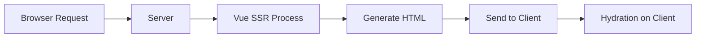

# Vue.js Server-Side Rendering

## Introduction

Server-Side Rendering (SSR) is a technique where your Vue.js application renders on the server rather than in the browser. This approach offers significant benefits, especially for performance and SEO, making it an essential topic for developers looking to build production-ready Vue applications.

In traditional Vue applications (client-side rendering), the browser downloads a minimal HTML page, along with JavaScript bundles that are responsible for rendering the content. With SSR, the server processes the Vue components and sends fully rendered HTML to the client, which improves initial loading time and allows search engines to better index your content.

## What is Server-Side Rendering?

Server-Side Rendering refers to the process where your Vue application renders on the server, generating HTML content that is sent directly to the client. The client's browser can display this content immediately while simultaneously "hydrating" the application—attaching event listeners and creating a Single-Page Application (SPA) experience for subsequent interactions.



### Benefits of SSR

1. **Improved Performance**: Faster initial page load and Time to First Contentful Paint (FCP)
2. **Better SEO**: Search engines can crawl your fully rendered content
3. **Enhanced User Experience**: Users see content quickly, even on slower connections
4. **Improved Social Sharing**: Social media platforms can properly display previews of your pages

### Challenges of SSR

1. **Development Complexity**: SSR introduces new concerns like server/client code separation
2. **Server Load**: Rendering on the server requires more server resources
3. **Build Setup**: More complex build and deployment process
4. **API Limitations**: Some browser-specific APIs aren't available during server rendering

## Setting Up Vue.js SSR

You can implement SSR in Vue.js either manually or using frameworks like Nuxt.js. Let's explore both approaches.

### Manual SSR Setup

For a manual setup, you'll need to use the `vue-server-renderer` package.

First, install the required packages:

```bash
npm install vue vue-server-renderer express
```

Create a basic server entry point (`server.js`):

```javascript
const Vue = require('vue')
const server = require('express')()
const { createRenderer } = require('vue-server-renderer')
const renderer = createRenderer()

server.get('*', (req, res) => {
  const app = new Vue({
    data: {
      message: 'Hello World!'
    },
    template: `<div>{{ message }}</div>`
  })

  renderer.renderToString(app, (err, html) => {
    if (err) {
      res.status(500).end('Internal Server Error')
      return
    }
    res.end(`
      <!DOCTYPE html>
      <html>
        <head>
          <title>Vue SSR Example</title>
        </head>
        <body>
          ${html}
        </body>
      </html>
    `)
  })
})

server.listen(8080, () => {
  console.log('Server running at http://localhost:8080/')
})
```

When you run this with `node server.js`, visiting http://localhost:8080 will display "Hello World!" rendered on the server.

### Using Nuxt.js for SSR

[Nuxt.js](https://nuxtjs.org/) is a higher-level framework built on top of Vue that makes SSR much easier to implement.

To create a new Nuxt.js project:

```bash
npx create-nuxt-app my-ssr-app
```

During setup, when asked about rendering mode, select "Universal (SSR / Static)".

Once set up, create a simple page in `pages/index.vue`:

```html
<template>
  <div>
    <h1>{{ title }}</h1>
    <p>This page is rendered on the server!</p>
  </div>
</template>

<script>
export default {
  data() {
    return {
      title: 'Welcome to Server-Side Rendered Vue'
    }
  },
  // This will run on the server
  asyncData() {
    return { serverTime: new Date().toLocaleString() }
  }
}
</script>
```

Run the development server:

```bash
npm run dev
```

Your application will now be server-side rendered when you visit http://localhost:3000.

## Advanced SSR Concepts

### Data Fetching with SSR

One of the key challenges with SSR is handling data fetching. You need to ensure data is available before rendering on the server.

#### Using Nuxt's asyncData

Nuxt provides the `asyncData` method for fetching data before rendering:

```html
<template>
  <div>
    <h1>User Profile</h1>
    <div v-if="user">
      <h2>{{ user.name }}</h2>
      <p>{{ user.email }}</p>
    </div>
  </div>
</template>

<script>
import axios from 'axios'

export default {
  async asyncData() {
    // This runs on the server before rendering!
    const { data } = await axios.get('https://api.example.com/user/1')
    return { user: data }
  }
}
</script>
```

#### Manual SSR Data Fetching

In manual Vue SSR, you need to create a data store that can be populated on the server:

```javascript
// store.js
import Vue from 'vue'
import Vuex from 'vuex'

Vue.use(Vuex)

export function createStore() {
  return new Vuex.Store({
    state: {
      user: null
    },
    mutations: {
      setUser(state, user) {
        state.user = user
      }
    },
    actions: {
      fetchUser({ commit }) {
        return fetch('https://api.example.com/user/1')
          .then(res => res.json())
          .then(user => {
            commit('setUser', user)
          })
      }
    }
  })
}
```

```javascript
// server-entry.js
import { createApp } from './app'

export default context => {
  return new Promise((resolve, reject) => {
    const { app, router, store } = createApp()
    
    // Set server-side router location
    router.push(context.url)
    
    router.onReady(() => {
      const matchedComponents = router.getMatchedComponents()
      
      if (!matchedComponents.length) {
        return reject({ code: 404 })
      }
      
      // Execute asyncData() hooks on components
      Promise.all(matchedComponents.map(Component => {
        if (Component.asyncData) {
          return Component.asyncData({
            store,
            route: router.currentRoute
          })
        }
      })).then(() => {
        // Pass store state to context
        context.state = store.state
        resolve(app)
      }).catch(reject)
    }, reject)
  })
}
```

### Handling Browser-Specific Code

Some code might rely on browser-specific APIs that don't exist on the server (like `window` or `document`). Here's how to handle it:

```html
<template>
  <div>
    <h1>Window Width: {{ windowWidth }}px</h1>
  </div>
</template>

<script>
export default {
  data() {
    return {
      windowWidth: 0
    }
  },
  // This only runs on client-side
  mounted() {
    this.windowWidth = window.innerWidth
    
    window.addEventListener('resize', this.handleResize)
  },
  beforeDestroy() {
    window.removeEventListener('resize', this.handleResize)
  },
  methods: {
    handleResize() {
      this.windowWidth = window.innerWidth
    }
  }
}
</script>
```

To make browser-specific code safe for SSR, use the `process.client` check in Nuxt.js:

```javascript
if (process.client) {
  // This code only runs in the browser
  window.addEventListener('scroll', this.handleScroll)
}
```

In manual Vue SSR, use the `mounted` lifecycle hook (which only runs on the client) or check if `window` is defined:

```javascript
export default {
  created() {
    if (typeof window !== 'undefined') {
      // This code only runs in the browser
    }
  }
}
```

## Real-World SSR Examples

### E-commerce Product Page

A product detail page is a perfect candidate for SSR because it needs to be indexed by search engines and load quickly:

```html
<template>
  <div class="product-page">
    <h1>{{ product.name }}</h1>
    <div class="product-image">
      
    </div>
    <p class="price">${{ product.price.toFixed(2) }}</p>
    <div class="description" v-html="product.description"></div>
    
    <button @click="addToCart" class="add-to-cart">
      Add to Cart
    </button>
  </div>
</template>

<script>
export default {
  async asyncData({ params, $axios }) {
    try {
      const { data } = await $axios.get(`/api/products/${params.id}`)
      return { product: data }
    } catch (error) {
      return { error: 'Product not found' }
    }
  },
  methods: {
    addToCart() {
      // Client-side only action
      this.$store.dispatch('cart/addItem', this.product)
      this.$toast.success('Added to cart!')
    }
  },
  head() {
    return {
      title: this.product ? this.product.name : 'Product',
      meta: [
        {
          hid: 'description',
          name: 'description',
          content: this.product ? this.product.shortDescription : ''
        }
      ]
    }
  }
}
</script>
```

### News Site Article Page

News articles greatly benefit from SSR for SEO and social sharing:

```html
<template>
  <div class="article">
    <header>
      <h1>{{ article.title }}</h1>
      <div class="meta">
        <span class="author">By {{ article.author }}</span>
        <time :datetime="article.publishedAt">
          {{ formattedDate }}
        </time>
      </div>
    </header>
    
    <figure v-if="article.featuredImage">
      
      <figcaption>{{ article.imageCaption }}</figcaption>
    </figure>
    
    <div class="content" v-html="article.content"></div>
    
    <section class="comments">
      <h2>Comments ({{ comments.length }})</h2>
      <!-- Client-side rendered comments -->
      <div v-if="process.client">
        <comment-list :comments="comments" />
        <comment-form @submit="addComment" />
      </div>
      <div v-else>
        Loading comments...
      </div>
    </section>
  </div>
</template>

<script>
export default {
  async asyncData({ params, $axios }) {
    const [articleRes, commentsRes] = await Promise.all([
      $axios.get(`/api/articles/${params.slug}`),
      $axios.get(`/api/articles/${params.slug}/comments`)
    ])
    
    return {
      article: articleRes.data,
      comments: commentsRes.data
    }
  },
  computed: {
    formattedDate() {
      if (!this.article.publishedAt) return ''
      return new Date(this.article.publishedAt)
        .toLocaleDateString('en-US', {
          year: 'numeric',
          month: 'long',
          day: 'numeric'
        })
    }
  },
  methods: {
    async addComment(comment) {
      await this.$axios.post(`/api/articles/${this.$route.params.slug}/comments`, comment)
      this.comments.push(comment)
    }
  },
  head() {
    return {
      title: this.article.title,
      meta: [
        { hid: 'description', name: 'description', content: this.article.excerpt },
        // Open Graph tags for social sharing
        { property: 'og:title', content: this.article.title },
        { property: 'og:description', content: this.article.excerpt },
        { property: 'og:image', content: this.article.featuredImage }
      ]
    }
  }
}
</script>
```

## Performance Optimization in SSR

### Component Caching

Server-side rendering can be CPU-intensive. To improve performance, you can cache rendered components:

```javascript
const { createRenderer } = require('vue-server-renderer')
const LRU = require('lru-cache')

const renderer = createRenderer({
  cache: new LRU({
    max: 10000,
    maxAge: 1000 * 60 * 15 // 15 minutes
  })
})
```

In Nuxt.js, you can enable component caching in `nuxt.config.js`:

```javascript
export default {
  render: {
    bundleRenderer: {
      cache: LRUCache({
        max: 1000,
        maxAge: 1000 * 60 * 15
      })
    }
  }
}
```

### Code Splitting

Code splitting is crucial for SSR performance. It ensures that only necessary JavaScript is loaded:

```javascript
// nuxt.config.js
export default {
  build: {
    splitChunks: {
      layouts: true,
      pages: true,
      commons: true
    }
  }
}
```

### Lazy Loading Components

In Vue, you can lazy load components:

```javascript
export default {
  components: {
    // This component will be loaded only when needed
    'heavy-component': () => import('@/components/HeavyComponent.vue')
  }
}
```

## When to Use SSR

SSR is not always the right choice. Consider using SSR when:

1. **SEO is Critical**: Your content needs to be indexed by search engines
2. **Initial Load Performance Matters**: Users need to see content as quickly as possible
3. **Social Sharing is Important**: Your pages need rich previews on social media

Consider alternatives when:

1. **Application is Highly Interactive**: If most functionality requires client-side interaction
2. **Limited Server Resources**: If you don't have the server capacity to handle the rendering load
3. **Private Content**: If most content requires authentication and isn't public-facing

## Summary

Server-Side Rendering is a powerful technique that can significantly improve your Vue.js application's performance and SEO capabilities. By rendering your application on the server first, you deliver a faster initial experience to your users and ensure search engines can properly index your content.

While implementing SSR manually in Vue.js is possible, frameworks like Nuxt.js make the process much more streamlined. Whether you choose the manual approach or use a framework, understanding the fundamentals of SSR will help you make informed decisions about your application architecture.

Remember that SSR comes with added complexity and server requirements, so always evaluate if the benefits outweigh these costs for your specific use case.

## Additional Resources

- [Vue.js SSR Guide](https://ssr.vuejs.org/)
- [Nuxt.js Documentation](https://nuxtjs.org/docs/get-started/installation)
- [Vue SSR Performance Optimization](https://ssr.vuejs.org/guide/caching.html)

## Exercises

1. Create a simple Nuxt.js application that fetches data from a public API and renders it server-side.
2. Implement component caching in a Vue SSR application to improve rendering performance.
3. Compare the Lighthouse performance scores of a client-rendered Vue app versus an SSR version of the same app.
4. Create a hybrid rendering strategy where some pages use SSR while others use client-side rendering based on their requirements.
5. Implement prerendering for static routes in your Vue application as an alternative to full SSR.