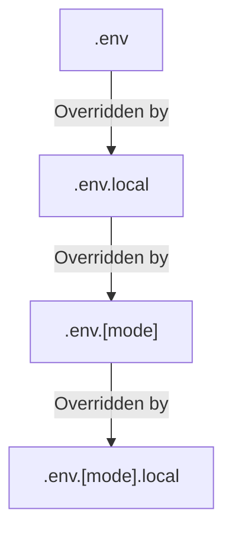

# Vue.js Environment Variables

When building a Vue.js application for deployment, you'll often need different configurations based on the environment where your application is running. Environment variables provide a way to manage these configurations securely and effectively.

## What Are Environment Variables?

Environment variables are dynamic values that can affect the way running processes behave on a computer. In web development, they allow you to:

- Store sensitive information like API keys separately from your code
- Configure different settings for development, testing, and production environments
- Change application behavior without modifying the codebase

## Why Use Environment Variables in Vue.js?

Using environment variables in your Vue.js projects offers several advantages:

1. **Security**: Keep sensitive information like API keys out of your source code
2. **Environment-specific configuration**: Maintain different settings for development, staging, and production
3. **Simplified deployment**: Deploy the same code to different environments with environment-specific configurations
4. **Better team collaboration**: Team members can have their own local configurations

## Environment Variables in Vue CLI Projects

Vue CLI provides built-in support for environment variables through `.env` files.

### Basic Setup

1. Create environment files in your project root:

```
├── .env                # loaded in all environments
├── .env.local          # loaded in all environments, ignored by git
├── .env.development    # only loaded in development environment
├── .env.production     # only loaded in production environment
```

2. Add variables to these files using the format:

```
VUE_APP_API_URL=https://api.example.com
VUE_APP_DEBUG=true
```

:::caution Important
In Vue CLI projects, only variables that begin with `VUE_APP_` will be embedded in your application bundle!
:::

### Accessing Environment Variables

You can access these variables in your Vue components:

```javascript
// Using in a component
export default {
  mounted() {
    console.log(process.env.VUE_APP_API_URL);
    console.log(process.env.VUE_APP_DEBUG);
  }
}
```

Or in your Vue templates:

```html
<template>
  <div>
    <p>API URL: {{ process.env.VUE_APP_API_URL }}</p>
    <p v-if="process.env.VUE_APP_DEBUG">Debug mode is ON</p>
  </div>
</template>
```

## Environment Variables in Vite Projects

If you're using Vite (Vue 3's recommended build tool), the process is slightly different.

### Basic Setup for Vite

1. Create `.env` files similar to Vue CLI:

```
├── .env                # loaded in all environments
├── .env.local          # loaded in all environments, ignored by git
├── .env.development    # only loaded in development environment
├── .env.production     # only loaded in production environment
```

2. Add variables with the format:

```
VITE_API_URL=https://api.example.com
VITE_DEBUG=true
```

:::caution Important
In Vite projects, only variables prefixed with `VITE_` are exposed to your client-side code!
:::

### Accessing Variables in Vite Projects

Access these variables in your components:

```javascript
// Using in a component
export default {
  mounted() {
    console.log(import.meta.env.VITE_API_URL);
    console.log(import.meta.env.VITE_DEBUG);
  }
}
```

Or in your templates:

```html
<template>
  <div>
    <p>API URL: {{ import.meta.env.VITE_API_URL }}</p>
    <p v-if="import.meta.env.VITE_DEBUG">Debug mode is ON</p>
  </div>
</template>
```

## Environment Variable Priority

The order of precedence for environment files is:



Where `[mode]` is the current environment (`development`, `production`, or `test`).

## Real-World Examples

### Configuring API Endpoints

A common use case is configuring different API endpoints for development and production:

**.env.development**
```
VUE_APP_API_URL=http://localhost:3000/api
```

**.env.production**
```
VUE_APP_API_URL=https://api.myproduct.com/v1
```

**ApiService.js**
```javascript
import axios from 'axios';

const apiClient = axios.create({
  baseURL: process.env.VUE_APP_API_URL,
  timeout: 10000,
  headers: {
    'Content-Type': 'application/json'
  }
});

export default {
  getUsers() {
    return apiClient.get('/users');
  },
  getUserById(id) {
    return apiClient.get(`/users/${id}`);
  }
  // Other API methods...
};
```

### Feature Flags

Use environment variables to enable/disable features:

**.env.development**
```
VUE_APP_FEATURE_NEW_UI=true
VUE_APP_ENABLE_ANALYTICS=false
```

**.env.production**
```
VUE_APP_FEATURE_NEW_UI=false
VUE_APP_ENABLE_ANALYTICS=true
```

**App.vue**
```html
<template>
  <div>
    <NewUI v-if="isNewUIEnabled" />
    <LegacyUI v-else />
    
    <analytics-tracker v-if="analyticsEnabled" />
  </div>
</template>

<script>
import NewUI from './components/NewUI.vue';
import LegacyUI from './components/LegacyUI.vue';
import AnalyticsTracker from './components/AnalyticsTracker.vue';

export default {
  components: {
    NewUI,
    LegacyUI,
    AnalyticsTracker
  },
  data() {
    return {
      isNewUIEnabled: process.env.VUE_APP_FEATURE_NEW_UI === 'true',
      analyticsEnabled: process.env.VUE_APP_ENABLE_ANALYTICS === 'true'
    }
  }
}
</script>
```

## Best Practices

1. **Never commit sensitive information**: Add `.env.local` and `.env.*.local` to your `.gitignore` file
2. **Document required variables**: Include a `.env.example` file with dummy values to document required variables
3. **Validate environment variables**: Check for required variables when your app starts
4. **Minimize client-exposed variables**: Only expose what's necessary to the client
5. **Use typed environment variables**: Convert strings to appropriate types when accessing them

Example of validating required variables:

```javascript
// src/utils/validateEnv.js
export default function validateEnv() {
  const requiredVars = ['VUE_APP_API_URL'];
  
  const missing = requiredVars.filter(
    varName => !process.env[varName]
  );
  
  if (missing.length > 0) {
    throw new Error(
      `Missing required environment variables: ${missing.join(', ')}`
    );
  }
}

// src/main.js
import validateEnv from './utils/validateEnv';

// Validate environment variables before starting app
validateEnv();

// Initialize Vue app
// ...
```

## Environment Variables in Deployment Platforms

Different deployment platforms handle environment variables differently:

### Netlify

Set environment variables in the Netlify UI under **Site settings > Build & deploy > Environment variables**

For local development with Netlify CLI, create a `.env` file and use the `-e` flag:

```bash
netlify dev -e .env.local
```

### Vercel

Set environment variables in the Vercel UI under **Project Settings > Environment Variables**

You can also set variables for different environments (production, preview, development).

### Docker

Pass environment variables when running a container:

```bash
docker run -e VUE_APP_API_URL=https://api.example.com my-vue-app
```

Or use a `docker-compose.yml` file:

```yaml
version: '3'
services:
  app:
    build: .
    environment:
      - VUE_APP_API_URL=https://api.example.com
      - VUE_APP_DEBUG=false
```

## Summary

Environment variables are essential for configuring Vue.js applications across different environments. They help keep sensitive information out of your source code and enable environment-specific configurations.

Key takeaways:
- Use `.env` files to define environment variables
- Prefix variables with `VUE_APP_` for Vue CLI projects or `VITE_` for Vite projects
- Never commit sensitive information to your code repository
- Use environment variables for API endpoints, feature flags, and other configuration settings
- Configure environment variables appropriately for your deployment platform

## Additional Resources

- [Official Vue CLI Environment Variables Documentation](https://cli.vuejs.org/guide/mode-and-env.html)
- [Vite Env Variables Documentation](https://vitejs.dev/guide/env-and-mode.html)
- [12 Factor App - Config](https://12factor.net/config) - Best practices for application configuration

## Exercises

1. Create a Vue application with different API endpoints for development and production.
2. Implement feature flags that enable/disable certain features based on the environment.
3. Set up environment-specific logging that only shows debug information in development.
4. Configure environment variables for a third-party service like Google Maps or Firebase.
5. Create a configuration validation system that checks for required environment variables at startup.