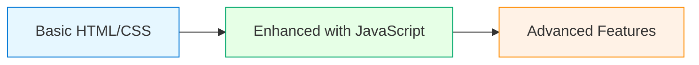

# Vue.js Progressive Enhancement

## Introduction

**Progressive enhancement** is a development philosophy that prioritizes delivering core content and functionality to all users, regardless of their browser capabilities, network conditions, or device specifications. Then, for users with more modern browsers or better conditions, the experience is progressively enhanced with advanced features.

When deploying Vue.js applications, progressive enhancement ensures that your site:

1. Works even if JavaScript fails to load or execute
2. Provides a basic experience for older browsers
3. Delivers content quickly before enhancements load
4. Improves accessibility and SEO

In this guide, we'll explore how to implement progressive enhancement strategies with Vue.js applications, making your deployed apps more resilient and accessible to all users.

## Understanding Progressive Enhancement vs. Graceful Degradation

Before diving deep, let's clarify two related concepts:



- **Progressive Enhancement**: Start with a functional basic version and add features for capable browsers
- **Graceful Degradation**: Build for modern browsers first, then ensure it "degrades gracefully" on older ones

Vue.js applications typically follow a Single-Page Application (SPA) approach, which relies heavily on JavaScript. This can pose challenges for progressive enhancement, but there are effective strategies we can employ.

## Why Progressive Enhancement Matters for Vue.js Apps

Progressive enhancement is crucial for Vue.js applications because:

- **Reliability**: Users can still access content even when JavaScript fails
- **Performance**: Core content loads quickly before JavaScript enhancements
- **Accessibility**: Screen readers and assistive technologies often work better with HTML-first approaches
- **SEO**: Search engines can more easily index content that doesn't require JavaScript

## Implementing Progressive Enhancement in Vue.js

### 1. Server-Side Rendering (SSR)

Server-Side Rendering is one of the most effective ways to implement progressive enhancement in Vue.js applications.

#### What is SSR?

SSR pre-renders your Vue application on the server before sending HTML to the client. This means users see content immediately, even before JavaScript loads.

#### Implementing SSR with Nuxt.js

[Nuxt.js](https://nuxt.com/) is a popular framework built on top of Vue that makes SSR straightforward:

```bash
# Create a new Nuxt project
npx create-nuxt-app my-progressive-vue-app
```

When configuring your Nuxt app, select "Universal" (or "SSR" in newer versions) as the rendering mode.

A simple Nuxt page component:

```html
<template>
  <div class="product-page">
    <h1>{{ product.name }}</h1>
    <p>{{ product.description }}</p>
    <button @click="addToCart">Add to Cart</button>
  </div>
</template>

<script>
export default {
  async asyncData({ params, $axios }) {
    // This runs on the server for initial render
    const product = await $axios.$get(`/api/products/${params.id}`)
    return { product }
  },
  methods: {
    addToCart() {
      // This enhancement runs only in the browser
      this.$store.commit('cart/addProduct', this.product)
      alert('Product added to cart!')
    }
  }
}
</script>
```

In this example:
- The product information is fetched and rendered on the server
- Users see content immediately
- The "Add to Cart" functionality works as an enhancement when JavaScript loads

### 2. Static Site Generation (SSG)

Static Site Generation pre-builds your entire site as static HTML files, providing the ultimate in performance and progressive enhancement.

#### Using Nuxt.js for SSG:

```bash
# In your nuxt.config.js
export default {
  target: 'static',
  // other configuration...
}
```

Then build your site:

```bash
npm run generate
```

This creates a `dist` folder with pre-rendered HTML pages that work even without JavaScript.

### 3. Critical CSS Inlining

Ensure core styles load immediately by inlining critical CSS in the `<head>` of your document:

```js
// vue.config.js
const { defineConfig } = require('@vue/cli-service')

module.exports = defineConfig({
  // other options...
  chainWebpack: (config) => {
    if (process.env.NODE_ENV === 'production') {
      config
        .plugin('html')
        .tap(args => {
          args[0].inlineSource = '.(css)$'
          return args
        })
      
      config
        .plugin('inline-source')
        .use(require('html-webpack-inline-source-plugin'))
    }
  }
})
```

### 4. Feature Detection over Browser Detection

Rather than checking browser versions, detect feature support:

```js
// Good practice - feature detection
if ('IntersectionObserver' in window) {
  // Use IntersectionObserver for lazy loading
} else {
  // Fallback to simple loading
}

// Avoid this - browser detection
if (navigator.userAgent.includes('Chrome')) {
  // Chrome-specific code
}
```

### 5. HTML-First Form Handling

Design forms to work without JavaScript first, then enhance:

```html
<template>
  <form 
    action="/api/subscribe" 
    method="POST"
    @submit.prevent="handleSubmitWithAjax">
    
    <label for="email">Email Address:</label>
    <input 
      type="email" 
      id="email" 
      name="email" 
      v-model="email" 
      required>
    
    <button type="submit">Subscribe</button>
  </form>
</template>

<script>
export default {
  data() {
    return {
      email: ''
    }
  },
  methods: {
    async handleSubmitWithAjax() {
      try {
        await this.$axios.post('/api/subscribe', {
          email: this.email
        })
        this.$toast.success('Successfully subscribed!')
      } catch (error) {
        this.$toast.error('Subscription failed')
      }
    }
  }
}
</script>
```

In this form:
- Without JavaScript, the form submits normally to `/api/subscribe`
- With JavaScript, it uses Ajax for a smoother experience

## Real-World Example: E-commerce Product Listing

Let's build a product listing page that works with and without JavaScript:

```html
<template>
  <div class="products-container">
    <noscript>
      <p class="alert">
        JavaScript is disabled. You can still browse products, but 
        some features like filtering and cart updates will be limited.
      </p>
    </noscript>
    
    <!-- Filter controls - enhanced with JS, but not critical -->
    <div class="filters">
      <label for="category-filter">Filter by category:</label>
      <select 
        id="category-filter" 
        v-model="selectedCategory"
        :disabled="!jsEnabled">
        <option value="">All Categories</option>
        <option v-for="category in categories" :key="category">
          {{ category }}
        </option>
      </select>
    </div>
    
    <!-- Core product listing - works without JS -->
    <div class="product-grid">
      <div 
        v-for="product in displayedProducts" 
        :key="product.id" 
        class="product-card">
        
        <h3>{{ product.name }}</h3>
        <p>${{ product.price.toFixed(2) }}</p>
        
        <!-- No-JS compatible add to cart with enhancement -->
        <form :action="`/api/cart/add/${product.id}`" method="POST">
          <input type="hidden" name="productId" :value="product.id">
          <button 
            type="submit" 
            @click.prevent="jsEnabled && addToCart(product)">
            Add to Cart
          </button>
        </form>
      </div>
    </div>
  </div>
</template>

<script>
export default {
  async asyncData({ $axios }) {
    // Fetch data on the server for initial render
    const products = await $axios.$get('/api/products')
    const categories = [...new Set(products.map(p => p.category))]
    
    return { 
      products,
      categories,
      originalProducts: products
    }
  },
  
  data() {
    return {
      selectedCategory: '',
      jsEnabled: false
    }
  },
  
  computed: {
    displayedProducts() {
      if (!this.selectedCategory) {
        return this.products
      }
      
      return this.products.filter(p => 
        p.category === this.selectedCategory
      )
    }
  },
  
  mounted() {
    // Now we know JS is working
    this.jsEnabled = true
    
    // Enhance with local storage cart persistence
    const savedCart = localStorage.getItem('cart')
    if (savedCart) {
      this.$store.commit('cart/setItems', JSON.parse(savedCart))
    }
  },
  
  methods: {
    async addToCart(product) {
      await this.$store.dispatch('cart/add', product)
      this.$toast.success(`Added ${product.name} to cart`)
      
      // Persist to localStorage
      const currentCart = this.$store.state.cart.items
      localStorage.setItem('cart', JSON.stringify(currentCart))
    }
  }
}
</script>
```

This example showcases several progressive enhancement techniques:
1. Core product listing works without JavaScript
2. The `<noscript>` tag informs users when JavaScript is disabled
3. Regular HTML forms work for adding to cart without JavaScript
4. With JavaScript enabled, we get enhanced filtering and cart functionality
5. The `mounted()` hook detects JavaScript and enables enhancements

## Measuring Progressive Enhancement Success

How do you know if your progressive enhancement strategy is working? Test your application in these scenarios:

1. **Disable JavaScript**: Use browser dev tools to disable JavaScript and test core functionality
2. **Throttle Network**: Simulate slow connections to verify content loads before enhancements
3. **Use Accessibility Tools**: Test with screen readers to ensure core functionality works
4. **Lighthouse**: Run audits to measure performance and accessibility

## Common Challenges and Solutions

### Challenge 1: Client-Side Routing

Vue Router depends entirely on JavaScript, breaking navigation when JS is disabled.

**Solution**: Implement server-side rendering with Nuxt.js, which supports fallback routing.

### Challenge 2: Authentication

SPAs typically handle authentication via JavaScript APIs.

**Solution**: Implement both token-based authentication for enhanced experiences and traditional cookie-based auth as a fallback:

```html
<template>
  <div>
    <form 
      action="/api/login" 
      method="POST"
      @submit.prevent="handleLogin">
      
      <input type="text" name="username" v-model="username" required>
      <input type="password" name="password" v-model="password" required>
      <button type="submit">Login</button>
    </form>
  </div>
</template>

<script>
export default {
  data() {
    return {
      username: '',
      password: ''
    }
  },
  methods: {
    async handleLogin() {
      try {
        const response = await this.$axios.post('/api/login', {
          username: this.username,
          password: this.password
        })
        
        // Store token for JavaScript-enhanced experience
        localStorage.setItem('token', response.data.token)
        this.$router.push('/dashboard')
      } catch (error) {
        alert('Login failed')
      }
    }
  }
}
</script>
```

The server should handle both API requests (returning tokens) and form submissions (setting secure cookies).

## Best Practices

1. **Start with structured HTML**: Use semantic HTML that makes sense without any CSS or JS
2. **Layer your technology**: Add CSS for presentation, then JavaScript for behavior
3. **Don't make functionality dependent on JavaScript**: Core features should work without it
4. **Use feature detection**: Test for capabilities rather than browser types
5. **Provide feedback**: Let users know when certain features aren't available
6. **Treat JavaScript as an enhancement**: Not a requirement

## Summary

Progressive enhancement in Vue.js applications ensures your deployment is resilient, accessible, and performs well across all devices and browsers. By implementing server-side rendering, static site generation, and HTML-first approaches, you can build applications that provide core functionality to everyone while enhancing the experience for users with modern browsers.

Remember this simple principle: **build from the content out**, not from the JavaScript down. Make sure your core content and functionality work without JavaScript, then progressively add enhancements.

## Additional Resources

- [Vue.js Server-Side Rendering Guide](https://vuejs.org/guide/scaling-up/ssr.html)
- [Nuxt.js Documentation](https://nuxtjs.org/docs/get-started/installation)
- [The A11Y Project](https://www.a11yproject.com/)
- [MDN Web Docs on Progressive Enhancement](https://developer.mozilla.org/en-US/docs/Glossary/Progressive_Enhancement)

## Practice Exercises

1. Take an existing Vue.js component that relies on JavaScript and modify it to work without JavaScript.
2. Implement a form in Vue.js that works with and without JavaScript enabled.
3. Create a Vue.js application with Nuxt.js using server-side rendering.
4. Implement a fallback for a JavaScript-dependent feature, such as infinite scrolling.
5. Test a Vue.js application with various network conditions to ensure it loads core content quickly.

By embracing progressive enhancement, you'll create Vue.js applications that are more resilient, accessible, and user-friendly across all platforms and conditions.