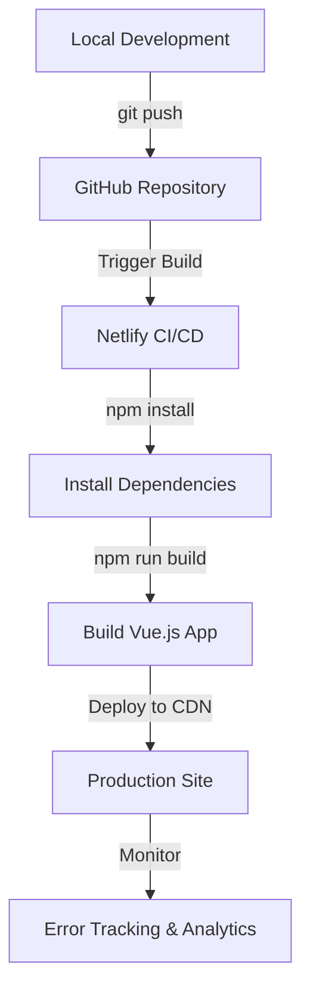

# Vue.js Deployment Checklist

Before launching your Vue.js application into the wild, it's essential to ensure everything is properly optimized and configured for production. This comprehensive checklist will guide you through the important steps to prepare your Vue.js application for deployment, ensuring optimal performance, security, and user experience.

## Introduction

Deploying a Vue.js application involves more than just transferring files to a server. Proper deployment requires attention to performance optimization, security considerations, environment configuration, and more. This checklist aims to provide a systematic approach to ensure your Vue.js application is production-ready.

## Pre-deployment Preparation

### 1. Update Dependencies

Before deploying, ensure all your dependencies are up to date and don't contain any known security vulnerabilities.

```bash
# Check for outdated packages
npm outdated

# Update packages
npm update

# Check for security vulnerabilities
npm audit

# Fix security vulnerabilities
npm audit fix
```

### 2. Environment Variables

Set up proper environment variables to handle different deployment environments (development, staging, production).

```javascript
// .env.production
VUE_APP_API_URL=https://api.production.com
VUE_APP_FEATURE_FLAG=false
```

In your Vue application, you can access these variables using:

```javascript
// Access environment variable
const apiUrl = process.env.VUE_APP_API_URL;
console.log(apiUrl); // Output: https://api.production.com
```

### 3. Remove Console Logs and Debuggers

Remove or disable console logs and debugger statements in production code:

```javascript
// vue.config.js
module.exports = {
  configureWebpack: {
    optimization: {
      minimize: true,
    },
    devtool: 'source-map',
  },
}
```

You can also use Babel plugins to automatically remove console statements:

```bash
npm install babel-plugin-transform-remove-console --save-dev
```

Then in your `.babelrc` file:

```json
{
  "env": {
    "production": {
      "plugins": ["transform-remove-console"]
    }
  }
}
```

## Build Optimization

### 1. Configure Production Build

Generate an optimized production build:

```bash
# For Vue CLI projects
npm run build

# For Vite projects
npm run build
```

### 2. Analyze Bundle Size

Identify large dependencies that might impact loading times:

```bash
# Install bundle analyzer
npm install --save-dev webpack-bundle-analyzer

# In vue.config.js
const { BundleAnalyzerPlugin } = require('webpack-bundle-analyzer');

module.exports = {
  configureWebpack: {
    plugins: [
      new BundleAnalyzerPlugin()
    ]
  }
}
```

Run your build with the analyzer:

```bash
npm run build -- --report
```

### 3. Enable Gzip/Brotli Compression

Configure your build to pre-compress assets:

```javascript
// vue.config.js
const CompressionPlugin = require('compression-webpack-plugin');

module.exports = {
  configureWebpack: {
    plugins: [
      new CompressionPlugin({
        algorithm: 'gzip',
        test: /\.(js|css|html|svg)$/,
        threshold: 10240,
        minRatio: 0.8
      })
    ]
  }
}
```

### 4. Code Splitting

Implement code splitting to reduce initial load time:

```javascript
// router.js
const routes = [
  {
    path: '/dashboard',
    name: 'Dashboard',
    // Lazy-loaded component
    component: () => import(/* webpackChunkName: "dashboard" */ './views/Dashboard.vue')
  },
  {
    path: '/settings',
    name: 'Settings',
    component: () => import(/* webpackChunkName: "settings" */ './views/Settings.vue')
  }
];
```

## Performance Optimization

### 1. Optimize Images and Assets

Compress and optimize images and other assets:

```bash
# Install image optimization plugin
npm install --save-dev image-webpack-loader

# In vue.config.js
module.exports = {
  chainWebpack: config => {
    config.module
      .rule('images')
      .use('image-webpack-loader')
      .loader('image-webpack-loader')
      .options({
        mozjpeg: { progressive: true, quality: 65 },
        optipng: { enabled: false },
        pngquant: { quality: [0.65, 0.90], speed: 4 },
        gifsicle: { interlaced: false }
      })
      .end();
  }
}
```

### 2. Implement Caching Strategies

Configure proper caching headers in your server:

```nginx
# Example Nginx configuration
location / {
  try_files $uri $uri/ /index.html;
  add_header Cache-Control "public, max-age=31536000";
}

location /index.html {
  add_header Cache-Control "no-cache";
}

location /api/ {
  proxy_pass http://backend-server;
  add_header Cache-Control "no-store";
}
```

### 3. Set Up a Service Worker

Implement PWA features with service workers:

```bash
# For Vue CLI projects
vue add pwa
```

Configure the service worker in `vue.config.js`:

```javascript
// vue.config.js
module.exports = {
  pwa: {
    workboxPluginMode: 'GenerateSW',
    workboxOptions: {
      navigateFallback: '/index.html',
      runtimeCaching: [
        {
          urlPattern: new RegExp('^https://api.example.com/'),
          handler: 'networkFirst',
          options: {
            cacheName: 'api-cache',
            expiration: {
              maxEntries: 100,
              maxAgeSeconds: 60 * 60 * 24 * 7 // 1 week
            }
          }
        }
      ]
    }
  }
}
```

## Security Measures

### 1. Content Security Policy (CSP)

Implement a Content Security Policy to protect against XSS attacks:

```html
<!-- In public/index.html -->
<meta http-equiv="Content-Security-Policy" 
      content="default-src 'self'; script-src 'self' https://trusted.cdn.com; 
              style-src 'self' https://trusted.cdn.com 'unsafe-inline';">
```

### 2. Secure Cookies

If your application uses cookies, ensure they're secured:

```javascript
// For backend cookie configuration
const cookieOptions = {
  httpOnly: true,
  secure: process.env.NODE_ENV === 'production',
  sameSite: 'strict'
};
```

### 3. Enable HTTPS

Always serve your production Vue.js application over HTTPS:

```javascript
// Example Express server configuration
const express = require('express');
const https = require('https');
const fs = require('fs');
const app = express();

app.use(express.static('dist'));

// Redirect HTTP to HTTPS
app.use((req, res, next) => {
  if (!req.secure) {
    return res.redirect(['https://', req.get('Host'), req.url].join(''));
  }
  next();
});

const httpsOptions = {
  key: fs.readFileSync('./ssl/private.key'),
  cert: fs.readFileSync('./ssl/certificate.crt')
};

https.createServer(httpsOptions, app).listen(443, () => {
  console.log('HTTPS server running on port 443');
});
```

## Deployment Configuration

### 1. Configure `vue.config.js` for Production

Adjust the configuration for production:

```javascript
// vue.config.js
module.exports = {
  publicPath: process.env.NODE_ENV === 'production' ? '/app/' : '/',
  productionSourceMap: false,
  css: {
    extract: true,
    sourceMap: false
  },
  configureWebpack: {
    // Production optimizations
    optimization: {
      splitChunks: {
        chunks: 'all',
        minSize: 30000,
        maxSize: 250000
      }
    }
  }
}
```

### 2. Set Up `robots.txt` and `sitemap.xml`

Create or update these files in your `public` directory:

```text
# public/robots.txt
User-agent: *
Allow: /
Sitemap: https://yourdomain.com/sitemap.xml
```

You can generate a sitemap.xml based on your routes or statically create one.

### 3. SPA History Mode Configuration

If using Vue Router in history mode, configure your server for SPA routing:

**For Apache (.htaccess):**

```apache
<IfModule mod_rewrite.c>
  RewriteEngine On
  RewriteBase /
  RewriteRule ^index\.html$ - [L]
  RewriteCond %{REQUEST_FILENAME} !-f
  RewriteCond %{REQUEST_FILENAME} !-d
  RewriteRule . /index.html [L]
</IfModule>
```

**For Nginx:**

```nginx
location / {
  try_files $uri $uri/ /index.html;
}
```

## Testing Before Deployment

### 1. Run Unit and E2E Tests

Execute your test suite to catch any issues:

```bash
# Run unit tests
npm run test:unit

# Run E2E tests
npm run test:e2e
```

### 2. Lighthouse Performance Testing

Run Lighthouse audits to check performance, accessibility, SEO, and best practices:

```bash
# Install Lighthouse CLI
npm install -g lighthouse

# Run Lighthouse audit
lighthouse https://your-staging-url.com --view
```

### 3. Cross-browser Testing

Test your application in different browsers to ensure compatibility.

## Real-world Deployment Example

Let's put everything together in a practical example. Here's a complete deployment workflow for a Vue.js application to Netlify:

1. First, create a `netlify.toml` file in your project root:

```toml
# netlify.toml
[build]
  publish = "dist"
  command = "npm run build"

[context.production.environment]
  VUE_APP_API_URL = "https://api.production.com"
  NODE_ENV = "production"

[[redirects]]
  from = "/*"
  to = "/index.html"
  status = 200
```

2. Set up automated deployment with GitHub:



3. Configure preview deploys for pull requests:

```yaml
# .github/workflows/preview.yml
name: Preview Deploy

on:
  pull_request:
    types: [opened, synchronize]

jobs:
  deploy-preview:
    runs-on: ubuntu-latest
    steps:
      - uses: actions/checkout@v2
      - name: Setup Node.js
        uses: actions/setup-node@v1
        with:
          node-version: '16'
      - name: Install Dependencies
        run: npm ci
      - name: Run Tests
        run: npm run test:unit
      - name: Build
        run: npm run build
      - name: Deploy Preview
        uses: netlify/actions/cli@master
        with:
          args: deploy --dir=dist --functions=functions
        env:
          NETLIFY_SITE_ID: ${{ secrets.NETLIFY_SITE_ID }}
          NETLIFY_AUTH_TOKEN: ${{ secrets.NETLIFY_AUTH_TOKEN }}
```

## Final Deployment Checklist

Here's a final checklist to review before deploying:

- [ ] Run the production build locally and test it
- [ ] Verify all environment variables are correctly set
- [ ] Check that all API endpoints use the production URLs
- [ ] Ensure there are no console.log statements or debuggers
- [ ] Validate HTML and ensure accessibility compliance
- [ ] Test site performance using Lighthouse
- [ ] Verify handling of offline scenarios if using PWA
- [ ] Test site in multiple browsers
- [ ] Validate forms and user interactions
- [ ] Check mobile responsiveness
- [ ] Set up monitoring and error tracking
- [ ] Configure proper backups
- [ ] Test rollback procedures

## Summary

Deploying a Vue.js application to production involves numerous considerations to ensure optimal performance, security, and user experience. This checklist provides a comprehensive guide to prepare your Vue.js application for deployment, covering aspects from build optimization and security measures to testing and monitoring.

By following these steps, you can significantly improve your deployment process and ensure your application runs smoothly in production. Remember that deployment is an ongoing process, and continuous monitoring and improvements are essential for maintaining a high-quality application.

## Additional Resources

- [Vue.js Official Deployment Guide](https://cli.vuejs.org/guide/deployment.html)
- [Vue.js Performance Optimization Tips](https://vuejs.org/v2/guide/performance.html)
- [Web.dev Performance Measurement](https://web.dev/measure/)
- [MDN Web Security](https://developer.mozilla.org/en-US/docs/Web/Security)
- [Google Lighthouse Documentation](https://developers.google.com/web/tools/lighthouse)

## Exercises

1. Create a simple Vue.js application and deploy it to a free hosting service like Netlify or Vercel.
2. Use the Vue CLI to generate a PWA project and optimize it based on the checklist.
3. Set up a CI/CD pipeline for your Vue.js project using GitHub Actions.
4. Run a Lighthouse audit on an existing Vue.js application and implement recommendations to improve the score.
5. Configure different environment variables for development, staging, and production environments.

Happy deploying!