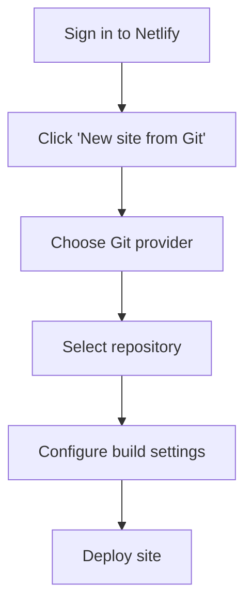
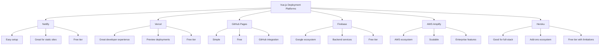

# Vue.js Deployment Platforms

When you've built your Vue.js application and are ready to share it with the world, you need to choose a deployment platform. This crucial step can sometimes be overwhelming for beginners, as there are many options available, each with its own features, complexity levels, and pricing models.

## Introduction to Deployment Platforms

Deployment platforms provide the infrastructure needed to host your Vue.js application and make it accessible on the internet. They handle aspects such as:

- Serving your static files (HTML, CSS, JavaScript)
- Providing a domain or subdomain for your application
- Ensuring high availability and reliability
- Scaling resources as your application grows
- Providing additional services like continuous integration/deployment (CI/CD)

Let's explore some of the most popular platforms for deploying Vue.js applications.

## Popular Deployment Platforms for Vue.js

### 1. Netlify

**Netlify** has become a favorite among Vue.js developers for its simplicity and powerful features.

#### Key Features:
- Continuous deployment from Git repositories
- Automatic HTTPS
- Global CDN
- Form handling
- Serverless functions
- Split testing

#### Deploying to Netlify

To deploy your Vue.js application to Netlify:

1. Create a production build of your application:

```bash
npm run build
```

2. Sign up for a Netlify account and connect it to your GitHub/GitLab/Bitbucket account.

3. Create a new site from Git:



4. Configure your build settings:

```
Build command: npm run build
Publish directory: dist
```

5. Click "Deploy site" and Netlify will handle the rest!

#### Real-World Example:

For a Vue.js e-commerce application, Netlify can be set up to automatically deploy changes whenever you push to your main branch:

```yaml
# netlify.toml configuration file
[build]
  command = "npm run build"
  publish = "dist"
  
[context.production.environment]
  VUE_APP_API_URL = "https://api.yourstore.com"
  
[context.develop.environment]
  VUE_APP_API_URL = "https://dev-api.yourstore.com"
```

### 2. Vercel

**Vercel** (formerly Zeit) is another excellent platform that's particularly well-suited for Vue.js applications.

#### Key Features:
- Optimized for frontend frameworks
- Serverless functions
- Edge network for global distribution
- Preview deployments for every push
- Custom domains and HTTPS

#### Deploying to Vercel

1. Install Vercel CLI globally:

```bash
npm i -g vercel
```

2. Navigate to your project directory and run:

```bash
vercel
```

3. Follow the prompts to configure your deployment.

4. For automatic deployments, connect your Git repository through the Vercel dashboard.

#### Real-World Example:

A Vue.js blog application with Markdown content can be deployed to Vercel with this configuration:

```json
// vercel.json
{
  "version": 2,
  "builds": [
    {
      "src": "package.json",
      "use": "@vercel/static-build",
      "config": { "distDir": "dist" }
    }
  ],
  "routes": [
    { "handle": "filesystem" },
    { "src": "/(.*)", "dest": "/index.html" }
  ]
}
```

### 3. GitHub Pages

**GitHub Pages** offers a free and straightforward way to host Vue.js applications directly from your GitHub repository.

#### Key Features:
- Free hosting
- Custom domains support
- HTTPS
- Integrated with GitHub repositories
- Simple setup

#### Deploying to GitHub Pages

1. Create a `vue.config.js` file in your project root:

```js
// vue.config.js
module.exports = {
  publicPath: process.env.NODE_ENV === 'production'
    ? '/your-repository-name/'
    : '/'
}
```

2. Create a deployment script in your package.json:

```json
{
  "scripts": {
    "deploy": "npm run build && gh-pages -d dist"
  }
}
```

3. Install the `gh-pages` package:

```bash
npm install --save-dev gh-pages
```

4. Run the deploy script:

```bash
npm run deploy
```

#### Real-World Example:

For a Vue.js portfolio site, you can use GitHub Actions to automate deployment:

```yaml
# .github/workflows/deploy.yml
name: Deploy to GitHub Pages

on:
  push:
    branches: [ main ]

jobs:
  build-and-deploy:
    runs-on: ubuntu-latest
    steps:
      - name: Checkout
        uses: actions/checkout@v2

      - name: Setup Node.js
        uses: actions/setup-node@v2
        with:
          node-version: '14'

      - name: Install and Build
        run: |
          npm install
          npm run build

      - name: Deploy
        uses: JamesIves/github-pages-deploy-action@4.1.4
        with:
          branch: gh-pages
          folder: dist
```

### 4. Firebase Hosting

**Firebase Hosting** from Google provides fast and secure hosting for your web applications.

#### Key Features:
- Global CDN
- Automatic HTTPS
- Custom domains
- Integration with other Firebase services
- Preview channels for testing

#### Deploying to Firebase Hosting

1. Install the Firebase CLI:

```bash
npm install -g firebase-tools
```

2. Login to Firebase:

```bash
firebase login
```

3. Initialize your project:

```bash
firebase init
```

4. Select "Hosting" and follow the setup instructions.

5. Build your Vue.js app:

```bash
npm run build
```

6. Deploy to Firebase:

```bash
firebase deploy
```

#### Real-World Example:

For a Vue.js social media application that uses Firebase Authentication and Firestore:

```json
// firebase.json
{
  "hosting": {
    "public": "dist",
    "ignore": [
      "firebase.json",
      "**/.*",
      "**/node_modules/**"
    ],
    "rewrites": [
      {
        "source": "**",
        "destination": "/index.html"
      }
    ],
    "headers": [
      {
        "source": "**/*.@(js|css)",
        "headers": [
          {
            "key": "Cache-Control",
            "value": "max-age=31536000"
          }
        ]
      }
    ]
  }
}
```

### 5. AWS Amplify

**AWS Amplify** provides a set of tools and services for building scalable web applications.

#### Key Features:
- Continuous deployment
- Global CDN
- Custom domains and HTTPS
- Preview environments
- Authentication and API integration
- Monitoring and analytics

#### Deploying to AWS Amplify

1. Install the AWS Amplify CLI:

```bash
npm install -g @aws-amplify/cli
```

2. Configure Amplify:

```bash
amplify configure
```

3. Initialize Amplify in your Vue.js project:

```bash
amplify init
```

4. Add hosting:

```bash
amplify add hosting
```

5. Publish your app:

```bash
amplify publish
```

#### Real-World Example:

For a Vue.js SaaS application with user authentication:

```js
// In your Vue application
import Amplify from 'aws-amplify';
import config from './aws-exports';

Amplify.configure(config);

// Now you can use Amplify services in your components
import { Auth } from 'aws-amplify';

async function signIn() {
  try {
    const user = await Auth.signIn(username, password);
    console.log('User signed in successfully!', user);
  } catch (error) {
    console.error('Error signing in:', error);
  }
}
```

### 6. Heroku

**Heroku** is a cloud platform that lets you deploy, manage, and scale applications.

#### Key Features:
- Simple deployment workflow
- Integrated CI/CD
- Add-ons ecosystem
- Good for full-stack applications
- Custom domains

#### Deploying to Heroku

For a Vue.js application, you need to add a small server to serve your static files:

1. Create a `server.js` file:

```js
// server.js
const express = require('express');
const serveStatic = require('serve-static');
const path = require('path');

const app = express();

// Serve the static files from the dist directory
app.use('/', serveStatic(path.join(__dirname, '/dist')));

// This handles SPA routing
app.get(/.*/, function (req, res) {
  res.sendFile(path.join(__dirname, '/dist/index.html'));
});

const port = process.env.PORT || 8080;
app.listen(port);
console.log(`App is listening on port: ${port}`);
```

2. Update your `package.json`:

```json
{
  "scripts": {
    "start": "node server.js",
    "postinstall": "npm run build"
  },
  "dependencies": {
    "express": "^4.17.1",
    "serve-static": "^1.14.1"
  },
  "engines": {
    "node": "14.x"
  }
}
```

3. Create a `Procfile`:

```
web: npm start
```

4. Deploy to Heroku using the Heroku CLI:

```bash
heroku create my-vue-app
git push heroku main
```

## Comparison of Deployment Platforms

To help you choose the right platform, here's a comparison of key factors:



| Platform | Ease of Use | Free Tier | CI/CD | Custom Domain | Best For |
|----------|------------|-----------|-------|--------------|----------|
| Netlify | ⭐⭐⭐⭐⭐ | Yes (generous) | Yes | Yes | Most Vue.js projects |
| Vercel | ⭐⭐⭐⭐⭐ | Yes (generous) | Yes | Yes | Frontend-focused apps |
| GitHub Pages | ⭐⭐⭐⭐ | Yes (unlimited) | Manual/GitHub Actions | Yes | Simple apps, portfolios |
| Firebase | ⭐⭐⭐⭐ | Yes (limited) | Yes | Yes | Apps using Firebase services |
| AWS Amplify | ⭐⭐⭐ | Limited | Yes | Yes | Enterprise applications |
| Heroku | ⭐⭐⭐ | Yes (with sleep) | Yes | Yes | Full-stack applications |

## Best Practices for Vue.js Deployment

Regardless of which platform you choose, follow these best practices:

### 1. Use Environment Variables

Keep your sensitive information and environment-specific configurations separate:

```js
// In your .env files
VUE_APP_API_URL=https://api.example.com
VUE_APP_DEBUG=false

// In your Vue components
const apiUrl = process.env.VUE_APP_API_URL;
```

### 2. Optimize Your Builds

Make your production builds as efficient as possible:

```js
// vue.config.js
module.exports = {
  productionSourceMap: false, // Disable source maps in production
  chainWebpack: config => {
    config.plugin('html').tap(args => {
      args[0].minify = {
        removeComments: true,
        collapseWhitespace: true,
        removeAttributeQuotes: false
      }
      return args
    })
  }
}
```

### 3. Configure Proper Routing

Ensure your Vue Router works correctly on the deployment platform:

```js
// For single-page applications
const router = new VueRouter({
  mode: 'history',
  routes: [/* your routes */]
})
```

### 4. Set Up Proper Headers

Configure cache headers for better performance:

```
// Example for Netlify (_headers file)
/assets/*
  Cache-Control: public, max-age=31536000
/*
  X-Frame-Options: DENY
  X-XSS-Protection: 1; mode=block
```

## Summary

Choosing the right deployment platform for your Vue.js application depends on your specific needs, budget, and the complexity of your project:

- **Netlify and Vercel** are excellent choices for most Vue.js projects, especially for beginners, due to their ease of use and generous free tiers.
- **GitHub Pages** is perfect for simple personal projects and portfolios.
- **Firebase** is great if you're already using other Firebase services.
- **AWS Amplify** offers powerful options for enterprise-level applications.
- **Heroku** works well for full-stack applications where you need more backend capabilities.

Start with a simpler option like Netlify or Vercel if you're new to deployment. As your project grows or your requirements become more complex, you can explore the more advanced platforms.

## Additional Resources

- [Official Vue.js Deployment Guide](https://cli.vuejs.org/guide/deployment.html)
- [Netlify Documentation for Vue.js](https://docs.netlify.com/configure-builds/common-configurations/vue/)
- [Vercel Vue.js Documentation](https://vercel.com/guides/deploying-vuejs-to-vercel)
- [Firebase Hosting Documentation](https://firebase.google.com/docs/hosting)

## Exercises

1. **Basic Deployment**: Create a simple Vue.js application and deploy it to GitHub Pages.
2. **Environment Configuration**: Set up a Vue.js application with different environment configurations for development and production, then deploy it to Netlify.
3. **CI/CD Pipeline**: Create an automated deployment workflow using GitHub Actions to deploy your Vue.js application whenever you push changes to your repository.
4. **Multi-Environment Setup**: Configure a Vue.js application with staging and production environments on Vercel, with different API endpoints for each.
5. **Performance Optimization**: Deploy your Vue.js application to your chosen platform, then use Lighthouse to identify and fix performance issues.

By mastering these deployment platforms, you'll be able to share your Vue.js creations with the world effectively and professionally.