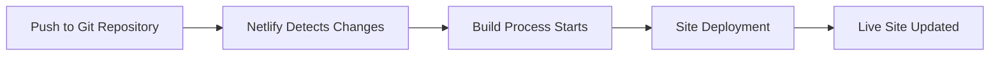

# Vue.js Netlify Deployment

## Introduction

Deploying your Vue.js applications to production is a crucial step in the development process. Netlify offers a seamless, developer-friendly platform for deploying static websites with continuous integration and deployment features. This guide will walk you through the process of deploying your Vue.js application to Netlify, from setting up your project to configuring advanced deployment options.

Netlify is particularly well-suited for Vue.js applications because:
- It's optimized for static site hosting
- It offers continuous deployment from Git repositories
- It provides built-in SSL certificates
- It includes global CDN distribution
- It supports serverless functions for backend functionality

## Prerequisites

Before we begin, make sure you have:
1. A Vue.js application ready for deployment
2. A GitHub, GitLab, or Bitbucket account with your project repository
3. A Netlify account (free tier is available)
4. Basic understanding of npm/yarn and the Vue CLI

## Setting Up Your Vue.js Project for Netlify

### Step 1: Preparing Your Project

Before deploying to Netlify, we should ensure our Vue.js project is properly configured:

1. **Add a `netlify.toml` configuration file** in your project root:

```toml
[build]
  publish = "dist"
  command = "npm run build"

[[redirects]]
  from = "/*"
  to = "/index.html"
  status = 200
```

This file tells Netlify how to build your project and configures the redirect rule necessary for single-page applications (SPAs).

2. **Ensure your Vue project has a proper build script** in `package.json`:

```json
{
  "scripts": {
    "serve": "vue-cli-service serve",
    "build": "vue-cli-service build",
    "lint": "vue-cli-service lint"
  }
}
```

### Step 2: Environment Variables

If your application uses environment variables, you'll need to handle them carefully:

1. Create a `.env` file for local development:

```
VUE_APP_API_URL=https://api.example.com
VUE_APP_FEATURE_FLAG=true
```

> **Note:** Never commit sensitive environment variables to your repository. Use `.gitignore` to exclude `.env` files.

2. You'll set these variables in Netlify later during the deployment setup.

## Deploying to Netlify

### Method 1: Deploying via the Netlify UI

This is the most straightforward approach for beginners:

1. **Log in to Netlify** and go to your dashboard
2. **Click "New site from Git"**
3. **Select your Git provider** (GitHub, GitLab, or Bitbucket)
4. **Authorize Netlify** to access your repositories
5. **Select your Vue.js project repository**
6. Configure build settings:
   - **Build command**: `npm run build` (or `yarn build`)
   - **Publish directory**: `dist`
7. **Click "Deploy site"**

That's it! Netlify will now build and deploy your site.

### Method 2: Deploying via the Netlify CLI

For more control, you can use the Netlify CLI:

1. **Install the Netlify CLI** globally:

```bash
npm install netlify-cli -g
```

2. **Authenticate** with your Netlify account:

```bash
netlify login
```

3. **Initialize your site** (from your project directory):

```bash
netlify init
```

4. **Deploy your site**:

```bash
netlify deploy
```

For production deployments, use:

```bash
netlify deploy --prod
```

## Configuring Advanced Netlify Features

### Continuous Deployment

One of Netlify's best features is automatic deployment when you push changes to your repository:



### Environment Variables in Netlify

To configure environment variables:

1. Go to your site dashboard in Netlify
2. Navigate to **Site settings > Build & deploy > Environment**
3. Click **Edit variables** and add your variables

For example:
- Key: `VUE_APP_API_URL`
- Value: `https://api.production.com`

### Custom Domains

To set up a custom domain:

1. Go to your site dashboard in Netlify
2. Navigate to **Domain settings**
3. Click **Add custom domain**
4. Follow the instructions to verify domain ownership

Netlify will automatically provision SSL certificates for your custom domain.

### Deploy Previews

Netlify's deploy previews allow you to preview changes before merging them to your main branch:

1. Create a pull request in your Git repository
2. Netlify automatically builds a preview of your site
3. A preview URL is added as a comment on your pull request

## Handling SPAs with Client-Side Routing

Vue Router uses client-side routing, which can cause issues with direct URL access on deployment. The `redirects` rule in your `netlify.toml` file (which we added earlier) solves this by redirecting all routes to `index.html`:

```toml
[[redirects]]
  from = "/*"
  to = "/index.html"
  status = 200
```

## Real-World Example: Deploying a Vue.js Portfolio

Let's walk through deploying a simple Vue.js portfolio site to Netlify:

1. **Project structure**:

```
my-portfolio/
├── public/
├── src/
│   ├── assets/
│   ├── components/
│   ├── views/
│   ├── router/
│   ├── App.vue
│   └── main.js
├── netlify.toml
├── package.json
└── vue.config.js
```

2. **Create `netlify.toml`**:

```toml
[build]
  publish = "dist"
  command = "npm run build"

[[redirects]]
  from = "/*"
  to = "/index.html"
  status = 200
```

3. **Build locally to test**:

```bash
npm run build
```

4. **Deploy to Netlify** using one of the methods described above

5. **Configure a custom domain** like `portfolio.yourname.com`

Within minutes, your portfolio will be live with a secure HTTPS connection and global CDN distribution.

## Troubleshooting Common Issues

### Build Failures

If your build fails on Netlify but works locally:

1. Check the build logs in the Netlify dashboard
2. Ensure Node.js version compatibility
3. Verify all dependencies are properly listed in `package.json`

To specify a Node.js version, add a `.nvmrc` file:

```
14.17.0
```

### Missing Environment Variables

If your app behaves differently on Netlify:

1. Check if all environment variables are configured
2. Remember that variables must be prefixed with `VUE_APP_` to be accessible in Vue

### 404 Errors on Page Refresh

If you get 404 errors when refreshing pages:

1. Verify your `netlify.toml` has the proper redirects configuration
2. Check that your publish directory is correctly set to `dist`

## Summary

Deploying a Vue.js application to Netlify provides a robust, developer-friendly workflow with powerful features like continuous deployment, custom domains, and SSL certificates. 

In this guide, we've covered:
- Setting up your Vue.js project for Netlify
- Deploying through the UI and CLI
- Configuring environment variables
- Setting up custom domains
- Handling SPA routing challenges
- Troubleshooting common deployment issues

With these steps, you can confidently deploy your Vue.js applications to production using Netlify's powerful platform.

## Additional Resources

- [Netlify Documentation](https://docs.netlify.com/)
- [Vue.js Deployment Guide](https://cli.vuejs.org/guide/deployment.html)
- [Netlify Functions for Serverless Backend](https://docs.netlify.com/functions/overview/)

## Practice Exercises

1. Deploy a simple Vue.js Todo app to Netlify
2. Set up environment variables for development and production environments
3. Configure a custom domain for your deployed application
4. Set up a contact form using Netlify Forms
5. Implement deploy previews for your team's pull request workflow

By mastering Netlify deployment for your Vue.js applications, you'll streamline your development workflow and ensure your projects are delivered efficiently and professionally.