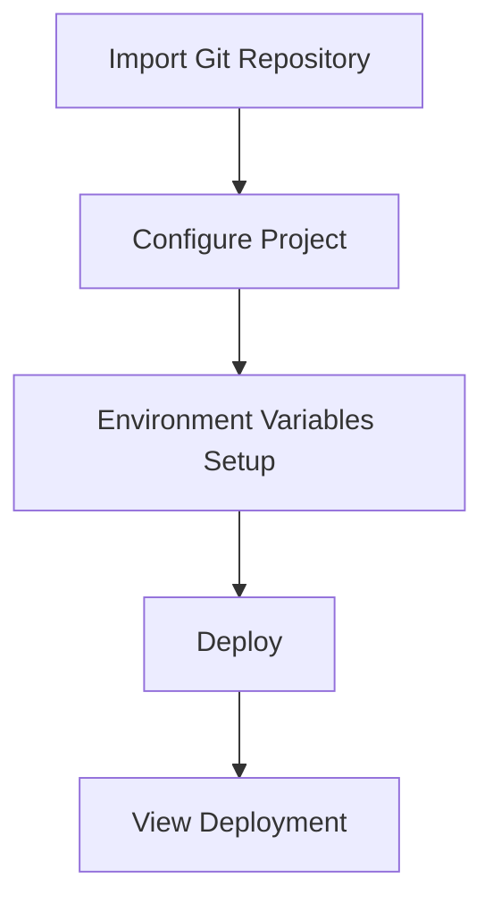

# Vue.js Vercel Deployment

## Introduction

Deploying your Vue.js application is an essential step in making your project accessible to users worldwide. [Vercel](https://vercel.com) has emerged as one of the most developer-friendly platforms for deploying frontend applications, offering a seamless experience particularly well-suited for Vue.js projects. In this guide, we'll walk through the process of deploying your Vue.js application to Vercel, from initial setup to continuous deployment.

## What is Vercel?

Vercel is a cloud platform designed for frontend frameworks and static sites, providing:

- Global CDN for lightning-fast content delivery
- Automatic HTTPS
- Continuous deployment from Git repositories
- Preview deployments for pull requests
- Serverless functions
- Zero configuration required for many frameworks, including Vue.js

## Prerequisites

Before starting the deployment process, make sure you have:

1. A working Vue.js application
2. A GitHub, GitLab, or Bitbucket account with your project repository
3. A Vercel account (you can sign up for free at [vercel.com](https://vercel.com))

## Step-by-Step Deployment Guide

### 1. Prepare Your Vue.js Project

Ensure your Vue.js project is properly configured for production deployment. Your `package.json` file should have a build script that generates static files:

```json
{
  "scripts": {
    "dev": "vite",
    "build": "vite build",
    "preview": "vite preview"
  }
}
```

### 2. Create a Vercel Configuration File (Optional)

While Vercel works with Vue.js out of the box, you can customize your deployment by creating a `vercel.json` file in the root of your project:

```json
{
  "framework": "vue",
  "buildCommand": "npm run build",
  "outputDirectory": "dist",
  "routes": [
    { "handle": "filesystem" },
    { "src": "/(.*)", "dest": "/index.html" }
  ]
}
```

This configuration:
- Specifies the framework (Vue.js)
- Defines the build command
- Sets the output directory
- Configures routing for a single-page application (SPA)

### 3. Deploying to Vercel

#### Option 1: Deploy from the Vercel Dashboard

1. Log in to your Vercel account
2. Click "New Project" on the dashboard
3. Import your Git repository (GitHub, GitLab, or Bitbucket)
4. Select your Vue.js project from the list
5. Configure your project:



6. Vercel will automatically detect that your project is a Vue.js application
7. Click "Deploy" and Vercel will build and deploy your application

#### Option 2: Deploy with Vercel CLI

1. Install the Vercel CLI:

```bash
npm install -g vercel
```

2. Log in to your Vercel account:

```bash
vercel login
```

3. Navigate to your project directory and deploy:

```bash
cd your-vue-project
vercel
```

4. Follow the interactive prompts:

```
? Set up and deploy "~/your-vue-project"? [Y/n] y
? Which scope do you want to deploy to? your-username
? Link to existing project? [y/N] n
? What's your project's name? your-vue-project
? In which directory is your code located? ./
? Want to override the settings? [y/N] n
```

5. The CLI will deploy your application and provide a URL when complete.

### 4. Viewing Your Deployed Application

After successful deployment, Vercel will provide you with:

- A production URL (typically `https://your-project-name.vercel.app`)
- A dashboard with deployment information
- Performance analytics
- Logs for debugging

Example output:

```
✅ Production: https://your-vue-project.vercel.app [copied to clipboard]
```

## Environment Variables

For applications that need environment variables, Vercel provides an easy way to manage them:

1. In the Vercel dashboard, go to your project settings
2. Select the "Environment Variables" tab
3. Add your variables specifying which environments they apply to (Production, Preview, Development)

For Vue.js applications, remember that client-side environment variables must be prefixed with `VITE_` to be exposed to your code:

```
VITE_API_URL=https://api.example.com
VITE_APP_TITLE=My Vue App
```

Access these variables in your Vue code:

```javascript
console.log(import.meta.env.VITE_API_URL);  // https://api.example.com
```

## Setting Up Continuous Deployment

One of Vercel's most powerful features is continuous deployment from Git. Once your project is connected:

1. Every push to your main/master branch triggers a production deployment
2. Every pull request creates a preview deployment
3. Comments and status checks are added to your pull requests

To customize this behavior, you can add a `.github/workflows` directory with custom GitHub Actions or modify your `vercel.json` file.

## Domain Configuration

To use a custom domain with your Vue.js application:

1. In the Vercel dashboard, go to your project settings
2. Click on "Domains"
3. Add your domain and follow the instructions to configure DNS

Vercel will automatically provision SSL certificates for your custom domains.

## Real-World Example: Deploying a Vue.js E-commerce Application

Let's walk through deploying a Vue.js e-commerce application that includes:

1. Vue Router for navigation
2. Vuex for state management
3. API calls to a backend service

### Project Structure

```
ecommerce-app/
├── public/
├── src/
│   ├── assets/
│   ├── components/
│   ├── router/
│   ├── store/
│   ├── views/
│   ├── App.vue
│   └── main.js
├── package.json
├── vite.config.js
└── vercel.json
```

### Vercel Configuration for SPA with API Routes

```json
{
  "framework": "vue",
  "buildCommand": "npm run build",
  "outputDirectory": "dist",
  "routes": [
    { "src": "/api/.*", "dest": "/api/index.js" },
    { "handle": "filesystem" },
    { "src": "/(.*)", "dest": "/index.html" }
  ],
  "env": {
    "VITE_API_URL": "https://api.yourstore.com"
  }
}
```

### Deployment Process in Action

1. Push your code to GitHub
2. Connect your repository to Vercel
3. Configure build settings
4. Set up environment variables
5. Deploy

Vercel will automatically:
- Build your Vue application
- Optimize assets
- Deploy to its global CDN
- Provide HTTPS

Your e-commerce application is now available globally with fast load times!

## Troubleshooting Common Issues

### Build Failures

If your build fails, check:

1. Your `package.json` scripts
2. Dependencies installation
3. Vercel logs for specific error messages

### Routing Issues

For SPA routing problems:

1. Ensure your `vercel.json` has proper route configuration
2. Verify your Vue Router is using history mode

```javascript
// router/index.js
import { createRouter, createWebHistory } from 'vue-router'

const router = createRouter({
  history: createWebHistory(),
  routes: [
    // your routes
  ]
})
```

### Environment Variable Problems

If your app can't access environment variables:

1. Confirm they're prefixed with `VITE_`
2. Verify they're properly set in the Vercel dashboard
3. Restart your deployment

## Performance Optimization Tips

To get the most out of your Vercel-deployed Vue.js application:

1. **Use Code Splitting**

```javascript
// router/index.js
const About = () => import('../views/About.vue')

const routes = [
  {
    path: '/about',
    component: About
  }
]
```

2. **Enable Compression**

Vercel automatically applies compression, but ensure your assets are optimized.

3. **Leverage Serverless Functions**

For API calls, consider using Vercel Serverless Functions to avoid CORS issues:

```javascript
// api/product.js
export default function handler(req, res) {
  const { id } = req.query
  // Fetch product from database or external API
  res.status(200).json({ id, name: 'Product Name' })
}
```

## Summary

Deploying your Vue.js application to Vercel offers numerous benefits:

- Simple deployment process
- Automatic HTTPS and CDN distribution
- Seamless integration with Git workflows
- Preview deployments for testing
- Custom domain support
- Environment variable management

Following the steps in this guide, you can quickly get your Vue.js application deployed and accessible to users worldwide with minimal configuration and maximum performance.

## Additional Resources

- [Vercel Documentation for Vue.js](https://vercel.com/docs/frameworks/vue)
- [Vue.js Deployment Guide](https://vuejs.org/guide/best-practices/production-deployment.html)
- [Optimizing Vue.js Performance](https://vuejs.org/guide/best-practices/performance.html)

## Practice Exercises

1. Deploy a basic Vue.js application to Vercel and configure a custom domain
2. Set up a Vue.js project with environment variables and deploy it to different Vercel environments
3. Create a Vue.js application with API routes using Vercel Serverless Functions
4. Implement continuous deployment with preview URLs for a team project
5. Optimize your Vue.js application's loading performance and verify improvements with Vercel Analytics