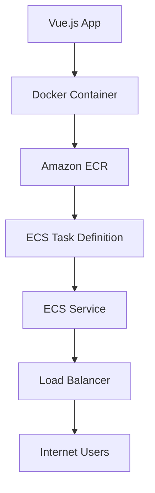

# Vue.js AWS Deployment

## Introduction

Deploying a Vue.js application to Amazon Web Services (AWS) opens up a world of possibilities for scalability, reliability, and global reach. AWS provides multiple services that can host your Vue.js applications, from simple static site hosting to complex containerized deployments.

In this guide, we'll explore how to deploy Vue.js applications to various AWS services, starting with simpler options and progressing to more advanced deployment strategies. By the end, you'll have a comprehensive understanding of how to leverage AWS's powerful infrastructure for your Vue.js projects.

## Prerequisites

Before diving into AWS deployment, ensure you have:

- A complete Vue.js application ready for deployment
- An AWS account (free tier is sufficient for learning)
- AWS CLI installed and configured on your development machine
- Basic knowledge of Vue.js and its build system
- Node.js and npm installed

## Option 1: Deploying to AWS S3 + CloudFront

### What is S3 and CloudFront?

- **S3 (Simple Storage Service)**: A highly scalable object storage service
- **CloudFront**: A fast content delivery network (CDN) service

This combination is perfect for hosting static Vue.js applications, providing global distribution and high availability.

### Step 1: Build Your Vue.js Application

First, create a production build of your Vue.js application:

```bash
# Navigate to your Vue.js project
cd my-vue-project

# Install dependencies if needed
npm install

# Build for production
npm run build
```

This will generate a `dist` folder containing your optimized application.

### Step 2: Create an S3 Bucket

1. Log in to the AWS Management Console
2. Navigate to S3 service
3. Create a new bucket:

```bash
# Alternatively, use AWS CLI
aws s3 mb s3://my-vue-app-bucket --region us-east-1
```

### Step 3: Configure S3 for Static Website Hosting

1. Select your bucket and go to the "Properties" tab
2. Find "Static website hosting" and select "Use this bucket to host a website"
3. Set "Index document" to `index.html`
4. Set "Error document" to `index.html` (for SPA routing)

Using AWS CLI:

```bash
aws s3 website s3://my-vue-app-bucket/ --index-document index.html --error-document index.html
```

### Step 4: Set Bucket Permissions

Create a bucket policy to make your content publicly accessible:

```json
{
  "Version": "2012-10-17",
  "Statement": [
    {
      "Sid": "PublicReadGetObject",
      "Effect": "Allow",
      "Principal": "*",
      "Action": "s3:GetObject",
      "Resource": "arn:aws:s3:::my-vue-app-bucket/*"
    }
  ]
}
```

Save this as `policy.json` and apply it:

```bash
aws s3api put-bucket-policy --bucket my-vue-app-bucket --policy file://policy.json
```

### Step 5: Upload Your Vue.js Application

Upload the contents of your `dist` folder to your S3 bucket:

```bash
aws s3 sync dist/ s3://my-vue-app-bucket/ --acl public-read
```

### Step 6: Set Up CloudFront (Optional but Recommended)

1. Go to CloudFront in the AWS Console
2. Create a new distribution
3. Set "Origin Domain Name" to your S3 bucket endpoint
4. Configure the following settings:
   - Redirect HTTP to HTTPS
   - Set "Default Root Object" to `index.html`
   - Set "Error Pages" to redirect to `/index.html` for error codes 403 and 404

### Step 7: Configure Vue Router for AWS Deployment

To ensure your Vue router works correctly with AWS, modify your router configuration:

```js
// src/router/index.js
import { createRouter, createWebHistory } from 'vue-router'

const router = createRouter({
  history: createWebHistory(process.env.BASE_URL),
  routes: [
    // your routes here
  ]
})

export default router
```

## Option 2: AWS Amplify Deployment

AWS Amplify provides an even simpler solution for deploying Vue.js applications with additional features like CI/CD, authentication, and backend integration.

### Step 1: Install and Configure AWS Amplify CLI

```bash
# Install Amplify CLI
npm install -g @aws-amplify/cli

# Configure Amplify
amplify configure
```

Follow the prompts to set up your AWS credentials.

### Step 2: Initialize Amplify in Your Vue.js Project

```bash
cd my-vue-project
amplify init
```

Follow the interactive setup:

```
? Enter a name for the project: myvueapp
? Enter a name for the environment: dev
? Choose your default editor: Visual Studio Code
? Choose the type of app that you're building: javascript
? What javascript framework are you using: vue
? Source Directory Path: src
? Distribution Directory Path: dist
? Build Command: npm run build
? Start Command: npm run serve
```

### Step 3: Add Hosting

```bash
amplify add hosting
```

Choose between:
- Managed hosting with Amplify Console
- Manual deployment using S3 and CloudFront

For beginners, the managed option is simpler:

```
? Select the plugin module to execute: Hosting with Amplify Console
? Choose a type: Manual deployment
```

### Step 4: Deploy Your Application

```bash
amplify publish
```

This command builds your application and deploys it to AWS.

### Step 5: Accessing Additional Features

With Amplify, you can easily add backend features:

```bash
# Add authentication
amplify add auth

# Add API (GraphQL or REST)
amplify add api

# Add storage
amplify add storage
```

After adding these features, update your Vue.js code to use them:

```js
// src/main.js
import { createApp } from 'vue'
import App from './App.vue'
import { Amplify } from 'aws-amplify'
import awsconfig from './aws-exports'

Amplify.configure(awsconfig)

createApp(App).mount('#app')
```

## Option 3: Containerized Deployment with AWS ECS/Fargate

For more complex applications, containerizing your Vue.js app with Docker and deploying to AWS ECS (Elastic Container Service) provides more flexibility.

### Step 1: Create a Dockerfile

In your Vue.js project root, create a `Dockerfile`:

```dockerfile
# Build stage
FROM node:16-alpine as build-stage
WORKDIR /app
COPY package*.json ./
RUN npm install
COPY . .
RUN npm run build

# Production stage
FROM nginx:stable-alpine as production-stage
COPY --from=build-stage /app/dist /usr/share/nginx/html
COPY nginx.conf /etc/nginx/conf.d/default.conf
EXPOSE 80
CMD ["nginx", "-g", "daemon off;"]
```

### Step 2: Create nginx.conf for SPA Routing

```nginx
server {
  listen 80;
  server_name _;

  root /usr/share/nginx/html;
  index index.html;

  location / {
    try_files $uri $uri/ /index.html;
  }
}
```

### Step 3: Build and Test Your Docker Image

```bash
docker build -t my-vue-app .
docker run -p 8080:80 my-vue-app
```

Visit `http://localhost:8080` to test your containerized Vue.js app.

### Step 4: Push to Amazon ECR

```bash
# Authenticate Docker to ECR
aws ecr get-login-password --region us-east-1 | docker login --username AWS --password-stdin YOUR_AWS_ACCOUNT_ID.dkr.ecr.us-east-1.amazonaws.com

# Create ECR repository
aws ecr create-repository --repository-name my-vue-app --region us-east-1

# Tag and push image
docker tag my-vue-app:latest YOUR_AWS_ACCOUNT_ID.dkr.ecr.us-east-1.amazonaws.com/my-vue-app:latest
docker push YOUR_AWS_ACCOUNT_ID.dkr.ecr.us-east-1.amazonaws.com/my-vue-app:latest
```

### Step 5: Create ECS Cluster and Service

You can do this through the AWS Console or with AWS CLI/CloudFormation. Here's a simplified workflow diagram:



## Best Practices for AWS Vue.js Deployments

### 1. Environment Variables

Use environment variables for different deployment environments:

```js
// vue.config.js
module.exports = {
  publicPath: process.env.NODE_ENV === 'production'
    ? '/'  // For production
    : '/', // For development
}
```

For AWS Amplify, create environment variables in the Amplify Console.

### 2. CloudFront Cache Invalidation

When deploying updates, invalidate the CloudFront cache:

```bash
aws cloudfront create-invalidation --distribution-id YOUR_DISTRIBUTION_ID --paths "/*"
```

### 3. Setup CI/CD Pipeline

Use AWS CodePipeline or GitHub Actions to automate deployments:

```yaml
# .github/workflows/deploy.yml
name: Deploy to AWS S3
on:
  push:
    branches: [ main ]
jobs:
  build-and-deploy:
    runs-on: ubuntu-latest
    steps:
    - uses: actions/checkout@v2
    - name: Setup Node.js
      uses: actions/setup-node@v2
      with:
        node-version: '16'
    - run: npm ci
    - run: npm run build
    - name: Deploy to S3
      uses: jakejarvis/s3-sync-action@master
      with:
        args: --delete
      env:
        AWS_S3_BUCKET: my-vue-app-bucket
        AWS_ACCESS_KEY_ID: ${{ secrets.AWS_ACCESS_KEY_ID }}
        AWS_SECRET_ACCESS_KEY: ${{ secrets.AWS_SECRET_ACCESS_KEY }}
        SOURCE_DIR: 'dist'
```

### 4. Monitor Your Application

Set up CloudWatch monitoring for your deployed application to track metrics and errors:

```bash
aws cloudwatch put-metric-alarm \
  --alarm-name "S3BucketAccessAlarm" \
  --alarm-description "Alarm when access to S3 bucket is denied" \
  --metric-name "4XXErrors" \
  --namespace "AWS/CloudFront" \
  --statistic "Sum" \
  --period 300 \
  --threshold 5 \
  --comparison-operator "GreaterThanThreshold" \
  --dimensions Name=DistributionId,Value=YOUR_DISTRIBUTION_ID \
  --evaluation-periods 1 \
  --alarm-actions arn:aws:sns:us-east-1:YOUR_ACCOUNT_ID:YOUR_SNS_TOPIC
```

## Common Issues and Troubleshooting

### Vue Router History Mode Issues

If you encounter routing issues after deployment, ensure you've configured both your Vue Router and AWS services correctly:

```js
// router/index.js
const router = createRouter({
  history: createWebHistory(),
  routes: [
    // Your routes here
  ]
})
```

For S3/CloudFront deployments, make sure error pages redirect to `index.html`.

### CORS Issues

If your Vue app calls APIs and encounters CORS issues, configure CORS on your API Gateway or other AWS services:

```bash
# Example for S3 CORS configuration
aws s3api put-bucket-cors --bucket my-vue-app-bucket --cors-configuration '{
  "CORSRules": [
    {
      "AllowedOrigins": ["*"],
      "AllowedHeaders": ["*"],
      "AllowedMethods": ["GET", "HEAD", "PUT", "POST", "DELETE"],
      "MaxAgeSeconds": 3000
    }
  ]
}'
```

## Summary

In this guide, we've explored several approaches to deploying Vue.js applications on AWS:

1. **S3 + CloudFront**: Simple, cost-effective for static sites
2. **AWS Amplify**: All-in-one solution with additional features
3. **ECS/Fargate**: Containerized deployment for complex applications

Each option offers different advantages depending on your project's complexity, budget, and scalability requirements. S3 with CloudFront is excellent for most static Vue.js applications, while Amplify simplifies adding backend functionality. For larger applications or microservices architectures, container-based deployments with ECS provide the most flexibility.

## Further Learning Resources

- [AWS Amplify Documentation for Vue.js](https://docs.amplify.aws/start/q/integration/vue)
- [Vue.js Deployment Best Practices](https://vuejs.org/v2/guide/deployment.html)
- [AWS S3 Static Website Hosting Documentation](https://docs.aws.amazon.com/AmazonS3/latest/dev/WebsiteHosting.html)
- [AWS CloudFront Documentation](https://docs.aws.amazon.com/cloudfront/latest/developerguide/Introduction.html)

## Exercises

1. Deploy a basic Vue.js application to S3 and access it via its website endpoint
2. Add CloudFront to your S3 deployment and configure HTTPS
3. Set up a CI/CD pipeline using GitHub Actions or AWS CodePipeline
4. Deploy a Vue.js application with Amplify and add authentication
5. Create a containerized Vue.js app and deploy it to AWS Fargate

By working through these exercises, you'll gain hands-on experience with different AWS deployment options for Vue.js applications, preparing you for real-world deployment scenarios.