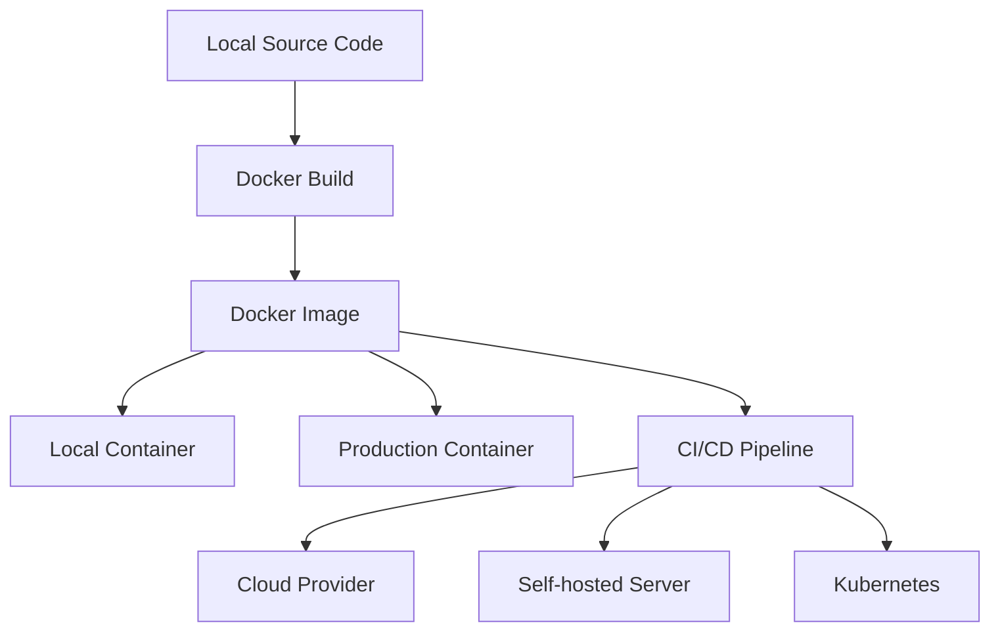

# Vue.js Docker Integration

## Introduction

Containerization has revolutionized how we build, ship, and run applications. Docker, the leading container platform, allows developers to package applications with all their dependencies into standardized units (containers) that can run consistently across different environments. This eliminates the common "it works on my machine" problem and streamlines development and deployment workflows.

In this guide, we'll explore how to integrate Docker with Vue.js applications. By the end, you'll understand how to containerize your Vue.js app, set up development and production environments, and prepare your application for deployment in container orchestration platforms.

## Why Use Docker with Vue.js?

Before diving into implementation, let's understand the benefits of Docker for Vue.js applications:

1. **Consistent environments** - Same environment across development, testing, and production
2. **Simplified onboarding** - New team members can start development with a single command
3. **Isolation** - Applications run in isolated environments with their own dependencies
4. **Scalability** - Easily scale your application in container orchestration platforms like Kubernetes
5. **CI/CD integration** - Streamlined integration with continuous integration and deployment pipelines

## Prerequisites

To follow along with this tutorial, you should have:

- Basic knowledge of Vue.js
- Basic understanding of command-line operations
- Docker installed on your system
- Node.js and npm installed (for local development)

## Creating a Vue.js Project

Let's start by creating a simple Vue.js project that we'll containerize. If you already have a Vue.js project, you can skip this step.

```bash
# Create a new Vue project
vue create vue-docker-demo

# Navigate to the project directory
cd vue-docker-demo
```

## Creating a Basic Dockerfile

A Dockerfile is a text document containing instructions to build a Docker image. Here's a basic Dockerfile for a Vue.js application:

```dockerfile
# Build stage
FROM node:16-alpine as build-stage
WORKDIR /app
COPY package*.json ./
RUN npm install
COPY . .
RUN npm run build

# Production stage
FROM nginx:stable-alpine as production-stage
COPY --from=build-stage /app/dist /usr/share/nginx/html
EXPOSE 80
CMD ["nginx", "-g", "daemon off;"]
```

Let's break down what this Dockerfile does:

1. **Build stage**:
   - Uses Node.js Alpine image for a smaller footprint
   - Sets the working directory to `/app`
   - Copies package files and installs dependencies
   - Copies the rest of the code and builds the Vue application

2. **Production stage**:
   - Uses Nginx Alpine as a lightweight web server
   - Copies the built files from the build stage to Nginx's serving directory
   - Exposes port 80 for web traffic
   - Starts Nginx in the foreground

This multi-stage build approach optimizes the final image size by excluding build tools and dependencies from the production image.

## Creating Docker-related Configuration Files

### .dockerignore

Similar to `.gitignore`, a `.dockerignore` file specifies which files should be excluded when copying files to the Docker image:

```text
node_modules
npm-debug.log
dist
.git
.gitignore
.env.local
.env.*.local
```

This prevents unnecessary files from being included in the build context, which makes building the image faster and reduces the image size.

## Building and Running the Docker Image

Now that we have our Dockerfile and configuration set up, let's build and run our Docker image:

```bash
# Build the Docker image
docker build -t vue-docker-demo .

# Run the container
docker run -it -p 8080:80 --name vue-app vue-docker-demo
```

Now you can access your Vue.js application at `http://localhost:8080`.

## Development Environment with Docker Compose

For development, you might want to use hot-reloading and other development features. Docker Compose helps us define multi-container applications and simplifies the development workflow.

Create a `docker-compose.yml` file in your project root:

```yaml
version: '3'
services:
  app:
    build: 
      context: .
      dockerfile: Dockerfile.dev
    ports:
      - "8080:8080"
    volumes:
      - .:/app
      - /app/node_modules
    environment:
      - NODE_ENV=development
```

And create a `Dockerfile.dev` for development:

```dockerfile
FROM node:16-alpine
WORKDIR /app
COPY package*.json ./
RUN npm install
COPY . .
EXPOSE 8080
CMD ["npm", "run", "serve"]
```

Now you can start your development environment with:

```bash
docker-compose up
```

This setup mounts your project directory into the container, allowing changes to be immediately reflected, while preserving the node_modules directory inside the container.

## Advanced Docker Configuration for Vue.js

### Environment Variables

To handle environment variables in your Vue.js Docker setup, you can use `.env` files and Docker's environment capabilities:

1. Create environment-specific files (`.env.development`, `.env.production`)
2. Reference them in your Vue.js application
3. Pass them during Docker build or runtime

For Vue.js, environment variables need to start with `VUE_APP_` to be accessible in the application:

```env
VUE_APP_API_URL=https://api.example.com
VUE_APP_FEATURE_FLAG=true
```

### Optimizing Docker Image Size

To keep your Docker image as small as possible:

1. Use Alpine-based images
2. Implement multi-stage builds (as we did earlier)
3. Group related RUN commands to reduce layers
4. Clean up in the same layer where installations happen

Optimized RUN command example:

```dockerfile
RUN npm install && \
    npm run build && \
    npm prune --production
```

## Real-world Example: Full-stack Vue.js Application with Docker

Let's create a more complete example of a Vue.js application with an API backend, all containerized with Docker.

### Project Structure

```
full-stack-vue-docker/
├── frontend/            # Vue.js frontend
│   ├── Dockerfile
│   ├── ...
├── backend/             # API backend (e.g., Node.js)
│   ├── Dockerfile
│   ├── ...
├── docker-compose.yml
└── README.md
```

### docker-compose.yml

```yaml
version: '3'
services:
  frontend:
    build: ./frontend
    ports:
      - "8080:80"
    depends_on:
      - backend
    environment:
      - VUE_APP_API_URL=http://localhost:3000

  backend:
    build: ./backend
    ports:
      - "3000:3000"
    environment:
      - NODE_ENV=production
      - PORT=3000
    volumes:
      - ./backend/logs:/app/logs
```

### Frontend Dockerfile

```dockerfile
# Build stage
FROM node:16-alpine as build-stage
WORKDIR /app
COPY package*.json ./
RUN npm install
COPY . .
ARG VUE_APP_API_URL
ENV VUE_APP_API_URL=$VUE_APP_API_URL
RUN npm run build

# Production stage
FROM nginx:stable-alpine as production-stage
COPY --from=build-stage /app/dist /usr/share/nginx/html
# Add nginx configuration for SPA routing
COPY nginx.conf /etc/nginx/conf.d/default.conf
EXPOSE 80
CMD ["nginx", "-g", "daemon off;"]
```

### Frontend nginx.conf for SPA Routing

```nginx
server {
    listen 80;
    server_name localhost;
    root /usr/share/nginx/html;
    index index.html;

    location / {
        try_files $uri $uri/ /index.html;
    }

    # Cache settings
    location ~* \.(js|css|png|jpg|jpeg|gif|ico)$ {
        expires 1y;
        add_header Cache-Control "public";
    }
}
```

### Running the Full-stack Application

```bash
docker-compose up -d
```

This command starts both the frontend and backend services in detached mode.

## Deploying Your Dockerized Vue.js Application

Once you've containerized your Vue.js application, you can deploy it to various environments:

### Docker Registry

Push your image to a container registry like Docker Hub:

```bash
# Tag your image
docker tag vue-docker-demo username/vue-docker-demo:latest

# Push to Docker Hub
docker push username/vue-docker-demo:latest
```

### Cloud Providers

Most cloud providers offer container hosting services:

- AWS: Elastic Container Service (ECS) or Elastic Kubernetes Service (EKS)
- Google Cloud: Cloud Run or Google Kubernetes Engine (GKE)
- Azure: Azure Container Instances or Azure Kubernetes Service (AKS)

### Continuous Deployment

Here's an example GitHub Actions workflow for building and deploying your Vue.js Docker image:

```yaml
name: Build and Deploy

on:
  push:
    branches: [ main ]

jobs:
  build-and-deploy:
    runs-on: ubuntu-latest
    steps:
      - uses: actions/checkout@v2
      
      - name: Build Docker image
        run: docker build -t ${{ secrets.DOCKER_USERNAME }}/vue-docker-demo:latest .
      
      - name: Login to Docker Hub
        uses: docker/login-action@v1
        with:
          username: ${{ secrets.DOCKER_USERNAME }}
          password: ${{ secrets.DOCKER_PASSWORD }}
      
      - name: Push Docker image
        run: docker push ${{ secrets.DOCKER_USERNAME }}/vue-docker-demo:latest
      
      # Deployment steps would go here, specific to your hosting platform
```

## Visualizing the Docker Architecture



## Troubleshooting Common Issues

### CORS Issues

When running in Docker, your frontend and backend may have different URLs, leading to CORS issues. Ensure your backend properly sets CORS headers:

```javascript
// Example in Express.js
app.use(cors({
  origin: process.env.FRONTEND_URL || 'http://localhost:8080',
  credentials: true
}));
```

### Volume Permission Issues

You might encounter permission issues with Docker volumes. To fix this:

```bash
# Run the container with your user ID
docker run -u $(id -u):$(id -g) -v $(pwd):/app vue-docker-demo
```

### Container Doesn't Reflect Source Changes

If your container doesn't reflect source code changes, ensure your volumes are correctly mounted and you're not using a cached image:

```bash
# Rebuild without cache
docker-compose build --no-cache

# Start fresh
docker-compose down && docker-compose up
```

## Summary

In this guide, we've covered:

1. Why Docker is beneficial for Vue.js applications
2. Setting up a basic Dockerfile for Vue.js
3. Creating development environments with Docker Compose
4. Advanced Docker configurations and optimizations
5. Real-world examples with full-stack applications
6. Deployment strategies for containerized Vue.js apps
7. Troubleshooting common Docker integration issues

Docker integration brings consistency, reliability, and scalability to your Vue.js applications. By containerizing your applications, you simplify deployment processes and enable your team to work with identical environments across development, testing, and production.

## Additional Resources and Exercises

### Resources

- [Official Vue.js Documentation](https://vuejs.org/guide/deployment.html)
- [Docker Documentation](https://docs.docker.com/)
- [Nginx Configuration for Vue Router](https://router.vuejs.org/guide/essentials/history-mode.html#example-server-configurations)

### Exercises

1. **Basic**: Containerize an existing Vue.js project using the provided Dockerfile template.

2. **Intermediate**: Create a Docker Compose setup for a Vue.js application with a mock API server (e.g., json-server).

3. **Advanced**: Set up a CI/CD pipeline using GitHub Actions that builds a Docker image for your Vue.js application and deploys it to a cloud provider of your choice.

4. **Expert**: Create a Kubernetes deployment for a production-grade Vue.js application with multiple replicas, a load balancer, and environment-specific configurations.

By following this guide and completing these exercises, you'll gain practical experience in containerizing Vue.js applications for development and production environments.