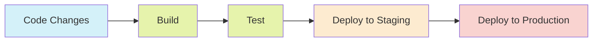

# Vue.js CI/CD Pipeline

In modern web application development, automating the build, test, and deployment processes is crucial for maintaining consistent quality and accelerating delivery. This is where Continuous Integration and Continuous Deployment (CI/CD) pipelines come into play. In this guide, we'll explore how to set up an effective CI/CD pipeline specifically for Vue.js applications.

## What is a CI/CD Pipeline?

A CI/CD pipeline automates the process of building, testing, and deploying your application. It consists of two main components:

- **Continuous Integration (CI)**: Automatically building and testing your code whenever changes are pushed to your repository
- **Continuous Deployment (CD)**: Automatically deploying your application to various environments (staging, production) after successful builds



## Why Use CI/CD for Vue.js Projects?

For Vue.js applications, a CI/CD pipeline offers several benefits:

1. **Consistent builds** - Ensures your application is built the same way every time
2. **Early detection of issues** - Catches bugs, errors, and integration problems early
3. **Automated testing** - Runs unit, integration, and end-to-end tests automatically
4. **Faster releases** - Streamlines the deployment process, enabling more frequent releases
5. **Better collaboration** - Improves team coordination with automated feedback loops

## Setting Up a Basic CI/CD Pipeline for Vue.js

Let's walk through setting up a basic CI/CD pipeline for a Vue.js project using GitHub Actions, one of the most accessible CI/CD platforms for beginners.

### Step 1: Create a GitHub Actions Workflow File

In your Vue.js project repository, create a new directory called `.github/workflows` and add a file named `vue-ci-cd.yml`:

```yaml
name: Vue.js CI/CD

on:
  push:
    branches: [ main ]
  pull_request:
    branches: [ main ]

jobs:
  build-and-test:
    runs-on: ubuntu-latest
    
    steps:
    - uses: actions/checkout@v2
    
    - name: Setup Node.js
      uses: actions/setup-node@v2
      with:
        node-version: '16'
        
    - name: Install dependencies
      run: npm ci
      
    - name: Lint
      run: npm run lint
      
    - name: Run unit tests
      run: npm run test:unit
      
    - name: Build
      run: npm run build
      
    - name: Upload build artifacts
      uses: actions/upload-artifact@v2
      with:
        name: dist
        path: dist/
```

This basic workflow will:
1. Trigger on pushes to the main branch or pull requests
2. Set up a Node.js environment
3. Install dependencies
4. Run linting checks
5. Run unit tests
6. Build the application
7. Upload the build artifacts for potential deployment

### Step 2: Add Deployment to the Pipeline

Let's expand our workflow to include deployment to a hosting provider like Netlify:

```yaml
# Add this job to the previous workflow file
  deploy:
    needs: build-and-test
    runs-on: ubuntu-latest
    if: github.ref == 'refs/heads/main'
    
    steps:
    - name: Download build artifacts
      uses: actions/download-artifact@v2
      with:
        name: dist
        path: dist
    
    - name: Deploy to Netlify
      uses: netlify/actions/cli@master
      env:
        NETLIFY_AUTH_TOKEN: ${{ secrets.NETLIFY_AUTH_TOKEN }}
        NETLIFY_SITE_ID: ${{ secrets.NETLIFY_SITE_ID }}
      with:
        args: deploy --prod --dir=dist
```

To make this work, you'll need to:
1. Create a Netlify account and set up a new site
2. Generate an access token in Netlify
3. Add the token and site ID as secrets in your GitHub repository settings

## Environment-Specific Configurations

For real-world applications, you might want to deploy to different environments (development, staging, production) with different configurations:

### Creating Environment-Specific Variables

In Vue.js, you can use `.env` files for environment variables:

```
# .env.development
VUE_APP_API_URL=https://dev-api.example.com

# .env.staging
VUE_APP_API_URL=https://staging-api.example.com

# .env.production
VUE_APP_API_URL=https://api.example.com
```

### Using These Variables in Your Pipeline

```yaml
# Example job for deploying to staging
deploy-staging:
  runs-on: ubuntu-latest
  if: github.ref == 'refs/heads/develop'
  
  steps:
  - uses: actions/checkout@v2
  
  - name: Setup Node.js
    uses: actions/setup-node@v2
    with:
      node-version: '16'
      
  - name: Install dependencies
    run: npm ci
    
  - name: Build for staging
    run: npm run build -- --mode staging
    
  - name: Deploy to staging
    # deployment steps here
```

## Adding Automated Testing

A robust CI/CD pipeline should include comprehensive testing:

### Unit Tests with Jest

Jest is commonly used for unit testing in Vue.js:

```javascript
// Example unit test for a Vue component
import { mount } from '@vue/test-utils'
import HelloWorld from '@/components/HelloWorld.vue'

describe('HelloWorld.vue', () => {
  it('renders props.msg when passed', () => {
    const msg = 'Welcome to Your Vue.js App'
    const wrapper = mount(HelloWorld, {
      props: { msg }
    })
    expect(wrapper.text()).toMatch(msg)
  })
})
```

Add this to your CI/CD workflow:

```yaml
- name: Run unit tests with coverage
  run: npm run test:unit -- --coverage
```

### End-to-End Tests with Cypress

For E2E testing, Cypress is a popular choice:

```javascript
// cypress/e2e/basic.cy.js
describe('Basic functionality', () => {
  it('visits the app and checks the title', () => {
    cy.visit('/')
    cy.contains('h1', 'Welcome to Your Vue.js App')
  })
  
  it('clicks a button and verifies the result', () => {
    cy.visit('/')
    cy.get('.action-button').click()
    cy.get('.result').should('contain', 'Button clicked!')
  })
})
```

Update your workflow to include E2E tests:

```yaml
- name: Run E2E tests
  run: npm run test:e2e -- --headless
```

## Advanced Pipeline Features

As your application grows, you might want to enhance your pipeline with:

### Caching Dependencies

```yaml
- name: Cache dependencies
  uses: actions/cache@v2
  with:
    path: ~/.npm
    key: ${{ runner.os }}-node-${{ hashFiles('**/package-lock.json') }}
    restore-keys: |
      ${{ runner.os }}-node-
```

### Parallel Jobs

```yaml
test:
  runs-on: ubuntu-latest
  strategy:
    matrix:
      test-group: [unit, e2e, integration]
  steps:
    # Run different types of tests based on matrix value
```

### Notifications

```yaml
- name: Notify on failure
  if: failure()
  uses: rtCamp/action-slack-notify@v2
  env:
    SLACK_WEBHOOK: ${{ secrets.SLACK_WEBHOOK }}
    SLACK_CHANNEL: ci-cd-alerts
    SLACK_COLOR: danger
    SLACK_MESSAGE: 'Pipeline failed for ${{ github.repository }}'
```

## Real-World Example: Multi-Environment CI/CD for Vue.js

Here's a more complete example of a production-grade CI/CD pipeline for a Vue.js application with development, staging, and production environments:

```yaml
name: Vue.js Complete CI/CD Pipeline

on:
  push:
    branches: [develop, staging, main]
  pull_request:
    branches: [develop, staging, main]

jobs:
  test:
    runs-on: ubuntu-latest
    steps:
      - uses: actions/checkout@v2
      
      - name: Setup Node.js
        uses: actions/setup-node@v2
        with:
          node-version: '16'
          
      - name: Cache dependencies
        uses: actions/cache@v2
        with:
          path: ~/.npm
          key: ${{ runner.os }}-node-${{ hashFiles('**/package-lock.json') }}
          restore-keys: |
            ${{ runner.os }}-node-
            
      - name: Install dependencies
        run: npm ci
        
      - name: Lint
        run: npm run lint
        
      - name: Unit tests
        run: npm run test:unit
  
  build:
    needs: test
    runs-on: ubuntu-latest
    strategy:
      matrix:
        environment: [development, staging, production]
        include:
          - environment: development
            branch: develop
          - environment: staging
            branch: staging
          - environment: production
            branch: main
    if: github.ref == format('refs/heads/{0}', matrix.branch)
    steps:
      - uses: actions/checkout@v2
      
      - name: Setup Node.js
        uses: actions/setup-node@v2
        with:
          node-version: '16'
          
      - name: Install dependencies
        run: npm ci
        
      - name: Build for ${{ matrix.environment }}
        run: npm run build -- --mode ${{ matrix.environment }}
        
      - name: Upload build artifacts
        uses: actions/upload-artifact@v2
        with:
          name: dist-${{ matrix.environment }}
          path: dist/
  
  deploy:
    needs: build
    runs-on: ubuntu-latest
    strategy:
      matrix:
        environment: [development, staging, production]
        include:
          - environment: development
            branch: develop
            site_id: DEV_SITE_ID
          - environment: staging
            branch: staging
            site_id: STAGING_SITE_ID
          - environment: production
            branch: main
            site_id: PROD_SITE_ID
    if: github.ref == format('refs/heads/{0}', matrix.branch)
    steps:
      - name: Download build artifacts
        uses: actions/download-artifact@v2
        with:
          name: dist-${{ matrix.environment }}
          path: dist
          
      - name: Deploy to Netlify
        uses: netlify/actions/cli@master
        env:
          NETLIFY_AUTH_TOKEN: ${{ secrets.NETLIFY_AUTH_TOKEN }}
          NETLIFY_SITE_ID: ${{ secrets.matrix.site_id }}
        with:
          args: deploy --prod --dir=dist
      
      - name: Send deployment notification
        uses: rtCamp/action-slack-notify@v2
        env:
          SLACK_WEBHOOK: ${{ secrets.SLACK_WEBHOOK }}
          SLACK_CHANNEL: deployments
          SLACK_COLOR: good
          SLACK_MESSAGE: 'Successfully deployed ${{ matrix.environment }} environment of ${{ github.repository }}'
```

## Common Challenges and Solutions

### Challenge: Large Build Artifacts
When your Vue.js applications grow, build artifacts can become large and slow down your pipeline.

**Solution**: Optimize your builds using features like:
- Code splitting
- Tree shaking
- webpack bundle analyzer to identify bloat

```javascript
// In vue.config.js
module.exports = {
  chainWebpack: config => {
    config.optimization.splitChunks({
      chunks: 'all',
      maxInitialRequests: Infinity,
      minSize: 20000,
      cacheGroups: {
        vendor: {
          test: /[\\/]node_modules[\\/]/,
          name(module) {
            const packageName = module.context.match(
              /[\\/]node_modules[\\/](.*?)([\\/]|$)/
            )[1];
            return `npm.${packageName.replace('@', '')}`;
          }
        }
      }
    });
  }
}
```

### Challenge: Environment Variables Security
Managing environment variables securely across environments can be difficult.

**Solution**: Use GitHub encrypted secrets for sensitive values:

```yaml
- name: Create .env file
  run: |
    echo "VUE_APP_API_KEY=${{ secrets.API_KEY }}" > .env.production
```

## Best Practices for Vue.js CI/CD

1. **Keep build steps consistent**: Use the same Node.js version and package manager in all environments
2. **Test thoroughly**: Include unit, integration, and E2E tests
3. **Optimize build performance**: Use caching and parallelization
4. **Secure secrets**: Never hardcode API keys or credentials
5. **Create informative notifications**: Make sure team members know when deployments happen or fail
6. **Consider progressive deployment**: Use techniques like canary releases or feature flags
7. **Monitor after deployment**: Integrate error tracking and monitoring

## Summary

Setting up a CI/CD pipeline for your Vue.js applications streamlines the process from development to deployment. By automating building, testing, and deploying your app, you can focus more on writing code and less on manual operations.

The CI/CD pipeline journey typically involves:
1. Setting up automated testing
2. Creating build workflows
3. Automating deployment to different environments
4. Adding notifications and monitoring
5. Continuously improving the pipeline itself

As your Vue.js application grows, your CI/CD pipeline will evolve alongside it, becoming an invaluable part of your development workflow.

## Additional Resources

- [Vue.js Documentation on Deployment](https://vuejs.org/v2/guide/deployment.html)
- [GitHub Actions Documentation](https://docs.github.com/en/actions)
- [Netlify Documentation](https://docs.netlify.com/)
- [Jest Testing Framework](https://jestjs.io/)
- [Cypress E2E Testing](https://www.cypress.io/)

## Exercises

1. Set up a basic CI pipeline for an existing Vue.js project using GitHub Actions that runs linting and unit tests.
2. Extend your pipeline to deploy to Netlify when tests pass successfully.
3. Create separate deployment workflows for development, staging, and production environments.
4. Add Slack or email notifications to your pipeline for successful and failed deployments.
5. Implement code coverage reporting and set a minimum coverage threshold in your pipeline.