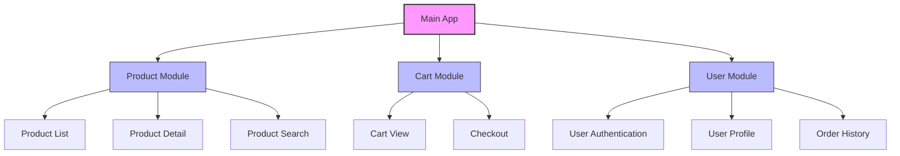

# Vue.js Scaling Strategies

## Introduction

As your Vue.js application grows from a simple prototype to a full-fledged production system, you'll face challenges related to performance, code organization, and maintenance. Scaling a Vue.js application isn't just about handling more users; it's also about managing increased complexity, keeping performance optimal, and ensuring your development team can work efficiently.

In this guide, we'll explore different strategies to scale your Vue.js applications effectively. Whether you're building a growing startup application or enterprise-level software, these approaches will help you maintain a robust, performant, and maintainable codebase.

## Why Scaling Matters

Before diving into specific strategies, let's understand why scaling considerations are important:

1. **Performance degradation**: As applications grow, they often become slower without proper optimization
2. **Development velocity**: Larger codebases can slow down developer productivity
3. **Maintenance overhead**: Complex applications become harder to debug and maintain
4. **Team collaboration**: Multiple developers need to work simultaneously without conflicts

## Component Architecture Strategies

### Component Composition

Vue's component-based architecture is your first line of defense against complexity. Breaking your UI into smaller, reusable components makes your code more maintainable.

#### Base Components

Create a set of base components that serve as building blocks:

```html
<!-- src/components/base/BaseButton.vue -->
<template>
  <button
    :class="['base-btn', `base-btn--${variant}`]"
    :disabled="disabled"
    @click="$emit('click', $event)"
  >
    <slot></slot>
  </button>
</template>

<script>
export default {
  name: 'BaseButton',
  props: {
    variant: {
      type: String,
      default: 'primary',
      validator: value => ['primary', 'secondary', 'danger'].includes(value)
    },
    disabled: {
      type: Boolean,
      default: false
    }
  }
}
</script>
```

#### Component Registration

For large applications, you can auto-register commonly used base components:

```js
// src/plugins/global-components.js
import Vue from 'vue'
import upperFirst from 'lodash/upperFirst'
import camelCase from 'lodash/camelCase'

const requireComponent = require.context(
  '@/components/base',
  false,
  /Base[A-Z]\w+\.(vue|js)$/
)

requireComponent.keys().forEach(fileName => {
  const componentConfig = requireComponent(fileName)
  const componentName = upperFirst(
    camelCase(
      fileName
        .split('/')
        .pop()
        .replace(/\.\w+$/, '')
    )
  )
  
  Vue.component(componentName, componentConfig.default || componentConfig)
})
```

Register this in your main.js file:

```js
// src/main.js
import Vue from 'vue'
import App from './App.vue'
import './plugins/global-components'

// ...rest of your initialization code

new Vue({
  render: h => h(App)
}).$mount('#app')
```

### Component Communication Patterns

As your application grows, managing component communication becomes crucial. Choose the right pattern for each situation:

1. **Props and events** for parent-child communication
2. **Event bus** for simple cross-component communication
3. **Vuex** for complex state management (more on this later)

## Code Organization Strategies

### Feature-Based Structure

Instead of organizing by file type (components, views, store), organize by feature or domain:

```
src/
├── assets/
├── core/              # Core functionality used across features
│   ├── components/
│   ├── directives/
│   └── utils/
├── features/
│   ├── authentication/
│   │   ├── components/
│   │   ├── store/
│   │   ├── services/
│   │   └── routes.js
│   ├── products/
│   │   ├── components/
│   │   ├── store/
│   │   ├── services/
│   │   └── routes.js
│   └── user-profile/
│       ├── components/
│       ├── store/
│       ├── services/
│       └── routes.js
└── main.js
```

This approach:
- Makes it easier to locate related code
- Improves code reusability
- Makes features more self-contained
- Simplifies onboarding for new developers

### Module Federation with Vue 3

For very large applications, you can implement micro-frontends using Webpack 5's Module Federation:

```js
// webpack.config.js
const { VueLoaderPlugin } = require('vue-loader');
const ModuleFederationPlugin = require('webpack/lib/container/ModuleFederationPlugin');

module.exports = {
  // ... other webpack config
  plugins: [
    new ModuleFederationPlugin({
      name: 'productApp',
      filename: 'remoteEntry.js',
      exposes: {
        './ProductList': './src/features/products/components/ProductList.vue',
        './ProductDetails': './src/features/products/components/ProductDetails.vue',
      },
      shared: ['vue', 'vuex', 'vue-router'],
    }),
    new VueLoaderPlugin(),
  ],
};
```

This allows different teams to work on separate parts of the application that can be developed, tested, and deployed independently.

## State Management Scaling

### Vuex for Complex State

For applications with complex state, Vuex provides a predictable state management pattern:

```js
// store/index.js
import Vue from 'vue'
import Vuex from 'vuex'

Vue.use(Vuex)

export default new Vuex.Store({
  state: {
    user: null,
    isAuthenticated: false
  },
  getters: {
    username: state => state.user ? state.user.name : 'Guest'
  },
  mutations: {
    SET_USER(state, user) {
      state.user = user
      state.isAuthenticated = Boolean(user)
    }
  },
  actions: {
    async login({ commit }, credentials) {
      try {
        const user = await authService.login(credentials)
        commit('SET_USER', user)
        return user
      } catch (error) {
        console.error('Login failed:', error)
        throw error
      }
    },
    logout({ commit }) {
      authService.logout()
      commit('SET_USER', null)
    }
  }
})
```

### Modularized Vuex Store

For large applications, break down your Vuex store into modules:

```js
// store/index.js
import Vue from 'vue'
import Vuex from 'vuex'
import auth from './modules/auth'
import products from './modules/products'
import cart from './modules/cart'

Vue.use(Vuex)

export default new Vuex.Store({
  modules: {
    auth,
    products,
    cart
  }
})

// store/modules/auth.js
export default {
  namespaced: true,
  state: {
    user: null,
    isAuthenticated: false
  },
  // mutations, actions, getters...
}
```

Access this in components like:

```html
<script>
export default {
  computed: {
    username() {
      return this.$store.getters['auth/username']
    }
  },
  methods: {
    login() {
      this.$store.dispatch('auth/login', this.credentials)
    }
  }
}
</script>
```

## Performance Optimization Strategies

### Code Splitting

Leveraging Vue Router's dynamic imports to split your application code:

```js
// router/index.js
import Vue from 'vue'
import VueRouter from 'vue-router'

Vue.use(VueRouter)

const router = new VueRouter({
  mode: 'history',
  routes: [
    {
      path: '/',
      name: 'Home',
      component: () => import(/* webpackChunkName: "home" */ '../views/Home.vue')
    },
    {
      path: '/products',
      name: 'Products',
      component: () => import(/* webpackChunkName: "products" */ '../views/Products.vue')
    },
    {
      path: '/profile',
      name: 'UserProfile',
      component: () => import(/* webpackChunkName: "profile" */ '../views/UserProfile.vue'),
      meta: { requiresAuth: true }
    }
  ]
})

export default router
```

### Lazy Loading Components

For components that aren't immediately visible (like tabs, modals, etc.):

```html
<template>
  <div>
    <h1>User Dashboard</h1>
    <button @click="showStats = true">Show Statistics</button>
    
    <component v-if="showStats" :is="StatisticsComponent" />
  </div>
</template>

<script>
export default {
  data() {
    return {
      showStats: false,
      StatisticsComponent: null
    }
  },
  watch: {
    showStats(newValue) {
      if (newValue && !this.StatisticsComponent) {
        import(/* webpackChunkName: "stats" */ '../components/Statistics.vue')
          .then(module => {
            this.StatisticsComponent = module.default
          })
      }
    }
  }
}
</script>
```

### Virtual Scrolling

For long lists, implement virtual scrolling to render only visible items:

```html
<template>
  <vue-virtual-scroller
    class="scroller"
    :items="items"
    :item-height="50"
  >
    <template v-slot="{ item, index }">
      <div class="product-item">
        {{ item.name }} - ${{ item.price }}
      </div>
    </template>
  </vue-virtual-scroller>
</template>

<script>
import { VirtualScroller } from 'vue-virtual-scroller'
import 'vue-virtual-scroller/dist/vue-virtual-scroller.css'

export default {
  components: {
    VirtualScroller
  },
  data() {
    return {
      items: Array.from({ length: 10000 }, (_, i) => ({
        id: i,
        name: `Product ${i}`,
        price: (Math.random() * 100).toFixed(2)
      }))
    }
  }
}
</script>
```

## Deployment and Infrastructure Scaling

### Server-Side Rendering (SSR)

For SEO-sensitive applications or to improve load time, implement Server-Side Rendering with Nuxt.js:

```js
// nuxt.config.js
export default {
  // Server-side rendering mode
  ssr: true,
  
  // Target (default is 'server')
  target: 'server',
  
  // Other configuration...
  head: {
    title: 'My Vue Application',
    meta: [
      { charset: 'utf-8' },
      { name: 'viewport', content: 'width=device-width, initial-scale=1' }
    ]
  },
  
  // Auto-import components
  components: true
}
```

### Static Site Generation

For content-heavy sites that don't need real-time data:

```js
// nuxt.config.js for static generation
export default {
  // Static site generation
  target: 'static',
  
  // Generate routes dynamically
  generate: {
    async routes() {
      const { data } = await axios.get('https://my-api.com/products')
      return data.map(product => `/product/${product.id}`)
    }
  }
}
```

### CDN and Edge Caching

Configure your Vue application to work well with CDNs by setting proper cache headers and generating static assets with hashed filenames (Vue CLI does this by default).

For dynamic content, implement caching strategies using service workers:

```js
// vue.config.js
module.exports = {
  pwa: {
    workboxPluginMode: 'GenerateSW',
    workboxOptions: {
      runtimeCaching: [
        {
          urlPattern: new RegExp('^https://api.myapp.com/products'),
          handler: 'StaleWhileRevalidate',
          options: {
            cacheName: 'api-product-cache',
            expiration: {
              maxEntries: 100,
              maxAgeSeconds: 60 * 60 * 24 // 24 hours
            }
          }
        }
      ]
    }
  }
}
```

## Real-World Example: Scaling an E-commerce Application

Let's consolidate our strategies in a real-world e-commerce application scenario:



### Implementation Strategy

1. **Feature-based organization**:
   - Separate the app into product, cart, and user modules
   - Each module has its own components, routes, and store modules

2. **Performance optimizations**:
   - Implement virtual scrolling for product lists
   - Lazy-load product images and details
   - Use service workers to cache product data

3. **State management**:
   - Use Vuex modules for each feature area
   - Implement optimistic UI updates for cart operations

4. **Deployment strategy**:
   - Use SSR for product pages (SEO is important)
   - Implement CDN for static assets
   - Use API caching for product data

### Code Example: Product Module Structure

```
src/
├── features/
│   ├── products/
│   │   ├── components/
│   │   │   ├── ProductList.vue
│   │   │   ├── ProductCard.vue
│   │   │   ├── ProductDetail.vue
│   │   │   └── ProductFilters.vue
│   │   ├── store/
│   │   │   ├── index.js
│   │   │   ├── actions.js
│   │   │   ├── mutations.js
│   │   │   └── getters.js
│   │   ├── services/
│   │   │   └── productService.js
│   │   ├── views/
│   │   │   ├── ProductsView.vue
│   │   │   └── ProductDetailView.vue
│   │   └── routes.js
```

#### Store Module Implementation

```js
// products/store/index.js
import actions from './actions'
import mutations from './mutations'
import getters from './getters'

export default {
  namespaced: true,
  state: {
    products: [],
    filteredProducts: [],
    currentProduct: null,
    filters: {
      category: null,
      priceRange: { min: 0, max: 1000 },
      sortBy: 'popularity'
    },
    loading: false,
    error: null
  },
  actions,
  mutations,
  getters
}

// products/store/actions.js
import productService from '../services/productService'

export default {
  async fetchProducts({ commit, state }) {
    try {
      commit('SET_LOADING', true)
      const products = await productService.getProducts(state.filters)
      commit('SET_PRODUCTS', products)
      return products
    } catch (error) {
      commit('SET_ERROR', error.message)
      throw error
    } finally {
      commit('SET_LOADING', false)
    }
  },
  
  async fetchProductById({ commit }, productId) {
    try {
      commit('SET_LOADING', true)
      const product = await productService.getProductById(productId)
      commit('SET_CURRENT_PRODUCT', product)
      return product
    } catch (error) {
      commit('SET_ERROR', error.message)
      throw error
    } finally {
      commit('SET_LOADING', false)
    }
  },
  
  updateFilters({ commit, dispatch }, filters) {
    commit('SET_FILTERS', filters)
    return dispatch('fetchProducts')
  }
}
```

#### Router Configuration with Code Splitting

```js
// products/routes.js
export default [
  {
    path: '/products',
    name: 'ProductsView',
    component: () => import(/* webpackChunkName: "products" */ './views/ProductsView.vue')
  },
  {
    path: '/products/:id',
    name: 'ProductDetail',
    component: () => import(/* webpackChunkName: "product-detail" */ './views/ProductDetailView.vue'),
    props: true
  }
]

// src/router/index.js
import Vue from 'vue'
import Router from 'vue-router'
import productRoutes from '@/features/products/routes'
import cartRoutes from '@/features/cart/routes'
import userRoutes from '@/features/user/routes'

Vue.use(Router)

export default new Router({
  mode: 'history',
  routes: [
    {
      path: '/',
      name: 'Home',
      component: () => import(/* webpackChunkName: "home" */ '@/views/Home.vue')
    },
    ...productRoutes,
    ...cartRoutes,
    ...userRoutes,
    {
      path: '*',
      component: () => import(/* webpackChunkName: "not-found" */ '@/views/NotFound.vue')
    }
  ]
})
```

## Summary

Scaling a Vue.js application involves multiple complementary strategies:

1. **Architectural Strategies**
   - Component composition and reusable base components
   - Feature-based code organization
   - Module federation for micro-frontends

2. **State Management**
   - Modularized Vuex stores
   - Optimized state access patterns
   - Careful management of shared state

3. **Performance Optimizations**
   - Code splitting and lazy loading
   - Virtual scrolling for large data sets
   - Efficient component rendering

4. **Deployment Strategies**
   - Server-side rendering or static site generation
   - CDN and edge caching
   - Progressive Web App capabilities

By implementing these strategies, you can ensure your Vue.js application remains fast, maintainable, and scalable as it grows in complexity and user base.

## Additional Resources

- [Vue.js Official Scaling Up Documentation](https://vuejs.org/v2/guide/routing.html)
- [Nuxt.js for SSR and Static Site Generation](https://nuxtjs.org/)
- [Vue CLI Documentation](https://cli.vuejs.org/)
- [Vuex for Large Applications](https://vuex.vuejs.org/guide/modules.html)

## Exercises

1. **Refactor Challenge**: Take an existing Vue component and split it into smaller, reusable components.

2. **State Management**: Convert a simple application using component state to use Vuex with modules.

3. **Performance Audit**: Use the Vue DevTools and Chrome Lighthouse to identify performance issues in your Vue application.

4. **Lazy Loading**: Implement lazy loading for a route in your application and measure the impact on initial load time.

5. **Feature Organization**: Reorganize a small Vue project from a file-type based structure to a feature-based structure.