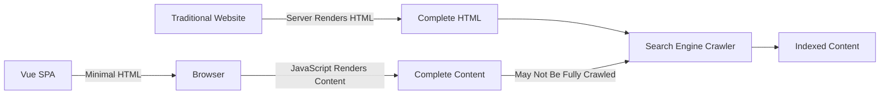

# Vue.js SEO Optimization

## Introduction

Search Engine Optimization (SEO) is crucial for any website that wants to be discoverable online. Single Page Applications (SPAs) built with frameworks like Vue.js have traditionally faced challenges with SEO because of how they render content dynamically on the client side. Search engine crawlers have historically struggled with JavaScript-heavy applications, making it difficult for Vue.js applications to rank well in search results.

In this guide, we'll explore how to optimize your Vue.js applications for search engines, ensuring that your content is properly indexed and can achieve better rankings. We'll cover both basic and advanced techniques, from meta tags to server-side rendering options.

## Why SEO Matters for Vue.js Applications

Vue.js applications are typically client-side rendered, which means:

1. The initial HTML sent to the browser is minimal
2. Content is generated dynamically when JavaScript executes
3. Search engine crawlers might not see the full content if they don't execute JavaScript

This can lead to poor indexing, resulting in lower search rankings and reduced visibility. However, with proper optimization techniques, we can overcome these challenges.



## Basic SEO Optimizations

### 1. Proper Meta Tags

Even in a Vue.js application, you should include essential meta tags in your `index.html` file:

```html
<!DOCTYPE html>
<html lang="en">
  <head>
    <meta charset="UTF-8">
    <meta name="viewport" content="width=device-width, initial-scale=1.0">
    <meta name="description" content="Your site description">
    <meta name="keywords" content="vue, javascript, your keywords">
    <title>Your Site Title</title>
    <link rel="canonical" href="https://yoursite.com/current-page" />
  </head>
  <body>
    <div id="app"></div>
  </body>
</html>
```

### 2. Dynamic Meta Tags with Vue Meta

For route-specific meta tags, you can use the `vue-meta` package to dynamically update your document head:

```bash
npm install vue-meta
```

Setup in your main.js:

```javascript
import Vue from 'vue'
import VueMeta from 'vue-meta'
import App from './App.vue'

Vue.use(VueMeta)

new Vue({
  render: h => h(App),
}).$mount('#app')
```

Then in your components:

```javascript
export default {
  metaInfo: {
    title: 'My Example Page',
    meta: [
      { name: 'description', content: 'This is the page description' },
      { property: 'og:title', content: 'My Example Page' },
      { property: 'og:description', content: 'Page description for social media' }
    ]
  },
  // rest of your component
}
```

For Vue 3, you can use `vueuse/head` instead:

```javascript
import { createApp } from 'vue'
import { createHead } from '@vueuse/head'
import App from './App.vue'

const app = createApp(App)
const head = createHead()

app.use(head)
app.mount('#app')
```

And in components:

```javascript
import { useHead } from '@vueuse/head'

export default {
  setup() {
    useHead({
      title: 'My Example Page',
      meta: [
        { name: 'description', content: 'This is the page description' },
        { property: 'og:title', content: 'My Example Page' }
      ]
    })
  }
}
```

## Advanced SEO Techniques for Vue.js

### 1. Server-Side Rendering (SSR)

Server-side rendering generates HTML on the server, providing complete page content to search engines on initial load.

#### Using Nuxt.js for SSR

[Nuxt.js](https://nuxtjs.org/) is a higher-level framework built on top of Vue that provides SSR capabilities out of the box.

Create a new Nuxt.js project:

```bash
npx create-nuxt-app my-seo-friendly-app
```

When prompted, select "Universal" or "SSR" mode.

With Nuxt.js, your page components are automatically server-rendered with proper metadata:

```javascript
// pages/about.vue
export default {
  head() {
    return {
      title: 'About Us',
      meta: [
        { hid: 'description', name: 'description', content: 'About our company' }
      ]
    }
  }
}
```

### 2. Pre-rendering / Static Site Generation

Pre-rendering generates static HTML files during build time, which is perfect for content that doesn't change frequently.

#### Using Vue CLI with prerender-spa-plugin

```bash
npm install prerender-spa-plugin --save-dev
```

Configure in vue.config.js:

```javascript
const path = require('path');
const PrerenderSpaPlugin = require('prerender-spa-plugin');

module.exports = {
  configureWebpack: {
    plugins: [
      new PrerenderSpaPlugin({
        // Required - The path to the webpack-outputted app to prerender
        staticDir: path.join(__dirname, 'dist'),
        // Required - Routes to render
        routes: ['/', '/about', '/contact'],
      }),
    ],
  },
};
```

#### Using Nuxt.js for Static Generation

Nuxt.js also supports static site generation:

```bash
# In nuxt.config.js, set target to static
export default {
  target: 'static'
}

# Generate the static site
npm run generate
```

### 3. Implementing Structured Data

Structured data helps search engines understand your content and can lead to rich results in search listings:

```javascript
// In a Vue component
export default {
  metaInfo() {
    return {
      script: [
        {
          type: 'application/ld+json',
          json: {
            '@context': 'https://schema.org',
            '@type': 'Article',
            'headline': 'My Article Title',
            'datePublished': '2023-08-15T08:00:00+08:00',
            'author': {
              '@type': 'Person',
              'name': 'Author Name'
            }
          }
        }
      ]
    }
  }
}
```

## Practical Example: Building an SEO-Friendly Blog with Vue.js

Let's create a simple blog post page that implements many of the SEO features we've discussed:

```javascript
// BlogPost.vue
<template>
  <div class="blog-post">
    <h1>{{ post.title }}</h1>
    <div class="metadata">
      <span>Author: {{ post.author }}</span>
      <span>Published: {{ formatDate(post.publishedDate) }}</span>
    </div>
    <div class="content" v-html="post.content"></div>
  </div>
</template>

<script>
export default {
  data() {
    return {
      post: {
        id: 1,
        title: 'Getting Started with Vue.js SEO',
        author: 'Jane Developer',
        publishedDate: '2023-08-15T08:00:00+08:00',
        content: '<p>This is the full content of the blog post...</p>',
        description: 'Learn the basics of optimizing your Vue.js application for search engines.'
      }
    }
  },
  
  metaInfo() {
    return {
      title: this.post.title,
      meta: [
        { name: 'description', content: this.post.description },
        { property: 'og:title', content: this.post.title },
        { property: 'og:description', content: this.post.description },
        { property: 'og:type', content: 'article' },
        { property: 'article:published_time', content: this.post.publishedDate },
        { property: 'article:author', content: this.post.author }
      ],
      script: [
        {
          type: 'application/ld+json',
          json: {
            '@context': 'https://schema.org',
            '@type': 'BlogPosting',
            'mainEntityOfPage': {
              '@type': 'WebPage',
              '@id': `https://myblog.com/posts/${this.post.id}`
            },
            'headline': this.post.title,
            'datePublished': this.post.publishedDate,
            'author': {
              '@type': 'Person',
              'name': this.post.author
            }
          }
        }
      ],
      link: [
        { rel: 'canonical', href: `https://myblog.com/posts/${this.post.id}` }
      ]
    }
  },
  
  methods: {
    formatDate(dateString) {
      return new Date(dateString).toLocaleDateString();
    }
  }
}
</script>
```

## Additional Optimization Tips

### 1. Use Semantic HTML

Semantic HTML helps search engines understand the structure of your content:

```html
<article>
  <header>
    <h1>Article Title</h1>
    <time datetime="2023-08-15">August 15, 2023</time>
  </header>
  <section>
    <p>Content goes here...</p>
  </section>
  <footer>
    <p>Author: Jane Developer</p>
  </footer>
</article>
```

### 2. Optimize Loading Speed

Speed is a ranking factor, so optimize your Vue.js application:

- Use code splitting with dynamic imports
- Implement lazy loading for images
- Enable gzip compression on your server
- Optimize asset file sizes

Example of code splitting with Vue Router:

```javascript
// router.js
const routes = [
  {
    path: '/about',
    name: 'About',
    // Lazy-loaded component
    component: () => import(/* webpackChunkName: "about" */ '../views/About.vue')
  }
]
```

### 3. Implement a Sitemap

Create a dynamic sitemap.xml file for your Vue application:

```javascript
// scripts/generate-sitemap.js
const fs = require('fs');
const path = require('path');

const baseUrl = 'https://yoursite.com';
const pages = ['/', '/about', '/contact', '/blog/1', '/blog/2'];

const sitemap = `<?xml version="1.0" encoding="UTF-8"?>
<urlset xmlns="http://www.sitemaps.org/schemas/sitemap/0.9">
  ${pages.map(page => `
    <url>
      <loc>${baseUrl}${page}</loc>
      <lastmod>${new Date().toISOString()}</lastmod>
      <changefreq>monthly</changefreq>
      <priority>0.8</priority>
    </url>
  `).join('')}
</urlset>`;

fs.writeFileSync(
  path.resolve(__dirname, '../dist/sitemap.xml'),
  sitemap
);
```

Add this script to your build process in package.json:

```json
"scripts": {
  "build": "vue-cli-service build && node scripts/generate-sitemap.js"
}
```

## Testing Your Vue.js SEO

After implementing these optimizations, make sure to test your site:

1. Use Google's Mobile-Friendly Test
2. Check with Google Search Console's URL Inspection tool
3. Test structured data with the Rich Results Test
4. Verify proper rendering with "Fetch as Google"

## Summary

SEO optimization for Vue.js applications involves several key techniques:

1. **Basic Meta Tags**: Ensure proper meta tags are set in your HTML
2. **Dynamic Meta Tags**: Use packages like `vue-meta` or `@vueuse/head` to manage route-specific metadata
3. **Server-Side Rendering**: Implement SSR for better crawlability, especially with Nuxt.js
4. **Static Site Generation**: Pre-render pages for faster loading and improved SEO
5. **Structured Data**: Implement schema.org markup for rich results
6. **Semantic HTML**: Use proper HTML elements to improve content understanding
7. **Performance Optimization**: Faster sites rank better in search results
8. **Sitemaps**: Create XML sitemaps to help search engines discover your content

By implementing these techniques, your Vue.js application can overcome the typical SEO challenges associated with SPAs and achieve better visibility in search engine results.

## Additional Resources

- [Vue.js Official SEO Guide](https://v3.vuejs.org/guide/ssr.html)
- [Nuxt.js Documentation](https://nuxtjs.org/docs/concepts/server-side-rendering)
- [Google's JavaScript SEO Basics](https://developers.google.com/search/docs/guides/javascript-seo-basics)
- [Schema.org Documentation](https://schema.org/docs/gs.html)

## Exercises

1. Implement dynamic meta tags in a simple Vue.js application using `vue-meta`.
2. Create a basic Nuxt.js project and configure proper metadata for at least three different pages.
3. Add structured data to a product page using JSON-LD format.
4. Generate a sitemap.xml file for your Vue.js application with at least 5 URLs.
5. Test your Vue.js application using Google's Mobile-Friendly Test and address any issues found.