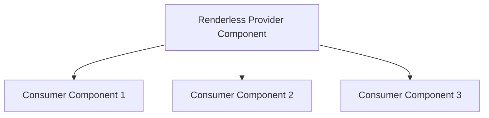

# Vue.js Renderless Components

## Introduction

Renderless components are a powerful design pattern in Vue.js that focuses on separating component logic from its visual representation. Unlike traditional components that come with both behavior and presentation, renderless components contain only behavior (logic, data fetching, state management) and delegate rendering responsibilities to the parent component.

This pattern gives you ultimate flexibility in styling and presentation while promoting code reuse at the logic level. It's part of the "logic extraction" family of patterns that makes Vue.js applications more maintainable and composable.

## Understanding the Renderless Pattern

### What Makes a Component "Renderless"?

A renderless component doesn't render any DOM elements of its own. Instead, it:

1. Manages state and behavior
2. Provides data and methods via scoped slots
3. Lets the parent component determine how to render the UI

This approach follows the principle of **separation of concerns** - separating the "how it works" from "how it looks."

### Anatomy of a Renderless Component

A basic renderless component typically:

1. Contains logic, computed properties, and methods
2. Uses the `render()` function to expose its functionality via scoped slots
3. Returns no markup of its own

## Your First Renderless Component

Let's create a simple counter component to demonstrate the pattern:

```html
<!-- CounterLogic.vue -->
<script>
export default {
  name: 'CounterLogic',
  data() {
    return {
      count: 0
    }
  },
  methods: {
    increment() {
      this.count++
    },
    decrement() {
      this.count--
    },
    reset() {
      this.count = 0
    }
  },
  render() {
    return this.$scopedSlots.default({
      count: this.count,
      increment: this.increment,
      decrement: this.decrement,
      reset: this.reset
    })
  }
}
</script>
```

Now, let's use this renderless component:

```html
<!-- Counter.vue -->
<template>
  <div>
    <CounterLogic v-slot="{ count, increment, decrement, reset }">
      <div class="counter-container">
        <h2>Count: {{ count }}</h2>
        <div class="buttons">
          <button @click="increment" class="btn btn-primary">Increment</button>
          <button @click="decrement" class="btn btn-secondary">Decrement</button>
          <button @click="reset" class="btn btn-danger">Reset</button>
        </div>
      </div>
    </CounterLogic>
  </div>
</template>

<script>
import CounterLogic from './CounterLogic.vue'

export default {
  components: {
    CounterLogic
  }
}
</script>
```

In this example, `CounterLogic` is our renderless component that manages the counter state and operations. The parent component determines the visual representation.

## Benefits of Renderless Components

1. **Reusability**: Share logic across multiple components with different visual designs
2. **Flexibility**: Complete freedom over markup and styling
3. **Separation of concerns**: Logic and presentation are cleanly separated
4. **Testability**: Logic is easier to test in isolation
5. **Composition**: Build complex components by composing simpler ones

## Advanced Renderless Patterns

### Toggle Functionality

Here's a more practical example - a toggle component that can be used for dropdowns, modals, or any toggled UI element:

```html
<!-- Toggle.vue -->
<script>
export default {
  name: 'Toggle',
  props: {
    initialState: {
      type: Boolean,
      default: false
    }
  },
  data() {
    return {
      isOpen: this.initialState
    }
  },
  methods: {
    toggle() {
      this.isOpen = !this.isOpen
    },
    close() {
      this.isOpen = false
    },
    open() {
      this.isOpen = true
    }
  },
  render() {
    return this.$scopedSlots.default({
      isOpen: this.isOpen,
      toggle: this.toggle,
      close: this.close,
      open: this.open
    })
  }
}
</script>
```

Let's use this toggle component to create a dropdown:

```html
<!-- Dropdown.vue -->
<template>
  <div class="dropdown-container">
    <Toggle v-slot="{ isOpen, toggle, close }">
      <button @click="toggle" class="dropdown-button">
        Menu {{ isOpen ? '▲' : '▼' }}
      </button>
      <ul v-if="isOpen" class="dropdown-menu">
        <li><a href="#" @click.prevent="close">Home</a></li>
        <li><a href="#" @click.prevent="close">About</a></li>
        <li><a href="#" @click.prevent="close">Contact</a></li>
      </ul>
    </Toggle>
  </div>
</template>

<script>
import Toggle from './Toggle.vue'

export default {
  components: {
    Toggle
  }
}
</script>

<style scoped>
.dropdown-container {
  position: relative;
}

.dropdown-menu {
  position: absolute;
  top: 100%;
  left: 0;
  list-style: none;
  padding: 0.5rem;
  background: white;
  border: 1px solid #ccc;
}
</style>
```

And now let's reuse the same toggle logic for a modal:

```html
<!-- Modal.vue -->
<template>
  <div>
    <Toggle v-slot="{ isOpen, open, close }">
      <button @click="open" class="btn btn-primary">Open Modal</button>
      
      <div v-if="isOpen" class="modal-backdrop" @click="close">
        <div class="modal-content" @click.stop>
          <div class="modal-header">
            <h3>Modal Title</h3>
            <button @click="close" class="close-btn">&times;</button>
          </div>
          
          <div class="modal-body">
            <p>This is modal content using the same Toggle logic!</p>
          </div>
          
          <div class="modal-footer">
            <button @click="close" class="btn">Close</button>
          </div>
        </div>
      </div>
    </Toggle>
  </div>
</template>

<script>
import Toggle from './Toggle.vue'

export default {
  components: {
    Toggle
  }
}
</script>

<style scoped>
.modal-backdrop {
  position: fixed;
  top: 0;
  left: 0;
  width: 100%;
  height: 100%;
  background: rgba(0, 0, 0, 0.5);
  display: flex;
  align-items: center;
  justify-content: center;
}

.modal-content {
  background: white;
  padding: 1rem;
  border-radius: 4px;
  min-width: 300px;
}
</style>
```

Notice how we're reusing the same `Toggle` component for two completely different UI elements!

### Async Data Fetching

Another common use case for renderless components is managing asynchronous data fetching:

```html
<!-- FetchData.vue -->
<script>
export default {
  name: 'FetchData',
  props: {
    url: {
      type: String,
      required: true
    },
    autoFetch: {
      type: Boolean,
      default: true
    }
  },
  data() {
    return {
      data: null,
      loading: false,
      error: null
    }
  },
  created() {
    if (this.autoFetch) {
      this.fetchData()
    }
  },
  methods: {
    async fetchData() {
      this.loading = true
      this.error = null
      
      try {
        const response = await fetch(this.url)
        if (!response.ok) {
          throw new Error(`HTTP error! status: ${response.status}`)
        }
        this.data = await response.json()
      } catch (e) {
        this.error = e.message
      } finally {
        this.loading = false
      }
    },
    async refetch() {
      await this.fetchData()
    }
  },
  render() {
    return this.$scopedSlots.default({
      data: this.data,
      loading: this.loading,
      error: this.error,
      refetch: this.refetch
    })
  }
}
</script>
```

Using the `FetchData` component in a user profile component:

```html
<!-- UserProfile.vue -->
<template>
  <div class="profile-container">
    <FetchData url="https://api.example.com/user/123" v-slot="{ data, loading, error, refetch }">
      <div v-if="loading" class="loading-spinner">
        Loading...
      </div>
      
      <div v-else-if="error" class="error-message">
        <p>Error: {{ error }}</p>
        <button @click="refetch" class="btn">Try Again</button>
      </div>
      
      <div v-else-if="data" class="profile">
        
        <h2>{{ data.name }}</h2>
        <p>{{ data.bio }}</p>
      </div>
    </FetchData>
  </div>
</template>

<script>
import FetchData from './FetchData.vue'

export default {
  components: {
    FetchData
  }
}
</script>
```

## Using Renderless Components with Vue 3 Composition API

In Vue 3, we can create renderless components using the Composition API for even cleaner code:

```html
<!-- CompositionToggle.vue -->
<script>
import { ref } from 'vue'

export default {
  name: 'CompositionToggle',
  props: {
    initialState: {
      type: Boolean,
      default: false
    }
  },
  setup(props) {
    const isOpen = ref(props.initialState)
    
    const toggle = () => {
      isOpen.value = !isOpen.value
    }
    
    const close = () => {
      isOpen.value = false
    }
    
    const open = () => {
      isOpen.value = true
    }
    
    return { isOpen, toggle, close, open }
  },
  render() {
    return this.$slots.default({
      isOpen: this.isOpen,
      toggle: this.toggle,
      close: this.close,
      open: this.open
    })
  }
}
</script>
```

## Design Patterns with Renderless Components

### 1. Provider Pattern

In this pattern, the renderless component provides functionality that multiple child components can consume:



### 2. Compound Components

Combine renderless components with regular components to create a compound component system with shared state:

```html
<!-- Form.vue -->
<script>
export default {
  name: 'Form',
  provide() {
    return {
      form: this
    }
  },
  data() {
    return {
      values: {},
      errors: {}
    }
  },
  methods: {
    setField(name, value) {
      this.values[name] = value
    },
    setError(name, error) {
      this.errors[name] = error
    },
    submit() {
      this.$emit('submit', this.values)
    }
  },
  render() {
    return this.$scopedSlots.default({
      values: this.values,
      errors: this.errors,
      submit: this.submit
    })
  }
}
</script>
```

```html
<!-- FormField.vue -->
<script>
export default {
  name: 'FormField',
  inject: ['form'],
  props: {
    name: {
      type: String,
      required: true
    }
  },
  computed: {
    value() {
      return this.form.values[this.name] || ''
    },
    error() {
      return this.form.errors[this.name] || null
    }
  },
  methods: {
    handleInput(event) {
      this.form.setField(this.name, event.target.value)
    }
  },
  render() {
    return this.$scopedSlots.default({
      value: this.value,
      error: this.error,
      handleInput: this.handleInput
    })
  }
}
</script>
```

Usage:

```html
<template>
  <Form v-slot="{ values, submit }">
    <form @submit.prevent="submit">
      <FormField name="username" v-slot="{ value, error, handleInput }">
        <div class="form-group">
          <label>Username</label>
          <input 
            type="text" 
            :value="value" 
            @input="handleInput" 
            class="form-control"
          />
          <p v-if="error" class="error">{{ error }}</p>
        </div>
      </FormField>
      
      <FormField name="password" v-slot="{ value, error, handleInput }">
        <div class="form-group">
          <label>Password</label>
          <input 
            type="password" 
            :value="value" 
            @input="handleInput" 
            class="form-control"
          />
          <p v-if="error" class="error">{{ error }}</p>
        </div>
      </FormField>
      
      <button type="submit">Login</button>
      <pre>{{ values }}</pre>
    </form>
  </Form>
</template>

<script>
import Form from './Form.vue'
import FormField from './FormField.vue'

export default {
  components: {
    Form,
    FormField
  }
}
</script>
```

## Best Practices for Renderless Components

1. **Keep them focused**: Each renderless component should have a single responsibility
2. **Document the API**: Clearly document the properties and methods exposed via scoped slots
3. **Consider performance**: Be cautious of excessive re-renders with complex logic
4. **Provide sensible defaults**: Make common usage patterns simple
5. **Handle edge cases**: Account for potential errors and edge cases in your component logic

## Debugging Renderless Components

Since renderless components don't produce visible output on their own, debugging them can be challenging. Here are some tips:

1. Use Vue DevTools to inspect component state
2. Add `console.log` statements in lifecycle hooks and methods
3. Make sure to handle error cases explicitly
4. Consider adding debugging props that expose internal state

## Summary

Renderless components are a powerful pattern in Vue.js that allows you to:

1. Separate logic from presentation
2. Create highly reusable component logic
3. Allow for maximum flexibility in UI design
4. Improve maintainability through separation of concerns

This pattern is especially useful when you have:
- Multiple components that share the same logic but look different
- Complex functionality that needs to be reused
- A need to give consumers maximum control over rendering

## Exercise Ideas

1. **Exercise 1**: Create a renderless `Pagination` component that handles pagination logic, while allowing the consumer to determine how pagination controls look
   
2. **Exercise 2**: Build a renderless `FormValidation` component that handles form validation logic but allows the consumer to control how validation errors are displayed

3. **Exercise 3**: Create a renderless `SortableList` component that handles sorting functionality but allows the consumer to determine how the list and sort controls look

## Additional Resources

- [Vue.js Documentation on Scoped Slots](https://vuejs.org/guide/components/slots.html#scoped-slots)
- [Component Design Patterns In Vue.js](https://www.patterns.dev/vue)
- [Advanced Vue Component Design](https://adamwathan.me/advanced-vue-component-design/)
- [Vue Composition API Documentation](https://vuejs.org/api/composition-api.html)

By mastering renderless components, you'll unlock a powerful pattern that helps build more flexible, maintainable, and composable Vue applications.