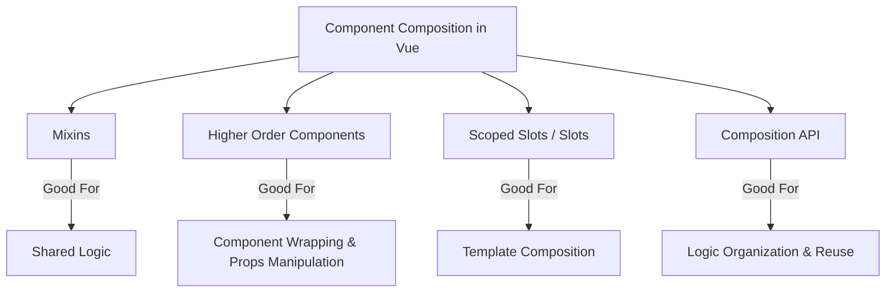

# Vue.js Higher Order Components

## Introduction

Higher Order Components (HOCs) represent an advanced pattern in Vue.js that can significantly enhance your component architecture. 

A Higher Order Component is essentially a function that takes a component as an argument and returns a new enhanced component. This pattern is borrowed from React and provides a powerful way to reuse component logic. While Vue has its own composition mechanisms like mixins and more recently the Composition API, understanding HOCs can give you another tool in your Vue.js development toolkit.

In this guide, we'll explore how HOCs work in Vue, when to use them, and how they compare to other composition patterns.

## Understanding Higher Order Components

### What is a HOC?

A Higher Order Component is a function that:

1. Takes a component as an argument
2. Returns a new component with enhanced functionality
3. Doesn't modify the original component

Let's look at the basic structure:

```js
// Basic HOC structure
const withSomething = (WrappedComponent) => {
  return {
    name: 'WithSomething',
    props: WrappedComponent.props,
    render(h) {
      return h(WrappedComponent, {
        props: this.$props,
        // Pass additional props or override existing ones
      });
    }
  }
}
```

### How HOCs Compare to Other Vue Patterns

Here's how HOCs compare to other Vue patterns:



## Creating Your First HOC

Let's create a simple HOC that adds a loading state to any component:

```js
// withLoading.js
export const withLoading = (Component) => {
  return {
    name: 'WithLoading',
    props: {
      ...Component.props,
      isLoading: {
        type: Boolean,
        default: false
      }
    },
    render(h) {
      if (this.isLoading) {
        return h('div', { class: 'loading-container' }, [
          h('span', { class: 'loading-spinner' }, 'Loading...')
        ]);
      }
      
      return h(Component, {
        props: this.$props,
        on: this.$listeners,
        scopedSlots: this.$scopedSlots,
      });
    }
  };
};
```

### Using the HOC

Now, let's use our HOC with a simple component:

```html
<template>
  <div>
    <h1>{{ title }}</h1>
    <p>{{ content }}</p>
  </div>
</template>

<script>
export default {
  name: 'ArticleComponent',
  props: {
    title: String,
    content: String
  }
}
</script>
```

To enhance this component with our loading functionality:

```js
import { withLoading } from './withLoading';
import ArticleComponent from './ArticleComponent.vue';

// Create enhanced component
const ArticleWithLoading = withLoading(ArticleComponent);

export default {
  components: {
    ArticleWithLoading
  },
  data() {
    return {
      isLoading: true,
      articleTitle: 'Vue.js HOCs',
      articleContent: 'This is an article about Higher Order Components.'
    }
  },
  mounted() {
    // Simulate loading delay
    setTimeout(() => {
      this.isLoading = false;
    }, 2000);
  },
  template: `
    <article-with-loading 
      :is-loading="isLoading"
      :title="articleTitle"
      :content="articleContent" 
    />
  `
}
```

In this example, when `isLoading` is true, the loading spinner will be displayed. Once `isLoading` becomes false, the original ArticleComponent will be rendered.

## Practical Real-World Examples

### Example 1: Authentication HOC

One common use case for HOCs is restricting access to components based on authentication:

```js
// withAuth.js
export const withAuth = (Component, redirectPath = '/login') => {
  return {
    name: 'WithAuth',
    props: Component.props,
    beforeRouteEnter(to, from, next) {
      const isAuthenticated = localStorage.getItem('auth_token');
      
      if (!isAuthenticated) {
        next(redirectPath);
      } else {
        next();
      }
    },
    render(h) {
      return h(Component, {
        props: this.$props,
        on: this.$listeners,
        scopedSlots: this.$scopedSlots,
      });
    }
  };
};
```

Usage:

```js
import { withAuth } from './withAuth';
import UserDashboard from './UserDashboard.vue';

const SecureDashboard = withAuth(UserDashboard);

export default {
  components: {
    SecureDashboard
  },
  template: '<secure-dashboard />'
}
```

### Example 2: Data Fetching HOC

Another common use case is wrapping components that need to fetch data:

```js
// withFetch.js
import axios from 'axios';

export const withFetch = (Component, fetchOptions) => {
  return {
    name: 'WithFetch',
    props: {
      ...Component.props,
      fetchUrl: {
        type: String,
        required: true
      }
    },
    data() {
      return {
        loading: true,
        error: null,
        data: null
      };
    },
    created() {
      this.fetchData();
    },
    watch: {
      fetchUrl() {
        this.fetchData();
      }
    },
    methods: {
      async fetchData() {
        this.loading = true;
        try {
          const response = await axios.get(this.fetchUrl, fetchOptions);
          this.data = response.data;
          this.error = null;
        } catch (err) {
          this.error = err.message || 'An error occurred';
          this.data = null;
        } finally {
          this.loading = false;
        }
      }
    },
    render(h) {
      return h(Component, {
        props: {
          ...this.$props,
          data: this.data,
          loading: this.loading,
          error: this.error
        },
        on: this.$listeners,
        scopedSlots: this.$scopedSlots,
      });
    }
  };
};
```

Using the data fetching HOC:

```html
<template>
  <div>
    <div v-if="loading">Loading users...</div>
    <div v-else-if="error">Error: {{ error }}</div>
    <ul v-else>
      <li v-for="user in data" :key="user.id">{{ user.name }}</li>
    </ul>
  </div>
</template>

<script>
import { withFetch } from './withFetch';

const UserList = {
  props: ['data', 'loading', 'error']
};

export default withFetch(UserList);
</script>
```

And in a parent component:

```html
<template>
  <user-list-with-fetch fetch-url="https://api.example.com/users" />
</template>

<script>
import UserListWithFetch from './UserListWithFetch.vue';

export default {
  components: { UserListWithFetch }
}
</script>
```

## Advanced HOC Techniques

### Composing Multiple HOCs

One of the powerful features of HOCs is that they can be composed together:

```js
// Compose HOCs
const enhance = compose(
  withAuth,
  withLoading,
  withFetch
);

// Usage
const EnhancedComponent = enhance(BaseComponent);

// A simple compose function
function compose(...funcs) {
  if (funcs.length === 0) return arg => arg;
  if (funcs.length === 1) return funcs[0];
  
  return funcs.reduce((a, b) => (...args) => a(b(...args)));
}
```

### HOC with Render Props

We can also create HOCs that leverage render props:

```js
// withMousePosition.js
export const withMousePosition = (Component) => {
  return {
    name: 'WithMousePosition',
    data() {
      return {
        x: 0,
        y: 0
      };
    },
    mounted() {
      window.addEventListener('mousemove', this.updateMousePosition);
    },
    beforeDestroy() {
      window.removeEventListener('mousemove', this.updateMousePosition);
    },
    methods: {
      updateMousePosition(e) {
        this.x = e.clientX;
        this.y = e.clientY;
      }
    },
    render(h) {
      return h(Component, {
        props: {
          ...this.$props,
          mousePosition: {
            x: this.x,
            y: this.y
          }
        }
      });
    }
  };
};
```

Usage:

```html
<template>
  <div>
    Mouse is at: ({{ mousePosition.x }}, {{ mousePosition.y }})
  </div>
</template>

<script>
import { withMousePosition } from './withMousePosition';

export default withMousePosition({
  props: ['mousePosition']
});
</script>
```

## Potential Drawbacks and Considerations

While HOCs are powerful, they come with some considerations:

1. **Prop Naming Collisions**: If multiple HOCs inject props with the same name, they can override each other.

2. **Wrapper Component Hell**: Overusing HOCs can lead to many nested wrapper components, complicating debugging.

3. **Refs Don't Get Passed Through**: Unlike in React, refs don't automatically get passed through HOCs in Vue.

4. **Composition API Alternative**: With Vue 3's Composition API, many use cases for HOCs can be handled more elegantly.

## HOCs vs. Vue 3 Composition API

If you're working with Vue 3, the Composition API often provides a more elegant solution for logic reuse:

```js
// Instead of withMousePosition HOC
export function useMousePosition() {
  const x = ref(0);
  const y = ref(0);
  
  const updateMousePosition = (e) => {
    x.value = e.clientX;
    y.value = e.clientY;
  };
  
  onMounted(() => {
    window.addEventListener('mousemove', updateMousePosition);
  });
  
  onBeforeUnmount(() => {
    window.removeEventListener('mousemove', updateMousePosition);
  });
  
  return { x, y };
}

// Usage in a component
export default {
  setup() {
    const { x, y } = useMousePosition();
    
    return { x, y };
  }
}
```

## Summary

Higher Order Components in Vue.js are a powerful pattern for component composition and logic reuse. While Vue provides other mechanisms like mixins, scoped slots, and the Composition API, HOCs still have their place in the Vue ecosystem—especially when you need to:

- Enhance components without modifying them
- Apply consistent behavior across multiple components
- Conditionally render components based on external factors
- Share complex functionality that affects rendering

In modern Vue development, especially with Vue 3, consider whether the Composition API might offer a cleaner solution for your specific use case. However, understanding HOCs expands your toolkit and gives you more options to architect your Vue applications effectively.

## Additional Resources and Exercises

### Resources

- [Vue.js Official Documentation](https://vuejs.org/guide/reusability/composables.html)
- [Vue.js Component Design Patterns](https://vuejs.org/guide/components/slots.html)

### Exercises

1. **Basic HOC Exercise**: Create a `withTheme` HOC that provides theme variables to any component.

2. **Intermediate Exercise**: Implement a `withLocalStorage` HOC that synchronizes component state with localStorage.

3. **Advanced Exercise**: Create a set of composable HOCs for form handling that add validation, value persistence, and submission handling to any form component.

4. **Comparison Exercise**: Take an existing HOC you've created and reimplement its functionality using Vue 3's Composition API. Compare the two approaches.

Happy coding!