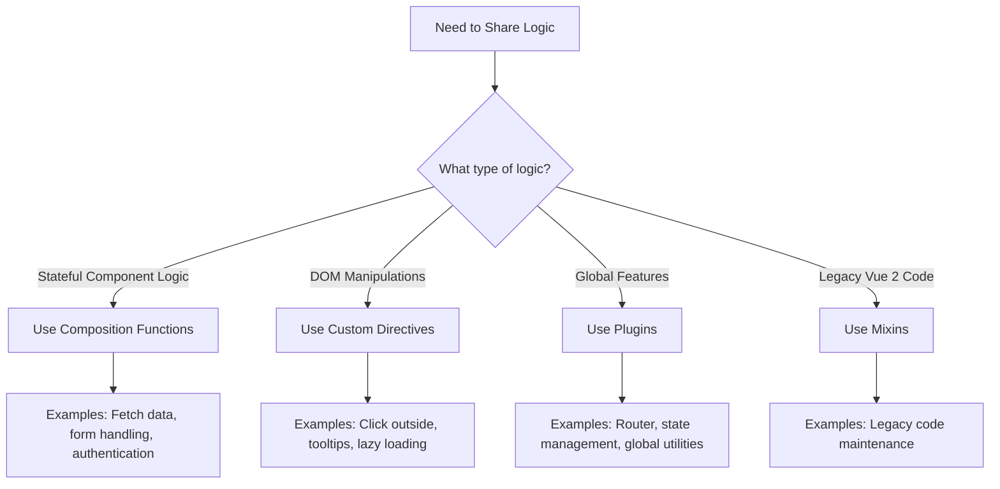

# Vue.js Reusable Logic

## Introduction

As your Vue.js application grows in size and complexity, you'll find yourself writing similar code across different components. Implementing the same functionality repeatedly leads to code duplication, which makes maintenance difficult and increases the chance of bugs. 

Vue.js offers several powerful patterns for extracting and reusing logic across components. In this tutorial, we'll explore these patterns, including:

1. Composition Functions (Vue 3's Composition API)
2. Mixins (Traditional Vue 2 approach)
3. Plugins (Global functionality)
4. Custom Directives (DOM manipulations)

By the end of this guide, you'll understand how to structure your Vue applications with reusable, maintainable code patterns that follow Vue's best practices.

## Composition Functions (Composition API)

### What are Composition Functions?

Composition functions (sometimes called "composables") are a Vue 3 pattern that leverages the Composition API to extract and reuse stateful logic between components. They are simple JavaScript functions that can use Vue's reactivity system and lifecycle hooks.

### Basic Structure

```js
// useFeature.js
import { ref, onMounted, onUnmounted } from 'vue'

export function useFeature() {
  // reactive state
  const state = ref(null)
  
  // methods/functions
  function doSomething() {
    // implementation
  }
  
  // lifecycle hooks
  onMounted(() => {
    // setup code
  })
  
  onUnmounted(() => {
    // cleanup code
  })
  
  // return exposed state and methods
  return {
    state,
    doSomething
  }
}
```

### Example: Creating a Mouse Position Tracker

Let's create a composable function that tracks the mouse position:

```js
// useMousePosition.js
import { ref, onMounted, onUnmounted } from 'vue'

export function useMousePosition() {
  const x = ref(0)
  const y = ref(0)
  
  function update(event) {
    x.value = event.pageX
    y.value = event.pageY
  }
  
  onMounted(() => {
    window.addEventListener('mousemove', update)
  })
  
  onUnmounted(() => {
    window.removeEventListener('mousemove', update)
  })
  
  return { x, y }
}
```

Now we can use this functionality in any component:

```html
<template>
  <div>
    Mouse position: x: {{ x }}, y: {{ y }}
  </div>
</template>

<script setup>
import { useMousePosition } from './useMousePosition'

const { x, y } = useMousePosition()
</script>
```

### Example: Creating a Reusable Fetch Logic

Let's create a more practical example - a composable to handle API requests with loading and error states:

```js
// useFetch.js
import { ref, computed } from 'vue'

export function useFetch() {
  const data = ref(null)
  const error = ref(null)
  const loading = ref(false)

  const hasError = computed(() => error.value !== null)
  
  async function execute(url, options = {}) {
    loading.value = true
    data.value = null
    error.value = null
    
    try {
      const response = await fetch(url, options)
      
      if (!response.ok) {
        throw new Error(`HTTP error! Status: ${response.status}`)
      }
      
      data.value = await response.json()
    } catch (err) {
      error.value = err.message || 'An error occurred'
    } finally {
      loading.value = false
    }
  }
  
  return {
    data,
    error,
    loading,
    hasError,
    execute
  }
}
```

Using it in a component:

```html
<template>
  <div>
    <button @click="fetchUsers" :disabled="loading">
      {{ loading ? 'Loading...' : 'Load Users' }}
    </button>
    
    <div v-if="hasError" class="error">
      Error: {{ error }}
    </div>
    
    <ul v-if="data && !loading">
      <li v-for="user in data" :key="user.id">
        {{ user.name }}
      </li>
    </ul>
  </div>
</template>

<script setup>
import { useFetch } from './useFetch'

const { data, error, loading, hasError, execute } = useFetch()

function fetchUsers() {
  execute('https://jsonplaceholder.typicode.com/users')
}
</script>
```

### Benefits of Composition Functions

1. **Type Safe**: Better TypeScript integration than mixins.
2. **Clear Source**: It's always clear where functionality is coming from (unlike mixins).
3. **Flexible**: You can pass arguments to customize behavior.
4. **Tree-shakable**: Unused functions don't bloat your bundle.
5. **Testable**: Easy to test in isolation.

## Mixins (Vue 2 Approach)

:::info
While mixins are still supported in Vue 3, the Composition API is the recommended approach for code reuse in new applications.
:::

Mixins are a traditional way to share reusable functionality between Vue components. They're objects that contain component options which are merged into the components that use them.

### Basic Structure

```js
// myMixin.js
export const myMixin = {
  data() {
    return {
      // mixin data properties
    }
  },
  methods: {
    // mixin methods
  },
  created() {
    // lifecycle hooks
  }
}
```

### Example: A Logger Mixin

```js
// loggerMixin.js
export const loggerMixin = {
  data() {
    return {
      logCount: 0
    }
  },
  methods: {
    log(message) {
      this.logCount++
      console.log(`[Logger ${this.logCount}]: ${message}`)
    }
  },
  created() {
    this.log('Component created')
  },
  mounted() {
    this.log('Component mounted')
  }
}
```

Using the mixin in a component:

```html
<template>
  <div>
    <p>{{ message }}</p>
    <button @click="logMessage">Log Message</button>
  </div>
</template>

<script>
import { loggerMixin } from './loggerMixin'

export default {
  mixins: [loggerMixin],
  data() {
    return {
      message: 'Hello World!'
    }
  },
  methods: {
    logMessage() {
      this.log(this.message)
    }
  }
}
</script>
```

### Drawbacks of Mixins

1. **Naming Conflicts**: Properties from mixins can conflict with component properties.
2. **Implicit Dependencies**: It's not clear where mixed-in properties come from.
3. **Composition Issues**: Multiple mixins can lead to unclear interactions.

## Plugins

Plugins are a way to add global-level functionality to Vue. Unlike mixins and composables that target specific components, plugins typically affect every component instance.

### Creating a Plugin

The basic structure of a Vue plugin:

```js
// myPlugin.js
export default {
  install(app, options) {
    // Add global methods or properties
    app.config.globalProperties.$myMethod = () => {
      // logic
    }
    
    // Add global directives
    app.directive('my-directive', {
      // directive hooks
    })
    
    // Add global components
    app.component('MyComponent', {
      // component options
    })
    
    // Add global composables
    app.provide('key', 'value')
  }
}
```

### Example: Toast Notification Plugin

Let's create a simple toast notification plugin:

```js
// plugins/toast.js
import { createApp } from 'vue'
import ToastComponent from './ToastComponent.vue'

export default {
  install(app, options = {}) {
    // Create a div for mounting the toast
    const mountPoint = document.createElement('div')
    document.body.appendChild(mountPoint)
    
    // Create toast instance
    const toastApp = createApp(ToastComponent)
    const toast = toastApp.mount(mountPoint)
    
    // Add method to Vue prototype
    app.config.globalProperties.$toast = {
      show(message, type = 'info', duration = 3000) {
        toast.show(message, type, duration)
      },
      success(message, duration) {
        toast.show(message, 'success', duration)  
      },
      error(message, duration) {
        toast.show(message, 'error', duration)
      },
      info(message, duration) {
        toast.show(message, 'info', duration)
      }
    }
    
    // For Composition API usage
    app.provide('toast', app.config.globalProperties.$toast)
  }
}
```

ToastComponent.vue:

```html
<template>
  <transition name="toast-fade">
    <div v-if="visible" :class="['toast', `toast-${type}`]">
      {{ message }}
    </div>
  </transition>
</template>

<script>
export default {
  data() {
    return {
      visible: false,
      message: '',
      type: 'info',
      timeout: null
    }
  },
  methods: {
    show(message, type = 'info', duration = 3000) {
      this.message = message
      this.type = type
      this.visible = true
      
      clearTimeout(this.timeout)
      this.timeout = setTimeout(() => {
        this.visible = false
      }, duration)
    }
  }
}
</script>

<style scoped>
.toast {
  position: fixed;
  top: 20px;
  right: 20px;
  padding: 10px 20px;
  border-radius: 4px;
  color: white;
  z-index: 9999;
  box-shadow: 0 3px 6px rgba(0,0,0,0.16);
}

.toast-success {
  background-color: #4caf50;
}

.toast-error {
  background-color: #f44336;
}

.toast-info {
  background-color: #2196f3;
}

.toast-fade-enter-active,
.toast-fade-leave-active {
  transition: opacity .3s, transform .3s;
}

.toast-fade-enter-from,
.toast-fade-leave-to {
  opacity: 0;
  transform: translateY(-20px);
}
</style>
```

Using the plugin in the main app:

```js
// main.js
import { createApp } from 'vue'
import App from './App.vue'
import ToastPlugin from './plugins/toast'

const app = createApp(App)
app.use(ToastPlugin)
app.mount('#app')
```

Using it in a component with Options API:

```html
<template>
  <button @click="showToast">Show Toast</button>
</template>

<script>
export default {
  methods: {
    showToast() {
      this.$toast.success('Operation completed successfully!')
    }
  }
}
</script>
```

Using it with Composition API:

```html
<template>
  <button @click="showToast">Show Toast</button>
</template>

<script setup>
import { inject } from 'vue'

const toast = inject('toast')

function showToast() {
  toast.success('Operation completed successfully!')
}
</script>
```

## Custom Directives

For DOM-related reusable logic, Vue offers custom directives. They're perfect for direct DOM manipulations that would be cumbersome to implement using components.

### Creating a Custom Directive

```js
// Basic structure
const myDirective = {
  // Called before bound element's attributes
  // or event listeners are applied
  created(el, binding, vnode, prevVnode) {},
  
  // Called before the element is inserted into the DOM
  beforeMount(el, binding, vnode, prevVnode) {},
  
  // Called when the element has been inserted into the DOM
  mounted(el, binding, vnode, prevVnode) {},
  
  // Called before the parent component is updated
  beforeUpdate(el, binding, vnode, prevVnode) {},
  
  // Called after the parent component and its children have updated
  updated(el, binding, vnode, prevVnode) {},
  
  // Called before the parent component is unmounted
  beforeUnmount(el, binding, vnode, prevVnode) {},
  
  // Called when the parent component is unmounted
  unmounted(el, binding, vnode, prevVnode) {}
}
```

### Example: Click Outside Directive

Let's create a directive that detects clicks outside an element:

```js
// vClickOutside.js
export const vClickOutside = {
  mounted(el, binding) {
    el._clickOutside = (event) => {
      if (!(el === event.target || el.contains(event.target))) {
        binding.value(event)
      }
    }
    document.addEventListener('click', el._clickOutside)
  },
  unmounted(el) {
    document.removeEventListener('click', el._clickOutside)
  }
}
```

Register it globally:

```js
// main.js
import { createApp } from 'vue'
import App from './App.vue'
import { vClickOutside } from './vClickOutside'

const app = createApp(App)
app.directive('click-outside', vClickOutside)
app.mount('#app')
```

Using it in a component:

```html
<template>
  <div class="dropdown" v-click-outside="closeDropdown">
    <button @click="isOpen = !isOpen">Toggle Dropdown</button>
    <div v-if="isOpen" class="dropdown-content">
      <a href="#">Link 1</a>
      <a href="#">Link 2</a>
      <a href="#">Link 3</a>
    </div>
  </div>
</template>

<script setup>
import { ref } from 'vue'

const isOpen = ref(false)

function closeDropdown() {
  isOpen.value = false
}
</script>

<style scoped>
.dropdown {
  position: relative;
  display: inline-block;
}

.dropdown-content {
  position: absolute;
  background-color: #f9f9f9;
  min-width: 160px;
  box-shadow: 0 8px 16px rgba(0,0,0,0.2);
  z-index: 1;
  padding: 12px 16px;
}

.dropdown-content a {
  color: black;
  padding: 6px 0;
  text-decoration: none;
  display: block;
}
</style>
```

## When to Use Each Pattern

Here's a quick guide on when to use each pattern:



## Comparing Patterns

| Pattern | Use Case | Scope | Vue Version |
|---------|----------|-------|------------|
| Composition Functions | Stateful, reusable logic | Component | Vue 3 (preferred) |
| Mixins | Stateful, reusable logic | Component | Vue 2 & 3 (legacy) |
| Plugins | Global functionality | Application | Vue 2 & 3 |
| Custom Directives | DOM manipulations | Element | Vue 2 & 3 |

## Best Practices

1. **Prefer Composition Functions** over mixins for new Vue 3 projects.
2. **Keep Plugins Focused** on a specific global functionality.
3. **Use Directives Only for DOM Operations** that can't be easily achieved with components.
4. **Name Your Functions Well** to indicate what they do (e.g., `useFetch`, `useMousePosition`).
5. **Extract Complex Logic** into separate files to keep components lean.
6. **Document Your Reusable Logic** for team members to know how to use it.

## Summary

In Vue.js, we have multiple patterns to extract and reuse logic across our applications:

- **Composition Functions** are the modern Vue 3 approach for sharing stateful logic.
- **Mixins** are a traditional Vue 2 approach that still works but has limitations.
- **Plugins** allow for adding global functionality to your Vue application.
- **Custom Directives** provide reusable DOM manipulation logic.

By utilizing these patterns appropriately, you can build more maintainable, DRY (Don't Repeat Yourself) Vue applications with clear code organization and better developer experience.

## Additional Resources

- [Vue 3 Composition API Documentation](https://v3.vuejs.org/guide/composition-api-introduction.html)
- [Vue Custom Directives Guide](https://v3.vuejs.org/guide/custom-directive.html)
- [Vue Plugins Documentation](https://v3.vuejs.org/guide/plugins.html)

## Exercises

1. Create a `useLocalStorage` composition function that helps persist and retrieve data from browser's localStorage.
2. Implement a custom directive `v-focus` that automatically focuses an input element when it's mounted.
3. Build a simple analytics plugin that tracks page views and custom events in your Vue application.
4. Convert an existing mixin in a Vue 2 project to use the Composition API approach.