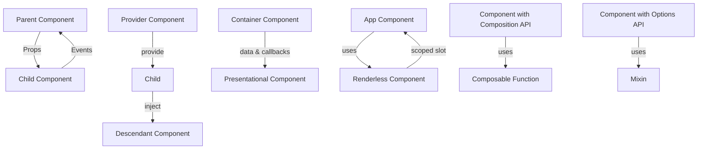

# Vue.js Design Patterns

## Introduction

Design patterns are proven solutions to common problems in software design. When building Vue.js applications, using the right design patterns can significantly improve your code organization, component reusability, and application maintainability.

In this guide, we'll explore essential design patterns that are particularly useful in Vue.js applications. Whether you're building a simple app or a complex enterprise system, these patterns will help you write cleaner, more efficient code that's easier to understand, test, and modify.

## Why Design Patterns Matter in Vue.js

Before we dive into specific patterns, let's understand why design patterns are valuable in Vue.js development:

1. **Consistency** - Design patterns provide a consistent approach to solving common problems
2. **Communication** - They create a shared vocabulary among developers
3. **Best Practices** - They embody proven solutions refined over time
4. **Scalability** - They help applications grow without becoming unmaintainable

Now, let's explore the most important Vue.js design patterns!

## Component Communication Patterns

### Props Down, Events Up Pattern

This is the fundamental communication pattern in Vue.js, following a unidirectional data flow principle.

#### How it works:

1. Parent components pass data to children via props
2. Child components notify parents of changes via events

#### Example:

Parent component:

```html
<template>
  <div>
    <h2>Current count: {{ count }}</h2>
    <counter-button 
      :initial-count="count" 
      @increment="incrementCount"
    />
  </div>
</template>

<script>
export default {
  data() {
    return {
      count: 0
    }
  },
  methods: {
    incrementCount(amount) {
      this.count += amount;
    }
  }
}
</script>
```

Child component:

```html
<template>
  <button @click="handleClick">
    Increment by {{ incrementAmount }}
  </button>
</template>

<script>
export default {
  props: {
    initialCount: {
      type: Number,
      required: true
    }
  },
  data() {
    return {
      incrementAmount: 1
    }
  },
  methods: {
    handleClick() {
      this.$emit('increment', this.incrementAmount);
    }
  }
}
</script>
```

This pattern creates a clear flow of data and helps prevent unexpected side effects. It's the backbone of Vue's component system.

### Provide/Inject Pattern

When components are deeply nested, passing props through multiple layers becomes cumbersome. The provide/inject pattern offers a solution.

#### How it works:

1. A parent component provides data
2. Any descendant component can inject and use this data

#### Example:

Parent component:

```html
<template>
  <div>
    <h2>Theme Provider</h2>
    <child-component />
  </div>
</template>

<script>
export default {
  provide() {
    return {
      theme: {
        color: 'dark',
        fontSize: 'medium'
      }
    }
  }
}
</script>
```

Deeply nested component:

```html
<template>
  <div :class="theme.color">
    <p :style="{ fontSize: theme.fontSize + 'em' }">
      Themed Content
    </p>
  </div>
</template>

<script>
export default {
  inject: ['theme']
}
</script>
```

This pattern is especially useful for theme configuration, user authentication state, or other application-wide data that many components need access to. However, use it sparingly as it can make component dependencies less obvious.

## Component Design Patterns

### Container/Presentational Pattern

This pattern separates concerns between data management and presentation.

#### How it works:

1. **Container components** handle data fetching, state management, and business logic
2. **Presentational components** focus on UI rendering, receiving data via props

#### Example:

Container component:

```html
<template>
  <div>
    <user-profile-view 
      :user="user" 
      :loading="loading"
      :error="error"
      @refresh="fetchUser"
    />
  </div>
</template>

<script>
import UserProfileView from './UserProfileView.vue';
import userService from '@/services/userService';

export default {
  components: {
    UserProfileView
  },
  data() {
    return {
      user: null,
      loading: true,
      error: null
    }
  },
  created() {
    this.fetchUser();
  },
  methods: {
    async fetchUser() {
      this.loading = true;
      try {
        this.user = await userService.getUser();
        this.error = null;
      } catch (err) {
        this.error = 'Failed to load user data';
        console.error(err);
      } finally {
        this.loading = false;
      }
    }
  }
}
</script>
```

Presentational component:

```html
<template>
  <div class="user-profile">
    <div v-if="loading" class="loading">Loading...</div>
    <div v-else-if="error" class="error">{{ error }}</div>
    <div v-else class="profile">
      
      <h2>{{ user.name }}</h2>
      <p>{{ user.bio }}</p>
      <button @click="$emit('refresh')">Refresh</button>
    </div>
  </div>
</template>

<script>
export default {
  props: {
    user: Object,
    loading: Boolean,
    error: String
  }
}
</script>
```

### Renderless Components Pattern

This pattern focuses on reusable logic without enforcing any particular UI representation.

#### How it works:

1. Create components with no render output of their own
2. Use scoped slots to expose functionality and state to parent components

#### Example:

Renderless counter component:

```html
<script>
export default {
  props: {
    initial: {
      type: Number,
      default: 0
    },
    min: {
      type: Number,
      default: null
    },
    max: {
      type: Number,
      default: null
    }
  },
  data() {
    return {
      count: this.initial
    }
  },
  methods: {
    increment(amount = 1) {
      const newValue = this.count + amount;
      if (this.max !== null && newValue > this.max) return;
      this.count = newValue;
    },
    decrement(amount = 1) {
      const newValue = this.count - amount;
      if (this.min !== null && newValue < this.min) return;
      this.count = newValue;
    },
    reset() {
      this.count = this.initial;
    }
  },
  render() {
    return this.$scopedSlots.default({
      count: this.count,
      increment: this.increment,
      decrement: this.decrement,
      reset: this.reset
    });
  }
}
</script>
```

Using the renderless component:

```html
<template>
  <div>
    <counter-logic :initial="10" :min="0" :max="20" v-slot="{ count, increment, decrement, reset }">
      <div class="fancy-counter">
        <button @click="decrement(5)">-5</button>
        <button @click="decrement()">-1</button>
        <span>{{ count }}</span>
        <button @click="increment()">+1</button>
        <button @click="increment(5)">+5</button>
        <button @click="reset()">Reset</button>
      </div>
    </counter-logic>
  </div>
</template>

<script>
import CounterLogic from './CounterLogic.vue';

export default {
  components: {
    CounterLogic
  }
}
</script>
```

The renderless component pattern is perfect for abstracting complex functionality like form handling, pagination, or drag-and-drop behavior.

## Composition Patterns

### Composable Functions (Vue 3)

With Vue 3's Composition API, we can extract and reuse stateful logic across components.

#### How it works:

1. Create functions that encapsulate a specific piece of logic
2. Import and use these functions inside the `setup()` function of components

#### Example:

Creating a composable:

```js
// useCounter.js
import { ref } from 'vue';

export function useCounter(initialValue = 0) {
  const count = ref(initialValue);
  
  function increment() {
    count.value++;
  }
  
  function decrement() {
    count.value--;
  }
  
  return {
    count,
    increment,
    decrement
  };
}
```

Using the composable in a component:

```html
<template>
  <div>
    <p>Count: {{ count }}</p>
    <button @click="increment">Increment</button>
    <button @click="decrement">Decrement</button>
  </div>
</template>

<script>
import { useCounter } from './composables/useCounter';

export default {
  setup() {
    const { count, increment, decrement } = useCounter(0);
    
    return {
      count,
      increment,
      decrement
    };
  }
}
</script>
```

### Mixins (Vue 2)

In Vue 2, mixins were the primary way to reuse component logic.

#### How it works:

1. Create objects with component options
2. Merge these options with components using them

#### Example:

Creating a mixin:

```js
// counterMixin.js
export const counterMixin = {
  data() {
    return {
      count: 0
    };
  },
  methods: {
    increment() {
      this.count++;
    },
    decrement() {
      this.count--;
    }
  }
};
```

Using the mixin:

```html
<template>
  <div>
    <p>Count: {{ count }}</p>
    <button @click="increment">Increment</button>
    <button @click="decrement">Decrement</button>
  </div>
</template>

<script>
import { counterMixin } from './mixins/counterMixin';

export default {
  mixins: [counterMixin]
}
</script>
```

While mixins work, they can cause naming conflicts and unclear source of properties. In Vue 3, composables are the preferred approach.

## Advanced State Management Patterns

### Vuex Module Pattern

For larger applications, organizing Vuex into modules helps maintain a clean state architecture.

#### How it works:

1. Divide store into modules, each with its own state, mutations, actions, and getters
2. Use namespaces to avoid naming conflicts

#### Example:

```js
// store/index.js
import Vue from 'vue';
import Vuex from 'vuex';
import auth from './modules/auth';
import products from './modules/products';
import cart from './modules/cart';

Vue.use(Vuex);

export default new Vuex.Store({
  modules: {
    auth,
    products,
    cart
  }
});
```

```js
// store/modules/cart.js
export default {
  namespaced: true,
  state: {
    items: [],
    total: 0
  },
  mutations: {
    ADD_ITEM(state, item) {
      state.items.push(item);
      state.total += item.price;
    },
    REMOVE_ITEM(state, index) {
      state.total -= state.items[index].price;
      state.items.splice(index, 1);
    }
  },
  actions: {
    addToCart({ commit }, product) {
      commit('ADD_ITEM', product);
    },
    removeFromCart({ commit }, index) {
      commit('REMOVE_ITEM', index);
    }
  },
  getters: {
    itemCount(state) {
      return state.items.length;
    }
  }
};
```

Using the store in a component:

```html
<template>
  <div>
    <h2>Shopping Cart ({{ itemCount }} items)</h2>
    <ul>
      <li v-for="(item, index) in cartItems" :key="index">
        {{ item.name }} - ${{ item.price }}
        <button @click="removeItem(index)">Remove</button>
      </li>
    </ul>
    <p><strong>Total: ${{ total }}</strong></p>
  </div>
</template>

<script>
import { mapState, mapActions, mapGetters } from 'vuex';

export default {
  computed: {
    ...mapState('cart', ['items', 'total']),
    ...mapGetters('cart', ['itemCount']),
    cartItems() {
      return this.items;
    }
  },
  methods: {
    ...mapActions('cart', {
      removeItem: 'removeFromCart'
    })
  }
}
</script>
```

## Practical Design Pattern: Form Handling

Let's see how we can apply design patterns to a common task: form handling.

### Form Container Component Pattern

This pattern simplifies form handling by separating form logic from presentation.

#### Example:

```html
<!-- UserFormContainer.vue -->
<template>
  <user-form
    :user="userData"
    :errors="errors"
    :loading="loading"
    @submit="handleSubmit"
  />
</template>

<script>
import UserForm from './UserForm.vue';
import userService from '@/services/userService';

export default {
  components: {
    UserForm
  },
  props: {
    userId: {
      type: String,
      default: null
    }
  },
  data() {
    return {
      userData: {
        name: '',
        email: '',
        role: 'user'
      },
      errors: {},
      loading: false
    };
  },
  created() {
    if (this.userId) {
      this.fetchUser();
    }
  },
  methods: {
    async fetchUser() {
      this.loading = true;
      try {
        const user = await userService.getUser(this.userId);
        this.userData = { ...user };
      } catch (error) {
        this.$emit('error', 'Failed to load user data');
      } finally {
        this.loading = false;
      }
    },
    async handleSubmit(formData) {
      this.loading = true;
      this.errors = {};
      
      try {
        if (this.userId) {
          await userService.updateUser(this.userId, formData);
          this.$emit('success', 'User updated successfully');
        } else {
          const newUser = await userService.createUser(formData);
          this.$emit('success', 'User created successfully', newUser);
        }
      } catch (error) {
        if (error.validationErrors) {
          this.errors = error.validationErrors;
        } else {
          this.$emit('error', 'Failed to save user data');
        }
      } finally {
        this.loading = false;
      }
    }
  }
};
</script>
```

```html
<!-- UserForm.vue -->
<template>
  <form @submit.prevent="onSubmit">
    <div class="form-group">
      <label for="name">Name</label>
      <input 
        id="name"
        v-model="form.name"
        :class="{ error: errors.name }"
      />
      <p v-if="errors.name" class="error-message">{{ errors.name }}</p>
    </div>
    
    <div class="form-group">
      <label for="email">Email</label>
      <input 
        id="email"
        type="email"
        v-model="form.email"
        :class="{ error: errors.email }"
      />
      <p v-if="errors.email" class="error-message">{{ errors.email }}</p>
    </div>
    
    <div class="form-group">
      <label for="role">Role</label>
      <select 
        id="role"
        v-model="form.role"
        :class="{ error: errors.role }"
      >
        <option value="user">User</option>
        <option value="editor">Editor</option>
        <option value="admin">Admin</option>
      </select>
      <p v-if="errors.role" class="error-message">{{ errors.role }}</p>
    </div>
    
    <button type="submit" :disabled="loading">
      {{ loading ? 'Saving...' : 'Save User' }}
    </button>
  </form>
</template>

<script>
export default {
  props: {
    user: {
      type: Object,
      required: true
    },
    errors: {
      type: Object,
      default: () => ({})
    },
    loading: {
      type: Boolean,
      default: false
    }
  },
  data() {
    return {
      form: { ...this.user }
    };
  },
  watch: {
    user(newUser) {
      this.form = { ...newUser };
    }
  },
  methods: {
    onSubmit() {
      this.$emit('submit', { ...this.form });
    }
  }
};
</script>
```

Using this pattern, `UserFormContainer.vue` handles all business logic, API calls, and data management, while `UserForm.vue` focuses solely on rendering the form and reporting user input.

## Flow Diagram of Component Patterns

Here's a visual representation of the component patterns we've discussed:



## Summary

Vue.js design patterns help you build applications that are maintainable, scalable, and robust. We've covered several key patterns:

1. **Component Communication Patterns**
   - Props Down, Events Up
   - Provide/Inject

2. **Component Design Patterns**
   - Container/Presentational
   - Renderless Components

3. **Composition Patterns**
   - Composable Functions (Vue 3)
   - Mixins (Vue 2)

4. **State Management Patterns**
   - Vuex Module Pattern

5. **Practical Pattern Application**
   - Form Container Component Pattern

By applying these patterns in your Vue.js applications, you'll create a more structured codebase that's easier to manage and extend.

## Additional Resources

To deepen your understanding of Vue.js design patterns, consider exploring:

- **Official Vue.js Documentation**: [Vue.js Guide](https://vuejs.org/guide/introduction.html)
- **Vuex Documentation**: [Vuex Guide](https://vuex.vuejs.org/)
- **Vue Composition API**: [Composition API Guide](https://vuejs.org/guide/extras/composition-api-faq.html)

## Practice Exercises

1. **Counter Component**: Build a counter using the Container/Presentational pattern
2. **Theme Switcher**: Create a theme provider using Provide/Inject
3. **Data Fetcher**: Build a renderless component that handles API fetching
4. **Form Builder**: Create a composable function for form validation
5. **Shopping Cart**: Implement a shopping cart using Vuex modules

By practicing these design patterns in real projects, you'll develop a strong intuition for when and how to apply them effectively.