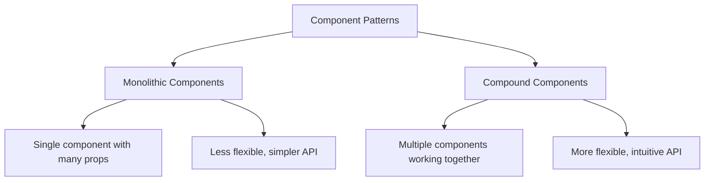

# Vue.js Compound Components

## Introduction

Compound components are a pattern that helps manage complex component relationships in a more elegant and flexible way. Rather than building monolithic components with numerous props, the compound pattern breaks functionality into smaller, focused components that work together seamlessly.

In this guide, you'll learn how to:

- Understand what compound components are and when to use them
- Implement compound components in Vue.js
- Use provide/inject to share state between parent and child components
- Build practical compound components with slots and scoped slots

## What Are Compound Components?

Compound components are a set of components that work together to accomplish a common goal. Think about HTML's native `<select>` and `<option>` elements - they're separate elements, but designed to work together as a cohesive unit.

The key benefits of compound components include:

- **Cleaner component APIs**: Less props to manage
- **Flexible layouts**: Child components can be arranged freely
- **Separation of concerns**: Each component has a specific responsibility
- **Improved readability**: Component usage reflects its structure

## Basic Compound Components in Vue

Let's start with a simple example - a custom `Tabs` component:

```html
<!-- Tabs.vue -->
<template>
  <div class="tabs-container">
    <slot></slot>
  </div>
</template>

<script>
export default {
  name: 'Tabs',
  provide() {
    return {
      tabs: this
    }
  },
  data() {
    return {
      activeTabIndex: 0,
      tabs: []
    }
  },
  methods: {
    registerTab(tab) {
      this.tabs.push(tab)
    },
    setActiveTab(index) {
      this.activeTabIndex = index
    }
  }
}
</script>
```

Now, let's create the `TabItem` component:

```html
<!-- TabItem.vue -->
<template>
  <div 
    v-if="isActive" 
    class="tab-content"
  >
    <slot></slot>
  </div>
</template>

<script>
export default {
  name: 'TabItem',
  inject: ['tabs'],
  props: {
    title: {
      type: String,
      required: true
    }
  },
  computed: {
    isActive() {
      return this.tabs.activeTabIndex === this.tabIndex
    },
    tabIndex() {
      return this.tabs.tabs.indexOf(this)
    }
  },
  created() {
    this.tabs.registerTab(this)
  }
}
</script>
```

And finally, the `TabHeader` component:

```html
<!-- TabHeader.vue -->
<template>
  <div class="tab-headers">
    <button 
      v-for="(tab, index) in tabs.tabs" 
      :key="index"
      :class="{ active: index === tabs.activeTabIndex }"
      @click="tabs.setActiveTab(index)"
      class="tab-header"
    >
      {{ tab.title }}
    </button>
  </div>
</template>

<script>
export default {
  name: 'TabHeader',
  inject: ['tabs']
}
</script>
```

Now we can use these components together:

```html
<template>
  <Tabs>
    <TabHeader />
    <TabItem title="Profile">
      User profile content here
    </TabItem>
    <TabItem title="Settings">
      User settings content here
    </TabItem>
    <TabItem title="Notifications">
      Notification preferences here
    </TabItem>
  </Tabs>
</template>

<script>
import Tabs from './Tabs.vue'
import TabHeader from './TabHeader.vue'
import TabItem from './TabItem.vue'

export default {
  components: {
    Tabs,
    TabHeader,
    TabItem
  }
}
</script>
```

## Using Provide/Inject for State Sharing

In the example above, we used Vue's `provide` and `inject` to share state between the parent component and its children. This is a key aspect of compound components in Vue.

Here's how it works:

1. The parent component uses `provide()` to expose itself or specific data to its children
2. Child components use `inject:` to access the provided values
3. This creates an implicit communication channel without prop drilling

## Advanced Compound Components with Scoped Slots

For more flexibility, we can enhance our compound components using scoped slots. Let's rebuild our tabs component to be even more customizable:

```html
<!-- Tabs.vue -->
<template>
  <div class="tabs-container">
    <slot 
      :active-index="activeTabIndex" 
      :set-active-tab="setActiveTab" 
      :tabs="tabs"
    ></slot>
  </div>
</template>

<script>
export default {
  name: 'Tabs',
  data() {
    return {
      activeTabIndex: 0,
      tabs: []
    }
  },
  methods: {
    registerTab(tab) {
      this.tabs.push(tab)
      return this.tabs.length - 1 // Return the tab's index
    },
    setActiveTab(index) {
      this.activeTabIndex = index
    }
  }
}
</script>
```

Now our usage is more flexible:

```html
<template>
  <div>
    <Tabs v-slot="{ activeIndex, setActiveTab, tabs }">
      <!-- Custom header implementation -->
      <div class="custom-tab-header">
        <button 
          v-for="(tab, index) in tabs" 
          :key="index"
          :class="{ 'active-tab': activeIndex === index }"
          @click="setActiveTab(index)"
        >
          {{ tab.title }}
        </button>
      </div>
      
      <!-- Tab content -->
      <div class="tab-content">
        <div v-for="(tab, index) in tabs" :key="index" v-show="activeIndex === index">
          <component :is="tab" />
        </div>
      </div>
    </Tabs>
  </div>
</template>
```

## Real-world Example: Accordion Component

Let's create a more practical example - an accordion component that users can customize to their needs:

```html
<!-- Accordion.vue -->
<template>
  <div class="accordion">
    <slot></slot>
  </div>
</template>

<script>
export default {
  name: 'Accordion',
  provide() {
    return {
      accordion: {
        openItems: this.openItems,
        toggle: this.toggle,
        isOpen: this.isOpen
      }
    }
  },
  props: {
    multiple: {
      type: Boolean,
      default: false
    }
  },
  data() {
    return {
      openItems: new Set()
    }
  },
  methods: {
    toggle(id) {
      if (this.isOpen(id)) {
        this.openItems.delete(id)
        this.$forceUpdate() // Force update due to Set mutation
      } else {
        if (!this.multiple) {
          this.openItems.clear()
        }
        this.openItems.add(id)
        this.$forceUpdate()
      }
    },
    isOpen(id) {
      return this.openItems.has(id)
    }
  }
}
</script>

<style scoped>
.accordion {
  border: 1px solid #ddd;
  border-radius: 4px;
}
</style>
```

```html
<!-- AccordionItem.vue -->
<template>
  <div class="accordion-item">
    <div 
      class="accordion-header" 
      @click="accordion.toggle(id)"
      :aria-expanded="accordion.isOpen(id)"
    >
      <slot name="header"></slot>
      <span class="indicator">{{ accordion.isOpen(id) ? '▲' : '▼' }}</span>
    </div>
    <div 
      v-if="accordion.isOpen(id)" 
      class="accordion-content"
    >
      <slot></slot>
    </div>
  </div>
</template>

<script>
import { v4 as uuidv4 } from 'uuid'

export default {
  name: 'AccordionItem',
  inject: ['accordion'],
  data() {
    return {
      id: uuidv4() // Generate unique ID for each item
    }
  }
}
</script>

<style scoped>
.accordion-item {
  border-bottom: 1px solid #ddd;
}
.accordion-header {
  padding: 15px;
  cursor: pointer;
  display: flex;
  justify-content: space-between;
  align-items: center;
}
.accordion-content {
  padding: 15px;
}
.accordion-item:last-child {
  border-bottom: none;
}
</style>
```

Now we can use our accordion component like this:

```html
<template>
  <div>
    <h2>FAQ Section</h2>
    
    <Accordion :multiple="true">
      <AccordionItem>
        <template #header>
          <h3>What is Vue.js?</h3>
        </template>
        <p>Vue.js is a progressive JavaScript framework for building user interfaces. 
        Unlike monolithic frameworks, Vue is designed from the ground up to be incrementally adoptable.</p>
      </AccordionItem>
      
      <AccordionItem>
        <template #header>
          <h3>How do I install Vue?</h3>
        </template>
        <p>You can install Vue.js by using npm: <code>npm install vue</code>, 
        or by including it via CDN: <code>&lt;script src="https://unpkg.com/vue@3/dist/vue.global.js">&lt;/script></code></p>
      </AccordionItem>
      
      <AccordionItem>
        <template #header>
          <h3>What are compound components?</h3>
        </template>
        <p>Compound components are a pattern where multiple components work together to create a cohesive UI element
        with shared state but separate responsibilities.</p>
      </AccordionItem>
    </Accordion>
  </div>
</template>

<script>
import Accordion from './Accordion.vue'
import AccordionItem from './AccordionItem.vue'

export default {
  components: {
    Accordion,
    AccordionItem
  }
}
</script>
```

## When To Use Compound Components

Compound components are most useful when:

1. You have complex component logic that can be broken down into smaller pieces
2. You need to provide flexibility in how components are arranged and styled
3. You want a more intuitive API for related components
4. You find yourself passing too many props through multiple levels

Examples of good candidates for compound components:
- Form controls (select menus, radio groups)
- Tabs and tab panels
- Accordions
- Dropdown menus
- Data tables with sorting/filtering

## Comparing Approaches



## Common Pitfalls and Solutions

### Issues with reactive updates

When using Sets or Maps in Vue 2, reactivity can be an issue. Use `this.$forceUpdate()` after mutations or consider using Vue 3 which has better reactivity handling.

### Component registration

Ensure all related compound components are properly registered and imported.

### Naming collisions

When providing values, use namespaced objects to avoid naming collisions:

```js
provide() {
  return {
    myComponentName: {
      // State and methods here
    }
  }
}
```

## Summary

Compound components provide a powerful way to build flexible, composable user interfaces in Vue.js. By leveraging Vue's provide/inject system, slots, and careful component design, you can create components that are both powerful and easy to use.

Key takeaways:
- Compound components split complex UI into simpler, focused components
- They reduce prop drilling and create intuitive APIs
- The provide/inject feature is essential for state sharing
- Scoped slots add extra flexibility to compound components
- They're particularly useful for complex UI elements like tabs, accordions, and form controls

## Exercises

1. Enhance the Tabs component to support lazy loading of tab content
2. Create a Select/Option compound component that mimics HTML's select but with custom styling
3. Build a Form/FormField compound component that handles validation and error messages
4. Modify the Accordion component to support animation when opening/closing items
5. Create a Menu/MenuItem component that supports nested submenus

## Additional Resources

- [Vue.js Documentation on Provide/Inject](https://vuejs.org/guide/components/provide-inject.html)
- [Vue.js Documentation on Slots](https://vuejs.org/guide/components/slots.html)
- [Component Design Patterns](https://vuejs.org/guide/reusability/composables.html)

Remember, compound components are not just about code organization—they're about creating intuitive APIs that make your components a joy to use.