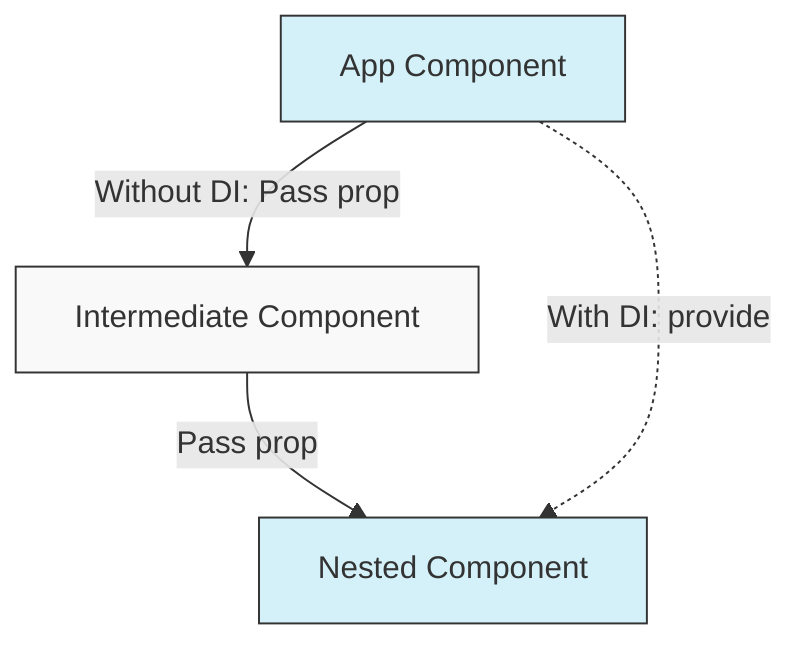

# Vue.js Dependency Injection

## Introduction

When building complex Vue applications, you often need to share data between components that are deeply nested within your component tree. While props are great for parent-child communication, passing props through many levels of components (often called "prop drilling") can become cumbersome and hard to maintain.

Vue.js provides a built-in dependency injection system through the `provide` and `inject` options that allows you to share data between ancestor and descendant components without requiring intermediate components to be aware of it.

In this tutorial, we'll explore:
- What dependency injection is and why it's useful
- How to use Vue's `provide` and `inject` API
- Best practices for dependency injection
- Real-world examples and patterns

## What is Dependency Injection?

Dependency injection is a design pattern that allows us to pass (or "inject") dependencies into components without explicitly passing them as props through every layer of the component hierarchy.



## Basic Usage of Provide/Inject

### The `provide` Option

The `provide` option allows an ancestor component to provide data to all its descendants, regardless of how deep the component hierarchy is.

```html
<!-- ParentComponent.vue -->
<script>
export default {
  provide: {
    message: 'Hello from ancestor!'
  }
}
</script>
```

For reactive data or methods, you can use a function that returns an object:

```html
<!-- ParentComponent.vue -->
<script>
export default {
  data() {
    return {
      userInfo: {
        name: 'John',
        role: 'Admin'
      }
    }
  },
  provide() {
    return {
      userInfo: this.userInfo,
      // Methods can also be provided
      updateUser: (newName) => {
        this.userInfo.name = newName
      }
    }
  }
}
</script>
```

### The `inject` Option

The `inject` option allows any descendant component to use ("inject") the data provided by an ancestor component:

```html
<!-- DeeplyNestedComponent.vue -->
<template>
  <div>
    <p>{{ message }}</p>
    <p>User: {{ userInfo.name }} ({{ userInfo.role }})</p>
    <button @click="updateUser('Jane')">Change Name</button>
  </div>
</template>

<script>
export default {
  inject: ['message', 'userInfo', 'updateUser']
}
</script>
```

## Composition API Version

If you're using Vue 3's Composition API, you can use `provide()` and `inject()` functions:

```html
<!-- Provider.vue -->
<script setup>
import { ref, provide } from 'vue'

const count = ref(0)

function increment() {
  count.value++
}

// Make the ref itself reactive when shared
provide('count', count)
provide('increment', increment)
</script>
```

And then in any descendant:

```html
<!-- Consumer.vue -->
<script setup>
import { inject } from 'vue'

// Access the provided values
const count = inject('count')
const increment = inject('increment')

// You can specify default values if nothing is provided
const message = inject('message', 'Default message')
</script>

<template>
  <div>
    <p>Count: {{ count }}</p>
    <button @click="increment">Increment</button>
    <p>Message: {{ message }}</p>
  </div>
</template>
```

## Advanced Patterns

### Symbol Keys

To avoid potential naming collisions, you can use Symbol keys:

```javascript
// injection-keys.js
export const UserSymbol = Symbol('user')
export const ThemeSymbol = Symbol('theme')
```

```html
<!-- Provider.vue -->
<script setup>
import { ref, provide } from 'vue'
import { UserSymbol } from './injection-keys'

const user = ref({ name: 'John' })
provide(UserSymbol, user)
</script>
```

```html
<!-- Consumer.vue -->
<script setup>
import { inject } from 'vue'
import { UserSymbol } from './injection-keys'

const user = inject(UserSymbol)
</script>
```

### Readonly Injections

To prevent descendant components from mutating provided state, use `readonly`:

```html
<!-- Provider.vue -->
<script setup>
import { ref, readonly, provide } from 'vue'

const count = ref(0)
provide('count', readonly(count)) // Descendants can't modify this

function increment() {
  count.value++ // But we can still modify it here
}
provide('increment', increment)
</script>
```

## Real-World Example: Theme System

Let's build a simple theme system using dependency injection:

```html
<!-- ThemeProvider.vue -->
<script setup>
import { ref, provide, computed } from 'vue'

const theme = ref('light')

const toggleTheme = () => {
  theme.value = theme.value === 'light' ? 'dark' : 'light'
}

const themeStyles = computed(() => {
  return {
    backgroundColor: theme.value === 'light' ? '#ffffff' : '#333333',
    color: theme.value === 'light' ? '#333333' : '#ffffff'
  }
})

provide('theme', theme)
provide('toggleTheme', toggleTheme)
provide('themeStyles', themeStyles)
</script>

<template>
  <div>
    <slot></slot>
  </div>
</template>
```

Now any descendant component can use the theme:

```html
<!-- ThemedButton.vue -->
<script setup>
import { inject } from 'vue'

const theme = inject('theme')
const themeStyles = inject('themeStyles')
const toggleTheme = inject('toggleTheme')
</script>

<template>
  <div>
    <button 
      @click="toggleTheme"
      :style="themeStyles">
      Toggle Theme (Current: {{ theme }})
    </button>
  </div>
</template>
```

And in your main App:

```html
<!-- App.vue -->
<template>
  <ThemeProvider>
    <h1>My Themed App</h1>
    <p>This content uses the current theme</p>
    <ThemedButton />
    <!-- Any other components will have access to theme as well -->
  </ThemeProvider>
</template>

<script setup>
import ThemeProvider from './ThemeProvider.vue'
import ThemedButton from './ThemedButton.vue'
</script>
```

## Best Practices for Dependency Injection

1. **Use sparingly**: Dependency injection makes your component coupling less obvious. Use it for truly app-wide or branch-wide concerns.

2. **Document your injections**: Make it clear what your component expects to be injected.

3. **Provide defaults**: Always provide default values for non-critical injections.

4. **Use Symbols for keys**: Prevents name collisions, especially when using third-party components.

5. **Consider readonly for state**: Use readonly to prevent descendant components from mutating shared state.

6. **Keep related data together**: Use objects to group related injection values.

## Common Use Cases

Dependency injection is particularly useful for:

1. **Theme systems** - As shown in our example
2. **User authentication state** - Making the current user available app-wide
3. **Feature flags** - Toggling features throughout the application
4. **Translation/i18n services** - For internationalization
5. **State management** - For simpler apps that don't need Vuex/Pinia

## Vue 3 App-Level Provide

In Vue 3, you can use dependency injection at the app level:

```javascript
// main.js
import { createApp } from 'vue'
import App from './App.vue'

const app = createApp(App)

// App-level provide
app.provide('appName', 'My Amazing App')
app.provide('appVersion', '1.0.0')

app.mount('#app')
```

All components in your app will have access to these values:

```html
<script setup>
import { inject } from 'vue'

const appName = inject('appName')
const appVersion = inject('appVersion')
</script>

<template>
  <footer>
    {{ appName }} v{{ appVersion }}
  </footer>
</template>
```

## Summary

Dependency injection in Vue.js provides an elegant solution for sharing data across deeply nested component hierarchies. By using `provide` and `inject`, you can avoid prop drilling and keep your component interfaces clean and focused.

Key points to remember:

- Use `provide` in ancestor components to make data available
- Use `inject` in descendant components to access the provided data
- Consider using Symbol keys to avoid naming collisions
- Make provided values readonly when appropriate
- Always provide sensible defaults for injected values

Dependency injection is best used for application-wide or branch-wide concerns like themes, authentication, or localization. For more complex state management needs, consider dedicated state management libraries like Vuex or Pinia.

## Additional Resources

- [Vue.js Official Guide: Provide / Inject](https://vuejs.org/guide/components/provide-inject.html)
- [Vue Composition API: provide/inject](https://vuejs.org/api/composition-api-dependency-injection.html)

## Exercises

1. Create a simple notification system using provide/inject that allows any component to display toast messages.

2. Implement a multi-language support system where language strings are provided at the app root and can be injected by any component.

3. Build a form validation system where validation rules are provided by form container components and injected by individual form field components.

4. Create a permissions system that provides user permissions at the app level and allows components to check if a user can perform specific actions.