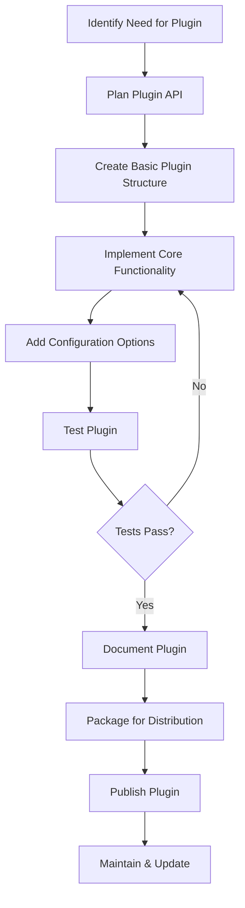

# Vue.js Plugin Development

## Introduction

Plugins are a powerful way to extend Vue.js functionality at a global level. They allow you to add global features to your Vue applications, such as directives, mixins, components, and more. Understanding how to create custom plugins is essential for advanced Vue developers who want to create reusable code that can be shared across components, projects, or even with the wider Vue community.

In this tutorial, we'll explore the Vue.js plugin system, learn how to create our own plugins from scratch, and cover best practices for plugin development.

## Understanding Vue.js Plugins

### What is a Vue Plugin?

A Vue.js plugin is essentially a JavaScript object with an `install` method that receives the Vue constructor and optional options. When a plugin is installed using `Vue.use()`, the `install` method is called with Vue as the first argument, allowing the plugin to register global components, directives, mixins, and more.

### When Should You Create a Plugin?

Consider creating a plugin when you want to:

1. Add global-level functionality to Vue
2. Add multiple components, directives, or services with one single import
3. Create reusable code that can be shared across projects
4. Provide a public API for your third-party library

## Creating Your First Vue.js Plugin

Let's start by creating a simple plugin that adds a global method to Vue instances.

### Basic Plugin Structure

```js
// simple-logger.js
const SimpleLogger = {
  install(Vue, options = {}) {
    // Add a global method
    Vue.prototype.$log = function(message) {
      if (options.debug || process.env.NODE_ENV !== 'production') {
        console.log(`[SimpleLogger]: ${message}`);
      }
    };
  }
};

// For auto-installation if Vue is detected in the global scope
if (typeof window !== 'undefined' && window.Vue) {
  window.Vue.use(SimpleLogger);
}

export default SimpleLogger;
```

### Using the Plugin

```js
// main.js
import Vue from 'vue';
import SimpleLogger from './plugins/simple-logger';

Vue.use(SimpleLogger, { debug: true });

new Vue({
  created() {
    this.$log('Application started!');
    // Console output: [SimpleLogger]: Application started!
  }
}).$mount('#app');
```

## Plugin Features and Capabilities

Let's explore various features you can add with plugins:

### 1. Adding Global Properties

```js
install(Vue, options) {
  // Add global property/method
  Vue.prototype.$http = axios;
  
  // In Vue 3, it would be:
  // app.config.globalProperties.$http = axios;
}
```

### 2. Adding Global Components

```js
install(Vue, options) {
  // Register a global component
  Vue.component('v-button', {
    props: ['type', 'size'],
    template: `
      <button 
        class="v-btn" 
        :class="[type && 'v-btn-' + type, size && 'v-btn-' + size]"
      >
        <slot></slot>
      </button>
    `
  });
}
```

### 3. Adding Global Directives

```js
install(Vue, options) {
  // Register a global custom directive
  Vue.directive('focus', {
    inserted(el) {
      el.focus();
    }
  });
}
```

### 4. Adding Global Mixins

```js
install(Vue, options) {
  // Add a global mixin
  Vue.mixin({
    created() {
      const componentName = this.$options.name;
      if (componentName) {
        console.log(`Component ${componentName} created`);
      }
    }
  });
}
```

### 5. Adding Instance Methods

```js
install(Vue, options) {
  // Add an instance method
  Vue.prototype.$formatDate = function(date, format = 'YYYY-MM-DD') {
    // Implementation using a date library like date-fns or moment.js
    return format === 'YYYY-MM-DD' 
      ? `${date.getFullYear()}-${date.getMonth() + 1}-${date.getDate()}`
      : date.toLocaleDateString();
  };
}
```

## Building a Real-World Plugin Example

Let's create a more practical plugin that provides toast notification functionality:

```js
// toast-plugin.js
const ToastPlugin = {
  install(Vue, options = {}) {
    // Default settings
    const defaultOptions = {
      position: 'top-right',
      duration: 3000,
      closeButton: true,
      ...options
    };
    
    // Create a new Vue instance for our toast system
    const ToastConstructor = Vue.extend({
      data() {
        return {
          toasts: []
        };
      },
      methods: {
        addToast(message, options = {}) {
          const toast = {
            id: Date.now(),
            message,
            type: options.type || 'info',
            duration: options.duration || defaultOptions.duration,
            ...options
          };
          
          this.toasts.push(toast);
          
          if (toast.duration > 0) {
            setTimeout(() => {
              this.removeToast(toast.id);
            }, toast.duration);
          }
          
          return toast.id;
        },
        removeToast(id) {
          const index = this.toasts.findIndex(toast => toast.id === id);
          if (index !== -1) {
            this.toasts.splice(index, 1);
          }
        }
      },
      render(h) {
        return h('div', { 
          class: 'toast-container ' + defaultOptions.position 
        }, this.toasts.map(toast => {
          return h('div', { 
            key: toast.id,
            class: ['toast', `toast-${toast.type}`]
          }, [
            h('div', { class: 'toast-content' }, toast.message),
            defaultOptions.closeButton ? h('button', {
              class: 'toast-close',
              on: { click: () => this.removeToast(toast.id) }
            }, '×') : null
          ]);
        }));
      }
    });
    
    // Create toast container DOM element
    const toastContainer = document.createElement('div');
    document.body.appendChild(toastContainer);
    
    // Mount toast manager
    const toastManager = new ToastConstructor().$mount(toastContainer);
    
    // Add global methods
    const types = ['success', 'error', 'info', 'warning'];
    
    // Create base toast method
    Vue.prototype.$toast = function(message, options = {}) {
      return toastManager.addToast(message, options);
    };
    
    // Create convenience methods for different toast types
    types.forEach(type => {
      Vue.prototype.$toast[type] = function(message, options = {}) {
        return toastManager.addToast(message, { ...options, type });
      };
    });
    
    // Add ability to dismiss by ID
    Vue.prototype.$toast.dismiss = function(id) {
      toastManager.removeToast(id);
    };
    
    // Add ability to dismiss all
    Vue.prototype.$toast.dismissAll = function() {
      toastManager.toasts = [];
    };
  }
};

// Auto-install when Vue is found
if (typeof window !== 'undefined' && window.Vue) {
  window.Vue.use(ToastPlugin);
}

export default ToastPlugin;
```

To use the toast plugin:

```js
// main.js
import Vue from 'vue';
import ToastPlugin from './plugins/toast-plugin';
import './assets/toast.css'; // You'd need to create CSS for styling toasts

Vue.use(ToastPlugin, { 
  position: 'bottom-right',
  duration: 5000
});

new Vue({
  methods: {
    showSuccessToast() {
      this.$toast.success('Operation completed successfully!');
    },
    showErrorToast() {
      this.$toast.error('Something went wrong!', { duration: 10000 });
    }
  },
  mounted() {
    this.showSuccessToast();
  }
}).$mount('#app');
```

Here's some basic CSS you might use for styling the toasts:

```css
/* toast.css */
.toast-container {
  position: fixed;
  z-index: 9999;
  max-width: 350px;
  box-sizing: border-box;
  padding: 16px;
}

.top-right {
  top: 0;
  right: 0;
}

.top-left {
  top: 0;
  left: 0;
}

.bottom-right {
  bottom: 0;
  right: 0;
}

.bottom-left {
  bottom: 0;
  left: 0;
}

.toast {
  margin-bottom: 10px;
  padding: 15px;
  border-radius: 4px;
  color: white;
  display: flex;
  align-items: center;
  justify-content: space-between;
  box-shadow: 0 4px 12px rgba(0, 0, 0, 0.15);
  animation: fade-in 0.3s ease-in-out;
}

.toast-success {
  background-color: #4caf50;
}

.toast-error {
  background-color: #f44336;
}

.toast-info {
  background-color: #2196f3;
}

.toast-warning {
  background-color: #ff9800;
}

.toast-content {
  flex: 1;
}

.toast-close {
  background: transparent;
  border: none;
  color: white;
  font-size: 20px;
  cursor: pointer;
  margin-left: 10px;
}

@keyframes fade-in {
  from {
    opacity: 0;
    transform: translateY(20px);
  }
  to {
    opacity: 1;
    transform: translateY(0);
  }
}
```

## Plugin Development Best Practices

To ensure your plugins are maintainable, reusable, and easy to use:

### 1. Provide Clear Documentation

Always document:
- Installation instructions
- Configuration options
- API methods
- Examples of usage
- Version compatibility

### 2. Make Plugins Configurable

```js
install(Vue, options = {}) {
  const defaultOptions = {
    feature1: true,
    feature2: 'default',
    // ...
  };
  
  // Merge default options with user-provided options
  const resolvedOptions = {
    ...defaultOptions,
    ...options
  };
  
  // Use resolvedOptions throughout your plugin
}
```

### 3. Use Namespaces

Avoid polluting the global Vue namespace by using clear prefixes:

```js
install(Vue) {
  Vue.prototype.$myPlugin = {
    method1() { /* ... */ },
    method2() { /* ... */ }
  };
}
```

### 4. Consider Vue Version Compatibility

For plugins that support both Vue 2 and Vue 3:

```js
const MyPlugin = {
  install(app, options) {
    // Check if it's Vue 2 or Vue 3
    const isVue3 = !!app.config;
    
    if (isVue3) {
      // Vue 3 implementation
      app.config.globalProperties.$myMethod = () => {};
      app.component('my-component', {/* ... */});
    } else {
      // Vue 2 implementation
      app.prototype.$myMethod = () => {};
      app.component('my-component', {/* ... */});
    }
  }
};
```

### 5. Test Your Plugins

Create unit tests for your plugins using testing libraries like Jest:

```js
// toast-plugin.test.js
import { createLocalVue } from '@vue/test-utils';
import ToastPlugin from './toast-plugin';

describe('ToastPlugin', () => {
  let localVue;
  
  beforeEach(() => {
    localVue = createLocalVue();
    localVue.use(ToastPlugin);
  });
  
  test('adds $toast method to Vue prototype', () => {
    const vm = new localVue();
    expect(typeof vm.$toast).toBe('function');
  });
  
  test('creates success toast', () => {
    const vm = new localVue();
    const spy = jest.spyOn(console, 'log');
    vm.$toast.success('Test message');
    expect(spy).toHaveBeenCalled();
  });
});
```

### 6. Provide TypeScript Support

If your plugin is likely to be used in TypeScript projects, provide type definitions:

```ts
// vue-shim.d.ts
import Vue from 'vue';

declare module 'vue/types/vue' {
  interface Vue {
    $toast: {
      (message: string, options?: ToastOptions): number;
      success(message: string, options?: ToastOptions): number;
      error(message: string, options?: ToastOptions): number;
      info(message: string, options?: ToastOptions): number;
      warning(message: string, options?: ToastOptions): number;
      dismiss(id: number): void;
      dismissAll(): void;
    };
  }
}

export interface ToastOptions {
  duration?: number;
  type?: 'success' | 'error' | 'info' | 'warning';
  position?: 'top-right' | 'top-left' | 'bottom-right' | 'bottom-left';
  closeButton?: boolean;
}
```

## Publishing Your Plugin

Once you've developed your plugin, you might want to share it with the Vue community:

### 1. Prepare your package.json

```json
{
  "name": "vue-my-plugin",
  "version": "1.0.0",
  "description": "A useful Vue.js plugin",
  "main": "dist/vue-my-plugin.common.js",
  "module": "dist/vue-my-plugin.esm.js",
  "unpkg": "dist/vue-my-plugin.min.js",
  "files": [
    "dist",
    "src",
    "types"
  ],
  "types": "types/index.d.ts",
  "scripts": {
    "build": "rollup -c",
    "test": "jest"
  },
  "keywords": [
    "vue",
    "plugin",
    "vue-plugin"
  ],
  "author": "Your Name",
  "license": "MIT",
  "peerDependencies": {
    "vue": "^2.6.0 || ^3.0.0"
  }
}
```

### 2. Set up a Build Tool

A common approach is to use Rollup to create different builds:

```js
// rollup.config.js
import babel from '@rollup/plugin-babel';
import commonjs from '@rollup/plugin-commonjs';
import { terser } from 'rollup-plugin-terser';
import resolve from '@rollup/plugin-node-resolve';

export default {
  input: 'src/index.js',
  external: ['vue'],
  output: [
    // CommonJS build for Node.js
    {
      file: 'dist/vue-my-plugin.common.js',
      format: 'cjs',
      exports: 'named'
    },
    // ES Module build for bundlers
    {
      file: 'dist/vue-my-plugin.esm.js',
      format: 'es',
      exports: 'named'
    },
    // UMD build for browsers
    {
      name: 'VueMyPlugin',
      file: 'dist/vue-my-plugin.min.js',
      format: 'umd',
      exports: 'named',
      globals: {
        vue: 'Vue'
      },
      plugins: [terser()]
    }
  ],
  plugins: [
    resolve(),
    commonjs(),
    babel({ babelHelpers: 'bundled' })
  ]
};
```

### 3. Publish to npm

```bash
npm login
npm publish
```

## Plugin Development Flow Chart



## Summary

In this tutorial, we've covered the fundamentals of Vue.js plugin development:

1. We learned what plugins are and when to use them
2. We built simple and complex plugins with various capabilities
3. We explored best practices for plugin development
4. We learned how to publish plugins for wider use

Vue.js plugins provide a powerful way to extend Vue's functionality and create reusable code modules. By mastering plugin development, you can create cleaner, more modular applications and contribute to the Vue ecosystem.

## Additional Resources

Here are some resources to deepen your understanding of Vue.js plugin development:

- [Official Vue.js Plugin Documentation](https://v3.vuejs.org/guide/plugins.html)
- [Vue.js Cookbook: Creating Custom Directives](https://vuejs.org/v2/cookbook/creating-custom-scroll-directives.html)
- [Understanding Vue.js Plugins](https://vueschool.io/articles/vuejs-tutorials/creating-custom-plugins-in-vuejs/)

## Exercises

1. Create a simple plugin that adds a `$capitalizeText` method to format text to title case.
2. Build a "dark mode" plugin that adds a global mixin to toggle between light and dark themes.
3. Develop a form validation plugin with custom directives for validating common inputs like email, phone numbers, etc.
4. Create a plugin that integrates a third-party library like Chart.js into Vue with custom components.
5. Extend the toast notification example to include custom animations and a progress bar showing time remaining before auto-dismissal.