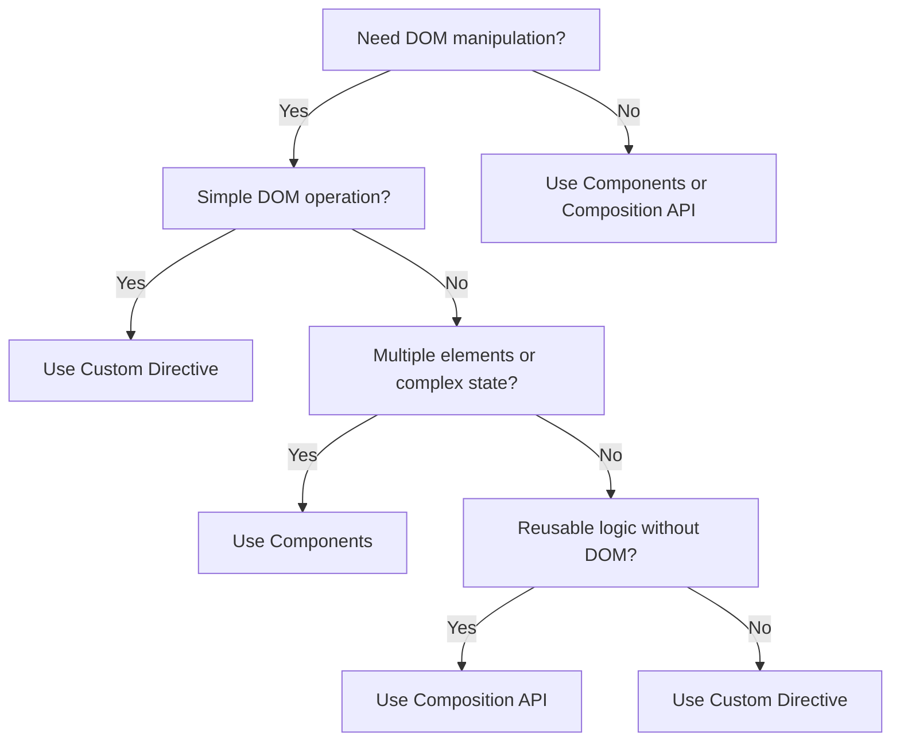

# Vue.js Custom Directives

## Introduction

Vue.js comes with a set of built-in directives like `v-if`, `v-for`, and `v-model` that help you manipulate the DOM declaratively. However, sometimes you need functionality that isn't covered by the built-in directives. This is where custom directives come into play.

Custom directives allow you to directly manipulate the DOM when specific things happen to an element. They're perfect for low-level DOM access and can help you encapsulate repetitive DOM manipulations into reusable components of your application.

In this tutorial, we'll learn:

- What custom directives are and when to use them
- How to create and register custom directives
- The directive hook functions and their arguments
- Building practical custom directives for real-world applications

## What are Custom Directives?

Custom directives are a way to extend HTML elements with reactive behavior that isn't easily achievable with standard Vue features. While components are the main building blocks for creating reusable code in Vue.js, directives focus specifically on DOM manipulations.

### When to Use Custom Directives

Use custom directives when you need to:

1. Directly manipulate the DOM in cases where standard Vue features don't help
2. Apply the same DOM manipulation to multiple elements
3. Extend HTML elements with specific behaviors
4. Perform operations when an element is inserted, updated, or removed

## Creating Basic Custom Directives

### Global Registration

To register a custom directive globally, use the `app.directive` method:

```js
// main.js
const app = createApp(App)

app.directive('focus', {
  mounted(el) {
    el.focus()
  }
})

app.mount('#app')
```

### Local Registration

For component-scoped directives, you can define them in the component options:

```js
export default {
  directives: {
    focus: {
      mounted(el) {
        el.focus()
      }
    }
  }
}
```

### Using the Custom Directive

Once registered, you can use your custom directive in templates with the `v-` prefix:

```html
<template>
  <input v-focus placeholder="This input will be focused on mount" />
</template>
```

## Directive Hook Functions

Custom directives have several lifecycle hooks that are called at specific times:

- `created`: Called before the element's attributes or event listeners are applied
- `beforeMount`: Called right before the element is inserted into the DOM
- `mounted`: Called when the element has been inserted into the DOM
- `beforeUpdate`: Called before the containing component's VNode is updated
- `updated`: Called after the containing component's VNode and the VNodes of its children have updated
- `beforeUnmount`: Called before the element is removed from the DOM
- `unmounted`: Called after the element has been removed from the DOM

Let's see a more complete example:

```js
app.directive('lifecycle', {
  created(el, binding, vnode) {
    console.log('Element created')
  },
  beforeMount(el, binding, vnode) {
    console.log('Element about to be mounted')
  },
  mounted(el, binding, vnode) {
    console.log('Element mounted')
  },
  beforeUpdate(el, binding, vnode, prevVnode) {
    console.log('Element about to update')
  },
  updated(el, binding, vnode, prevVnode) {
    console.log('Element updated')
  },
  beforeUnmount(el, binding, vnode) {
    console.log('Element about to be unmounted')
  },
  unmounted(el, binding, vnode) {
    console.log('Element unmounted')
  }
})
```

## Directive Hook Arguments

Each hook function receives these arguments:

1. `el`: The element the directive is bound to
2. `binding`: An object containing arguments passed to the directive
3. `vnode`: The virtual node produced by Vue's compiler
4. `prevVnode`: The previous virtual node (only available in `beforeUpdate` and `updated`)

The `binding` object contains:

- `value`: The value passed to the directive 
- `oldValue`: The previous value (only available in `beforeUpdate` and `updated`)
- `arg`: Any arguments passed to the directive
- `modifiers`: An object containing modifiers
- `instance`: The instance of the component where the directive is used
- `dir`: The directive definition object

## Shorthand for Mounted and Updated Hooks

If you only need the `mounted` and `updated` hooks with the same functionality, you can pass a function directly:

```js
app.directive('color', (el, binding) => {
  // This will be called for both mounted and updated
  el.style.color = binding.value
})
```

## Practical Examples

Let's build some useful custom directives that you might use in real-world applications.

### Example 1: Tooltip Directive

A directive that shows a tooltip when hovering over an element:

```js
app.directive('tooltip', {
  mounted(el, binding) {
    // Create tooltip element
    const tooltip = document.createElement('div')
    tooltip.className = 'tooltip'
    tooltip.textContent = binding.value
    tooltip.style.position = 'absolute'
    tooltip.style.backgroundColor = '#333'
    tooltip.style.color = 'white'
    tooltip.style.padding = '5px'
    tooltip.style.borderRadius = '5px'
    tooltip.style.display = 'none'
    
    // Add tooltip to document
    document.body.appendChild(tooltip)
    
    // Store tooltip reference
    el._tooltip = tooltip
    
    // Show tooltip on hover
    el.addEventListener('mouseenter', () => {
      const rect = el.getBoundingClientRect()
      tooltip.style.left = rect.left + 'px'
      tooltip.style.top = (rect.bottom + 5) + 'px'
      tooltip.style.display = 'block'
    })
    
    // Hide tooltip when not hovering
    el.addEventListener('mouseleave', () => {
      tooltip.style.display = 'none'
    })
  },
  updated(el, binding) {
    // Update tooltip content if binding value changes
    el._tooltip.textContent = binding.value
  },
  unmounted(el) {
    // Remove tooltip when element is unmounted
    document.body.removeChild(el._tooltip)
  }
})
```

Usage:

```html
<template>
  <button v-tooltip="'Click me to submit'">Submit</button>
</template>
```

### Example 2: Click Outside Directive

A directive that triggers a function when clicking outside an element:

```js
app.directive('click-outside', {
  mounted(el, binding) {
    el._clickOutsideHandler = (event) => {
      // Check if click was outside the element
      if (!(el === event.target || el.contains(event.target))) {
        // Call the provided function
        binding.value(event)
      }
    }
    document.addEventListener('click', el._clickOutsideHandler)
  },
  unmounted(el) {
    // Clean up event listener
    document.removeEventListener('click', el._clickOutsideHandler)
  }
})
```

Usage:

```html
<template>
  <div v-click-outside="closeDropdown" class="dropdown">
    <!-- Dropdown content goes here -->
  </div>
</template>

<script>
export default {
  methods: {
    closeDropdown() {
      this.isDropdownOpen = false
    }
  },
  data() {
    return {
      isDropdownOpen: true
    }
  }
}
</script>
```

### Example 3: Scroll Animation Directive

A directive that applies a CSS class when an element comes into view during scrolling:

```js
app.directive('animate-on-scroll', {
  mounted(el, binding) {
    // Default animation class
    const animationClass = binding.value || 'fade-in'
    
    // Create intersection observer
    const observer = new IntersectionObserver((entries) => {
      entries.forEach(entry => {
        if (entry.isIntersecting) {
          // Add animation class when element is visible
          el.classList.add(animationClass)
          // Stop observing once animation is triggered
          observer.unobserve(el)
        }
      })
    }, { threshold: 0.1 }) // Element is 10% visible
    
    // Start observing the element
    observer.observe(el)
    
    // Store observer for cleanup
    el._scrollObserver = observer
  },
  unmounted(el) {
    // Clean up observer when element is unmounted
    if (el._scrollObserver) {
      el._scrollObserver.disconnect()
    }
  }
})
```

Usage:

```html
<template>
  <div>
    <h2 v-animate-on-scroll="'slide-in'">This will animate when scrolled into view</h2>
    <p v-animate-on-scroll>This uses the default animation</p>
  </div>
</template>

<style>
.fade-in {
  animation: fadeIn 1s ease-in forwards;
}

.slide-in {
  animation: slideIn 1s ease-out forwards;
}

@keyframes fadeIn {
  from { opacity: 0; }
  to { opacity: 1; }
}

@keyframes slideIn {
  from { transform: translateX(-50px); opacity: 0; }
  to { transform: translateX(0); opacity: 1; }
}
</style>
```

### Example 4: Directive with Arguments and Modifiers

A resize directive that changes an element's style based on the window size:

```js
app.directive('resize', {
  mounted(el, binding) {
    const { arg, value, modifiers } = binding
    
    el._resizeHandler = () => {
      const width = window.innerWidth
      
      // Handle different size breakpoints based on modifiers
      if (modifiers.small && width < 768) {
        el.style[arg || 'fontSize'] = value
      } else if (modifiers.medium && width >= 768 && width < 1024) {
        el.style[arg || 'fontSize'] = value
      } else if (modifiers.large && width >= 1024) {
        el.style[arg || 'fontSize'] = value
      } else if (!Object.keys(modifiers).length) {
        // No modifiers, always apply
        el.style[arg || 'fontSize'] = value
      }
    }
    
    // Run once on mount
    el._resizeHandler()
    
    // Add event listener for resize
    window.addEventListener('resize', el._resizeHandler)
  },
  unmounted(el) {
    // Clean up
    window.removeEventListener('resize', el._resizeHandler)
  }
})
```

Usage:

```html
<template>
  <div>
    <!-- Changes font size to 20px on small screens -->
    <h1 v-resize:fontSize.small="'20px'">Responsive Title</h1>
    
    <!-- Changes padding to 2rem on medium screens -->
    <div v-resize:padding.medium="'2rem'">Content</div>
    
    <!-- Changes margin to 40px on large screens -->
    <footer v-resize:margin.large="'40px'">Footer</footer>
  </div>
</template>
```

## Best Practices for Custom Directives

1. **Keep directives focused**: Directives should do one thing and do it well
2. **Clean up resources**: Always remove event listeners and clean up any DOM nodes created by your directive
3. **Use components when appropriate**: If your feature needs complex internal state or multiple elements, a component might be a better choice
4. **Be mindful of performance**: Manipulating the DOM can be expensive, so optimize your directives for performance
5. **Test thoroughly**: Test your directives across different browsers and device sizes

## Custom Directives vs. Components vs. Composition API

Let's compare when to use each approach:



## Summary

Custom directives are a powerful feature in Vue.js that allow you to manipulate the DOM directly in a reusable way. They're perfect for:

- Focusing elements automatically
- Managing event listeners outside components
- Creating tooltips, popovers, or modals
- Implementing scroll animations
- Handling accessibility features

By understanding the hook functions and their arguments, you can create complex directives that extend HTML elements with powerful reactive behaviors.

## Exercises

1. Create a `v-lazy-load` directive for images that only loads them when they come into view
2. Build a `v-longpress` directive that triggers a function when an element is pressed for a specific duration
3. Implement a `v-ripple` directive that creates a material design-style ripple effect when an element is clicked
4. Create a `v-format` directive that formats input values (e.g., as currency, phone number, or date)
5. Build a `v-draggable` directive that allows an element to be dragged around the page

## Additional Resources

- [Vue.js Official Documentation on Custom Directives](https://vuejs.org/guide/reusability/custom-directives.html)
- [Vue.js Examples Repository](https://vuejs.org/examples/)
- [Vue.js GitHub Repository](https://github.com/vuejs/core)

By mastering custom directives, you'll add another powerful tool to your Vue.js toolkit that helps you create more interactive and user-friendly applications.