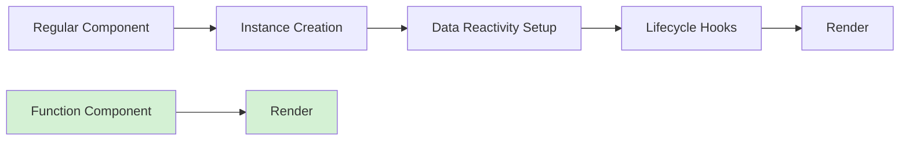

# Vue.js Function Components

## Introduction

Function components represent one of Vue's more advanced patterns that can significantly improve your application's performance and maintainability. In this guide, you'll learn what function components are, when to use them, and how they differ from standard components.

Function components (also known as functional components) are lightweight, stateless components that don't have their own instance. They're perfect for simple presentation logic and can render more efficiently than standard components.

## What Are Function Components?

Function components in Vue.js are components that:

- Are stateless (no `data` property)
- Have no lifecycle hooks
- Have no instance (no `this` context)
- Are cheaper and faster to render
- Render based purely on the props they receive

Think of them as pure functions that take props as input and return rendered virtual DOM as output, without any side effects.

## Defining Function Components

### Vue 2 Syntax

In Vue 2, you can create function components in two ways:

#### 1. Using the `functional` property:

```html
<template functional>
  <div>
    Hello {{ props.name }}
  </div>
</template>

<script>
export default {
  props: {
    name: {
      type: String,
      required: true
    }
  }
}
</script>
```

#### 2. Using JavaScript functions:

```javascript
export default {
  functional: true,
  props: ['name'],
  render(createElement, context) {
    return createElement('div', `Hello ${context.props.name}`);
  }
}
```

### Vue 3 Syntax

In Vue 3, the API was simplified. Function components are just plain functions:

```javascript
import { h } from 'vue'

const HelloWorld = (props) => {
  return h('div', `Hello ${props.name}`)
}

// To register props and other component options
HelloWorld.props = {
  name: String
}

export default HelloWorld
```

Alternatively, you can use JSX if you have it configured:

```jsx
const HelloWorld = (props) => {
  return <div>Hello {props.name}</div>
}

HelloWorld.props = {
  name: String
}

export default HelloWorld
```

## When to Use Function Components

Function components are best used when:

1. Your component only depends on props (no internal state)
2. You need to render large lists of simple components
3. You're implementing simple presentation logic
4. Performance optimization is needed

## Comparing Function vs Regular Components

Let's compare a function component with its standard counterpart:

### Regular Component:

```html
<template>
  <button 
    class="btn" 
    :class="[type ? `btn-${type}` : '', { active: isActive }]" 
    @click="$emit('click')">
    <slot></slot>
  </button>
</template>

<script>
export default {
  name: 'AppButton',
  props: {
    type: {
      type: String,
      default: 'primary'
    },
    isActive: {
      type: Boolean,
      default: false
    }
  }
}
</script>
```

### Function Component Version:

```javascript
// ButtonFunc.js (Vue 3)
import { h } from 'vue'

const ButtonFunc = (props, { slots, emit }) => {
  const btnClass = [
    'btn',
    props.type ? `btn-${props.type}` : '',
    { active: props.isActive }
  ]
  
  return h('button', {
    class: btnClass,
    onClick: () => emit('click')
  }, slots.default?.())
}

ButtonFunc.props = {
  type: {
    type: String,
    default: 'primary'
  },
  isActive: {
    type: Boolean,
    default: false
  }
}

export default ButtonFunc
```

## Practical Examples

### 1. List Item Component

A common use case for function components is rendering list items:

```javascript
// ListItem.js (Vue 3)
import { h } from 'vue'

const ListItem = (props) => {
  return h('li', { class: 'list-item' }, [
    h('div', { class: 'list-item-title' }, props.item.title),
    h('div', { class: 'list-item-subtitle' }, props.item.subtitle)
  ])
}

ListItem.props = {
  item: {
    type: Object,
    required: true
  }
}

export default ListItem
```

Usage:

```html
<template>
  <ul class="list">
    <list-item v-for="item in items" :key="item.id" :item="item" />
  </ul>
</template>

<script>
import ListItem from './ListItem.js'

export default {
  components: {
    ListItem
  },
  data() {
    return {
      items: [
        { id: 1, title: 'Item 1', subtitle: 'Description 1' },
        { id: 2, title: 'Item 2', subtitle: 'Description 2' },
        { id: 3, title: 'Item 3', subtitle: 'Description 3' }
      ]
    }
  }
}
</script>
```

### 2. Icon Component

Icons are perfect for function components because they're simple and frequently used:

```javascript
// Icon.js (Vue 3)
import { h } from 'vue'

const Icon = (props) => {
  const iconClass = ['icon', `icon-${props.name}`]
  
  if (props.spin) {
    iconClass.push('icon-spin')
  }
  
  return h('i', { 
    class: iconClass,
    style: {
      color: props.color,
      fontSize: props.size ? `${props.size}px` : null
    }
  })
}

Icon.props = {
  name: {
    type: String,
    required: true
  },
  color: String,
  size: Number,
  spin: Boolean
}

export default Icon
```

Usage:

```html
<template>
  <div>
    <icon name="user" size="24" color="blue" />
    <icon name="spinner" spin />
    <icon name="heart" color="red" />
  </div>
</template>

<script>
import Icon from './Icon.js'

export default {
  components: {
    Icon
  }
}
</script>
```

### 3. Dynamic Form Label

A function component that formats form labels with optional required indicators:

```javascript
// FormLabel.js (Vue 3)
import { h } from 'vue'

const FormLabel = (props) => {
  const children = [props.label]
  
  if (props.required) {
    children.push(h('span', {
      class: 'required-indicator',
      style: { color: 'red' }
    }, ' *'))
  }
  
  if (props.helpText) {
    children.push(h('div', {
      class: 'help-text',
      style: { fontSize: '12px', color: '#666' }
    }, props.helpText))
  }
  
  return h('label', {
    class: ['form-label', props.labelClass],
    for: props.for
  }, children)
}

FormLabel.props = {
  label: {
    type: String,
    required: true
  },
  required: Boolean,
  for: String,
  helpText: String,
  labelClass: [String, Array, Object]
}

export default FormLabel
```

Usage:

```html
<template>
  <div class="form-group">
    <form-label 
      label="Username" 
      for="username" 
      required 
      help-text="Enter a unique username" />
    <input id="username" type="text" />
    
    <form-label 
      label="Bio" 
      for="bio"
      help-text="Tell us about yourself (optional)" />
    <textarea id="bio"></textarea>
  </div>
</template>

<script>
import FormLabel from './FormLabel.js'

export default {
  components: {
    FormLabel
  }
}
</script>
```

## Understanding the Context Object

In Vue 3 function components, the second parameter is the context object which contains several useful properties:

```javascript
const MyComponent = (props, context) => {
  // Available properties:
  const { attrs, slots, emit, expose } = context
  
  // attrs: Non-prop attributes
  // slots: Contains all slots
  // emit: Method to emit events
  // expose: Method to expose public properties (new in Vue 3)
  
  return h('div', attrs, slots.default?.())
}
```

## Performance Benefits

Function components offer performance benefits because:

1. They skip the creation of Vue instances
2. They don't have reactive data or computed properties
3. They don't trigger lifecycle hooks
4. They're faster to initialize and render



## Best Practices for Function Components

1. **Keep them simple**: Function components are best for presentational logic.
2. **Props validation**: Always define props for clarity and documentation.
3. **Avoid stateful logic**: If you need state, use a regular component.
4. **Consider memoization**: To prevent unnecessary re-renders in large lists.

## Common Pitfalls

1. **Accessing instance properties**: Remember there's no `this` in function components.
2. **Lifecycle hooks**: Function components don't have lifecycle hooks.
3. **Over-optimization**: Don't convert all components to function components; use them where appropriate.

## Summary

Function components in Vue.js offer a lightweight alternative to regular components when you need simple, stateless rendering. They're perfect for performance-critical scenarios like rendering large lists or implementing simple UI elements like buttons, icons, and labels.

Key takeaways:
- Function components are stateless and have no instance
- They're faster and more efficient than regular components
- They're best used for presentational components
- The syntax differs between Vue 2 and Vue 3
- Function components receive props and context as parameters

## Exercises

1. Convert a simple button component to a function component
2. Create a function component for displaying user avatars with different sizes
3. Implement a badge function component that shows different colors based on status
4. Create a functional component that renders different heading levels (h1-h6) based on props
5. Build a star rating component using function components

## Additional Resources

- [Vue.js Official Documentation on Function Components](https://v3.vuejs.org/guide/render-function.html#functional-components)
- [Performance Optimization in Vue](https://vuejs.org/guide/best-practices/performance.html)
- [Vue 3 Render Functions](https://vuejs.org/guide/extras/render-function.html)
- [Function Components in Vue 3 Composition API](https://vuejs.org/api/composition-api-setup.html)

Now that you understand function components, you can use them to optimize your Vue.js applications and write cleaner, more performance-focused code!