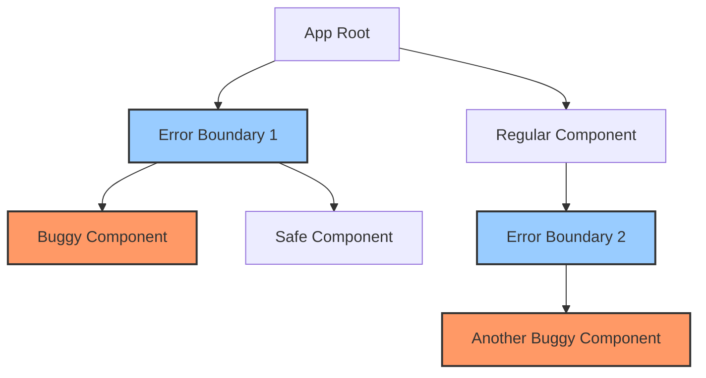

# Vue.js Error Boundaries

## Introduction

When building Vue.js applications, error handling is a critical aspect that can significantly improve user experience. In large applications, an error in one component shouldn't cause the entire application to crash. This is where **Error Boundaries** come into play.

Error boundaries are a pattern that allows you to catch JavaScript errors anywhere in a component tree, log those errors, and display a fallback UI instead of crashing the whole application. While React has built-in Error Boundary components, Vue handles this differently. In this tutorial, we'll explore how to implement error boundaries in Vue.js applications.

## Understanding Error Boundaries in Vue

Unlike React, Vue doesn't have a built-in Error Boundary component. However, Vue provides powerful error handling hooks that allow us to implement similar functionality. Vue's error handling happens at these levels:

1. Component-level error handling using `errorCaptured` hook
2. Global error handling using `app.config.errorHandler`

Let's understand how to use these mechanisms to create error boundaries in our Vue applications.

## Implementing Error Boundaries with `errorCaptured`

The `errorCaptured` hook in Vue components allows you to catch errors from any child components. This is the foundation for our error boundary implementation.

### Basic Error Boundary Component

```html
<template>
  <div>
    <div v-if="error" class="error-boundary">
      <h2>Something went wrong</h2>
      <p>{{ error }}</p>
      <button @click="resetError">Try again</button>
    </div>
    <slot v-else></slot>
  </div>
</template>

<script>
export default {
  name: 'ErrorBoundary',
  data() {
    return {
      error: null
    }
  },
  errorCaptured(err, vm, info) {
    this.error = `${err.toString()}\nInfo: ${info}`;
    return false; // Prevent error from propagating further
  },
  methods: {
    resetError() {
      this.error = null;
    }
  }
}
</script>

<style scoped>
.error-boundary {
  padding: 20px;
  border: 1px solid #f56c6c;
  background-color: #fef0f0;
  border-radius: 4px;
}
</style>
```

This component:
1. Catches errors from child components using `errorCaptured` lifecycle hook
2. Stores the error in component state
3. Displays a fallback UI when an error occurs
4. Provides a way to reset the state and try again

### Using the Error Boundary Component

Now that we have our error boundary component, let's see how to use it:

```html
<template>
  <div class="app">
    <h1>Vue Error Boundary Demo</h1>
    
    <ErrorBoundary>
      <BuggyComponent />
    </ErrorBoundary>
    
    <div class="safe-section">
      <p>This part of the UI will remain intact even if the component above crashes</p>
    </div>
  </div>
</template>

<script>
import ErrorBoundary from './components/ErrorBoundary.vue';
import BuggyComponent from './components/BuggyComponent.vue';

export default {
  components: {
    ErrorBoundary,
    BuggyComponent
  }
}
</script>
```

Here's an example of a component that will trigger an error:

```html
<template>
  <div>
    <h2>Buggy Component</h2>
    <button @click="triggerError">Trigger Error</button>
    <p>{{ nonExistentProperty.something }}</p>
  </div>
</template>

<script>
export default {
  name: 'BuggyComponent',
  methods: {
    triggerError() {
      throw new Error('Manually triggered error');
    }
  }
}
</script>
```

When this component attempts to access `nonExistentProperty.something` or when the user clicks the "Trigger Error" button, it will throw an error that will be caught by our ErrorBoundary component.

## Error Boundaries in Vue 3 with Composition API

For Vue 3 projects using the Composition API, we can implement error boundaries like this:

```html
<template>
  <div>
    <div v-if="error" class="error-boundary">
      <h2>Something went wrong</h2>
      <p>{{ error }}</p>
      <button @click="resetError">Try again</button>
    </div>
    <slot v-else></slot>
  </div>
</template>

<script setup>
import { ref } from 'vue';

const error = ref(null);

function resetError() {
  error.value = null;
}

// Error boundary logic
const errorCaptured = (err, instance, info) => {
  error.value = `${err.toString()}\nInfo: ${info}`;
  return false; // Prevents error from propagating further
};

// Expose the error handling hook
defineExpose({
  errorCaptured
});
</script>

<style scoped>
.error-boundary {
  padding: 20px;
  border: 1px solid #f56c6c;
  background-color: #fef0f0;
  border-radius: 4px;
}
</style>
```

## Global Error Handling

While component-level error boundaries are powerful, Vue also provides a global error handler that can catch errors that aren't captured by error boundaries or that occur outside the component lifecycle.

```js
// main.js
import { createApp } from 'vue'
import App from './App.vue'

const app = createApp(App)

app.config.errorHandler = (err, vm, info) => {
  // Handle error
  // err: error being caught
  // vm: component in which error occurred
  // info: Vue-specific error information e.g. lifecycle hook, events etc.
  console.error('Global error:', err);
  console.error('Component:', vm);
  console.error('Info:', info);
  
  // You could also log to an error tracking service here
  // logErrorToService(err, info);
};

app.mount('#app')
```

This global handler will catch any errors not handled by component-level error boundaries.

## Real-World Use Case: Dynamic Component Loading

Error boundaries are particularly useful when loading components dynamically. For example, when building a dashboard with multiple widgets that load independently:

```html
<template>
  <div class="dashboard">
    <h1>Dashboard</h1>
    
    <div class="widgets-container">
      <div v-for="(widget, index) in widgets" :key="index" class="widget">
        <ErrorBoundary>
          <component :is="widget.component" v-bind="widget.props" />
        </ErrorBoundary>
      </div>
    </div>
  </div>
</template>

<script>
import ErrorBoundary from './components/ErrorBoundary.vue';
import AnalyticsWidget from './widgets/AnalyticsWidget.vue';
import RevenueWidget from './widgets/RevenueWidget.vue';
import UserWidget from './widgets/UserWidget.vue';

export default {
  components: {
    ErrorBoundary,
    AnalyticsWidget,
    RevenueWidget,
    UserWidget
  },
  data() {
    return {
      widgets: [
        { component: 'AnalyticsWidget', props: { period: 'week' } },
        { component: 'RevenueWidget', props: { showChart: true } },
        { component: 'UserWidget', props: { limit: 5 } }
      ]
    };
  }
}
</script>

<style scoped>
.widgets-container {
  display: grid;
  grid-template-columns: repeat(auto-fill, minmax(300px, 1fr));
  gap: 20px;
}

.widget {
  border: 1px solid #ddd;
  border-radius: 4px;
  padding: 15px;
}
</style>
```

With this approach, if one widget crashes, the others will continue to function properly, providing a much better user experience.

## Advanced Error Boundary Pattern: Error Recovery

We can enhance our error boundary component to provide recovery options:

```html
<template>
  <div>
    <div v-if="error" class="error-boundary">
      <h2>{{ errorTitle }}</h2>
      <p class="error-message">{{ error }}</p>
      <div class="error-actions">
        <button @click="resetError" class="retry-btn">Try again</button>
        <button v-if="hasRetryFn" @click="retryOperation" class="retry-btn primary">
          Retry Operation
        </button>
      </div>
    </div>
    <slot v-else></slot>
  </div>
</template>

<script>
export default {
  name: 'EnhancedErrorBoundary',
  props: {
    errorTitle: {
      type: String,
      default: 'Something went wrong'
    },
    retryFunction: {
      type: Function,
      default: null
    }
  },
  data() {
    return {
      error: null,
      errorInfo: null,
      errorComponent: null
    }
  },
  computed: {
    hasRetryFn() {
      return this.retryFunction !== null;
    }
  },
  errorCaptured(err, vm, info) {
    this.error = err.toString();
    this.errorInfo = info;
    this.errorComponent = vm;
    
    // Log error to monitoring service
    this.logError(err, vm, info);
    
    return false; // Prevent error from propagating
  },
  methods: {
    resetError() {
      this.error = null;
      this.errorInfo = null;
      this.errorComponent = null;
    },
    retryOperation() {
      if (this.retryFunction) {
        this.retryFunction(this.errorComponent);
        this.resetError();
      }
    },
    logError(err, vm, info) {
      console.error('Error:', err);
      console.error('Component:', vm);
      console.error('Info:', info);
      
      // Here you would typically send this to your error tracking service
      // Example: errorTrackingService.captureError(err, { extra: { componentName: vm.$options.name, info } });
    }
  }
}
</script>

<style scoped>
.error-boundary {
  padding: 20px;
  border: 1px solid #f56c6c;
  background-color: #fef0f0;
  border-radius: 4px;
  text-align: center;
}

.error-message {
  font-family: monospace;
  white-space: pre-wrap;
  text-align: left;
  background: rgba(0,0,0,0.05);
  padding: 10px;
  border-radius: 3px;
}

.error-actions {
  display: flex;
  justify-content: center;
  gap: 10px;
  margin-top: 15px;
}

.retry-btn {
  padding: 8px 16px;
  border-radius: 4px;
  cursor: pointer;
  border: 1px solid #dcdfe6;
  background-color: #f4f4f5;
}

.retry-btn.primary {
  background-color: #409eff;
  color: white;
  border-color: #409eff;
}
</style>
```

Usage example with retry functionality:

```html
<template>
  <div>
    <EnhancedErrorBoundary :retryFunction="retryDataFetch">
      <DataFetchingComponent :endpoint="endpoint" />
    </EnhancedErrorBoundary>
  </div>
</template>

<script>
import EnhancedErrorBoundary from './components/EnhancedErrorBoundary.vue';
import DataFetchingComponent from './components/DataFetchingComponent.vue';

export default {
  components: {
    EnhancedErrorBoundary,
    DataFetchingComponent
  },
  data() {
    return {
      endpoint: '/api/data'
    }
  },
  methods: {
    retryDataFetch(component) {
      // Access the component instance and call its fetch method
      if (component && component.fetchData) {
        component.fetchData();
      }
    }
  }
}
</script>
```

## Error Boundary Visualization

Here's a diagram showing how error boundaries work in a Vue application:



When an error occurs in component D, Error Boundary 1 catches it and displays a fallback UI. Similarly, if component G fails, Error Boundary 2 catches that error. The rest of the application continues to work normally.

## Summary

Error boundaries in Vue.js provide a powerful pattern for making robust applications that gracefully handle errors. By implementing error boundaries:

1. You can prevent component errors from crashing your entire application
2. You can display user-friendly fallback UIs when errors occur
3. You can log errors for debugging and monitoring
4. You can provide recovery mechanisms for better user experience

While Vue doesn't have built-in error boundary components like React, you can easily implement them using Vue's `errorCaptured` hook and global error handler. This pattern is especially valuable in large applications with many independent components or when working with third-party components that might not be fully reliable.

## Additional Resources and Exercises

### Resources:
- [Vue.js Official Error Handling Documentation](https://vuejs.org/guide/essentials/error-handling.html)
- [Vue.js Error Handler Configuration](https://vuejs.org/api/application.html#app-config-errorhandler)

### Exercises:

1. **Basic Implementation**: Create an error boundary component and test it with a component that deliberately throws an error.

2. **Error Reporting**: Enhance your error boundary to send error reports to a mock API endpoint.

3. **Recovery Logic**: Implement a specialized error boundary for form components that preserves user input when an error occurs in a form submission process.

4. **Nested Error Boundaries**: Create a component tree with nested error boundaries and observe how errors are caught at different levels.

5. **Async Error Handling**: Build an error boundary that can properly handle errors in async operations like API calls.

By mastering error boundaries, you'll be able to create more resilient Vue applications that provide better user experiences even when things go wrong.