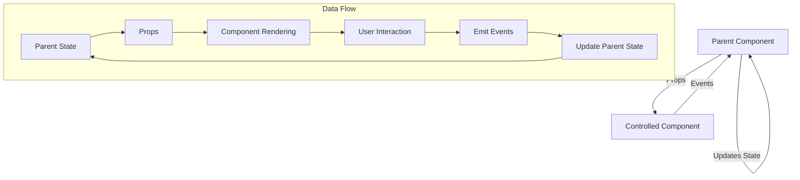

# Vue.js Controlled Components

## Introduction

Controlled components are a design pattern commonly used in component-based frameworks to manage form inputs and component state. In Vue.js, a controlled component is one where the data displayed by the component is controlled by its parent through props, and changes are communicated back to the parent via events. This creates a single source of truth for your application's state and enables powerful patterns for form validation, state management, and component reuse.

The controlled component pattern is inspired by React's approach to form handling but implemented with Vue's unique reactivity system and event mechanisms.

## Basic Concept

In a controlled component, two key principles are followed:

1. Component's display value is controlled by a prop from the parent
2. When user interaction causes a value change, the component emits an event to the parent instead of directly modifying its own state

This creates a one-way data flow:
```
Parent State → Props → Child Component → Events → Update Parent State
```

## Simple Controlled Input Example

Let's start with a basic example - a controlled text input:

```html
<template>
  <div>
    <label>{{ label }}</label>
    <input
      :value="value"
      @input="$emit('input', $event.target.value)"
      :placeholder="placeholder"
      type="text"
    />
  </div>
</template>

<script>
export default {
  name: 'ControlledInput',
  props: {
    value: {
      type: String,
      default: ''
    },
    label: {
      type: String,
      default: ''
    },
    placeholder: {
      type: String,
      default: ''
    }
  }
}
</script>
```

And here's how you would use this component in a parent:

```html
<template>
  <div>
    <h2>User Information</h2>
    <controlled-input
      v-model="username"
      label="Username"
      placeholder="Enter your username"
    />
    <p>Current username: {{ username }}</p>
  </div>
</template>

<script>
import ControlledInput from './ControlledInput.vue'

export default {
  components: {
    ControlledInput
  },
  data() {
    return {
      username: ''
    }
  }
}
</script>
```

In this example, the `v-model` directive is equivalent to:

```html
<controlled-input
  :value="username"
  @input="username = $event"
  label="Username"
  placeholder="Enter your username"
/>
```

## How It Works

Let's break down how controlled components work in Vue.js:

1. The parent component maintains the state in its `data` option
2. This state is passed to the child as a prop
3. The child renders based on the prop value but doesn't store or modify this value itself
4. When a user interacts with the child component (e.g., types in an input), the child emits an event
5. The parent listens for this event and updates its state accordingly
6. The updated state flows back down to the child as a prop

This creates a complete cycle of data flow.

## Creating Custom v-model Components (Vue 2)

In Vue 2, `v-model` uses the `value` prop and `input` event by default. Creating a component that works with `v-model` means following this convention:

```html
<template>
  <div class="custom-checkbox">
    <input 
      type="checkbox" 
      :checked="value" 
      @change="$emit('input', $event.target.checked)" 
    />
    <label>{{ label }}</label>
  </div>
</template>

<script>
export default {
  props: {
    value: Boolean,
    label: String
  }
}
</script>
```

Usage:
```html
<template>
  <div>
    <custom-checkbox v-model="agreeToTerms" label="I agree to the terms" />
    <p>User agreement status: {{ agreeToTerms ? 'Agreed' : 'Not agreed' }}</p>
  </div>
</template>

<script>
import CustomCheckbox from './CustomCheckbox.vue'

export default {
  components: {
    CustomCheckbox
  },
  data() {
    return {
      agreeToTerms: false
    }
  }
}
</script>
```

## Custom v-model in Vue 3

Vue 3 allows more flexibility with the `v-model`. You can customize the prop and event name:

```html
<template>
  <div class="rating-selector">
    <div class="stars">
      <span 
        v-for="n in 5" 
        :key="n"
        :class="{ active: modelValue >= n }"
        @click="$emit('update:modelValue', n)"
      >
        ★
      </span>
    </div>
  </div>
</template>

<script>
export default {
  props: {
    modelValue: {
      type: Number,
      default: 0
    }
  },
  emits: ['update:modelValue']
}
</script>

<style scoped>
.stars {
  cursor: pointer;
  font-size: 24px;
}
.active {
  color: gold;
}
</style>
```

Usage:
```html
<template>
  <div>
    <h3>Rate our service:</h3>
    <star-rating v-model="rating" />
    <p>Your rating: {{ rating }} stars</p>
  </div>
</template>

<script>
import StarRating from './StarRating.vue'

export default {
  components: {
    StarRating
  },
  data() {
    return {
      rating: 0
    }
  }
}
</script>
```

## Multiple v-model Bindings (Vue 3)

Vue 3 allows using multiple `v-model` bindings on a single component:

```html
<template>
  <div class="user-form-field">
    <input 
      :value="firstName"
      @input="$emit('update:firstName', $event.target.value)"
      placeholder="First name"
    />
    <input 
      :value="lastName"
      @input="$emit('update:lastName', $event.target.value)"
      placeholder="Last name"
    />
  </div>
</template>

<script>
export default {
  props: {
    firstName: String,
    lastName: String
  },
  emits: ['update:firstName', 'update:lastName']
}
</script>
```

Usage:
```html
<template>
  <div>
    <name-input
      v-model:firstName="user.firstName"
      v-model:lastName="user.lastName"
    />
    <p>Full name: {{ user.firstName }} {{ user.lastName }}</p>
  </div>
</template>

<script>
import NameInput from './NameInput.vue'

export default {
  components: {
    NameInput
  },
  data() {
    return {
      user: {
        firstName: '',
        lastName: ''
      }
    }
  }
}
</script>
```

## Real-world Example: Form Validation

Controlled components shine when implementing form validation. Here's a practical example:

```html
<template>
  <div class="controlled-input">
    <label :for="id">{{ label }}</label>
    <input
      :id="id"
      :value="value"
      @input="handleInput"
      :class="{ 'is-invalid': showError }"
      :type="type"
    />
    <div v-if="showError" class="error-message">
      {{ errorMessage }}
    </div>
  </div>
</template>

<script>
export default {
  props: {
    id: {
      type: String,
      required: true
    },
    label: {
      type: String,
      default: ''
    },
    value: {
      type: String,
      default: ''
    },
    type: {
      type: String,
      default: 'text'
    },
    validator: {
      type: Function,
      default: () => null
    },
    touched: {
      type: Boolean,
      default: false
    }
  },
  computed: {
    errorMessage() {
      return this.validator ? this.validator(this.value) : null
    },
    showError() {
      return this.touched && this.errorMessage
    }
  },
  methods: {
    handleInput(e) {
      this.$emit('input', e.target.value)
      this.$emit('update:touched', true)
    }
  }
}
</script>

<style scoped>
.is-invalid {
  border-color: red;
}
.error-message {
  color: red;
  font-size: 0.8rem;
  margin-top: 5px;
}
</style>
```

And here's how you would use it in a form:

```html
<template>
  <form @submit.prevent="submitForm">
    <controlled-input
      id="email"
      label="Email"
      v-model="form.email"
      :touched="touched.email"
      @update:touched="touched.email = true"
      :validator="validateEmail"
    />
    
    <controlled-input
      id="password"
      label="Password"
      type="password"
      v-model="form.password"
      :touched="touched.password"
      @update:touched="touched.password = true"
      :validator="validatePassword"
    />
    
    <button 
      type="submit"
      :disabled="!isFormValid"
    >
      Submit
    </button>
  </form>
</template>

<script>
import ControlledInput from './ControlledInput.vue'

export default {
  components: {
    ControlledInput
  },
  data() {
    return {
      form: {
        email: '',
        password: ''
      },
      touched: {
        email: false,
        password: false
      }
    }
  },
  computed: {
    isFormValid() {
      return !this.validateEmail(this.form.email) && 
             !this.validatePassword(this.form.password)
    }
  },
  methods: {
    validateEmail(email) {
      if (!email) return 'Email is required'
      const emailRegex = /^[^\s@]+@[^\s@]+\.[^\s@]+$/
      if (!emailRegex.test(email)) return 'Please enter a valid email'
      return null
    },
    validatePassword(password) {
      if (!password) return 'Password is required'
      if (password.length < 8) return 'Password must be at least 8 characters'
      return null
    },
    submitForm() {
      // Set all fields as touched
      Object.keys(this.touched).forEach(key => {
        this.touched[key] = true
      })
      
      // If form is valid, proceed with submission
      if (this.isFormValid) {
        console.log('Form submitted:', this.form)
        // Here you would typically make an API call
      }
    }
  }
}
</script>
```

## Advantages of Controlled Components

1. **Single Source of Truth**: The state lives in one place (the parent), making your application more predictable and easier to debug.

2. **Immediate Validation**: Since every keystroke flows through the parent, you can perform validations or transformations on the data immediately.

3. **Conditional Rendering**: You can conditionally render elements or attributes based on the input's value or validation state.

4. **Reusability**: Controlled components can be easily reused across your application, with behavior determined by props.

5. **Integration with State Management**: Easily connect your form components with Vuex or other state management solutions.

## Flow Diagram of Controlled Components



## When Not to Use Controlled Components

While controlled components are powerful, they aren't always the best choice:

1. **Simple Forms**: For simple, isolated forms with no validation needs, uncontrolled components may be simpler.

2. **Performance Concerns**: If you have a high-frequency input (like a drawing canvas), the prop/event cycle can cause performance issues.

3. **Independent Components**: When a component truly manages its own state independently and doesn't need to share it.

## Summary

Controlled components in Vue.js provide a powerful pattern for managing form inputs and component state. By passing data via props and communicating changes via events, you create a unidirectional data flow that makes your application more predictable and easier to reason about.

Key takeaways:

- Controlled components receive their current value from props
- They notify changes via events rather than modifying their own state
- They enable powerful patterns for form validation and state management
- Vue's v-model provides a convenient shorthand syntax for this pattern
- Vue 3 offers enhanced v-model capabilities with multiple bindings

By mastering controlled components, you'll create more maintainable, testable, and flexible Vue applications.

## Additional Resources

- Practice building a complex form with multiple controlled components
- Try implementing a multi-step form wizard using controlled components
- Explore integrating controlled components with Vuex for global state management
- Experiment with creating specialized input components (date pickers, sliders, color pickers) as controlled components

## Exercise Ideas

1. Create a controlled component for a money input that formats currency as the user types
2. Build a form with conditional fields that appear based on other field values
3. Implement a component that provides different visual feedback based on validation rules
4. Create a dynamic form builder that uses controlled components for all inputs