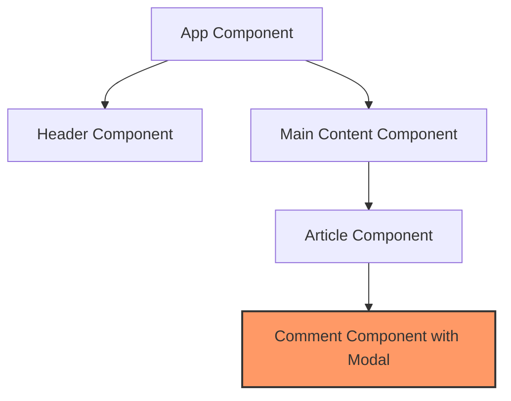
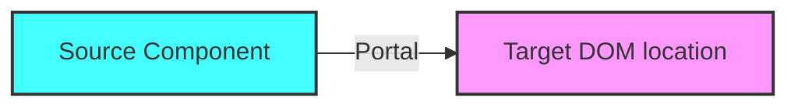

# Vue.js Portal Pattern

## Introduction

The Portal Pattern (also known as Teleport in Vue 3) is a powerful technique that allows you to render a piece of content at a different place in the DOM tree while keeping the component logic in its original location. This solves the common problem of "DOM hierarchy constraints" that developers often encounter when building complex UI components like modals, tooltips, or dropdown menus.

In many situations, the visual representation of a component is tightly coupled with the DOM structure, which can lead to styling and positioning challenges. The Portal Pattern breaks this constraint by enabling you to "teleport" content anywhere in the DOM.

## Understanding the Need for Portals

Before diving into portals, let's understand why they are necessary:



When a deeply nested component like `Comment` needs to display a modal dialog, the traditional approach would render the modal within the component. However, this presents several issues:

1. **CSS complications** - The modal might inherit unwanted styles from parent elements
2. **z-index battles** - Managing stacking contexts becomes difficult
3. **Overflow/clipping issues** - Parent elements with `overflow: hidden` might clip the modal

The Portal Pattern solves these problems by allowing you to render content at a specific DOM location regardless of the component hierarchy.

## Vue 2 vs Vue 3 Approach

### Vue 2: Portal-Vue

In Vue 2, we typically used a third-party library called `portal-vue`:

```bash
# Installing in Vue 2
npm install portal-vue
```

Then register it in your main.js:

```js
import Vue from 'vue'
import PortalVue from 'portal-vue'

Vue.use(PortalVue)
```

### Vue 3: Built-in Teleport

Vue 3 introduced a native `<Teleport>` component, removing the need for external libraries:

```html
<template>
  <div class="container">
    <button @click="showModal = true">Show Modal</button>
    
    <teleport to="body">
      <div v-if="showModal" class="modal">
        <h2>I'm a modal!</h2>
        <p>Even though I'm defined in a deeply nested component, I appear at the body level!</p>
        <button @click="showModal = false">Close</button>
      </div>
    </teleport>
  </div>
</template>

<script>
export default {
  data() {
    return {
      showModal: false
    }
  }
}
</script>

<style>
.modal {
  position: fixed;
  top: 0;
  left: 0;
  right: 0;
  bottom: 0;
  background-color: rgba(0, 0, 0, 0.5);
  display: flex;
  flex-direction: column;
  align-items: center;
  justify-content: center;
  z-index: 100;
}
</style>
```

## How the Portal Pattern Works

The Portal Pattern consists of two main parts:

1. **Source** - Where the content is defined in your component structure
2. **Target** - Where the content actually appears in the DOM

Here's a visual representation:



## Key Features of Teleport in Vue 3

1. **Target Selection**: The `to` prop accepts any valid CSS selector to specify the target element.

```html
<!-- Teleport to an element with id="modal-container" -->
<teleport to="#modal-container">...</teleport>

<!-- Teleport to the first element matching a class -->
<teleport to=".modals-wrapper">...</teleport>

<!-- Teleport to body -->
<teleport to="body">...</teleport>
```

2. **Conditional Teleporting**: You can conditionally disable teleporting with the `disabled` prop.

```html
<teleport to="#modal" :disabled="isMobile">
  <div class="modal">Modal content</div>
</teleport>
```

3. **Multiple Teleports to the Same Target**: Multiple teleport components can target the same element.

```html
<teleport to="#notifications">
  <notification message="First notification" />
</teleport>

<teleport to="#notifications">
  <notification message="Second notification" />
</teleport>
```

## Practical Example: Creating a Reusable Modal Component

Let's build a reusable modal component that uses the Portal Pattern:

```html
<!-- src/components/BaseModal.vue -->
<template>
  <teleport to="body">
    <div v-if="modelValue" class="modal-backdrop" @click.self="closeModal">
      <div class="modal-content">
        <div class="modal-header">
          <slot name="header">
            <h3>{{ title }}</h3>
          </slot>
          <button class="close-button" @click="closeModal">&times;</button>
        </div>
        
        <div class="modal-body">
          <slot></slot>
        </div>
        
        <div class="modal-footer">
          <slot name="footer">
            <button @click="closeModal">Close</button>
          </slot>
        </div>
      </div>
    </div>
  </teleport>
</template>

<script>
export default {
  name: 'BaseModal',
  props: {
    modelValue: {
      type: Boolean,
      required: true
    },
    title: {
      type: String,
      default: 'Modal'
    }
  },
  emits: ['update:modelValue'],
  methods: {
    closeModal() {
      this.$emit('update:modelValue', false)
    }
  }
}
</script>

<style scoped>
.modal-backdrop {
  position: fixed;
  top: 0;
  left: 0;
  width: 100%;
  height: 100%;
  background-color: rgba(0, 0, 0, 0.5);
  display: flex;
  justify-content: center;
  align-items: center;
  z-index: 1000;
}

.modal-content {
  background: white;
  border-radius: 8px;
  width: 500px;
  max-width: 90%;
  max-height: 90vh;
  overflow-y: auto;
  box-shadow: 0 2px 10px rgba(0, 0, 0, 0.1);
}

.modal-header {
  padding: 15px;
  display: flex;
  justify-content: space-between;
  align-items: center;
  border-bottom: 1px solid #eee;
}

.modal-body {
  padding: 15px;
}

.modal-footer {
  padding: 15px;
  border-top: 1px solid #eee;
  text-align: right;
}

.close-button {
  cursor: pointer;
  background: none;
  border: none;
  font-size: 1.5rem;
}
</style>
```

Now we can use this component anywhere in our application:

```html
<!-- Using the BaseModal in another component -->
<template>
  <div class="product-card">
    <h2>{{ product.name }}</h2>
    <button @click="showDetails = true">View Details</button>
    
    <!-- The modal will appear at the body level, not inside .product-card -->
    <BaseModal v-model="showDetails" title="Product Details">
      <div class="product-details">
        
        <p>{{ product.description }}</p>
        <p class="price">{{ formatPrice(product.price) }}</p>
      </div>
      
      <template #footer>
        <button @click="addToCart">Add to Cart</button>
        <button @click="showDetails = false">Close</button>
      </template>
    </BaseModal>
  </div>
</template>

<script>
import BaseModal from '@/components/BaseModal.vue'

export default {
  components: {
    BaseModal
  },
  data() {
    return {
      showDetails: false,
      product: {
        name: 'Smartphone XL',
        price: 799.99,
        description: 'A powerful smartphone with an incredible camera',
        image: '/images/smartphone.jpg'
      }
    }
  },
  methods: {
    formatPrice(price) {
      return `$${price.toFixed(2)}`
    },
    addToCart() {
      // Add to cart logic
      alert('Product added to cart!')
      this.showDetails = false
    }
  }
}
</script>
```

## Real-World Use Cases

1. **Modals and Dialog Boxes**: As demonstrated above, portals are perfect for modals that need to appear above all other content.

2. **Tooltips and Popovers**: These UI elements often need to break out of their container to avoid being clipped.

```html
<template>
  <div class="button-wrapper">
    <button @mouseenter="showTooltip = true" @mouseleave="showTooltip = false">
      Hover me
    </button>
    
    <teleport to="body">
      <div v-if="showTooltip" class="tooltip" :style="tooltipStyle">
        This is a tooltip that appears on hover!
      </div>
    </teleport>
  </div>
</template>

<script>
export default {
  data() {
    return {
      showTooltip: false,
      tooltipStyle: {
        top: '0px',
        left: '0px'
      }
    }
  },
  methods: {
    updateTooltipPosition(event) {
      this.tooltipStyle.top = `${event.clientY + 10}px`
      this.tooltipStyle.left = `${event.clientX + 10}px`
    }
  },
  mounted() {
    window.addEventListener('mousemove', this.updateTooltipPosition)
  },
  beforeUnmount() {
    window.removeEventListener('mousemove', this.updateTooltipPosition)
  }
}
</script>

<style>
.tooltip {
  position: fixed;
  background: black;
  color: white;
  padding: 8px;
  border-radius: 4px;
  z-index: 1000;
  pointer-events: none;
}
</style>
```

3. **Notifications and Toasts**: Display notification messages at a consistent location regardless of where they're triggered:

```html
<!-- src/components/NotificationSystem.vue -->
<template>
  <teleport to="#notifications-container">
    <transition-group name="notification" tag="div" class="notifications-wrapper">
      <div v-for="notification in notifications" :key="notification.id" class="notification" :class="notification.type">
        <div class="notification-content">{{ notification.message }}</div>
        <button class="close-notification" @click="removeNotification(notification.id)">&times;</button>
      </div>
    </transition-group>
  </teleport>
</template>

<script>
export default {
  name: 'NotificationSystem',
  data() {
    return {
      notifications: [],
      counter: 0
    }
  },
  methods: {
    addNotification(message, type = 'info') {
      const id = this.counter++
      const notification = { id, message, type }
      this.notifications.push(notification)
      
      // Auto-remove after 5 seconds
      setTimeout(() => {
        this.removeNotification(id)
      }, 5000)
    },
    removeNotification(id) {
      const index = this.notifications.findIndex(n => n.id === id)
      if (index !== -1) {
        this.notifications.splice(index, 1)
      }
    }
  }
}
</script>

<style scoped>
.notifications-wrapper {
  position: fixed;
  top: 20px;
  right: 20px;
  width: 300px;
  z-index: 9999;
}

.notification {
  margin-bottom: 10px;
  padding: 15px;
  border-radius: 4px;
  display: flex;
  justify-content: space-between;
  align-items: center;
  box-shadow: 0 2px 10px rgba(0, 0, 0, 0.1);
}

.notification.info {
  background-color: #e3f2fd;
  border-left: 4px solid #2196f3;
}

.notification.success {
  background-color: #e8f5e9;
  border-left: 4px solid #4caf50;
}

.notification.warning {
  background-color: #fffde7;
  border-left: 4px solid #ffc107;
}

.notification.error {
  background-color: #ffebee;
  border-left: 4px solid #f44336;
}

.close-notification {
  background: none;
  border: none;
  font-size: 1.2rem;
  cursor: pointer;
  opacity: 0.5;
}

.close-notification:hover {
  opacity: 1;
}

/* Transitions */
.notification-enter-active, .notification-leave-active {
  transition: all 0.3s ease;
}

.notification-enter-from, .notification-leave-to {
  opacity: 0;
  transform: translateX(30px);
}
</style>
```

Usage in your App.vue:

```html
<template>
  <div id="app">
    <div id="notifications-container"></div>
    <button @click="showSuccess">Show Success</button>
    <button @click="showError">Show Error</button>
    <NotificationSystem ref="notifications" />
  </div>
</template>

<script>
import NotificationSystem from '@/components/NotificationSystem.vue'

export default {
  components: {
    NotificationSystem
  },
  methods: {
    showSuccess() {
      this.$refs.notifications.addNotification('Operation completed successfully!', 'success')
    },
    showError() {
      this.$refs.notifications.addNotification('An error occurred!', 'error')
    }
  }
}
</script>
```

## Best Practices

1. **Target Existence Check**: Ensure the target element exists before rendering:

```html
<script>
export default {
  data() {
    return {
      targetExists: false
    }
  },
  mounted() {
    this.targetExists = !!document.querySelector('#modal-container')
  }
}
</script>

<template>
  <teleport to="#modal-container" :disabled="!targetExists">
    <!-- Modal content -->
  </teleport>
</template>
```

2. **Clean Up Resources**: Remove any event listeners when the component is destroyed.

3. **Use Scoped Styles**: Even though content is teleported, scoped styles from the source component will still apply, which helps maintain component encapsulation.

4. **Consider Server-Side Rendering (SSR)**: If using Nuxt.js or another SSR solution, remember that teleport only works on the client side. Use the `client-only` wrapper or the `:disabled="true"` prop during SSR.

## Common Pitfalls

1. **Nonexistent Target**: If the target element doesn't exist, your teleported content won't be rendered.

2. **Event Bubbling**: Events from teleported content still bubble up through the source component's hierarchy, not the target's.

3. **Multiple Apps**: When using multiple Vue instances, teleports from one app can't target elements from another app.

4. **Styling Conflicts**: Teleported content may inherit styles from its new position in the DOM.

## Summary

The Portal Pattern (Teleport in Vue 3) is a powerful tool that helps you break free from DOM hierarchy constraints. It allows you to:

- Render content in a different location in the DOM without changing the logical component structure
- Avoid styling issues like z-index wars and overflow clipping
- Create better, more maintainable UI components like modals, tooltips, and notifications

By using the Portal Pattern, you can write more maintainable code while achieving complex UI requirements. This pattern is especially useful for overlay elements that need to appear above other content regardless of the component's position in the hierarchy.

## Additional Resources

- [Vue 3 Teleport Documentation](https://v3.vuejs.org/guide/teleport.html)
- [Portal-Vue Documentation](https://portal-vue.linusb.org/) (for Vue 2)
- [Building a Modal Component with Vue 3 Teleport](https://vueschool.io/articles/vuejs-tutorials/building-a-modal-component-with-vue-3-teleport/)

## Exercises

1. Create a dropdown menu component that uses teleport to ensure the dropdown menu is never clipped by parent containers.
2. Build a tooltip system that uses teleport to show tooltips at the body level.
3. Enhance the NotificationSystem example to support different positions (top-right, bottom-left, etc.).
4. Create a context menu that appears at the cursor position using teleport.
5. Implement a "tour guide" feature that highlights different parts of your application with teleported overlays.