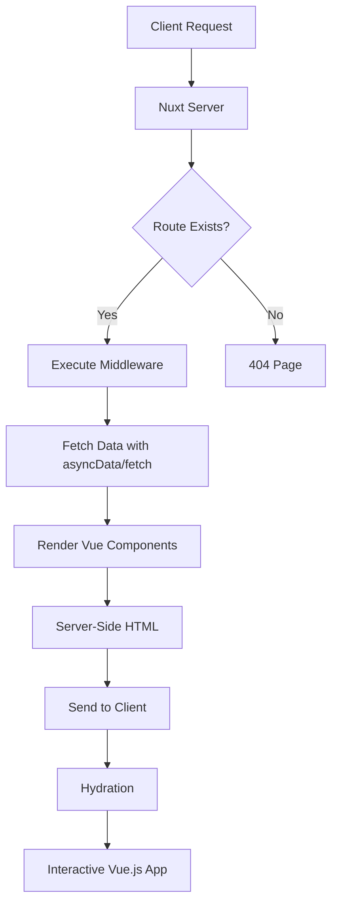

# Vue.js Nuxt.js Framework

## Introduction

Nuxt.js is a higher-level framework built on top of Vue.js that aims to simplify the development of Vue applications by providing a structured and opinionated approach. It was inspired by Next.js (a React framework) and offers powerful features like server-side rendering (SSR), static site generation (SSG), automatic routing, and a modular architecture.

Whether you're building a small application or a large-scale project, Nuxt.js provides the tools and conventions to make your development process more efficient and your applications more performant.

## Why Use Nuxt.js?

Before diving into the details, let's understand why you might want to use Nuxt.js instead of plain Vue.js:

1. **Server-Side Rendering (SSR)**: Improves SEO and initial load performance
2. **Automatic Routing**: Creates routes based on your file structure
3. **Code Splitting**: Automatically splits your code for better performance
4. **Static Site Generation**: Build static websites with dynamic data
5. **Powerful Configuration**: Simple configuration with `nuxt.config.js`
6. **Module System**: Extend functionality with a rich ecosystem of modules
7. **Developer Experience**: Hot module replacement, error reporting, and more

## Getting Started with Nuxt.js

### Installation

Let's start by creating a new Nuxt.js project:

```bash
npx create-nuxt-app my-nuxt-app
```

This interactive command will ask you several questions to customize your project:

- Choose between JavaScript and TypeScript
- Select your UI framework (Tailwind CSS, Bootstrap, etc.)
- Choose testing frameworks
- Configure rendering mode (Universal or SPA)

Once completed, navigate to your project folder and start the development server:

```bash
cd my-nuxt-app
npm run dev
```

Your Nuxt.js application should now be running at `http://localhost:3000`.

### Project Structure

Nuxt.js uses a convention-over-configuration approach, with a specific folder structure:

```
my-nuxt-app/
├── assets/          # Uncompiled assets like LESS, SASS, or JavaScript
├── components/      # Vue components
├── layouts/         # Application layouts
├── middleware/      # Custom functions that run before rendering pages
├── pages/           # Application views and routes
├── plugins/         # JavaScript plugins to run before mounting the app
├── static/          # Static files that are served directly
├── store/           # Vuex store files (optional)
├── nuxt.config.js   # Nuxt.js configuration file
└── package.json     # Project dependencies and scripts
```

## Key Features of Nuxt.js

### Automatic Routing

One of Nuxt.js's most powerful features is its automatic routing system based on the file structure in the `pages` directory.

For example, this file structure:

```
pages/
├── index.vue
├── about.vue
└── users/
    ├── index.vue
    └── _id.vue
```

Will automatically generate these routes:

- `/` → `pages/index.vue`
- `/about` → `pages/about.vue`
- `/users` → `pages/users/index.vue`
- `/users/:id` → `pages/users/_id.vue` (dynamic route)

Let's create a simple page:

```html
<!-- pages/index.vue -->
<template>
  <div>
    <h1>Welcome to my Nuxt.js application!</h1>
    <nuxt-link to="/about">About Page</nuxt-link>
  </div>
</template>

<script>
export default {
  name: 'IndexPage'
}
</script>
```

And another page with a dynamic parameter:

```html
<!-- pages/users/_id.vue -->
<template>
  <div>
    <h1>User Profile</h1>
    <p>User ID: {{ $route.params.id }}</p>
    <nuxt-link to="/">Back to Home</nuxt-link>
  </div>
</template>

<script>
export default {
  validate({ params }) {
    // Must be a number
    return /^\d+$/.test(params.id)
  }
}
</script>
```

### Server-Side Rendering vs. Static Site Generation

Nuxt.js supports different rendering modes:

1. **Universal (SSR)**: Server-side rendering with client-side hydration
2. **SPA**: Client-side rendering only
3. **Static (SSG)**: Pre-renders all pages as HTML files at build time

You can configure the rendering mode in your `nuxt.config.js` file:

```js
// nuxt.config.js
export default {
  // Universal SSR (default)
  ssr: true,
  
  // Static Site Generation
  target: 'static'
  // For SPA mode, set ssr: false
}
```

### Data Fetching with Nuxt.js

Nuxt.js provides special lifecycle hooks for data fetching:

1. **asyncData**: Runs before component initialization, can access route parameters
2. **fetch**: Similar to asyncData but doesn't set component data

Example using `asyncData`:

```html
<!-- pages/posts/_id.vue -->
<template>
  <div>
    <h1>{{ post.title }}</h1>
    <p>{{ post.body }}</p>
  </div>
</template>

<script>
export default {
  async asyncData({ params, $axios }) {
    // Fetch data from an API
    const post = await $axios.$get(`https://jsonplaceholder.typicode.com/posts/${params.id}`)
    return { post }
  }
}
</script>
```

Example using `fetch` (Nuxt 2.12+):

```html
<template>
  <div>
    <h1>Latest Posts</h1>
    <div v-if="$fetchState.pending">Loading...</div>
    <div v-else-if="$fetchState.error">Error while fetching posts</div>
    <ul v-else>
      <li v-for="post in posts" :key="post.id">{{ post.title }}</li>
    </ul>
  </div>
</template>

<script>
export default {
  data() {
    return {
      posts: []
    }
  },
  async fetch() {
    this.posts = await this.$axios.$get('https://jsonplaceholder.typicode.com/posts')
  }
}
</script>
```

### Layouts

Nuxt.js allows you to define different layouts for your pages:

```html
<!-- layouts/default.vue -->
<template>
  <div>
    <header>
      <nav>
        <nuxt-link to="/">Home</nuxt-link>
        <nuxt-link to="/about">About</nuxt-link>
      </nav>
    </header>
    <main>
      <nuxt />
    </main>
    <footer>
      <p>© {{ new Date().getFullYear() }} My Nuxt App</p>
    </footer>
  </div>
</template>
```

To use a custom layout:

```html
<!-- pages/about.vue -->
<template>
  <div>
    <h1>About Page</h1>
    <p>This page uses a custom layout!</p>
  </div>
</template>

<script>
export default {
  layout: 'custom' // References layouts/custom.vue
}
</script>
```

## Real-World Example: Building a Blog

Let's create a simple blog with Nuxt.js to demonstrate its capabilities in a real-world scenario.

### Step 1: Set Up the Project

First, let's set up our Nuxt.js project:

```bash
npx create-nuxt-app nuxt-blog
```

Choose the following options:
- JavaScript
- UI framework: Tailwind CSS
- Axios module for HTTP requests
- Content module for document-driven development

### Step 2: Create Blog Post Content

We'll use the Nuxt Content module to manage our blog posts:

```bash
mkdir -p content/blog
```

Create a markdown file for a blog post:

```markdown
// content/blog/first-post.md
---
title: Getting Started with Nuxt.js
description: Learn the basics of Nuxt.js framework
author: Jane Doe
date: 2023-08-15
---

# Getting Started with Nuxt.js

This is my first blog post using Nuxt.js and Nuxt Content.

## What is Nuxt.js?

Nuxt.js is a framework built on top of Vue.js...
```

### Step 3: Create Blog List and Detail Pages

Create a page to list all blog posts:

```html
<!-- pages/blog/index.vue -->
<template>
  <div class="container mx-auto px-4 py-8">
    <h1 class="text-3xl font-bold mb-8">Blog Posts</h1>
    <div v-if="$fetchState.pending">Loading posts...</div>
    <div v-else-if="$fetchState.error">Error fetching posts</div>
    <div v-else>
      <div v-for="post in posts" :key="post.slug" class="mb-6">
        <h2 class="text-xl font-semibold">
          <nuxt-link :to="`/blog/${post.slug}`" class="text-blue-600 hover:underline">
            {{ post.title }}
          </nuxt-link>
        </h2>
        <p class="text-gray-500">{{ formatDate(post.date) }} • {{ post.author }}</p>
        <p>{{ post.description }}</p>
      </div>
    </div>
  </div>
</template>

<script>
export default {
  data() {
    return {
      posts: []
    }
  },
  async fetch() {
    this.posts = await this.$content('blog')
      .only(['title', 'description', 'slug', 'author', 'date'])
      .sortBy('date', 'desc')
      .fetch()
  },
  methods: {
    formatDate(date) {
      return new Date(date).toLocaleDateString('en-US', {
        year: 'numeric',
        month: 'long',
        day: 'numeric'
      })
    }
  }
}
</script>
```

Create a page to display a single blog post:

```html
<!-- pages/blog/_slug.vue -->
<template>
  <div class="container mx-auto px-4 py-8">
    <article>
      <h1 class="text-4xl font-bold mb-4">{{ post.title }}</h1>
      <p class="text-gray-500 mb-6">{{ formatDate(post.date) }} • {{ post.author }}</p>
      <nuxt-content :document="post" />
    </article>
    <div class="mt-8">
      <nuxt-link to="/blog" class="text-blue-600 hover:underline">
        ← Back to all posts
      </nuxt-link>
    </div>
  </div>
</template>

<script>
export default {
  async asyncData({ $content, params, error }) {
    try {
      const post = await $content('blog', params.slug).fetch()
      return { post }
    } catch (e) {
      error({ statusCode: 404, message: "Blog post not found" })
    }
  },
  methods: {
    formatDate(date) {
      return new Date(date).toLocaleDateString('en-US', {
        year: 'numeric',
        month: 'long',
        day: 'numeric'
      })
    }
  },
  head() {
    return {
      title: this.post.title,
      meta: [
        { hid: 'description', name: 'description', content: this.post.description }
      ]
    }
  }
}
</script>

<style>
.nuxt-content h2 {
  font-weight: bold;
  font-size: 1.5rem;
  margin-top: 1.5rem;
  margin-bottom: 1rem;
}
.nuxt-content p {
  margin-bottom: 1rem;
}
</style>
```

### Step 4: Add SEO Optimization

Update the `nuxt.config.js` file for better SEO:

```js
// nuxt.config.js
export default {
  // Other configurations...
  head: {
    title: 'My Nuxt.js Blog',
    meta: [
      { charset: 'utf-8' },
      { name: 'viewport', content: 'width=device-width, initial-scale=1' },
      { hid: 'description', name: 'description', content: 'A blog built with Nuxt.js' }
    ],
    link: [
      { rel: 'icon', type: 'image/x-icon', href: '/favicon.ico' }
    ]
  },
  
  // Generate dynamic routes at build time for static hosting
  generate: {
    async routes() {
      const { $content } = require('@nuxt/content')
      const posts = await $content('blog').only(['slug']).fetch()
      
      return posts.map(post => `/blog/${post.slug}`)
    }
  }
}
```

### Step 5: Deploy the Blog

Build the static version of the blog:

```bash
npm run generate
```

This will create a `dist` folder with all the static files needed for deployment to platforms like Netlify, Vercel, or GitHub Pages.

## Nuxt.js Ecosystem

Nuxt.js has a rich ecosystem of modules that extend its functionality:

1. **@nuxt/content**: Document-driven content management system
2. **@nuxtjs/axios**: Integration with Axios for HTTP requests
3. **@nuxtjs/auth**: Authentication module
4. **@nuxtjs/pwa**: Progressive Web App support
5. **@nuxtjs/i18n**: Internationalization for your Nuxt.js project

To add a module to your Nuxt.js project:

```js
// nuxt.config.js
export default {
  modules: [
    '@nuxtjs/axios',
    '@nuxt/content',
    '@nuxtjs/pwa'
  ]
}
```

## Nuxt.js Architecture

The following diagram illustrates how Nuxt.js works under the hood:



## Summary

Nuxt.js is a powerful framework that enhances Vue.js with features like server-side rendering, automatic routing, and a module system. It provides an opinionated structure that helps developers build well-organized applications while maintaining the flexibility that Vue.js offers.

Key takeaways from this guide:

- Nuxt.js simplifies routing with a file-based system
- It offers multiple rendering modes: SSR, SPA, and Static
- Data fetching is handled through `asyncData` and `fetch`
- The framework comes with built-in layouts and middleware
- Nuxt.js has a rich ecosystem of modules to extend functionality

## Additional Resources

To continue learning about Nuxt.js:

1. [Official Nuxt.js Documentation](https://nuxtjs.org/docs)
2. [Nuxt.js GitHub Repository](https://github.com/nuxt/nuxt.js)
3. [Nuxt.js Examples](https://nuxtjs.org/examples)

## Exercises

1. Create a simple portfolio website using Nuxt.js and static site generation.
2. Build a small e-commerce product listing with Nuxt.js and the Axios module to fetch products from an API.
3. Implement authentication in a Nuxt.js application using the Auth module.
4. Create a multilingual blog using the i18n module.
5. Convert an existing Vue.js application to use Nuxt.js and explore the benefits.