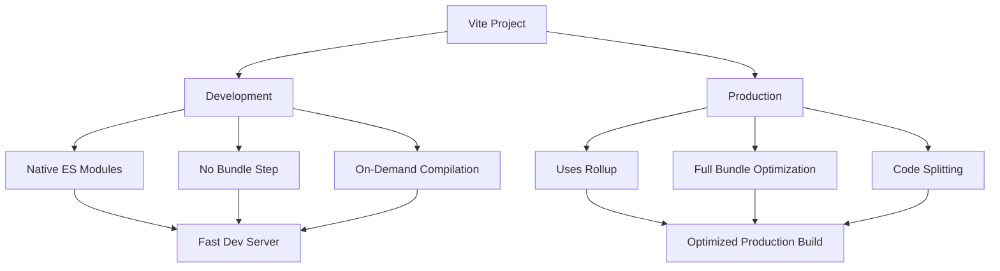

# Vue.js Vite Integration

## Introduction

Vite (French word for "quick", pronounced `/vit/`) is a modern build tool that significantly improves the frontend development experience. Created by Evan You, the same developer behind Vue.js, Vite is designed to address pain points in the development workflow, particularly focusing on fast server start and hot module replacement (HMR).

In this guide, we'll explore how to integrate Vite with Vue.js applications, understand what makes it different from traditional bundlers like webpack, and learn how to leverage its features to streamline your development process.

## What is Vite?

Vite is a build tool that aims to provide a faster and leaner development experience for modern web projects. It consists of two major parts:

1. A development server that provides rich feature enhancements over native ES modules, such as extremely fast Hot Module Replacement (HMR)
2. A build command that bundles your code with Rollup, pre-configured to output highly optimized static assets for production

## Why Use Vite with Vue.js?

Using Vite with Vue.js offers several advantages:

- **Lightning-fast server start**: Vite doesn't need to bundle your entire application before serving it
- **Instant hot module replacement (HMR)**: Changes to your code are reflected immediately without refreshing the page
- **True on-demand compilation**: Only the code being used is transformed and served
- **Optimized builds**: Production builds are highly optimized using Rollup
- **First-class Vue support**: Vite was created by Evan You and is designed to work seamlessly with Vue.js
- **Out-of-the-box support** for TypeScript, JSX, CSS preprocessors, and more

## Setting Up a Vue.js Project with Vite

### Creating a New Project

You can quickly scaffold a Vite + Vue project using the following command:

```bash
npm create vite@latest my-vue-app -- --template vue
```

Alternatively, you can use Yarn:

```bash
yarn create vite my-vue-app --template vue
```

For TypeScript support, use the `vue-ts` template:

```bash
npm create vite@latest my-vue-app -- --template vue-ts
```

### Project Structure

After creating your project, you'll have a structure similar to this:

```
my-vue-app/
├── node_modules/
├── public/
│   └── favicon.ico
├── src/
│   ├── assets/
│   │   └── logo.png
│   ├── components/
│   │   └── HelloWorld.vue
│   ├── App.vue
│   └── main.js
├── .gitignore
├── index.html
├── package.json
├── README.md
└── vite.config.js
```

The most notable difference from a Vue CLI project is the presence of `index.html` in the root directory rather than in the public folder. This is because Vite uses the HTML file as the entry point to your application.

### Understanding the Entry Point

Let's look at the `index.html` file:

```html
<!DOCTYPE html>
<html lang="en">
  <head>
    <meta charset="UTF-8" />
    <link rel="icon" href="/favicon.ico" />
    <meta name="viewport" content="width=device-width, initial-scale=1.0" />
    <title>Vite App</title>
  </head>
  <body>
    <div id="app"></div>
    <script type="module" src="/src/main.js"></script>
  </body>
</html>
```

Notice the `<script type="module">` tag pointing to your `main.js` file. This is how Vite loads your JavaScript as ES modules.

The `main.js` file initializes your Vue application:

```javascript
import { createApp } from 'vue'
import App from './App.vue'

createApp(App).mount('#app')
```

## Running Your Vite + Vue Application

### Development Server

To start the development server, run:

```bash
npm run dev
```

This will start the Vite development server, typically on `http://localhost:5173`.

### Building for Production

To build your application for production, run:

```bash
npm run build
```

This creates a `dist` directory with your optimized application ready for deployment.

### Previewing the Production Build

You can preview the production build locally with:

```bash
npm run preview
```

## Configuring Vite for Vue.js

Vite uses a configuration file named `vite.config.js` in the project root. Here's a basic configuration for a Vue.js project:

```javascript
import { defineConfig } from 'vite'
import vue from '@vitejs/plugin-vue'

// https://vitejs.dev/config/
export default defineConfig({
  plugins: [vue()],
})
```

### Common Configurations

Let's look at some common configurations you might want to add:

#### Configuring Base URL

If you're deploying to a subdirectory, you can set the base URL:

```javascript
export default defineConfig({
  plugins: [vue()],
  base: '/my-app/'
})
```

#### Aliasing Paths

For better import statements:

```javascript
import { defineConfig } from 'vite'
import vue from '@vitejs/plugin-vue'
import path from 'path'

export default defineConfig({
  plugins: [vue()],
  resolve: {
    alias: {
      '@': path.resolve(__dirname, './src')
    }
  }
})
```

Now you can use imports like:

```javascript
import MyComponent from '@/components/MyComponent.vue'
```

#### Environment Variables

Vite provides built-in support for environment variables. Create a `.env` file in your project root:

```
VITE_API_URL=https://api.example.com
```

Access it in your code:

```javascript
console.log(import.meta.env.VITE_API_URL)
```

Note that only variables prefixed with `VITE_` are exposed to your client-side code.

## Practical Examples

### Example 1: Adding Vue Router with Vite

First, install Vue Router:

```bash
npm install vue-router@4
```

Create a router configuration in `src/router/index.js`:

```javascript
import { createRouter, createWebHistory } from 'vue-router'
import Home from '../views/Home.vue'
import About from '../views/About.vue'

const routes = [
  {
    path: '/',
    name: 'Home',
    component: Home
  },
  {
    path: '/about',
    name: 'About',
    component: About
  }
]

const router = createRouter({
  history: createWebHistory(import.meta.env.BASE_URL),
  routes
})

export default router
```

Update `main.js` to use the router:

```javascript
import { createApp } from 'vue'
import App from './App.vue'
import router from './router'

createApp(App).use(router).mount('#app')
```

Modify `App.vue` to include router views:

```html
<template>
  <nav>
    <router-link to="/">Home</router-link> |
    <router-link to="/about">About</router-link>
  </nav>
  <router-view/>
</template>

<style>
#app {
  font-family: Avenir, Helvetica, Arial, sans-serif;
  text-align: center;
  color: #2c3e50;
  margin-top: 60px;
}

nav {
  padding: 30px;
}

nav a {
  font-weight: bold;
  color: #2c3e50;
}

nav a.router-link-exact-active {
  color: #42b983;
}
</style>
```

### Example 2: Implementing API Calls with Vite Environment Variables

Create a `.env` file:

```
VITE_API_URL=https://jsonplaceholder.typicode.com
```

Create an API service in `src/services/api.js`:

```javascript
const apiUrl = import.meta.env.VITE_API_URL;

export async function fetchPosts() {
  const response = await fetch(`${apiUrl}/posts`);
  if (!response.ok) {
    throw new Error('Network response was not ok');
  }
  return response.json();
}
```

Use the service in a component, `src/views/Posts.vue`:

```html
<template>
  <div class="posts">
    <h1>Posts</h1>
    <div v-if="loading">Loading...</div>
    <div v-if="error">{{ error }}</div>
    <ul v-if="posts.length">
      <li v-for="post in posts" :key="post.id">
        <h2>{{ post.title }}</h2>
        <p>{{ post.body }}</p>
      </li>
    </ul>
  </div>
</template>

<script>
import { ref, onMounted } from 'vue';
import { fetchPosts } from '@/services/api';

export default {
  setup() {
    const posts = ref([]);
    const loading = ref(true);
    const error = ref('');

    onMounted(async () => {
      try {
        posts.value = await fetchPosts();
        loading.value = false;
      } catch (err) {
        error.value = err.message;
        loading.value = false;
      }
    });

    return { posts, loading, error };
  }
};
</script>
```

## Advanced Vite Features for Vue.js

### CSS Pre-processors

Vite has built-in support for CSS pre-processors. For example, to use Sass:

1. Install the Sass pre-processor:

```bash
npm install -D sass
```

2. Use it in your Vue components:

```html
<style lang="scss">
$primary-color: #42b983;

.container {
  .title {
    color: $primary-color;
  }
}
</style>
```

### Using TypeScript with Vue and Vite

Vite supports TypeScript out of the box. If you create your project with the `vue-ts` template, you'll already have TypeScript configured.

Here's a Vue component using TypeScript:

```html
<template>
  <div>
    <h1>{{ message }}</h1>
    <button @click="increment">Count: {{ count }}</button>
  </div>
</template>

<script lang="ts">
import { defineComponent, ref } from 'vue'

export default defineComponent({
  setup() {
    const message: string = 'Hello TypeScript with Vue 3!'
    const count = ref<number>(0)
    
    const increment = (): void => {
      count.value++
    }

    return {
      message,
      count,
      increment
    }
  }
})
</script>
```

### Code-Splitting

Vite handles code-splitting automatically. You can use dynamic imports for route-based code splitting:

```javascript
// In your router configuration
const routes = [
  {
    path: '/dashboard',
    name: 'Dashboard',
    // This will generate a separate chunk
    component: () => import('../views/Dashboard.vue')
  }
]
```

## Understanding Vite's Development Server vs. Production Build

Vite's development and production workflows differ significantly:



During development:
- Vite serves source files over native ES modules, which are supported by modern browsers
- Files are served on demand and transformed when needed, no bundling required
- HMR updates are very fast because only the changed module is replaced

For production:
- Vite uses Rollup to bundle your app
- Code is minified, tree-shaken, and optimized
- Assets are properly hashed for caching
- Code-splitting is applied automatically

## Summary

Vite provides a modern, fast development environment for Vue.js applications with many benefits over traditional bundlers:

1. Lightning-fast development server startup
2. Extremely quick hot module replacement
3. On-demand compilation for faster development cycles
4. Optimized production builds through Rollup
5. Built-in support for TypeScript, CSS pre-processors, and more

By integrating Vue.js with Vite, you gain a development experience that's significantly faster and more responsive, allowing you to focus on building your application rather than waiting for your tools.

## Additional Resources

- [Official Vite Documentation](https://vitejs.dev/guide/)
- [Vue.js Documentation](https://v3.vuejs.org/guide/introduction.html)
- [Vite GitHub Repository](https://github.com/vitejs/vite)

## Exercises

1. **Basic Setup**: Create a new Vue.js project using Vite and implement a simple counter component.
  
2. **Router Integration**: Add Vue Router to your Vite project and create multiple pages with navigation between them.

3. **State Management**: Integrate Pinia or Vuex with your Vite + Vue application for global state management.

4. **API Integration**: Create a service that fetches data from a public API using environment variables to store the API URL.

5. **Production Optimization**: Build your application for production and analyze the output bundle size. Implement code-splitting for routes to reduce initial load time.