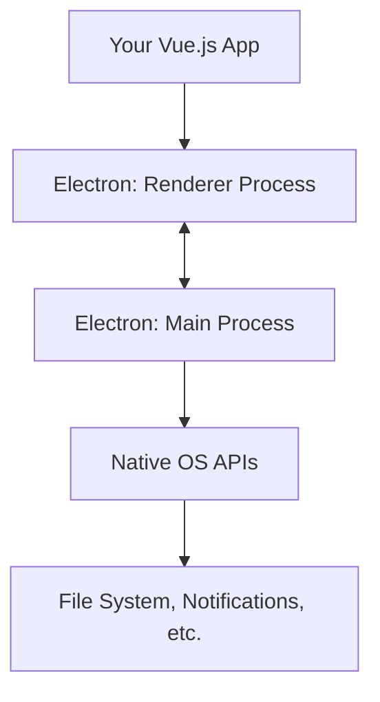

# Vue.js Desktop Applications

## Introduction

Vue.js is primarily known as a framework for building web applications, but its flexibility allows developers to create desktop applications as well. Building desktop applications with Vue.js combines the familiarity and ease of web development with the power and accessibility of native desktop apps.

In this guide, we'll explore how Vue.js can be used to build cross-platform desktop applications that run on Windows, macOS, and Linux. We'll focus primarily on the most popular approaches: using Vue.js with Electron and newer alternatives like Tauri.

## Why Build Desktop Applications with Vue.js?

Before diving into the technical details, let's understand why you might want to build desktop applications with Vue.js:

1. **Code Reusability**: Use your existing Vue.js skills and potentially share code between web and desktop apps
2. **Cross-Platform Development**: Write once, deploy to Windows, macOS, and Linux
3. **Access to Native APIs**: Interact with the file system, hardware, and other OS features
4. **Offline Capabilities**: Create applications that work without internet connection
5. **Distribution**: Package and distribute your application through app stores or direct downloads

## Vue.js + Electron: The Classic Approach

[Electron](https://www.electronjs.org/) is the most established framework for building cross-platform desktop applications using web technologies. Created by GitHub, it powers many popular applications like Visual Studio Code, Slack, and Discord.

### How Electron Works

Electron combines Chromium (for rendering web content) and Node.js (for accessing the file system and other native capabilities). Your Vue.js application runs inside this environment.



### Setting Up a Vue.js + Electron Project

The easiest way to get started is with the Vue CLI plugin for Electron:

1. First, create a new Vue project (if you don't have one already):

```bash
vue create my-desktop-app
cd my-desktop-app
```

2. Add the Electron Builder plugin:

```bash
vue add electron-builder
```

3. Start the development server:

```bash
npm run electron:serve
```

This will launch your Vue.js application in an Electron window. You can now develop your application as you would a normal Vue.js web app, but with access to Node.js and Electron APIs.

### Basic Structure of an Electron + Vue.js App

After adding the electron-builder plugin, your project will have a new file: `src/background.js`. This is the entry point for the Electron main process:

```javascript
// src/background.js (simplified)
import { app, BrowserWindow, ipcMain } from 'electron'

// Keep a global reference of the window object
let win

function createWindow() {
  // Create the browser window
  win = new BrowserWindow({
    width: 800,
    height: 600,
    webPreferences: {
      nodeIntegration: process.env.ELECTRON_NODE_INTEGRATION,
      contextIsolation: !process.env.ELECTRON_NODE_INTEGRATION
    }
  })

  // Load the app
  if (process.env.WEBPACK_DEV_SERVER_URL) {
    win.loadURL(process.env.WEBPACK_DEV_SERVER_URL)
    if (!process.env.IS_TEST) win.webContents.openDevTools()
  } else {
    win.loadURL('app://./index.html')
  }

  win.on('closed', () => {
    win = null
  })
}

app.on('ready', createWindow)

// Quit when all windows are closed
app.on('window-all-closed', () => {
  if (process.platform !== 'darwin') {
    app.quit()
  }
})
```

### Communication Between Vue.js and Electron

One of the key aspects of Electron development is the communication between your Vue.js application (renderer process) and the Electron main process. This is done using Electron's Inter-Process Communication (IPC) system:

In your Vue component:

```html
<template>
  <div>
    <button @click="openFile">Open File</button>
    <div v-if="filePath">Selected file: {{ filePath }}</div>
  </div>
</template>

<script>
import { ipcRenderer } from 'electron'

export default {
  data() {
    return {
      filePath: null
    }
  },
  mounted() {
    // Listen for the response from the main process
    ipcRenderer.on('file-opened', (event, path) => {
      this.filePath = path
    })
  },
  methods: {
    openFile() {
      // Send a message to the main process
      ipcRenderer.send('open-file-dialog')
    }
  },
  beforeUnmount() {
    // Clean up listener
    ipcRenderer.removeAllListeners('file-opened')
  }
}
</script>
```

In your Electron main process (background.js):

```javascript
import { dialog, ipcMain } from 'electron'

// Listen for open-file-dialog message from renderer
ipcMain.on('open-file-dialog', (event) => {
  dialog.showOpenDialog({
    properties: ['openFile']
  }).then(result => {
    if (!result.canceled && result.filePaths.length > 0) {
      event.reply('file-opened', result.filePaths[0])
    }
  }).catch(err => {
    console.error(err)
  })
})
```

### Building and Packaging Your Application

When you're ready to distribute your application, you can build it using:

```bash
npm run electron:build
```

This will create platform-specific distributables in the `dist_electron` directory, such as:
- `.exe` installers for Windows
- `.dmg` files for macOS
- `.AppImage` or `.deb` files for Linux

## Modern Alternative: Vue.js + Tauri

While Electron is well-established, it has been criticized for its large bundle size and memory consumption. [Tauri](https://tauri.app/) is a newer alternative that uses the operating system's native webview instead of bundling Chromium:

### Benefits of Tauri

1. **Smaller bundle size**: Tauri apps can be less than 10MB, compared to Electron's 100+ MB
2. **Better performance**: Lower memory footprint and better startup times
3. **Security**: More restricted security model by default

### Setting Up a Vue.js + Tauri Project

1. First, install Tauri CLI:

```bash
npm install -g @tauri-apps/cli
```

2. Create a new Vue project or use an existing one:

```bash
vue create my-tauri-app
cd my-tauri-app
```

3. Initialize Tauri in your project:

```bash
npm install --save-dev @tauri-apps/cli @tauri-apps/api
npx tauri init
```

4. Start the development server:

```bash
npm run tauri dev
```

### Basic Tauri + Vue.js Example

Here's a simple example of using Tauri's API in a Vue component to show a notification:

```html
<template>
  <div>
    <button @click="showNotification">Show Notification</button>
  </div>
</template>

<script>
import { notification } from '@tauri-apps/api';

export default {
  methods: {
    async showNotification() {
      await notification.sendNotification({
        title: 'Tauri Notification',
        body: 'This notification was sent from Tauri!'
      });
    }
  }
}
</script>
```

## Practical Example: Building a Markdown Editor

Let's create a simple markdown editor desktop application using Vue.js and Electron to demonstrate a real-world use case.

First, we need to add a markdown parser:

```bash
npm install marked
```

Then, create a `MarkdownEditor.vue` component:

```html
<template>
  <div class="markdown-editor">
    <div class="toolbar">
      <button @click="saveFile">Save</button>
      <button @click="openFile">Open</button>
    </div>
    <div class="editor-container">
      <textarea
        class="editor"
        v-model="markdownContent"
        placeholder="Write your markdown here..."
      ></textarea>
      <div class="preview" v-html="compiledMarkdown"></div>
    </div>
    <div class="status-bar">
      <span v-if="currentFile">Current file: {{ currentFile }}</span>
      <span v-else>No file open</span>
    </div>
  </div>
</template>

<script>
import { marked } from 'marked';
import { ipcRenderer } from 'electron';

export default {
  data() {
    return {
      markdownContent: '# Hello, Markdown!',
      currentFile: null
    };
  },
  computed: {
    compiledMarkdown() {
      return marked(this.markdownContent);
    }
  },
  mounted() {
    ipcRenderer.on('file-content', (event, { filePath, content }) => {
      this.markdownContent = content;
      this.currentFile = filePath;
    });

    ipcRenderer.on('file-saved', (event, filePath) => {
      this.currentFile = filePath;
      alert(`File saved to: ${filePath}`);
    });
  },
  methods: {
    openFile() {
      ipcRenderer.send('open-markdown-file');
    },
    saveFile() {
      ipcRenderer.send('save-markdown-file', {
        content: this.markdownContent,
        currentFile: this.currentFile
      });
    }
  },
  beforeUnmount() {
    ipcRenderer.removeAllListeners('file-content');
    ipcRenderer.removeAllListeners('file-saved');
  }
};
</script>

<style scoped>
.markdown-editor {
  display: flex;
  flex-direction: column;
  height: 100vh;
}

.toolbar {
  padding: 10px;
  background: #f1f1f1;
  border-bottom: 1px solid #ddd;
}

.editor-container {
  display: flex;
  flex: 1;
  overflow: hidden;
}

.editor, .preview {
  flex: 1;
  padding: 15px;
  overflow: auto;
  height: 100%;
}

.editor {
  font-family: monospace;
  resize: none;
  border: none;
  border-right: 1px solid #ddd;
}

.status-bar {
  padding: 5px 10px;
  background: #f1f1f1;
  border-top: 1px solid #ddd;
  font-size: 12px;
}
</style>
```

Now, let's add the necessary Electron code in `background.js`:

```javascript
// Add these imports and handlers to your background.js file
import { dialog, ipcMain } from 'electron';
import fs from 'fs';
import path from 'path';

// Open file handler
ipcMain.on('open-markdown-file', (event) => {
  dialog.showOpenDialog({
    properties: ['openFile'],
    filters: [{ name: 'Markdown Files', extensions: ['md', 'markdown'] }]
  }).then(result => {
    if (!result.canceled && result.filePaths.length > 0) {
      const filePath = result.filePaths[0];
      fs.readFile(filePath, 'utf-8', (err, data) => {
        if (err) {
          console.error('Error reading file:', err);
          return;
        }
        event.reply('file-content', { filePath, content: data });
      });
    }
  }).catch(err => {
    console.error(err);
  });
});

// Save file handler
ipcMain.on('save-markdown-file', (event, { content, currentFile }) => {
  if (currentFile) {
    // Save to existing file
    fs.writeFile(currentFile, content, (err) => {
      if (err) {
        console.error('Error saving file:', err);
        return;
      }
      event.reply('file-saved', currentFile);
    });
  } else {
    // Show save dialog for new file
    dialog.showSaveDialog({
      title: 'Save Markdown File',
      filters: [{ name: 'Markdown Files', extensions: ['md'] }]
    }).then(result => {
      if (!result.canceled && result.filePath) {
        fs.writeFile(result.filePath, content, (err) => {
          if (err) {
            console.error('Error saving file:', err);
            return;
          }
          event.reply('file-saved', result.filePath);
        });
      }
    }).catch(err => {
      console.error(err);
    });
  }
});
```

This creates a functional markdown editor that can open and save files from your local system - something a web application couldn't normally do without additional permissions.

## Other Approaches for Desktop Development with Vue

While Electron and Tauri are the most popular options, there are other approaches worth mentioning:

### NativeScript-Vue

[NativeScript-Vue](https://nativescript-vue.org/) combines Vue.js with NativeScript to build truly native mobile and desktop applications. Unlike Electron and Tauri which render your UI with HTML and CSS, NativeScript-Vue uses native UI components.

```bash
# Install NativeScript CLI
npm install -g nativescript

# Create a new project
ns create my-app --vue

# Run on desktop
ns run desktop
```

### Vuido

[Vuido](https://github.com/mimecorg/vuido) is a framework for creating native desktop applications based on Vue.js. It uses libui-node to provide native UI components.

## Best Practices for Vue.js Desktop Applications

When building desktop applications with Vue.js, keep these best practices in mind:

1. **Structure your app for desktop from the beginning:**
   - Design with desktop UX patterns in mind (menus, keyboard shortcuts, etc.)
   - Consider offline-first functionality

2. **Security:**
   - Validate user inputs thoroughly
   - Be careful with `nodeIntegration` in Electron (use contextBridge when possible)
   - Keep dependencies updated to avoid security vulnerabilities

3. **Performance:**
   - Optimize startup time
   - Minimize memory usage
   - Use lazy loading for larger features

4. **User Experience:**
   - Support keyboard shortcuts
   - Implement proper application state saving
   - Consider system themes (light/dark mode)

5. **Testing:**
   - Test all platform-specific features
   - Use Spectron (for Electron) or similar tools for end-to-end testing

## Summary

Vue.js provides multiple paths to build desktop applications, with Electron being the most established and Tauri representing a newer, more efficient alternative. By leveraging your existing Vue.js knowledge, you can create cross-platform applications that run on Windows, macOS, and Linux while accessing native system features.

The ability to reuse code between web and desktop applications makes Vue.js an excellent choice for teams looking to expand their application's reach beyond the browser.

## Additional Resources

- [Electron Documentation](https://www.electronjs.org/docs)
- [Tauri Documentation](https://tauri.app/v1/guides/)
- [Vue CLI Plugin for Electron Builder](https://nklayman.github.io/vue-cli-plugin-electron-builder/)
- [NativeScript-Vue Documentation](https://nativescript-vue.org/)

## Exercises

1. Build a simple to-do application that saves tasks to a local file using Electron and Vue.js.
2. Modify the markdown editor example to include additional features like syntax highlighting or a file browser sidebar.
3. Compare the bundle size and performance of the same simple application built with both Electron and Tauri.
4. Implement system notifications in a Vue.js desktop application.
5. Create a desktop application that can work both offline and online, synchronizing data when an internet connection is available.