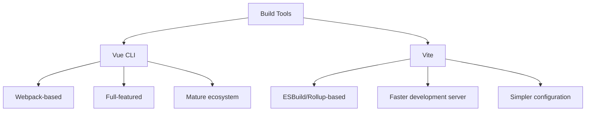

# Vue CLI

## Introduction

Vue CLI (Command Line Interface) is a powerful tool in the Vue.js ecosystem that helps developers create, develop, and manage Vue.js projects. It provides a standardized project structure, modern build tools configuration, and a rich plugin system that makes Vue.js development more efficient and enjoyable. 

Vue CLI serves as a central hub for your Vue.js development workflow, offering:

- Project scaffolding with best practices
- Plugin-based architecture for extending functionality
- Built-in development server with hot reloading
- Optimized production builds
- Official plugins for testing, linting, and more

Whether you're building a simple application or a complex enterprise system, Vue CLI can help streamline your development process.

## Getting Started with Vue CLI

### Installation

Before you can use Vue CLI, you need to install it globally on your system using npm or yarn:

```bash
# Using npm
npm install -g @vue/cli

# Using yarn
yarn global add @vue/cli
```

Verify the installation was successful:

```bash
vue --version
```

This should display the installed Vue CLI version (e.g., `@vue/cli 5.0.8`).

### Creating a New Project

To create a new project using Vue CLI:

```bash
vue create my-project
```

This command will prompt you to pick a preset:

- **Default preset** includes basic Babel and ESLint setup
- **Manually select features** allows you to customize your project setup

For beginners, the default preset is a good starting point. For more advanced needs, the manual selection allows you to choose:

- Babel
- TypeScript
- Progressive Web App (PWA) support
- Router
- Vuex
- CSS pre-processors
- Linter / Formatter
- Unit and E2E Testing

Here's what the selection process looks like:

```
? Please pick a preset:
  Default ([Vue 3] babel, eslint)
  Default ([Vue 2] babel, eslint)
❯ Manually select features
```

After making your selections, Vue CLI will create a new project with all the configurations and dependencies set up.

### Project Structure

A typical Vue CLI project structure looks like this:

```
my-project/
├── node_modules/
├── public/
│   ├── favicon.ico
│   └── index.html
├── src/
│   ├── assets/
│   ├── components/
│   ├── views/ (if router is selected)
│   ├── App.vue
│   └── main.js
├── .gitignore
├── babel.config.js
├── package.json
└── vue.config.js (optional)
```

- **public/** contains static assets that will be served as-is
- **src/** contains your application source code
- **components/** holds Vue components
- **views/** (with router) contains view components
- **App.vue** is the root component
- **main.js** is the application entry point

## Working with Vue CLI Projects

### Development Server

To start a local development server with hot-reloading:

```bash
# Navigate to your project directory
cd my-project

# Start the development server
npm run serve
# or
yarn serve
```

This will run your application locally (typically at `http://localhost:8080/`) with hot-reload enabled, so changes to your code will automatically update in the browser.

### Building for Production

When you're ready to deploy your application:

```bash
npm run build
# or
yarn build
```

This command creates a production-ready build in the `dist/` directory. The files are minified, and assets are optimized for efficient delivery.

## Vue CLI Plugins

One of Vue CLI's most powerful features is its plugin system, which allows you to add functionality to your project without complex configuration.

### Installing Plugins

You can add plugins to an existing project using the `vue add` command:

```bash
vue add vuetify
```

This example adds Vuetify (a Material Design component framework) to your project.

Common official plugins include:

- `@vue/cli-plugin-babel` - Babel transpilation
- `@vue/cli-plugin-eslint` - ESLint integration
- `@vue/cli-plugin-router` - Vue Router integration
- `@vue/cli-plugin-vuex` - Vuex integration
- `@vue/cli-plugin-unit-jest` - Unit testing with Jest
- `@vue/cli-plugin-e2e-cypress` - E2E testing with Cypress

### Creating Custom Presets

If you frequently create projects with the same set of options, you can save your selections as a preset:

```bash
vue create --preset my-preset my-project
```

## Vue UI: Graphical Interface

Vue CLI also provides a graphical user interface for managing your projects:

```bash
vue ui
```

This opens a browser window with a dashboard where you can:
- Create new projects
- Import existing projects
- Manage plugins
- Configure project settings
- Run tasks like serve, build, lint
- Analyze bundle size

This is especially helpful for beginners who prefer visual interfaces over command lines.

## Practical Example: Building a Todo App

Let's create a simple Todo app using Vue CLI to demonstrate its capabilities:

### Step 1: Create a new project

```bash
vue create todo-app
```

Select the default Vue 3 preset for simplicity.

### Step 2: Create a TodoList component

Create a file `src/components/TodoList.vue`:

```html
<template>
  <div class="todo-list">
    <h2>My Todo List</h2>
    
    <div class="add-todo">
      <input 
        v-model="newTodo" 
        @keyup.enter="addTodo" 
        placeholder="Add a new task..."
      />
      <button @click="addTodo">Add</button>
    </div>
    
    <ul class="todos">
      <li v-for="(todo, index) in todos" :key="index" :class="{ completed: todo.completed }">
        <input type="checkbox" v-model="todo.completed" />
        <span>{{ todo.text }}</span>
        <button @click="removeTodo(index)" class="delete">✕</button>
      </li>
    </ul>
    
    <div class="stats">
      <span>{{ activeTodosCount }} items left</span>
    </div>
  </div>
</template>

<script>
export default {
  name: 'TodoList',
  data() {
    return {
      newTodo: '',
      todos: [
        { text: 'Learn Vue.js', completed: false },
        { text: 'Build a Todo app', completed: false },
        { text: 'Master Vue CLI', completed: false }
      ]
    };
  },
  computed: {
    activeTodosCount() {
      return this.todos.filter(todo => !todo.completed).length;
    }
  },
  methods: {
    addTodo() {
      if (this.newTodo.trim()) {
        this.todos.push({
          text: this.newTodo.trim(),
          completed: false
        });
        this.newTodo = '';
      }
    },
    removeTodo(index) {
      this.todos.splice(index, 1);
    }
  }
};
</script>

<style scoped>
.todo-list {
  max-width: 500px;
  margin: 0 auto;
  padding: 20px;
  box-shadow: 0 2px 10px rgba(0, 0, 0, 0.1);
  border-radius: 8px;
}

.add-todo {
  display: flex;
  margin-bottom: 20px;
}

.add-todo input {
  flex-grow: 1;
  padding: 8px 12px;
  border: 1px solid #ddd;
  border-radius: 4px 0 0 4px;
}

.add-todo button {
  padding: 8px 16px;
  background-color: #42b983;
  color: white;
  border: none;
  border-radius: 0 4px 4px 0;
  cursor: pointer;
}

ul.todos {
  list-style-type: none;
  padding: 0;
}

li {
  display: flex;
  align-items: center;
  padding: 10px 0;
  border-bottom: 1px solid #eee;
}

li span {
  margin-left: 10px;
  flex-grow: 1;
}

li.completed span {
  text-decoration: line-through;
  color: #999;
}

button.delete {
  background: none;
  border: none;
  color: #ff5252;
  cursor: pointer;
}

.stats {
  margin-top: 15px;
  color: #666;
  font-size: 0.9em;
}
</style>
```

### Step 3: Update App.vue to use the TodoList component

Modify `src/App.vue`:

```html
<template>
  <div id="app">
    
    <TodoList />
  </div>
</template>

<script>
import TodoList from './components/TodoList.vue'

export default {
  name: 'App',
  components: {
    TodoList
  }
}
</script>

<style>
#app {
  font-family: Avenir, Helvetica, Arial, sans-serif;
  -webkit-font-smoothing: antialiased;
  -moz-osx-font-smoothing: grayscale;
  text-align: center;
  color: #2c3e50;
  margin-top: 60px;
}
</style>
```

### Step 4: Run the development server

```bash
npm run serve
```

Navigate to http://localhost:8080 to see your Todo app in action.

## Customizing Vue CLI Configuration

Vue CLI provides several ways to customize your project configuration:

### vue.config.js

Create a `vue.config.js` file in the root directory of your project to customize the build configuration:

```js
// vue.config.js
module.exports = {
  // Change the development server port
  devServer: {
    port: 3000
  },
  
  // Configure the output directory
  outputDir: 'dist',
  
  // Add or modify webpack configuration
  configureWebpack: {
    plugins: [
      // Add webpack plugins here
    ]
  },
  
  // CSS configuration
  css: {
    loaderOptions: {
      sass: {
        // Add global SASS variables
        additionalData: `
          @import "@/styles/_variables.scss";
        `
      }
    }
  }
}
```

This allows you to customize various aspects of your build process without "ejecting" from Vue CLI.

### Environment Variables

Vue CLI supports environment variables through `.env` files:

- `.env` - Loaded in all cases
- `.env.local` - Loaded in all cases, ignored by git
- `.env.development` - Only loaded in development mode
- `.env.production` - Only loaded in production mode

Example `.env` file:

```
VUE_APP_API_URL=https://api.example.com
VUE_APP_TITLE=My App
```

You can access these variables in your code through `process.env.VUE_APP_API_URL`.

:::tip Note
Only variables that start with `VUE_APP_` will be available in your Vue components.
:::

## Vue CLI vs Vite

In recent years, [Vite](https://vitejs.dev/) (created by Evan You, the creator of Vue) has become a popular alternative to Vue CLI. Here's a quick comparison:



While Vue CLI has been the standard for years, Vite offers significantly faster development server startup and hot module replacement due to its approach of leveraging native ES modules. Vue's official documentation now recommends Vite for new projects, but Vue CLI is still widely used and supported.

## Summary

Vue CLI is a comprehensive tooling system for Vue.js development that:

1. Streamlines project creation with best practices built in
2. Provides a modern development environment with hot reloading
3. Handles complex build configurations behind simple commands
4. Offers extensibility through plugins for various needs
5. Supports project management through both CLI and GUI interfaces

By using Vue CLI, developers can focus more on writing code rather than configuring build tools, making the Vue.js development experience more efficient and enjoyable.

## Additional Resources

- [Official Vue CLI Documentation](https://cli.vuejs.org/)
- [Vue CLI Configuration Reference](https://cli.vuejs.org/config/)
- [Vue CLI Plugin Development Guide](https://cli.vuejs.org/dev-guide/plugin-dev.html)

## Exercises

1. Create a new Vue CLI project with TypeScript support and Vue Router.
2. Add Vuex to an existing Vue CLI project using the plugin system.
3. Create a custom Vue CLI preset with your preferred configuration options.
4. Configure your Vue CLI project to use SCSS for styling.
5. Build a simple CRUD application using Vue CLI, practicing the concepts learned in this guide.