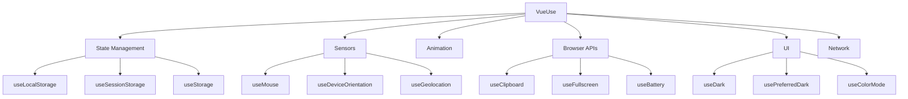

# Vue.js VueUse Library

## Introduction

VueUse is a collection of essential Vue Composition API utilities designed to make your Vue development experience smoother and more efficient. Think of it as a Swiss Army knife for Vue developers, providing ready-to-use functions for common tasks so you don't have to reinvent the wheel.

In this guide, we'll explore what the VueUse library offers, how to integrate it into your Vue projects, and demonstrate practical examples of some of its most useful utilities.

## What is VueUse?

VueUse is an open-source collection of Vue Composition API utilities, created by Anthony Fu. The library offers over 200 functions covering various categories:

- **Sensors**: Detect user activity and device capabilities
- **Animation**: Simplify complex animations and transitions
- **State Management**: Manage and persist state
- **Elements**: Interact with DOM elements easily
- **Browser APIs**: Simplified wrappers around complex browser features
- **Network**: Handle requests and responses
- **Time**: Date, time, and timing utilities

The best part is that VueUse works with both Vue 2 and Vue 3, making it versatile for any Vue project.

## Getting Started with VueUse

### Installation

To add VueUse to your Vue project, install it using npm or yarn:

```bash
# Using npm
npm install @vueuse/core

# Using yarn
yarn add @vueuse/core
```

### Basic Usage

Once installed, you can import any function from the library and use it in your components:

```html
<script setup>
import { useMousePosition } from '@vueuse/core'

// This composition function tracks the mouse position
const { x, y } = useMousePosition()
</script>

<template>
  <div>
    Mouse position: {{ x }}, {{ y }}
  </div>
</template>
```

The example above demonstrates one of VueUse's simplest utilities - `useMousePosition`. When rendered, this component will display the current mouse coordinates in real-time, updating as you move your cursor.

## Core Utilities

Let's explore some of the most useful utilities from VueUse:

### 1. State Management

#### `useLocalStorage` and `useSessionStorage`

These utilities make it simple to persist state in the browser's storage:

```html
<script setup>
import { useLocalStorage } from '@vueuse/core'

// Creates a reactive reference that syncs with localStorage
const name = useLocalStorage('user-name', 'Anonymous')
const visits = useLocalStorage('visit-count', 0)

// Increment visit count when component mounts
visits.value++
</script>

<template>
  <div>
    <p>Hello, {{ name }}!</p>
    <p>You have visited this page {{ visits }} times.</p>
    <input v-model="name" placeholder="Enter your name">
  </div>
</template>
```

In this example, the user's name and visit count persist even after page refresh. When the user changes their name in the input field, it's automatically saved to localStorage.

### 2. Browser Sensors

#### `useOnline` and `useGeolocation`

Monitor the user's connection status and location:

```html
<script setup>
import { useOnline, useGeolocation } from '@vueuse/core'

const isOnline = useOnline()
const { latitude, longitude, accuracy, isSupported } = useGeolocation()
</script>

<template>
  <div>
    <p>Network status: {{ isOnline ? 'Online' : 'Offline' }}</p>
    
    <div v-if="isSupported">
      <h3>Your current location:</h3>
      <p>Latitude: {{ latitude }}</p>
      <p>Longitude: {{ longitude }}</p>
      <p>Accuracy: {{ accuracy }} meters</p>
    </div>
    <p v-else>Geolocation is not supported in your browser.</p>
  </div>
</template>
```

This component shows the user's online status and geographical coordinates in real-time.

### 3. User Interface Utilities

#### `useDark` and `usePreferredDark`

Implement dark mode in your application with ease:

```html
<script setup>
import { useDark, useToggle } from '@vueuse/core'

const isDark = useDark()
const toggleDark = useToggle(isDark)
</script>

<template>
  <div>
    <button @click="toggleDark()">
      Toggle {{ isDark ? 'Light' : 'Dark' }} Mode
    </button>
  </div>
</template>

<style>
html.dark {
  background: #222;
  color: white;
}
</style>
```

This example sets up a button that toggles between light and dark modes. The `useDark` function automatically adds or removes the `.dark` class from the HTML element, which you can use for styling.

### 4. Input Handling

#### `useMouseInElement` and `useElementSize`

Track element interactions and dimensions:

```html
<script setup>
import { useMouseInElement, useElementSize } from '@vueuse/core'
import { ref } from 'vue'

const el = ref(null)
const { x, y, isOutside } = useMouseInElement(el)
const { width, height } = useElementSize(el)
</script>

<template>
  <div ref="el" style="height: 200px; border: 1px solid #ccc; position: relative; overflow: hidden;">
    <div 
      class="follower" 
      :style="{
        left: `${x}px`,
        top: `${y}px`,
        opacity: isOutside ? 0 : 1
      }"
    ></div>
    <p>Element dimensions: {{ width }} x {{ height }} pixels</p>
    <p>Mouse position within element: {{ x }}, {{ y }}</p>
    <p>Mouse is {{ isOutside ? 'outside' : 'inside' }} the element.</p>
  </div>
</template>

<style scoped>
.follower {
  position: absolute;
  width: 10px;
  height: 10px;
  background: red;
  border-radius: 50%;
  transform: translate(-50%, -50%);
  transition: opacity 0.3s;
}
</style>
```

This example creates an interactive element that tracks the cursor position within it and displays a red dot following the cursor.

## Real-World Application Example

Let's build a more complex example - a simple note-taking app that saves notes to localStorage and has a dark mode toggle:

```html
<script setup>
import { ref, computed } from 'vue'
import { useLocalStorage, useDark, useToggle } from '@vueuse/core'

// Dark mode setup
const isDark = useDark()
const toggleDark = useToggle(isDark)

// Notes management
const notes = useLocalStorage('notes', [])
const newNote = ref('')
const searchTerm = ref('')

const addNote = () => {
  if (newNote.value.trim()) {
    notes.value.push({
      id: Date.now(),
      text: newNote.value,
      date: new Date().toLocaleString()
    })
    newNote.value = ''
  }
}

const removeNote = (id) => {
  notes.value = notes.value.filter(note => note.id !== id)
}

const filteredNotes = computed(() => {
  if (!searchTerm.value) return notes.value
  return notes.value.filter(note => 
    note.text.toLowerCase().includes(searchTerm.value.toLowerCase())
  )
})
</script>

<template>
  <div class="app-container">
    <header>
      <h1>VueUse Notes</h1>
      <button @click="toggleDark()" class="theme-toggle">
        {{ isDark ? '🌙' : '☀️' }}
      </button>
    </header>

    <div class="note-input">
      <input 
        v-model="newNote" 
        placeholder="Write a new note..." 
        @keyup.enter="addNote"
      />
      <button @click="addNote">Add</button>
    </div>

    <div class="search-bar">
      <input 
        v-model="searchTerm" 
        placeholder="Search notes..."
      />
    </div>

    <div class="notes-list">
      <div v-if="filteredNotes.length === 0" class="empty-state">
        {{ searchTerm ? 'No matching notes found' : 'No notes yet. Add one!' }}
      </div>
      <div 
        v-for="note in filteredNotes" 
        :key="note.id" 
        class="note-item"
      >
        <p>{{ note.text }}</p>
        <div class="note-meta">
          <small>{{ note.date }}</small>
          <button @click="removeNote(note.id)" class="delete-btn">Delete</button>
        </div>
      </div>
    </div>
  </div>
</template>

<style scoped>
.app-container {
  max-width: 600px;
  margin: 0 auto;
  padding: 20px;
}

header {
  display: flex;
  justify-content: space-between;
  align-items: center;
  margin-bottom: 20px;
}

.theme-toggle {
  background: none;
  border: none;
  font-size: 1.5rem;
  cursor: pointer;
}

.note-input, .search-bar {
  margin-bottom: 20px;
  display: flex;
}

.note-input input, .search-bar input {
  flex-grow: 1;
  padding: 8px;
  margin-right: 10px;
}

.notes-list {
  display: flex;
  flex-direction: column;
  gap: 10px;
}

.note-item {
  padding: 15px;
  border-radius: 4px;
  background: var(--bg-secondary, #f5f5f5);
}

.note-meta {
  display: flex;
  justify-content: space-between;
  margin-top: 10px;
  color: #777;
}

.delete-btn {
  background: #ff5252;
  color: white;
  border: none;
  border-radius: 4px;
  padding: 3px 8px;
  cursor: pointer;
}

.empty-state {
  text-align: center;
  padding: 30px;
  color: #777;
}

/* Dark mode styles are automatically applied when the .dark class is present */
:global(html.dark) .note-item {
  --bg-secondary: #333;
}
</style>
```

This example demonstrates how VueUse utilities can simplify the development of real applications:

1. `useLocalStorage` persists the notes data between sessions
2. `useDark` enables a theme toggle with minimal code
3. The Vue Composition API integrates seamlessly with VueUse functions

## Working with Async Operations

VueUse also provides utilities for handling asynchronous operations:

### `useAsyncState` Example

Let's create a component that fetches data from an API:

```html
<script setup>
import { useAsyncState } from '@vueuse/core'

const fetchPosts = async () => {
  const response = await fetch('https://jsonplaceholder.typicode.com/posts?_limit=5')
  return await response.json()
}

const { state: posts, isLoading, error, execute: refetch } = useAsyncState(
  fetchPosts,
  [], // Initial state
  { immediate: true } // Options
)
</script>

<template>
  <div>
    <h2>Blog Posts</h2>
    
    <div v-if="isLoading">Loading posts...</div>
    <div v-else-if="error">Error loading posts: {{ error.message }}</div>
    <div v-else>
      <button @click="refetch">Refresh Posts</button>
      
      <ul>
        <li v-for="post in posts" :key="post.id">
          <h3>{{ post.title }}</h3>
          <p>{{ post.body }}</p>
        </li>
      </ul>
    </div>
  </div>
</template>
```

This component fetches a list of posts and provides loading, error, and data states. The `refetch` function allows users to manually trigger a refresh.

## Additional VueUse Categories

VueUse is organized into several specialized categories, each available as a separate package:

1. **@vueuse/core**: The main package with essential utilities
2. **@vueuse/firebase**: Firebase integration
3. **@vueuse/head**: Document head management
4. **@vueuse/motion**: Motion and animation utilities
5. **@vueuse/sound**: Audio playback management

For example, to use Firebase authentication with VueUse:

```bash
npm install @vueuse/firebase firebase
```

```html
<script setup>
import { useAuth } from '@vueuse/firebase/useAuth'
import { getAuth } from 'firebase/auth'

const { auth } = getAuth()
const { isAuthenticated, user } = useAuth(auth)
</script>

<template>
  <div>
    <div v-if="isAuthenticated">
      <p>Welcome, {{ user?.displayName || user?.email }}</p>
    </div>
    <div v-else>
      <p>Please log in</p>
    </div>
  </div>
</template>
```

## Understanding the Philosophy of VueUse

VueUse follows several key principles:

1. **Composition-first**: Designed specifically for the Composition API
2. **Tree-shakable**: Only include what you use
3. **Type Strong**: Built with TypeScript for great IDE support
4. **Fully flexible**: Most functions accept configuration options
5. **No external dependencies**: The core package has zero dependencies beyond Vue

These principles help make VueUse both powerful and lightweight.



## Summary

VueUse is a powerful utility library that significantly enhances Vue's Composition API by providing ready-made solutions for common development tasks. Key benefits include:

- Reduced boilerplate code for common tasks
- Improved code organization and reusability
- Easy integration with browser APIs and state management
- Seamless compatibility with both Vue 2 and Vue 3

Whether you're building a simple app or a complex application, VueUse can help you write cleaner, more efficient code while focusing on your application's unique features rather than reinventing standard functionality.

## Additional Resources

To continue learning about VueUse:

1. [VueUse Official Documentation](https://vueuse.org/)
2. [VueUse GitHub Repository](https://github.com/vueuse/vueuse)
3. [Interactive VueUse Functions Demo](https://vueuse.org/functions.html)

## Exercises

1. **Basic Exercise**: Create a component that tracks and displays how long a user has been on the page using `useTimeAgo` and `useNow`.

2. **Intermediate Exercise**: Build a file upload component that supports drag and drop using `useDrop` and displays a preview of the uploaded image using `useObjectUrl`.

3. **Advanced Exercise**: Create a custom pomodoro timer using `useStorage`, `useIntervalFn` and VueUse's time utilities. Include features like task naming, auto-saving the timer state, and dark mode toggle.

By exploring these exercises, you'll gain hands-on experience with VueUse and develop a deeper understanding of the Composition API pattern in Vue.